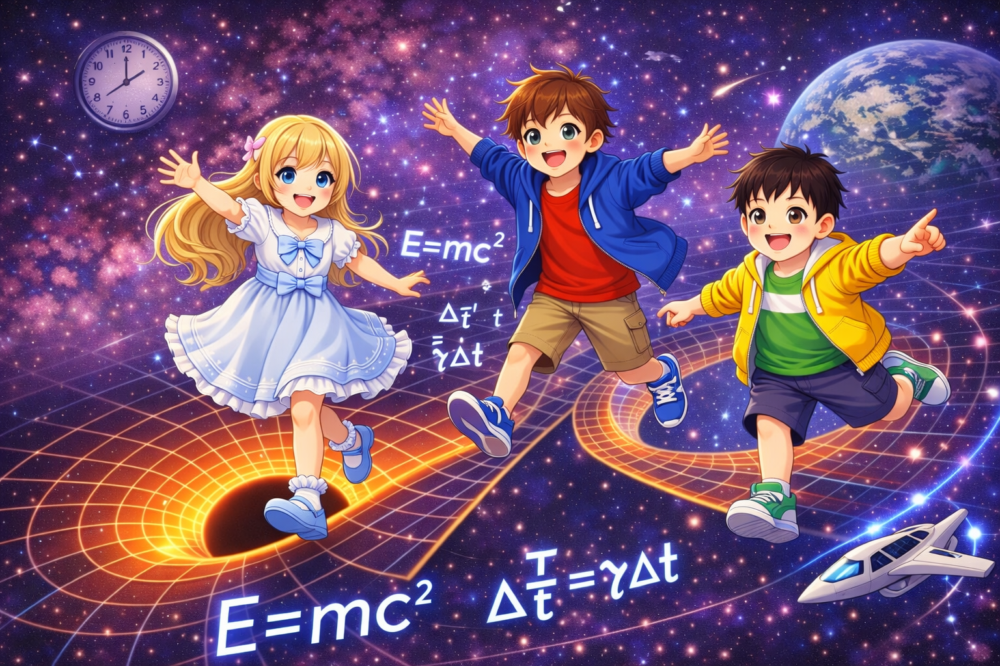

# Making Sense of Relativity

Relativity is full of elegant equations, but the physical meaning can still feel slippery.
This project is a narrative guide to special and general relativity, built around concrete thought experiments and visual intuition.

Inside, you'll find topics like time dilation, length contraction, simultaneity, proper time vs. coordinate time, the equivalence principle, and curved spacetime.

It is written for curious readers, students, and self-learners who want more than formula manipulation and want to feel what the theory is actually saying.

## GitHub Pages

- https://t-ishii66.github.io/Relativity/

## Contents

- 日本語版: [Relativity.md](./Relativity.md)
- English: [Relativity-en.md](./Relativity-en.md)
