# Making Sense of Relativity

_Notes Toward Understanding Relativity_

## Table of Contents

- Introduction
- Characters
  - Alice
  - Bob
  - Charlie
- Chapter 1: Special Relativity
  - The Principle of Invariant Light Speed
  - Lorentz Transformation
  - Setup and Characters
  - Proper Time and Coordinate Time
  - How Clocks Tick
  - Relativity of Simultaneity
  - Length Contraction
- Chapter 2: General Relativity
  - Setup and Characters
  - Metric
  - Schwarzschild Solution
  - Coordinates as a Canvas
  - Coordinate Time and Proper Time
  - Gravitational Redshift
  - Proper Length and Coordinate Length
  - Speed of Light in a Gravitational Field
  - Coordinate Systems as a Canvas
  - A Freely Falling Observer
  - Light Signals from Falling Bob
  - Bob and Charlie Meet Again
  - Metric and Coordinate Transformations
  - Interferometer Thought Experiment
- Appendix
  - Appendix A: Why is $ds^{2}$ invariant under Lorentz transformations?
  - Appendix B: Why do SB clocks look desynchronized from SA?
  - Appendix C: Deriving Length Contraction with Lorentz Transformations
  - Appendix D: Four-Momentum and $E = mc^{2}$
- References
- Credits
- Closing

## Introduction

Relativity often feels counterintuitive. Many readers can follow the algebra but still feel that the physical meaning does not settle in. This book is for that gap. We will use simple setups and follow concrete observations to make seemingly strange results less mysterious.

The discussion is intentionally informal. We skip strict formal derivations and focus on conceptual clarity. If you want full formal development, many excellent textbooks are available. Read one, get puzzled, then come back here.

Let us begin.

## Characters

### Alice

Age: 10

Personality: Curious, outspoken, never satisfied with vague answers.

Hobbies: Watching stars, reading storybooks, collecting pretty stones.

Likes: Strawberry milk, blue ribbons, mysterious stories.

### Bob

Age: 12

Personality: Calm and a bit logical. Observes before concluding.

Hobbies: Crafting, maps, taking clocks apart and reassembling them.

Likes: Hamburgers, toolboxes, new notebooks.

### Charlie

Age: 11

Personality: Relaxed but sharp. Good at seeing the big picture from a distance.

Hobbies: Naps, walks, watching cloud shapes.

Likes: Melon bread, wide scenery, binoculars.

## Chapter 1: Special Relativity

### The Principle of Invariant Light Speed

An inertial frame is a frame moving at constant velocity in a straight line. A rest frame means an inertial frame in which the observer is at rest.

In any inertial frame, the measured speed of light in vacuum is always $3 \times 10^{8}\,[m/s]$. Even if you chase light in a uniformly moving rocket, you still measure the same value. Strange, but experimentally true. This is the principle of invariant light speed.

### Lorentz Transformation

In this book we mostly use one spatial dimension, so spacetime is 2D: time + one space axis.

Let SA and SB be inertial frames, with SB moving at speed $V$ relative to SA. Coordinates are $(t_A,x_A)$ and $(t_B,x_B)$.

Assume

$$
x_B = \gamma(x_A - Vt_A)
$$

and conversely

$$
x_A = \gamma(x_B + Vt_B)
$$

From these, one can also solve for $t_B$ as

$$
t_B = \frac{1-\gamma^2}{\gamma V}x_A + \gamma t_A.
$$

Now impose invariant light speed. Emit light when SA and SB origins coincide:

$$
x_A = ct_A, \quad x_B = ct_B.
$$

Substitute:

$$
ct_B = \gamma(ct_A - Vt_A), \quad ct_A = \gamma(ct_B + Vt_B).
$$

Then

$$
c^2 = \gamma^2(c^2 - V^2),
$$

so

$$
\gamma = \frac{1}{\sqrt{1-(V/c)^2}}.
$$

Therefore,

$$
x_B = \frac{x_A - Vt_A}{\sqrt{1-(V/c)^2}},
$$

$$
t_B = \frac{t_A - Vx_A/c^2}{\sqrt{1-(V/c)^2}}.
$$

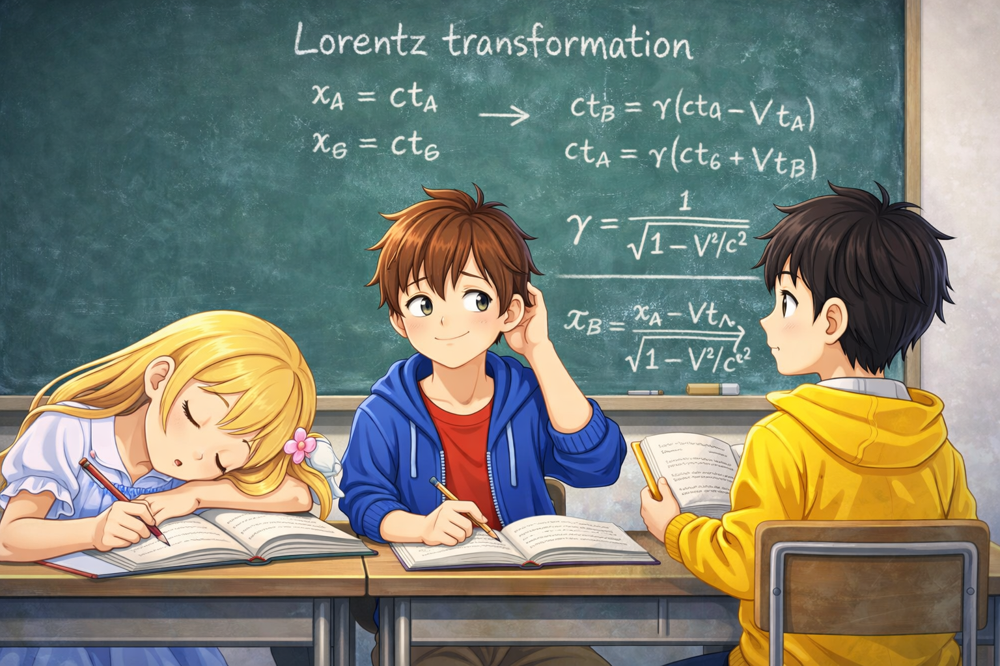

---

Alice: “I’ll read those equations later… just a tiny nap…”

Bob: “Alice is completely asleep. I kind of understand, though.”

Charlie: “I’ll keep following the math a little longer.”

---

### Setup and Characters

We have two inertial frames, SA and SB. Alice is at rest in SA and has a clock. Bob is at rest in SB and also has a clock. SB moves at speed $V$ relative to SA.

That is the whole setup.

| Character | Setup |
| --- | --- |
| Alice | At rest in SA, carrying a clock |
| Bob | At rest in SB, carrying a clock |

### Proper Time and Coordinate Time

In SA, imagine many clocks fixed to the coordinate grid (square clocks in figures). They define coordinate time. Let us call them coordinate clocks.

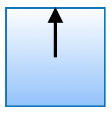

Alice’s own clock (round clock in figures) measures Alice’s proper time. Proper time means the time shown by a clock attached to the object.

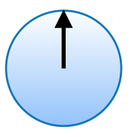

Coordinate clocks and proper clocks are physically the same type of clock; only how we use them differs.

All SA coordinate clocks are synchronized with Alice’s SA-rest clock. SB is built similarly.

Use $w$ for coordinate-time readings and $\tau$ for proper-time readings. In this book, these are measured in length units, not seconds, by defining

$$
w = ct.
$$

Similarly, we multiply ordinary proper time by $c$ and call it $\tau$. We still speak of them as “time” for readability.

Since Alice is at rest in SA,

$$
\tau_A = w_A,
$$

and for Bob at rest in SB,

$$
\tau_B = w_B.
$$

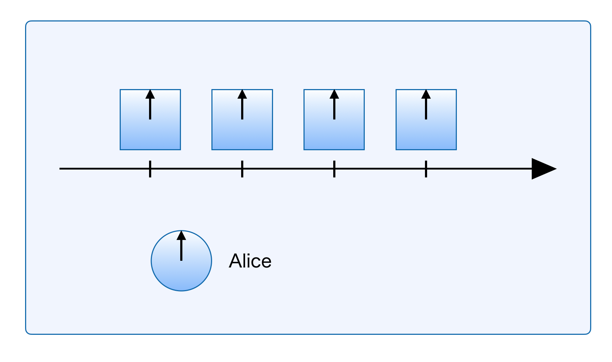

*Figure 1.1 (SA view): Proper clock and coordinate clocks*

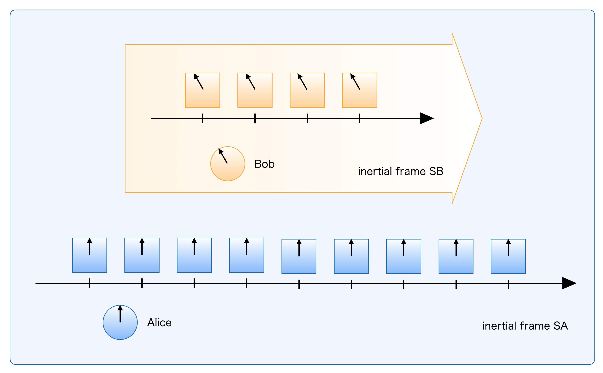

*Figure 1.2 (SA view): Relationship between SA and SB (conceptual)*

---

Alice: “So the round one is proper time and the square one is coordinate time? Same store, same clocks… weird.”

---

### How Clocks Tick

First, observe Bob’s clock from SA.

As seen in SA, Bob moves uniformly and passes points P and Q. Bob’s proper interval from P to Q is measured by one Bob clock:

$$
d\tau_B = \tau_Q - \tau_P.
$$

But SA’s coordinate interval is measured by two different SA clocks at P and Q:

$$
dw_A = w_Q - w_P.
$$

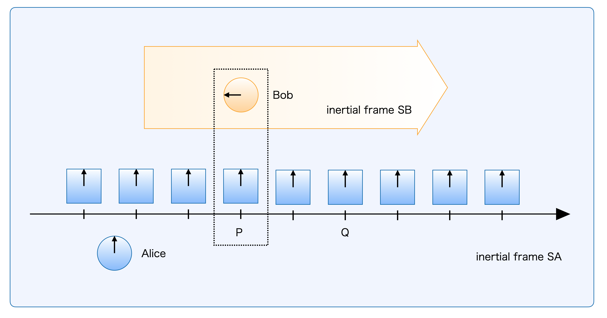

*Figure 1.3 (SA view): Bob’s proper clock and SA coordinate clocks*

|  | Bob (SB) | SA |
| --- | --- | --- |
| At P | Bob looks at his own clock and reads $\tau_P$. | When Bob passes in front of the SA coordinate clock at P, that clock reads $w_P$. |
| At Q | Bob looks at his own clock and reads $\tau_Q$. | When Bob passes in front of the SA coordinate clock at Q, that clock reads $w_Q$. |
| Interval P to Q | Bob took $d\tau_B = \tau_Q - \tau_P$ to travel from P to Q. | Bob took $dw_A = w_Q - w_P$ to travel from P to Q, as measured by SA. |

This distinction is crucial: $d\tau_B$ is the elapsed time on Bob's single clock, while $dw_A$ is the difference between readings on two different SA clocks at P and Q. (This is not always the case, but it is for this situation.)

Let SA spatial separation be $dx_A$. Define

$$
ds^2 = -dw_A^2 + dx_A^2.
$$

This quantity is Lorentz invariant (derivation in Appendix A).

In Bob’s own frame, Bob is at rest so $dx_B=0$, hence

$$
ds^2 = -dw_B^2 = -d\tau_B^2.
$$

---

Bob: “My $ds^2$ is this value, computed from my own clock.”

Alice: “Wait... if I compute with my coordinate clocks... what, same $ds^2$!?”

---

Thus,

$$
-d\tau_B^2 = -dw_A^2 + dx_A^2,
$$

so

$$
d\tau_B = dw_A\sqrt{1-(dx_A/dw_A)^2} = dw_A\sqrt{1-(V/c)^2}.
$$

Therefore $d\tau_B < dw_A$. Since $\tau_A = w_A$ for Alice at rest in SA, Bob’s clock runs slower than Alice’s according to SA.

---

Alice: “Bob’s clock is ticking slowly. It must be broken.”

---

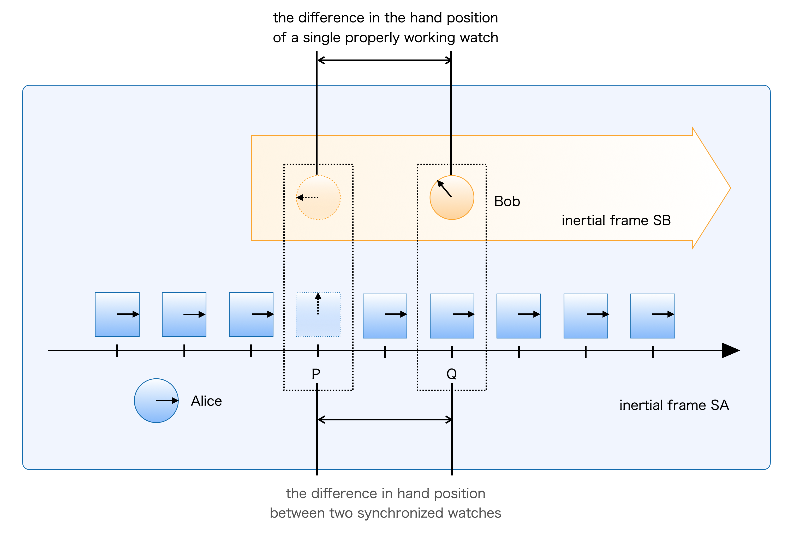

*Figure 1.4 (SA view): Proper-time interval vs coordinate-time interval*

|  | Bob (SB) | SA |
| --- | --- | --- |
| Time from P to Q | Bob carries his own clock, so he measures this as $d\tau_B$. | Difference between the SA clock reading when Bob passes P and the SA clock reading when Bob passes Q. This is $dw_A$. |
| Distance from P to Q | Zero. To make this intuitive: Bob is an SB resident and is at rest in SB. From Bob’s viewpoint, SA is what moves; first point P comes to him (first spacetime event), then point Q comes (second spacetime event). Between those two events, Bob’s traveled distance in SB is zero. | SA-measured distance $\overline{PQ}$, i.e. $dx_A$. |

Bob, however, has been observing Alice using SB coordinate clocks and reaches the opposite claim:

> Alice’s clock runs slower than Bob’s clock.

This sounds contradictory, but it is not. Let us check why.

---

Bob: “Alice’s clock is broken, isn’t it?”

Alice: “No way. Maybe your clock is the broken one.”

---

### Relativity of Simultaneity

Now compare SB coordinate clocks as seen from SA.

If each SB clock runs slowly from SA’s viewpoint, how can Bob still claim Alice’s clock is slower? The key is that SB clocks are not judged simultaneous in SA in the same way.

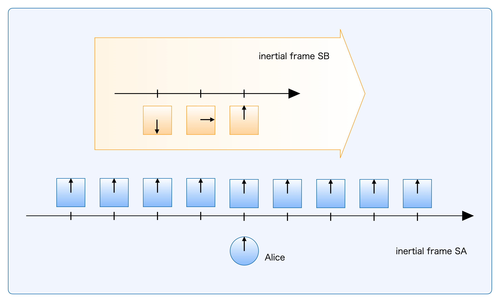

*Figure 1.5 (SA view): SB coordinate clocks from SA*

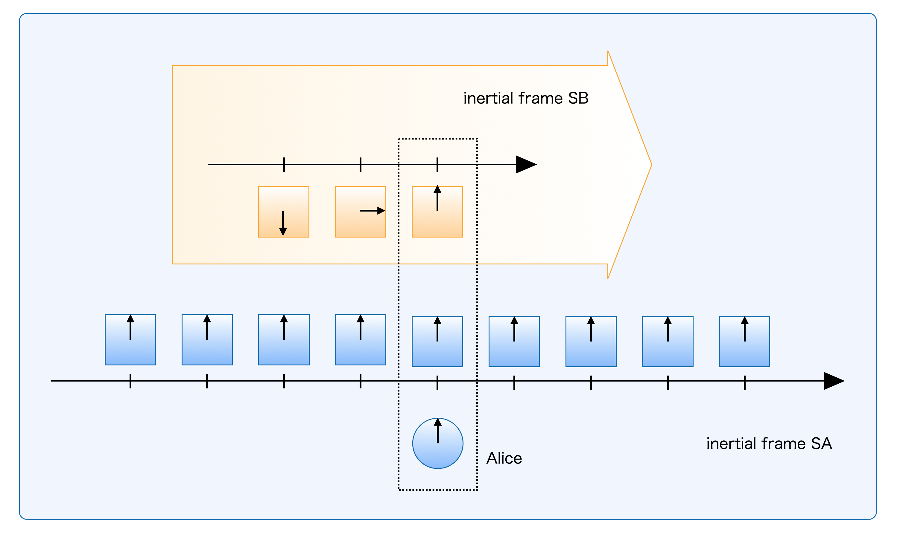

*Figure 1.6 (SA view): Rightmost SB clock happens to match Alice at one event*

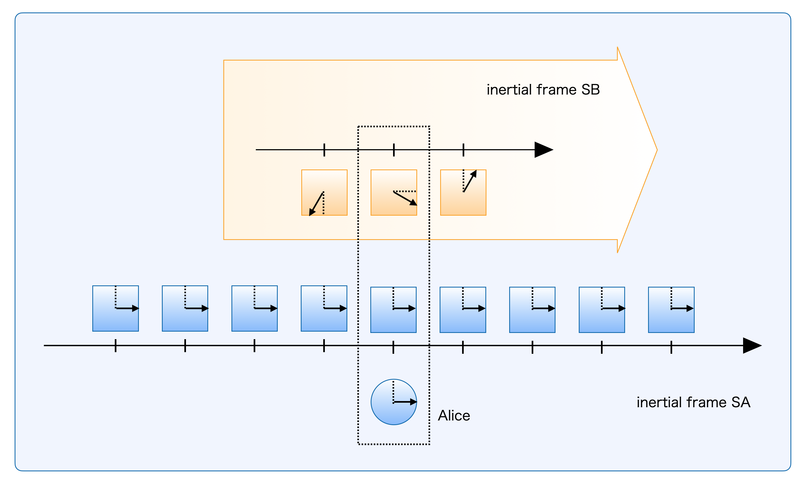

*Figure 1.7 (SA view): Another SB clock compares with Alice later*

From SA's fixed viewpoint, all SA clocks tick fast (in Figure 1.7, the blue coordinate clock hands move from 12 o'clock to 3 o'clock), while each SB clock ticks slowly (but all at the same slow rate).

Focus on two adjacent SB coordinate clocks. Both tick slowly as seen from SA. "Slowly" here refers to the rate at which the hands move, not the displayed time. Surprisingly, these two SB clocks believe they show the same time as each other. When these two clocks observe Alice's proper clock, the following situation arises.

When Alice passes in front of the rightmost SB clock, both clocks happen to show the same time (this is just a coincidence). But when Alice passes in front of the second SB clock (second from the right), that clock finds Alice's clock is behind. Since all SB coordinate clocks are synchronized with each other, SB concludes that Alice's clock is running slower than theirs.

When we compare multiple SB coordinate clocks with an SA proper clock (Alice's clock, or any single SA coordinate clock treated as a proper clock), SA proper time still appears to run slower. Both Alice's and Bob's claims turn out to be correct. In special relativity, comparing one proper clock against two coordinate clocks leads to this seemingly strange result. But there is no contradiction.

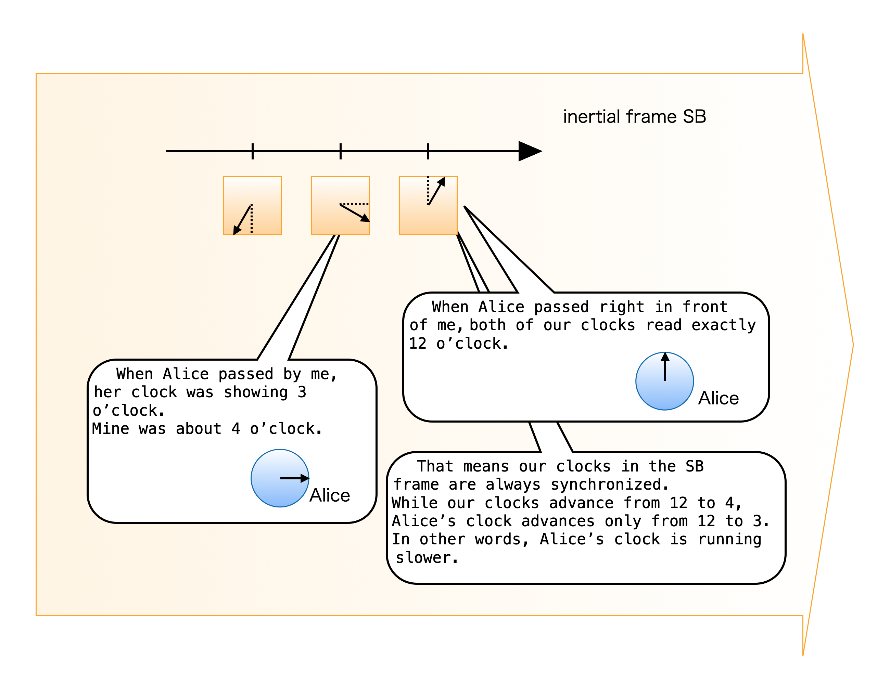

*Figure 1.8: Alice's clock seen via multiple SB coordinate clocks*

---

Alice: “Bob kept insisting, ‘Synchronize all the clocks properly.’ But what about his side? I’ll get him for this later.”

Bob: “Hmm… still, I feel like Alice’s clock is the one that’s off.”

---

### Length Contraction

Length measurement means identifying both endpoints simultaneously in the measuring frame.

Suppose a rod is at rest in SB and SA measures its endpoints as P and Q simultaneously in SA.

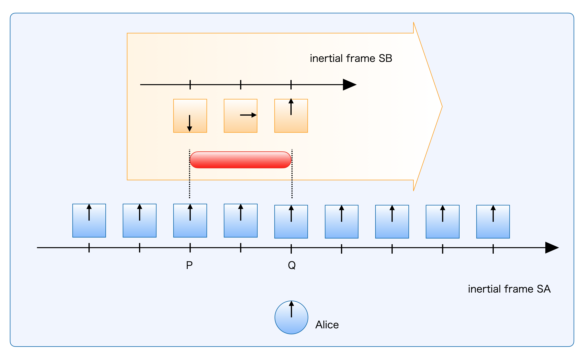

*Figure 1.9 (SA view): SA measuring a rod at rest in SB*

Switch to SB viewpoint. SA’s two endpoint-identification events are not simultaneous in SB.

From SB’s viewpoint, when the rod front reaches SA point Q, SA marks that front position. The SA coordinate clock at Q reads 12 o'clock in the figure.

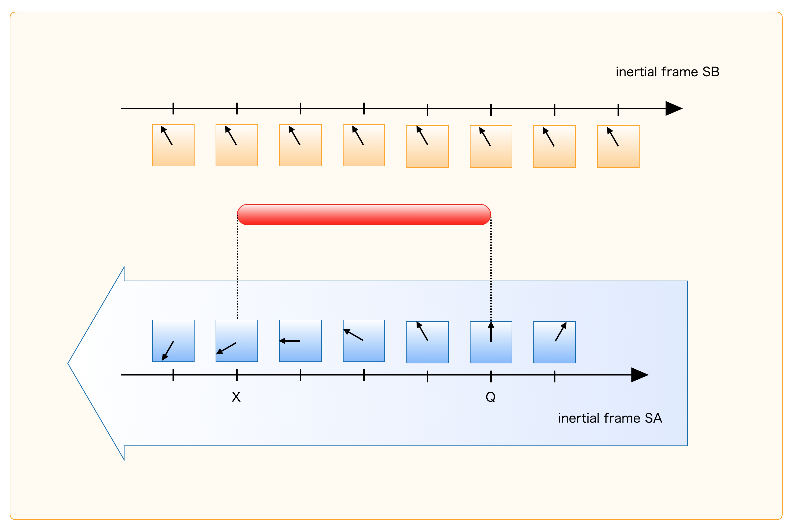

*Figure 1.10 (SB view): SA identifies the front endpoint*

But SA does not yet mark the rear endpoint. Looking at the rear side, the SA coordinate clock at the corresponding location X is still behind and has not reached 12 o'clock yet.

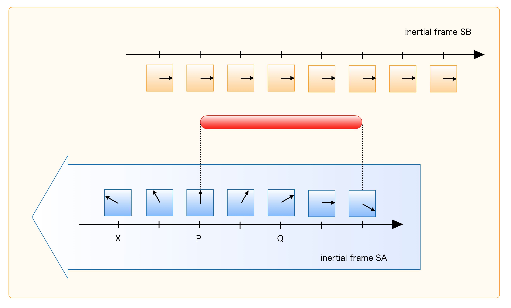

*Figure 1.11 (SB view): SA identifies the rear endpoint later*

Eventually the rear endpoint reaches point P, and at that moment the SA clock at P reads 12 o'clock. That is when SA identifies the rear endpoint as P.

Alice gets excited and says the rod became shorter. But from Bob’s perspective, SA did not identify both endpoints simultaneously in SB, so he calls that measurement meaningless.

Conversely, if SB measures SA’s segment with simultaneity in SB, SA also sees non-simultaneous events.

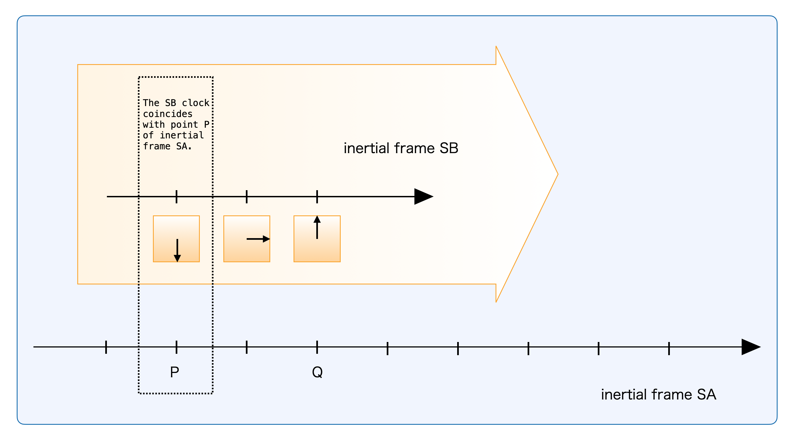

*Figure 1.12 (SA view): SB identifies P*

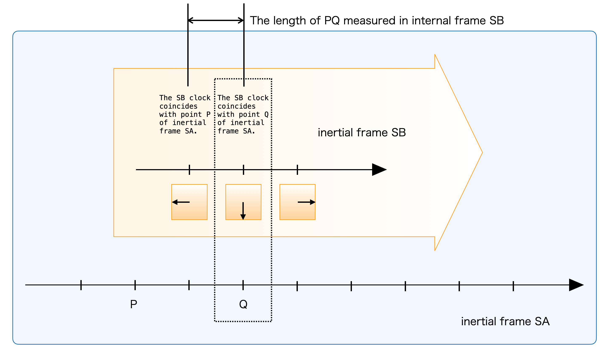

*Figure 1.13 (SA view): SB identifies Q later in SA time*

Hence each frame measures the other frame’s moving length as contracted.

---

Bob: “Alice, that measurement is sloppy. I told you: you have to identify both ends at the same time.”

---

For a more explicit derivation, see Appendix B and C.

## Chapter 2: General Relativity

Consider an astronaut in a uniformly accelerating rocket, holding an apple. Throw the apple, and inside the rocket it appears to follow a curved trajectory.

*Apple in an accelerating rocket*

From outside, however, the apple may follow straight inertial motion while the astronaut accelerates.

Apply this perspective to Earth. An apple seems to follow a projectile arc. But one can also say: the apple is simply following a straight path, while we and the ground are in a non-inertial frame in gravity.

That sounds strange at first: “No, gravity is pulling the apple, so it cannot be straight inertial motion.” Here the key shift is to think of gravity as curvature of spacetime. Then the apple follows the straightest path between nearby events in curved spacetime (we will loosely say “shortest path” for readability; strictly this is a geodesic).

Rocket acceleration points in one direction, while gravity points toward the massive body's center, so the global situations are not identical.

Trying to build one coordinate system where every point on Earth’s surface is “accelerating upward” becomes difficult. Einstein resolved this by introducing Riemannian geometry into physics.

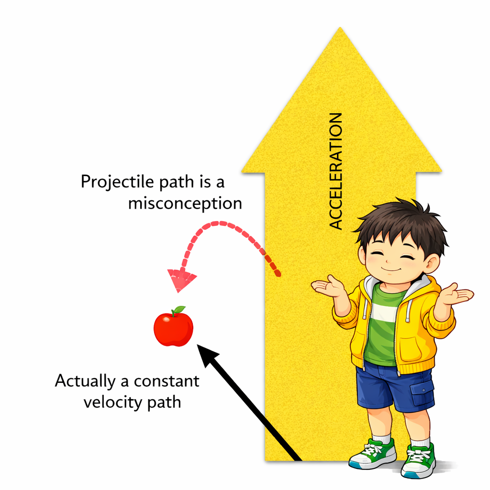

*Viewing projectile motion as an effect of curved spacetime description*

### Setup and Characters

In this chapter, place a single massive body at the origin. Focus on one radial spatial dimension.

Alice is at radius $r_A$ in stronger gravity (e.g., near the surface). Charlie is fixed far away at $r_C \approx \infty$ where gravity is negligible.

Both have their own clocks and can always read their own proper time.

| Character | Setup |
| --- | --- |
| Alice | Static at $r_A$, feels strong gravity |
| Charlie | Far away at $r_C \approx \infty$, effectively inertial |

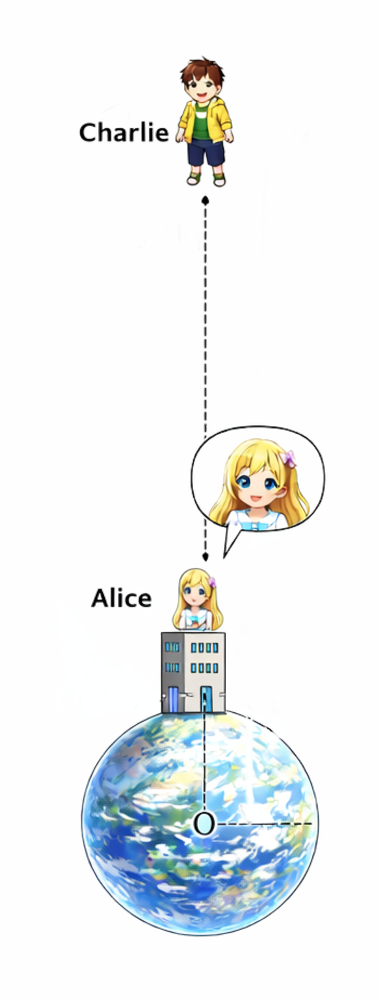

### Metric

Let inertial Minkowski metric be

$$
\eta_{\mu\nu}=
\begin{pmatrix}
-1&0&0&0\\
0&1&0&0\\
0&0&1&0\\
0&0&0&1
\end{pmatrix}.
$$

Even in flat spacetime, non-Cartesian coordinates can make metric components non-Minkowskian. Metric components depend on coordinates; curvature is the invariant criterion.

With inertial coordinates $X^\mu$ and arbitrary coordinates $x^\mu$:

$$
dX^\mu = \frac{\partial X^\mu}{\partial x^\nu}dx^\nu,
$$

and define the line element by

$$
ds^2=\eta_{\mu\nu}dX^\mu dX^\nu.
$$

Rewriting:

$$
ds^2=\eta_{\mu\nu}
\frac{\partial X^\mu}{\partial x^\rho}dx^\rho
\frac{\partial X^\nu}{\partial x^\tau}dx^\tau,
$$

and collecting terms gives

$$
ds^2=g_{\rho\tau}dx^\rho dx^\tau,
$$

with

$$
g_{\rho\tau}=\eta_{\mu\nu}\frac{\partial X^\mu}{\partial x^\rho}\frac{\partial X^\nu}{\partial x^\tau}.
$$

So, for a line element $ds^2$ seen from a (local) inertial frame, a person in a gravity-field coordinate can compute the same scalar value by using $g_{\rho\tau}dx^\rho dx^\tau$.

If the relation between $X^\mu$ and $x^\mu$ (equivalently $g_{\rho\tau}$) were already known, that would be convenient. In general, $g_{\rho\tau}$ is determined by energy-momentum distribution $T^{\mu\nu}$ (through Einstein’s equations; details are outside this book).

Also, if basis vectors of $x^\mu$ are defined by

$$
{e_{\mu}}^{\lambda}=\frac{\partial X^{\lambda}}{\partial x^{\mu}},
$$

then

$$
g_{\rho\tau}=\eta_{\mu\nu}{e_{\rho}}^{\mu}{e_{\tau}}^{\nu}
=(\mathbf{e}_{\rho}\cdot\mathbf{e}_{\tau}),
$$

so the metric is the inner product of basis vectors.

### Schwarzschild Solution

For a spherically symmetric mass, Schwarzschild metric is

$$
ds^{2}=-\left(1-\frac{a}{r}\right)dw^{2}+\frac{1}{1-a/r}dr^{2}+r^{2}d\Omega^{2},
$$

where

$$
a=\frac{2GM}{c^{2}},
$$

and

$$
d\Omega^{2}=d\theta^{2}+\sin^{2}\theta d\phi^{2}.
$$

In radial-only discussion:

$$
ds^{2}=-\left(1-\frac{a}{r}\right)dw^{2}+\frac{1}{1-a/r}dr^{2}.
$$

### Coordinates as a Canvas

Coordinates from a solution are a computational canvas, not automatically “the directly experienced time and distance.”

For example, even in flat space, suppose we describe space by a flat coordinate $r$ and then apply an arbitrary reparameterization

$$
R=f(r).
$$

Then

$$
dR=f'(r)\,dr.
$$

Even though $dr$ is uniform in the original flat coordinate, $dR$ can vary with position. So coordinate increments themselves are not automatically physical ruler lengths.

The same caution applies to Schwarzschild coordinates: coordinate values $(w,r)$ and coordinate increments $(dw,dr)$ are not automatically “time itself” or “distance itself.”

More strongly, one can even mix time and space in a transformation like

$$
W=f(w,r),
$$

which makes naive interpretation even less meaningful.

What we physically measure are proper time and proper length; relating these to the canvas coordinates is the key.

### Coordinate Time and Proper Time

At $r\to\infty$:

$$
ds^{2}=-dw^{2}+dr^{2}.
$$

For Charlie at rest, $dr_C=0$:

$$
ds^{2}=-d\tau_C^{2}=-dw^{2}\Rightarrow d\tau_C=dw.
$$

So, at Charlie’s location, the coordinate-time increment $dw$ equals Charlie’s proper-time increment $d\tau_C$.
But this statement is local: it is true for $dw$ at Charlie’s position. A $dw$ somewhere else may represent something different.

Now write the line element at Alice’s radius $r_A$:

$$
ds^{2}=-\left(1-\frac{a}{r_A}\right)dw^{2}+\frac{1}{1-a/r_A}dr^{2}.
$$

Suppose Alice emits light at coordinate time $w_{A1}$ and that light reaches Charlie after coordinate interval $W$:

$$
w_{A1}+W=w_{C1}.
$$

Later, Alice emits again at $w_{A2}$. The travel interval is again $W$, so

$$
w_{A2}+W=w_{C2}.
$$

Subtracting:

$$
(w_{A2}-w_{A1})=(w_{C2}-w_{C1}),
$$

or in differential form,

$$
dw_A=dw_C.
$$

This is why coordinate time can directly relate events at different places. Proper time cannot do that by itself, because it is local to each clock.

Still, we must be careful: coordinate time $w$ is a canvas variable. It is not automatically “experienced time.”

Now ask: is proper time in gravity still defined by

$$
ds^2=-d\tau^2
$$

for a clock attached to an object? Yes.

Intuitively: if Alice carries her own clock and ruler into a gravitational field, her local neighborhood, clock, and ruler are all affected together. She does not notice a local “rate change” by comparing against herself. Over sufficiently small spacetime neighborhoods, her local measurements are approximately inertial:

$$
ds^{2}\simeq -dw_A^{2}+dr_A^{2}.
$$

Here $dw_A,dr_A$ mean time and length measured by Alice’s own local clock and ruler, and $\\simeq$ means local approximation (small region, short duration), not exact global equality.

For Alice’s own clock worldline, $dr_A=0$, so

$$
ds^{2}(=-d\tau^{2})\simeq -dw_A^{2},
$$

hence her carried clock is precisely the proper-time clock in the operational sense.

Return now to Schwarzschild coordinates (without subscript $A$). For static Alice ($dr_A=0$):

$$
ds^{2}=-d\tau_A^{2}=-\left(1-\frac{a}{r_A}\right)dw^{2},
$$

thus

$$
d\tau_A=dw\sqrt{1-\frac{a}{r_A}}.
$$

So for the same coordinate increment $dw$, Alice’s proper-time increment is smaller than Charlie’s.

In other words, for proper-time flow (the clocks they carry), Alice ticks slower than Charlie.

---

Alice: “Charlie’s clock runs faster.”

Charlie: “Yes, mine runs faster.”

Alice: “Unlike that mean Bob, we finally agree.”

Charlie: “Yep!”

---

### Gravitational Redshift

Consider light emitted by Alice and received by Charlie. Suppose Alice keeps emitting during her own proper-time interval (experienced time) $d\tau_A$. Converting that interval to Schwarzschild coordinate time gives

$$
dw=d\tau_A\sqrt{\frac{1}{1-a/r_A}}.
$$

From the discussion above, Charlie also keeps receiving during that same coordinate-time interval. And at Charlie (infinity), the experienced time is proper time, with $d\tau_C=dw$. Therefore

$$
d\tau_C=d\tau_A\sqrt{\frac{1}{1-a/r_A}}.
$$

Suppose Alice counts $N$ oscillations during $d\tau_A$. Charlie receives the same $N$ oscillations during $d\tau_C$. The oscillation count is unchanged, but it is spread over a longer reception time, so Charlie observes a lower frequency.

### Proper Length and Coordinate Length

Now consider how a rod of inertial-frame length $\Delta L$ appears in a gravitational field.

Length means identifying both endpoints simultaneously, so set $dw=0$. Then Schwarzschild gives

$$
ds^2=\frac{1}{1-a/r}dr^2.
$$

Near Charlie, $r=\infty$, so

$$
ds^2=dr^2.
$$

If we choose the two spacetime points as the two rod endpoints, then

$$
ds^2=\Delta L^2.
$$

Write

$$
d\sigma^2=ds^2=\Delta L^2
$$

and call $d\sigma$ the proper length; this is the physical rod length in the inertial sense.

At Alice’s location,

$$
ds^{2}=\frac{1}{1-a/r_A}dr^{2},
$$

holds.

If Alice carries that rod from infinity down to her location, local space around her may be curved, but her ruler and rod are affected together. So in her local measurement she still reads the rod length as $\Delta L$.

Alice’s experienced coordinates and Schwarzschild coordinates are related by coordinate transformation, and the key point is that $ds^2$ is a scalar with the same value in either description. Therefore in Alice’s local frame

$$
d\sigma^2=ds^2=\Delta L^2
$$

is true, and expressing this in the Schwarzschild canvas coordinate $r$ gives

$$
ds^2=\Delta L^2=\frac{1}{1-a/r_A}dr^2.
$$

So

$$
dr=\Delta L\sqrt{1-\frac{a}{r_A}}.
$$

For example, a 10 m rod in an inertial frame remains 10 m when directly measured locally in gravity (both rod and ruler are affected together). But in the Schwarzschild $w-r$ canvas coordinate description, the corresponding $dr$ value can be less than 10 m.

So at $r_A$, it is better not to over-interpret this as “the rod itself became shorter.” It is a canvas-coordinate statement. If one goes there and directly measures with local instruments, it is still 10 m.

### Speed of Light in a Gravitational Field

From special relativity we know light follows paths with $ds^2=0$. Do the same in gravity:

$$
-\left(1-\frac{a}{r}\right)dw^2+\frac{1}{1-a/r}dr^2=0
$$

so

$$
\left|\frac{dr}{dw}\right|=1-\frac{a}{r}.
$$

This is the coordinate speed magnitude on the Schwarzschild canvas. On this canvas, invariant light speed no longer appears as a constant coordinate slope.

However, at infinity the Schwarzschild coordinate time $w$ equals Charlie’s proper time $\tau_C$. So as long as Charlie is far away, he may read this canvas time as his own time. At Charlie’s location $r=\infty$,

$$
\frac{dr}{dw}=1.
$$

So near himself, Charlie measures inertial light speed $c$ as usual.

Alice should also measure local light speed $c$ in her experienced frame. Let us compute that using the same $w-r$ canvas.

Alice’s experienced time is proper time, and we had

$$
d\tau_A^2=\left(1-\frac{a}{r_A}\right)dw^2,
$$

while Alice’s experienced length is proper length, with

$$
d\sigma = dr\sqrt{\frac{1}{1-a/r_A}},
$$

so

$$
\frac{d\sigma}{d\tau_A}
=\frac{dr\sqrt{\frac{1}{1-a/r_A}}}{d\tau_A}
$$

$$
=\frac{dr\sqrt{\frac{1}{1-a/r_A}}}{dw\sqrt{1-a/r_A}}
$$

$$
=\frac{dr}{dw(1-a/r_A)}=1.
$$

Thus Alice also observes light speed $c$ locally.

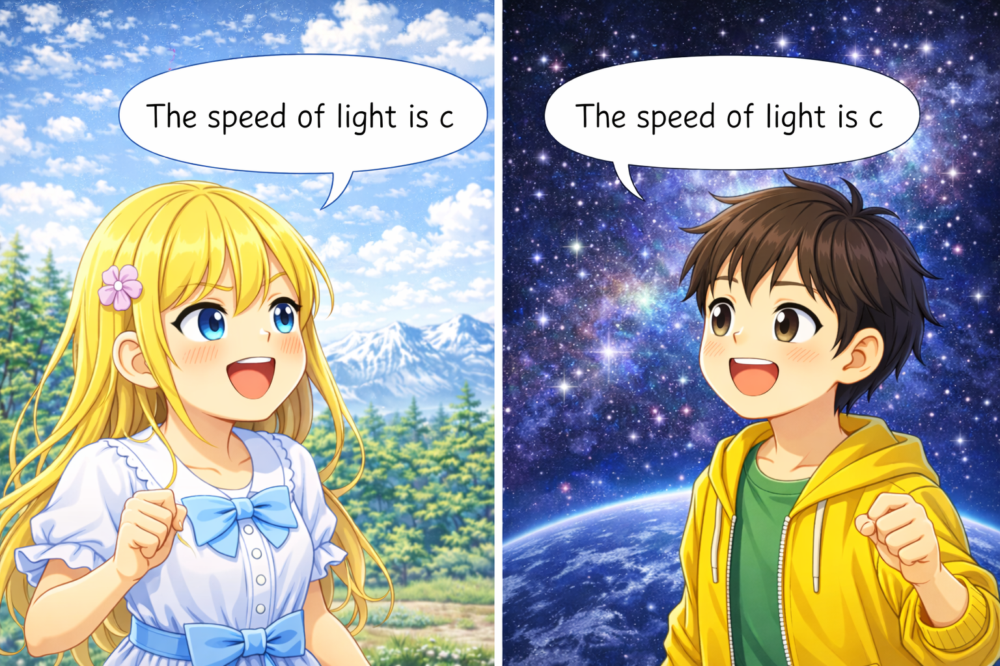

### Coordinate Systems as a Canvas

The coordinate system obtained from the Schwarzschild solution is a canvas coordinate system.

Times and lengths actually experienced or measured are proper time and proper length.

Let us think about this more concretely.

Charlie’s experienced world is of course described by Charlie’s proper time and proper length. The Schwarzschild coordinates $w,r$ happened to coincide with those proper quantities only near Charlie.

So $w,r$ looked like Charlie’s own coordinates, but that is only near Charlie.

Now consider a concrete situation: light bends due to the gravity of a massive star and eventually reaches Charlie.

The bending is computed on the $w-r$ canvas. But trying to treat the $w-r$ coordinates themselves as directly observable near the strong-gravity region has limits. What matters is that the calculation can be done consistently.

If Charlie places a detector near the strong-gravity region to observe the bending there, that detector uses the local observer’s proper clock and proper ruler at that location. So it is not directly reading raw $w,r$ values.

Therefore, rather than staring at the literal curve drawn in $w-r$, it is better to focus on what happens when the light reaches near Charlie.

Near Charlie, observation is performed in Charlie’s proper time/length, and there those coincide with $w,r$. So the trajectory computed on the canvas is observed directly there (near Charlie).

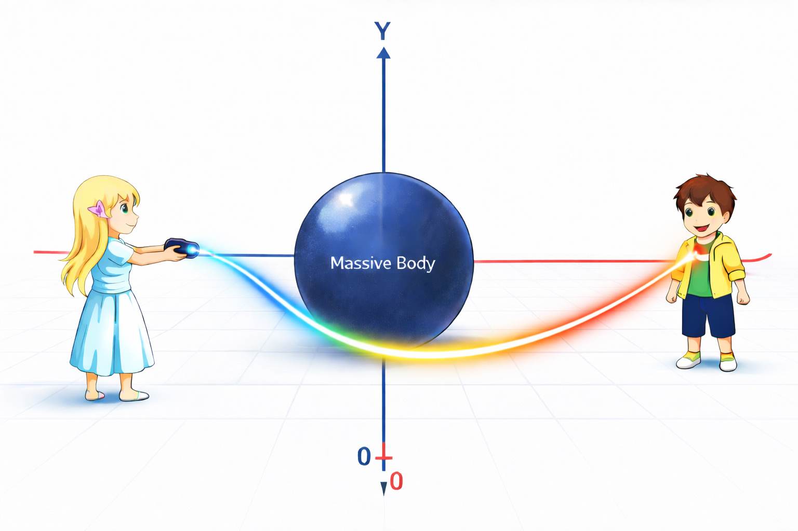

*Figure 2.1: Draw the light trajectory on the coordinate canvas*

In short: near a massive body, what matters is that the trajectory is computable. Even if one places detectors in that region, they do not directly read canvas coordinates themselves. By contrast, when Charlie waits in a far region without felt gravity and observes the arriving light, canvas coordinates and Charlie’s proper units coincide, so he observes the computed canvas trajectory directly there.

### A Freely Falling Observer

Alice seemed able to describe her experienced world locally with metric $\eta_{\mu\nu}$.

Now let Bob free-fall from Alice’s location. (Bob has a parachute, so no worries.) Since Bob is in free fall, in a very small neighborhood around him he can also be approximated as in a local inertial frame (metric approximately $\eta_{\mu\nu}$). But strictly, if one extends the region, caution is needed: the local inertial frame must be re-chosen point by point along Bob’s worldline, not one single frame for the entire fall.

Then a natural question appears: if Alice and Bob both locally use $\eta_{\mu\nu}$, are they just in a special-relativistic relative-velocity relation?

From Alice/Charlie, Bob is accelerated, so they are not globally connected by one Lorentz transformation. All three can still use $\eta_{\mu\nu}$ locally around themselves. Where does the difference show up? One place is that accumulated proper times differ.

Let us show the relation.

We already derived Alice–Charlie proper-time relation.

Now examine Bob–Charlie.

Using Bob-local and Charlie coordinates for the same nearby events:

$$
ds^{2}=-dw_B^{2}+dr_B^{2}
$$

For the same two spacetime points, Charlie’s coordinates satisfy

$$
ds^{2}=-\left(1-\frac{a}{r_B}\right)dw_C^{2}+\frac{1}{1-a/r_B}dr_C^{2}.
$$

Since both describe the same two endpoints and $ds^2$ is a scalar, we can write

$$
ds^{2}=-dw_B^{2}+dr_B^{2}
=-\left(1-\frac{a}{r_B}\right)dw_C^{2}+\frac{1}{1-a/r_B}dr_C^{2}.
$$

Now consider Bob’s proper time. Set $dr_B=0$:

$$
-d\tau_B^{2}=-\left(1-\frac{a}{r_B}\right)dw_C^{2}+\frac{1}{1-a/r_B}dr_C^{2},
$$

thus

$$
d\tau_B^{2}
=\left(1-\frac{a}{r_B}\right)dw_C^{2}
-\frac{1}{1-a/r_B}dr_C^{2}
< dw_C^{2}.
$$

So at least $d\tau_B<dw_C$ holds.

Now make comparison conditions explicit. If Alice and Bob are at nearly the same radius ($r_A\sim r_B$), gravitational slowing is nearly the same for both. But Bob is moving relative to Alice, so by the special-relativistic motion effect Bob’s clock is further slowed from Alice’s perspective. Therefore

$$
d\tau_B<d\tau_A.
$$

Combine with the already shown gravitational relation

$$
d\tau_A<d\tau_C
$$

to get

$$
d\tau_B<d\tau_A<d\tau_C.
$$

This conclusion is under the condition that Alice and Bob are compared at nearly the same $r$.

---

Alice: “Come on, Bob, be brave. Jump!”

Bob: “Give me a break...”

Alice: “Go!”

Bob: “Waaah...!”

---

### Light Signals from Falling Bob

Consider Bob free-falling while emitting blinking light toward Charlie (at infinity). Bob emits once every 1 second on his own proper clock.

For Bob, nothing unusual happens: ordinary time passes, and he emits every second.

But for Charlie, things look different. At first flashes arrive every second, then intervals become longer: every 2 seconds, 5 seconds, 10 seconds, and so on. As Bob approaches Schwarzschild radius $a$, arrival intervals keep stretching.

Quantitatively: at Bob position $r_B$, the relation between Bob proper time $d\tau_B$ and Charlie coordinate time $dw_C$ includes both gravitational and motion effects. Here, to capture the trend, use the static relation as an approximate guide:

$$
d\tau_B = dw_C\sqrt{1-\frac{a}{r_B}}.
$$

From this, as $r_B\to a$, a fixed $d\tau_B$ corresponds to very large $dw_C$. So flashes Bob emits every second are received by Charlie with very long spacing. Since Charlie is at infinity, $d\tau_C=dw_C$ holds, so he directly reads that spacing on his own clock.

Also, the received light is redshifted and dimmed. Suppose Bob emits $N$ wave cycles during $d\tau_B$. Charlie receives the same $N$ cycles during $dw_C$. Let emitted frequency be $\nu_B$ and observed frequency be $\nu_C$:

$$
\nu_B=\frac{N}{d\tau_B},\quad \nu_C=\frac{N}{dw_C},
$$

$$
\frac{\nu_C}{\nu_B}=\frac{d\tau_B}{dw_C}.
$$

Using the same approximation as above (static relation as guide), substitute $d\tau_B = dw_C\sqrt{1-\frac{a}{r_B}}$:

$$
\frac{\nu_C}{\nu_B}
=\frac{dw_C\sqrt{1-\frac{a}{r_B}}}{dw_C}
=\sqrt{1-\frac{a}{r_B}}.
$$

As $r_B\to a$, this ratio approaches zero, so observed frequency becomes arbitrarily small.

When Bob gets arbitrarily close to the horizon ($r=a$), for Charlie the blink interval stretches without bound and almost no light arrives. Bob appears to freeze on the horizon.

This is an extreme manifestation of coordinate-time vs proper-time difference. Bob crosses the horizon in finite Bob proper time, but in Charlie coordinate time Bob reaches the horizon only at “infinite future.” This is the appearance in Schwarzschild coordinates (the $w-r$ canvas). The coordinate light speed

$$
\left|\frac{dr}{dw}\right|=1-\frac{a}{r}
$$

correspondingly approaches zero as $r\to a$.

---

Charlie: “Bob’s flashes are getting slower and slower…”

Alice: “I hope Bob is okay…”

Charlie: “For our clocks, a long time has passed. For Bob, time is probably normal. We just lose sight of him.”

Bob: “I fell quite far. Still feels normal. Maybe I should head back.”

---

### Bob and Charlie Meet Again

Thought experiment: Bob falls deep, then briefly fires a rocket to reverse direction and return to Charlie at infinity.

Keep thrust duration short; focus on free-motion segments. On the outbound leg, as we have seen, Bob's clock runs slower than Charlie's from Charlie's viewpoint. What about the return leg? On the return leg, Bob is still moving through the gravitational field while ascending, so his proper time still runs slower than Charlie's.

That is, on both outbound and inbound parts,

$$
d\tau_{B} < dw_{C}(=d\tau_{C})
$$

holds in segments along the way. So over the full trip,

$$
\tau_{B,\mathrm{total}}<\tau_{C,\mathrm{total}}.
$$

When they reunite and compare clocks directly, Bob is younger.

Not necessarily exactly “double” any one-way effect; magnitude depends on turning radius and velocity history.

---

Bob: “Ah… my clock is behind.”

Charlie: “It really is!”

Alice: “You kept treating me like a little kid, Bob. Looks like the age gap just got a little smaller!”

Bob: “Ugh… by only a few seconds…”

---

### Metric and Coordinate Transformations

Earlier we wrote expressions such as

$$
ds^{2}=\eta_{\mu\nu}dX^{\mu}dX^{\nu}
$$

$$
=g_{\lambda\sigma}dx^{\lambda}dx^{\sigma},
$$

and explained it as “a person in gravity can compute the same $ds^2$ by multiplying with $g_{\lambda\sigma}$ in their own coordinates.” Let us refine that view.

For a transformation from coordinates $x^\mu$ (metric $g_{\mu\nu}$) to another coordinates $x'^\lambda$:

$$
ds^{2}=g_{\mu\nu}dx^{\mu}dx^{\nu}
$$

$$
=g_{\mu\nu}\frac{\partial x^{\mu}}{\partial x'^{\lambda}}dx'^{\lambda}
\frac{\partial x^{\nu}}{\partial x'^{\sigma}}dx'^{\sigma}
$$

$$
=g_{\mu\nu}\frac{\partial x^{\mu}}{\partial x'^{\lambda}}
\frac{\partial x^{\nu}}{\partial x'^{\sigma}}dx'^{\lambda}dx'^{\sigma}
$$

$$
=g'_{\lambda\sigma}dx'^{\lambda}dx'^{\sigma}.
$$

So the form is preserved, and the scalar value $ds^2$ is preserved.

Pushing this further: in a local neighborhood around a point, one can transform to coordinates with metric $\eta_{\mu\nu}$. If that coordinate is $X^\mu$, then

$$
ds^{2}=g_{\mu\nu}dx^{\mu}dx^{\nu}
$$

$$
=\eta_{\mu\nu}dX^{\mu}dX^{\nu}.
$$

This suggests a useful perspective shift. Perhaps it is not that we always start from $\eta_{\mu\nu}$ and then “add” $g_{\mu\nu}$. Rather, for a chosen coordinate system $x^\mu$, the corresponding $g_{\mu\nu}$ appears as part of that description from the start (as in Schwarzschild, where coordinate system and metric come together), and then we may transform locally to a coordinate where the metric is $\eta_{\mu\nu}$.

If we place an experiment anywhere and observe, instruments always measure values based on local proper time and proper length. So transforming to a local $\eta_{\mu\nu}$ coordinate is exactly the transformation that tells us what a local measurement at that place records.

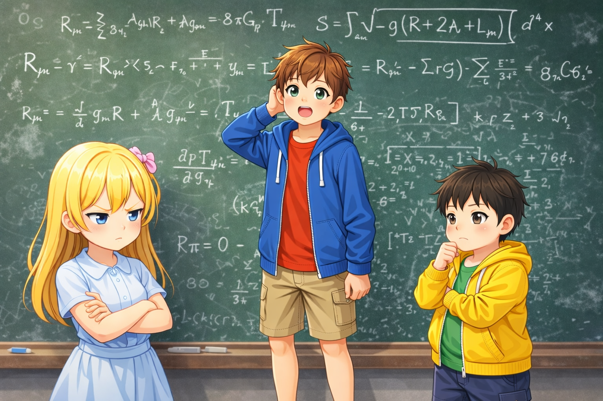

### Interferometer Thought Experiment

In an inertial frame, prepare one light source and place mirrors at distance $L$ on both left and right:

mirror <---------- $L$ ----------> source <---------- $L$ ----------> mirror

Light leaves the source, reflects at both mirrors, returns to the source position, and interferes.

Now move this whole setup into a gravitational field.

Assume the right mirror feels strong gravity while the source and left mirror feel almost none (because $L$ is very large), and assume the apparatus is held static against gravity by some support.

What happens to interference at the source position?

Light making round trips in gravity is affected by spacetime curvature along its path.

As a result, the effective optical path lengths (the round-trip path quantity) for left and right change differently.

So interference fringes shift.

What if the gravitational influence comes not from a celestial body, but from a metric that flies through?

If changes in the metric alter the optical path length, then conversely we can detect such metric changes by observing those shifts.

## Appendix

### Appendix A: Why is $ds^{2}$ Lorentz invariant?

In 1D space with this book’s sign convention,

$$
ds^2=-dw^2+dx^2
$$

(with $w=ct$). Some texts use the opposite sign convention $ds^2=+dw^2-dx^2$, but the physical content is the same.

Lorentz transform:

$$
x_B=\gamma\left(x_A-\frac{V}{c}w_A\right),\quad
w_B=\gamma\left(w_A-\frac{V}{c}x_A\right).
$$

Differentiate and substitute. With $\beta=V/c$:

$$
\begin{aligned}
-dw_B^2+dx_B^2
&=-\gamma^2(dw_A-\beta dx_A)^2+\gamma^2(dx_A-\beta dw_A)^2\\
&=\gamma^2(1-\beta^2)(-dw_A^2+dx_A^2)\\
&=-dw_A^2+dx_A^2
\end{aligned}
$$

since $\gamma^2(1-\beta^2)=1$.

Hence

$$
ds^2=-dw_A^2+dx_A^2=-dw_B^2+dx_B^2,
$$

so $ds^2$ is invariant.

### Appendix B: Why do SB clocks look desynchronized from SA?

In a Minkowski diagram drawn in SA coordinates, SB axes are tilted. SA simultaneity slices are horizontal SA-time lines. Events that are simultaneous in SA are not generally simultaneous in SB.

This is exactly why multiple SB clocks can appear offset in SA while each still runs uniformly in its own frame.

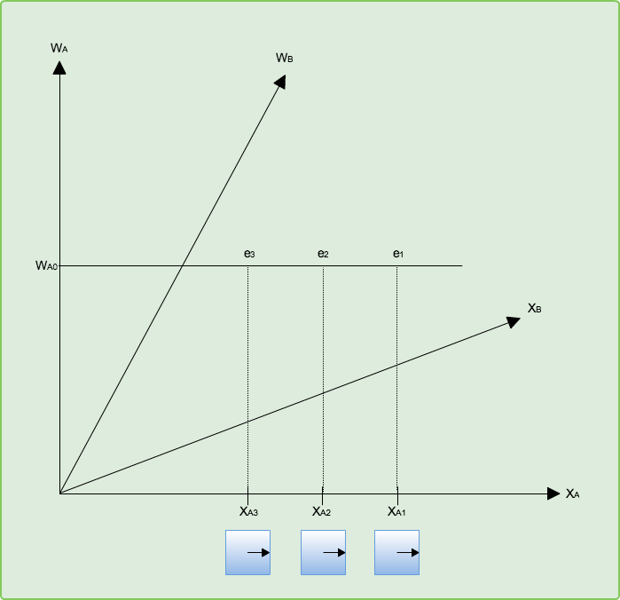

*Figure 3.1: Minkowski diagram (SA viewpoint)*

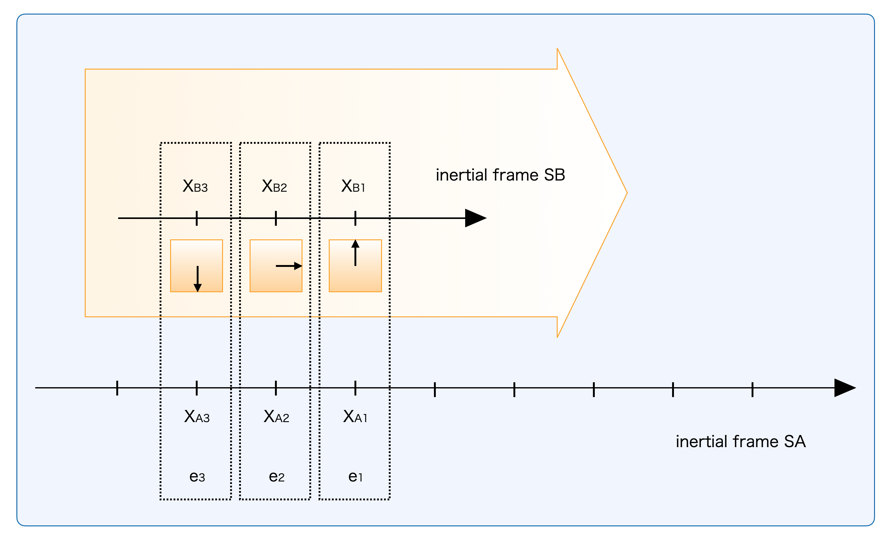

*Figure 3.2: Three events $e_1,e_2,e_3$ in SA view*

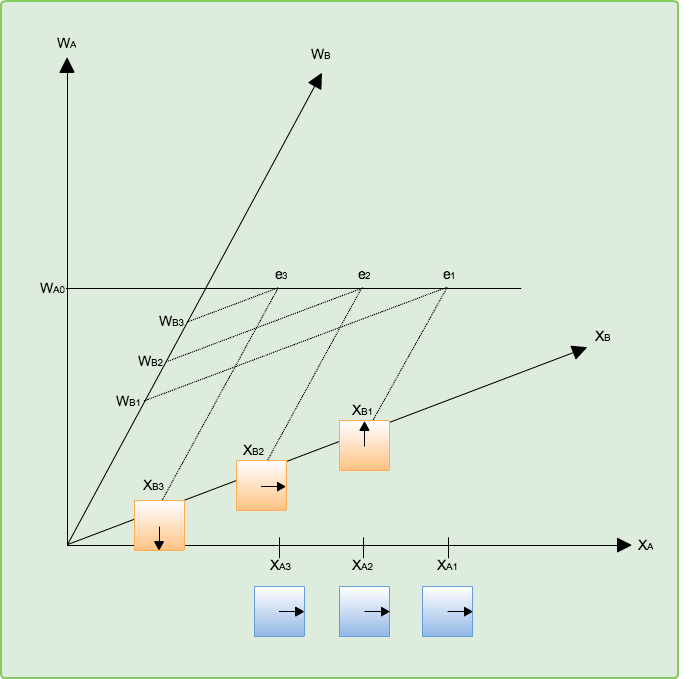

*Figure 3.3: SB-time ordering of those events*

### Appendix C: Deriving Length Contraction with Lorentz Transformations

Let us compute length contraction of SB as seen from SA using Lorentz transformations.

In SA, at time $t_A=0$, suppose SA marks two simultaneous positions $x_{A0}$ and $x_{A1}$ on the SB side. Compute where those marks lie in SB coordinates:

$$
x_{B0}=\frac{x_{A0}-V\times 0}{\sqrt{1-(V/c)^2}},
$$

$$
x_{B1}=\frac{x_{A1}-V\times 0}{\sqrt{1-(V/c)^2}}.
$$

Hence spacing between the two SB marks is

$$
x_{B1}-x_{B0}=\frac{x_{A1}-x_{A0}}{\sqrt{1-(V/c)^2}}.
$$

So the spacing is longer than SA spacing, meaning equivalently: if SA measures an SB-rest rod simultaneously in SA, SA gets a shorter length. That already gives the standard result.

But this is not in the same narrative flow as the main text, so below we derive it in the same event-by-event style. If this is enough for you, you can skip the rest.

Take Lorentz relation

$$
w_A = \frac{Vx_B/c + w_B}{\sqrt{1-(V/c)^2}}.
$$

Let the SB-rest rod length be $L_B$, with rear at $x_B=0$ and front at $x_B=L_B$ (SB coordinates). In SB view, at time $w_{B0}$, suppose rod front reaches SA point Q. Compute SA clock reading $w_A(Q)$:

$$
x_B=L_B,
$$

$$
w_B=w_{B0}.
$$

So

$$
w_A(Q)=\frac{VL_B/c+w_{B0}}{\sqrt{1-(V/c)^2}}.
$$

SA measures rod length at this SA time. Define $w_A(Q)=w_{A0}$ (constant).

Now change viewpoint and work backward from SA’s measurement event. SA measures both endpoints simultaneously at time $w_{A0}$. Seen from SB, front event (Q) and rear event (P) are not simultaneous. Let us compute this simultaneity offset explicitly.

First look at the rear event (P) in SB. The rear endpoint always has

$$
x_B=0.
$$

Substitute $w_A=w_{A0}, x_B=0$ into

$$
w_A=\frac{Vx_B/c+w_B}{\sqrt{1-(V/c)^2}}
$$

to get

$$
w_B(P)=w_{A0}\sqrt{1-(V/c)^2}.
$$

Next, define X as the rear-endpoint event at the same SB time $w_{B0}$ as front event Q. Then X has $x_B=0,\ w_B=w_{B0}$, so

$$
w_A(X)=\frac{w_{B0}}{\sqrt{1-(V/c)^2}}.
$$

From earlier,

$$
w_{A0}=w_A(Q)=\frac{VL_B/c+w_{B0}}{\sqrt{1-(V/c)^2}}.
$$

Subtract:

$$
\Delta w_A=w_{A0}-w_A(X)=\frac{VL_B/c}{\sqrt{1-(V/c)^2}}.
$$

This is the SA time difference during which the rear endpoint moves from X to P. Therefore

$$
\overline{XP}=V\frac{\Delta w_A}{c}=\frac{V^2L_B/c^2}{\sqrt{1-(V/c)^2}}.
$$

Now, from SB viewpoint, SA effectively measures the rod while omitting this X-to-P segment. If SA-measured length $\overline{PQ}$ is $L_A$, then adding $\overline{XP}$ gives $\overline{QX}$.

If SB simultaneously records both rod endpoints as Q and X into SA, then SA length $\overline{QX}$ is

$$
\overline{QX}=\frac{L_B}{\sqrt{1-(V/c)^2}}.
$$

Therefore

$$
L_A+\frac{V^2L_B/c^2}{\sqrt{1-(V/c)^2}}=\frac{L_B}{\sqrt{1-(V/c)^2}},
$$

and rearranging:

$$
L_A=L_B\sqrt{1-(V/c)^2}.
$$

So SA sees the rod contracted by this factor.

*Figure 3.4 (SB view): Rod front reaches SA point Q*

*Figure 3.5 (SB view): Rod rear moves from SA point X to P*

### Appendix D: Four-Momentum and $E = mc^{2}$

Since this is a relativity book, let us derive $E=mc^2$.

To describe moving objects, define four-velocity:

$$
\mathbf{u}=(u^0,u^1,u^2,u^3)=\left(\frac{dw}{d\tau},\frac{dx}{d\tau},\frac{dy}{d\tau},\frac{dz}{d\tau}\right),
$$

$d\tau$ is proper time of the moving object, and $dw,dx,dy,dz$ are coordinate time/space in the observer coordinates (strictly, with our convention they have length units because of factors of $c$). This is a definition.

Multiply by $mc$ to define four-momentum:

$$
\mathbf{p}=(p^0,p^1,p^2,p^3)=mc\mathbf{u}
=\left(mc\frac{dw}{d\tau},mc\frac{dx}{d\tau},mc\frac{dy}{d\tau},mc\frac{dz}{d\tau}\right).
$$

In one spatial dimension:

$$
\mathbf{p}=(p^0,p^1)=mc\mathbf{u}
=\left(mc\frac{dw}{d\tau},mc\frac{dx}{d\tau}\right).
$$

Up to here, there is no mystery: just definitions.

Now consider the Lorentz-invariant quantity

$$
ds^2=-dw^2+dx^2.
$$

Proper time is the time indicated by a clock attached to the object. Looking at the expression above, an object moving by $dx$ during coordinate interval $dw$ carries that attached-clock time as proper time.

For $dx=0$ (object at rest in that coordinate system), coordinate time and proper time coincide:

$$
ds^2=-dw^2+dx^2=-d\tau^2+0^2=-d\tau^2.
$$

So $ds^2$ can be written in terms of proper time. In general, relation between attached-clock proper time and observer coordinate variables is

$$
-d\tau^2(=ds^2)=-dw^2+dx^2.
$$

Divide by $d\tau^2$:

$$
-1=-\left(\frac{dw}{d\tau}\right)^2+\left(\frac{dx}{d\tau}\right)^2.
$$

Multiply by $(mc)^2$:

$$
-(mc)^2=-\left(mc\frac{dw}{d\tau}\right)^2+\left(mc\frac{dx}{d\tau}\right)^2,
$$

rearrange:

$$
\left(mc\frac{dw}{d\tau}\right)^2=(mc)^2+\left(mc\frac{dx}{d\tau}\right)^2.
$$

Rewrite using four-momentum symbols:

$$
(p^0)^2=(mc)^2+(p^1)^2.
$$

Now take the low-speed limit (speed much smaller than light speed), so $p^1$ is small, and calculate $p^0c$:

$$
p^0c=c\sqrt{(mc)^2+(p^1)^2}
=mc^2\sqrt{1+\left(\frac{p^1}{mc}\right)^2}.
$$

$$
\simeq mc^2\left(1+\frac{1}{2}\left(\frac{p^1}{mc}\right)^2\right).
$$

Let $t$ denote ordinary time in seconds. Since $d\tau\simeq cdt$,

$$
p^1=mc\frac{dx}{d\tau}\simeq mc\frac{dx}{cdt}=mv_x.
$$

Therefore

$$
p^0c\simeq mc^2+\frac{(p^1)^2}{2m}\simeq mc^2+\frac{1}{2}mv_x^2.
$$

The kinetic-energy term appears. So the first term $mc^2$ is an energy term existing in addition to kinetic energy. In this way, $p^0c$ is identified as total energy.

## References

- Introductory Physics Course 9: Relativity (Nakano)
- Spacetime and Gravity (Fujii)
- General Relativity (P.A.M. Dirac)
- EMAN Physics: <https://eman-physics.net/relativity/contents.html>

## Credits

- Book title: Making Sense of Relativity
- Version: 1.0.0
- Release date: 2026/3/7
- Author: t-ishii66 / Studied physics at university. Systems engineer. Learned programming on the X68000 and became interested in Linux. Recently interested in AI. Still struggling with English conversation.
- Review: GPT 5.3 Codex, Claude Opus 4.5
- Illustrations: ChatGPT 5.3
- Comics: ChatGPT 5.3
- English translation: GPT 5.3 Codex, Claude Opus 4.5, t-ishii66

## Closing

Thank you for reading to the end. This manuscript has been carefully discussed, but if you find any mistakes, please contact us.

Contact form:
https://forms.gle/d5QrngqCdRKYXhzs8

This work is protected by copyright. Partial or full reproduction is prohibited.

Copyright(C) 2026 t-ishii66. All rights reserved.

---

## END
