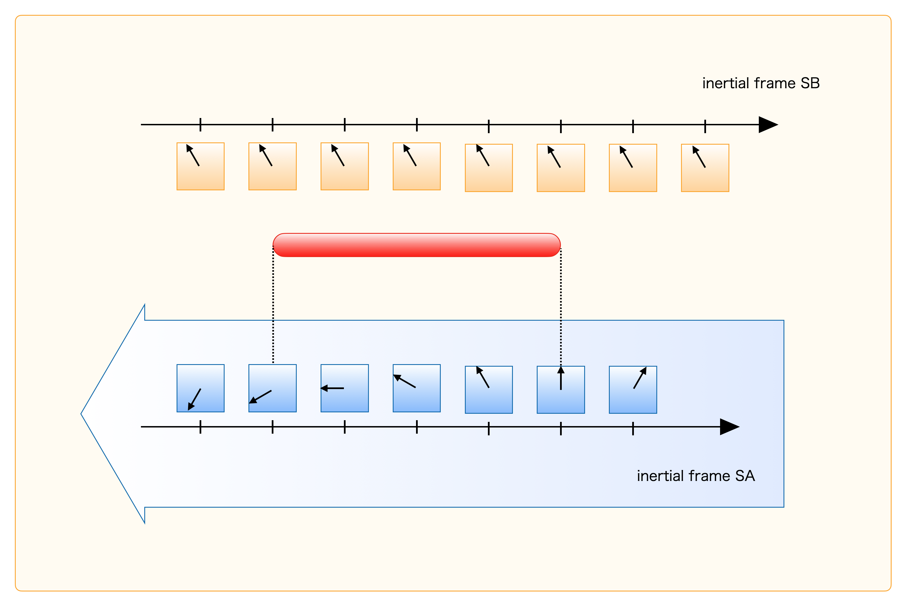
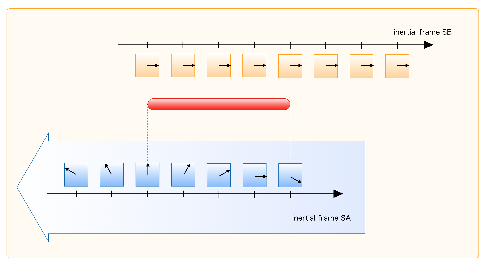

# Making Sense of Relativity

_Notes Toward Understanding Relativity_

## Table of Contents

- Introduction
- Characters
  - Alice
  - Bob
  - Charlie
- Chapter 1: Special Relativity
  - The Principle of Invariant Light Speed
  - Lorentz Transformation
  - Setup and Characters
  - Proper Time and Coordinate Time
  - How Clocks Tick
  - Relativity of Simultaneity
  - Length Contraction
- Chapter 2: General Relativity
  - Setup and Characters
  - Metric
  - Schwarzschild Solution
  - Coordinates as a Canvas
  - Coordinate Time and Proper Time
  - Gravitational Redshift
  - Proper Length and Coordinate Length
  - Speed of Light in a Gravitational Field
  - Coordinate Systems as a Canvas
  - A Freely Falling Observer
  - Light Signals from Falling Bob
  - Bob and Charlie Meet Again
  - Metric and Coordinate Transformations
  - Interferometer Thought Experiment
- Appendix
  - Appendix A: Why is $ds^{2}$ invariant under Lorentz transformations?
  - Appendix B: Why do SB clocks look desynchronized from SA?
  - Appendix C: Deriving Length Contraction with Lorentz Transformations
  - Appendix D: Four-Momentum and $E = mc^{2}$
- References
- Credits
- Closing

## Introduction

Relativity often feels counterintuitive. Many readers can follow the algebra but still feel that the physical meaning does not settle in. This book is for that gap. We will use simple setups and follow concrete observations to make seemingly strange results less mysterious.

The discussion is intentionally informal. We skip strict formal derivations and focus on conceptual clarity. If you want full formal development, many excellent textbooks are available. Read one, get puzzled, then come back here.

Let us begin.

## Characters

### Alice

Age: 10

Personality: Curious, outspoken, never satisfied with vague answers.

Hobbies: Watching stars, reading storybooks, collecting pretty stones.

Likes: Strawberry milk, blue ribbons, mysterious stories.

### Bob

Age: 12

Personality: Calm and a bit logical. Observes before concluding.

Hobbies: Crafting, maps, taking clocks apart and reassembling them.

Likes: Hamburgers, toolboxes, new notebooks.

### Charlie

Age: 11

Personality: Relaxed but sharp. Good at seeing the big picture from a distance.

Hobbies: Naps, walks, watching cloud shapes.

Likes: Melon bread, wide scenery, binoculars.

## Chapter 1: Special Relativity

### The Principle of Invariant Light Speed

An inertial frame is a frame moving at constant velocity in a straight line. A rest frame means an inertial frame in which the observer is at rest.

In any inertial frame, the measured speed of light in vacuum is always $3 \times 10^{8}\,[m/s]$. Even if you chase light in a uniformly moving rocket, you still measure the same value. Strange, but experimentally true. This is the principle of invariant light speed.

### Lorentz Transformation

In this book we mostly use one spatial dimension, so spacetime is 2D: time + one space axis.

Let SA and SB be inertial frames, with SB moving at speed $V$ relative to SA. Coordinates are $(t_A,x_A)$ and $(t_B,x_B)$.

Assume

$$
x_B = \gamma(x_A - Vt_A)
$$

and conversely

$$
x_A = \gamma(x_B + Vt_B)
$$

From these, one can also solve for $t_B$ as

$$
t_B = \frac{1-\gamma^2}{\gamma V}x_A + \gamma t_A.
$$

Now impose invariant light speed. Emit light when SA and SB origins coincide:

$$
x_A = ct_A, \quad x_B = ct_B.
$$

Substitute:

$$
ct_B = \gamma(ct_A - Vt_A), \quad ct_A = \gamma(ct_B + Vt_B).
$$

Then

$$
c^2 = \gamma^2(c^2 - V^2),
$$

so

$$
\gamma = \frac{1}{\sqrt{1-(V/c)^2}}.
$$

Therefore,

$$
x_B = \frac{x_A - Vt_A}{\sqrt{1-(V/c)^2}},
$$

$$
t_B = \frac{t_A - Vx_A/c^2}{\sqrt{1-(V/c)^2}}.
$$

---

Alice: “I’ll read those equations later… just a tiny nap…”

Bob: “Alice is completely asleep. I kind of understand, though.”

Charlie: “I’ll keep following the math a little longer.”

---

### Setup and Characters

We have two inertial frames, SA and SB. Alice is at rest in SA and has a clock. Bob is at rest in SB and also has a clock. SB moves at speed $V$ relative to SA.

That is the whole setup.

| Character | Setup |
| --- | --- |
| Alice | At rest in SA, carrying a clock |
| Bob | At rest in SB, carrying a clock |

### Proper Time and Coordinate Time

In SA, imagine many clocks fixed to the coordinate grid (square clocks in figures). They define coordinate time. Let us call them coordinate clocks.

Alice’s own clock (round clock in figures) measures Alice’s proper time. Proper time means the time shown by a clock attached to the object.

Coordinate clocks and proper clocks are physically the same type of clock; only how we use them differs.

All SA coordinate clocks are synchronized with Alice’s SA-rest clock. SB is built similarly.

Use $w$ for coordinate-time readings and $\tau$ for proper-time readings. In this book, these are measured in length units, not seconds, by defining

$$
w = ct.
$$

Similarly, we multiply ordinary proper time by $c$ and call it $\tau$. We still speak of them as “time” for readability.

Since Alice is at rest in SA,

$$
\tau_A = w_A,
$$

and for Bob at rest in SB,

$$
\tau_B = w_B.
$$

*Figure 1.1 (SA view): Proper clock and coordinate clocks*

*Figure 1.2 (SA view): Relationship between SA and SB (conceptual)*

---

Alice: “So the round one is proper time and the square one is coordinate time? Same store, same clocks… weird.”

---

### How Clocks Tick

First, observe Bob’s clock from SA.

As seen in SA, Bob moves uniformly and passes points P and Q. Bob’s proper interval from P to Q is measured by one Bob clock:

$$
d\tau_B = \tau_Q - \tau_P.
$$

But SA’s coordinate interval is measured by two different SA clocks at P and Q:

$$
dw_A = w_Q - w_P.
$$

|  | Bob (SB) | SA |
| --- | --- | --- |
| At P | Bob reads $\tau_P$ | SA clock at P reads $w_P$ |
| At Q | Bob reads $\tau_Q$ | SA clock at Q reads $w_Q$ |
| Interval P to Q | $d\tau_B$ | $dw_A$ |

This distinction is crucial.

Let SA spatial separation be $dx_A$. Define

$$
ds^2 = -dw_A^2 + dx_A^2.
$$

This quantity is Lorentz invariant (derivation in Appendix A).

In Bob’s own frame, Bob is at rest so $dx_B=0$, hence

$$
ds^2 = -dw_B^2 = -d\tau_B^2.
$$

Thus,

$$
-d\tau_B^2 = -dw_A^2 + dx_A^2,
$$

so

$$
d\tau_B = dw_A\sqrt{1-(dx_A/dw_A)^2} = dw_A\sqrt{1-(V/c)^2}.
$$

Therefore $d\tau_B < dw_A$. Since $\tau_A = w_A$ for Alice at rest in SA, Bob’s clock runs slower than Alice’s according to SA.

*Figure 1.4 (SA view): Proper-time interval vs coordinate-time interval*

But Bob can make a symmetric claim from SB. Is that a contradiction? Next section.

### Relativity of Simultaneity

Now compare SB coordinate clocks as seen from SA.

If each SB clock runs slowly from SA’s viewpoint, how can Bob still claim Alice’s clock is slower? The key is that SB clocks are not judged simultaneous in SA in the same way.

*Figure 1.5 (SA view): SB coordinate clocks from SA*

*Figure 1.6 (SA view): Rightmost SB clock happens to match Alice at one event*

*Figure 1.7 (SA view): Another SB clock compares with Alice later*

Even though each SB clock ticks slowly in SA, their displayed times are offset in SA slicing. This resolves the apparent paradox: both Alice and Bob can consistently conclude the other side’s moving clock is slow.

*Figure 1.8: Alice’s clock seen via multiple SB coordinate clocks*

### Length Contraction

Length measurement means identifying both endpoints simultaneously in the measuring frame.

Suppose a rod is at rest in SB and SA measures its endpoints as P and Q simultaneously in SA.

*Figure 1.9 (SA view): SA measuring a rod at rest in SB*

Switch to SB viewpoint. SA’s two endpoint-identification events are not simultaneous in SB.

*Figure 1.10 (SB view): SA identifies the front endpoint*

*Figure 1.11 (SB view): SA identifies the rear endpoint later*

So SA’s “simultaneous in SA” measurement appears non-simultaneous in SB.

Conversely, if SB measures SA’s segment with simultaneity in SB, SA sees non-simultaneous events too.

*Figure 1.12 (SA view): SB identifies P*

*Figure 1.13 (SA view): SB identifies Q later in SA time*

Hence each frame measures the other frame’s moving length as contracted. For a more explicit derivation, see Appendix B and C.

## Chapter 2: General Relativity

Consider an astronaut in a uniformly accelerating rocket, holding an apple. Throw the apple, and inside the rocket it appears to follow a curved trajectory.

*Apple in an accelerating rocket*

From outside, however, the apple may follow straight inertial motion while the astronaut accelerates.

Apply this perspective to Earth. An apple seems to arc downward. In GR language, the apple follows a geodesic (loosely: a “straightest” path in curved spacetime), while our frame is non-inertial in the gravitational field.

(Strictly speaking, we use “shortest path” only as an intuitive phrase; the precise term is geodesic.)

Rocket acceleration is one-directional, but gravity points toward the massive body’s center, so the global situations are not identical.

*Viewing projectile motion as an effect of curved spacetime description*

### Setup and Characters

In this chapter, place a single massive body at the origin. Focus on one radial spatial dimension.

Alice is at radius $r_A$ in stronger gravity (e.g., near the surface). Charlie is fixed far away at $r_C \approx \infty$ where gravity is negligible.

Both have their own clocks and can always read their own proper time.

| Character | Setup |
| --- | --- |
| Alice | Static at $r_A$, feels strong gravity |
| Charlie | Far away at $r_C \approx \infty$, effectively inertial |

### Metric

Let inertial Minkowski metric be

$$
\eta_{\mu\nu}=
\begin{pmatrix}
-1&0&0&0\\
0&1&0&0\\
0&0&1&0\\
0&0&0&1
\end{pmatrix}.
$$

Even in flat spacetime, non-Cartesian coordinates can make metric components non-Minkowskian. Metric components depend on coordinates; curvature is the invariant criterion.

With inertial coordinates $X^\mu$ and arbitrary coordinates $x^\mu$:

$$
dX^\mu = \frac{\partial X^\mu}{\partial x^\nu}dx^\nu,
$$

$$
ds^2 = \eta_{\mu\nu}dX^\mu dX^\nu = g_{\rho\tau}dx^\rho dx^\tau,
$$

with

$$
g_{\rho\tau}=\eta_{\mu\nu}\frac{\partial X^\mu}{\partial x^\rho}\frac{\partial X^\nu}{\partial x^\tau}.
$$

So $ds^2$ is the same scalar, regardless of coordinates.

### Schwarzschild Solution

For a spherically symmetric mass, Schwarzschild metric is

$$
ds^{2}=-\left(1-\frac{a}{r}\right)dw^{2}+\frac{1}{1-a/r}dr^{2}+r^{2}d\Omega^{2},
$$

where

$$
a=\frac{2GM}{c^{2}},
$$

and

$$
d\Omega^{2}=d\theta^{2}+\sin^{2}\theta d\phi^{2}.
$$

In radial-only discussion:

$$
ds^{2}=-\left(1-\frac{a}{r}\right)dw^{2}+\frac{1}{1-a/r}dr^{2}.
$$

### Coordinates as a Canvas

Coordinates from a solution are a computational canvas, not automatically “the directly experienced time and distance.”

Even in flat space, a coordinate reparameterization changes coordinate increments. So values like $w,r,dw,dr$ in Schwarzschild coordinates should be interpreted carefully.

What we physically measure are proper time and proper length; relating these to the canvas coordinates is the key.

### Coordinate Time and Proper Time

At $r\to\infty$:

$$
ds^{2}=-dw^{2}+dr^{2}.
$$

For Charlie at rest, $dr_C=0$:

$$
ds^{2}=-d\tau_C^{2}=-dw^{2}\Rightarrow d\tau_C=dw.
$$

At Alice’s radius $r_A$:

$$
ds^{2}=-\left(1-\frac{a}{r_A}\right)dw^{2}+\frac{1}{1-a/r_A}dr^{2}.
$$

For static Alice ($dr_A=0$):

$$
ds^{2}=-d\tau_A^{2}=-\left(1-\frac{a}{r_A}\right)dw^{2},
$$

thus

$$
d\tau_A=dw\sqrt{1-\frac{a}{r_A}}.
$$

So compared at the same coordinate increment $dw$, Alice’s proper-time increment is smaller than Charlie’s.

### Gravitational Redshift

If Alice emits light during proper interval $d\tau_A$, convert to coordinate interval:

$$
dw=d\tau_A\sqrt{\frac{1}{1-a/r_A}}.
$$

Charlie at infinity has $d\tau_C=dw$, so

$$
d\tau_C=d\tau_A\sqrt{\frac{1}{1-a/r_A}}.
$$

Same number of cycles spread over longer received time means lower observed frequency at Charlie: redshift.

### Proper Length and Coordinate Length

For simultaneous spatial separation in Schwarzschild coordinates ($dw=0$):

$$
ds^2=\frac{1}{1-a/r}dr^2.
$$

At infinity, this reduces to $ds^2=dr^2$.

Define proper length element $d\sigma$ by

$$
d\sigma^2 = ds^2.
$$

At $r_A$:

$$
ds^{2}=\frac{1}{1-a/r_A}dr^{2},
$$

hence

$$
dr = d\sigma\sqrt{1-a/r_A}.
$$

So coordinate distance $dr$ can be smaller than local proper length in strong gravity regions.

### Speed of Light in a Gravitational Field

For light, $ds^2=0$:

$$
-\left(1-\frac{a}{r}\right)dw^2+\frac{1}{1-a/r}dr^2=0
$$

so

$$
\left|\frac{dr}{dw}\right|=1-\frac{a}{r}.
$$

This is coordinate speed on the $w-r$ canvas.

At infinity, Charlie has $d\tau_C=dw$ and locally measures light speed $c$.

At Alice’s location, local proper measures satisfy

$$
d\tau_A^2=\left(1-\frac{a}{r_A}\right)dw^2,
$$

$$
d\sigma = dr\sqrt{\frac{1}{1-a/r_A}},
$$

hence

$$
\frac{d\sigma}{d\tau_A}=1,
$$

so local measured light speed remains $c$.

### Coordinate Systems as a Canvas

The Schwarzschild coordinates are a useful computational canvas.

Local measurements use local clocks/rulers, not raw coordinate values themselves. So when calculating trajectories near massive bodies, the physically observed quantity is what detectors record in local proper units.

*Figure 2.1: Light trajectory on a coordinate canvas*

In short: near a massive body, what matters is that the trajectory is computable on the canvas; instruments there do not directly read coordinate values.

### A Freely Falling Observer

Now let Bob free-fall from Alice’s location.

Near Bob’s worldline and over a sufficiently small region, Bob can use a local inertial description (metric approximately $\eta_{\mu\nu}$). But this is local: one must re-choose such local frames point by point along the worldline.

Alice/Charlie see Bob accelerated in Schwarzschild coordinates, so they are not globally related to Bob by one Lorentz transformation. Differences appear in accumulated proper time.

Using Bob-local and Charlie coordinates for the same nearby events:

$$
ds^{2}=-dw_B^{2}+dr_B^{2}
$$

and

$$
ds^{2}=-\left(1-\frac{a}{r_B}\right)dw_C^{2}+\frac{1}{1-a/r_B}dr_C^{2}.
$$

For Bob’s own proper-time increment ($dr_B=0$):

$$
-d\tau_B^{2}=-\left(1-\frac{a}{r_B}\right)dw_C^{2}+\frac{1}{1-a/r_B}dr_C^{2},
$$

thus at least

$$
d\tau_B < dw_C.
$$

If Alice and Bob are compared at nearly same radius ($r_A\sim r_B$), gravitational slowing is similar, and Bob’s extra relative motion implies: from Alice’s perspective Bob’s clock is further slowed. So

$$
d\tau_B<d\tau_A<d\tau_C.
$$

### Light Signals from Falling Bob

Bob emits flashes every 1 second of his proper time while free-falling toward Charlie (far away).

Bob feels ordinary passage of time. But Charlie sees longer and longer intervals between received flashes as Bob approaches $r=a$.

For qualitative trend, use the static-like relation as an approximation:

$$
d\tau_B = dw_C\sqrt{1-\frac{a}{r_B}}.
$$

As $r_B\to a$, a fixed $d\tau_B$ corresponds to very large $dw_C$, so received intervals stretch greatly.

Frequency ratio from cycle counting:

$$
\nu_B=\frac{N}{d\tau_B},\quad \nu_C=\frac{N}{dw_C},
$$

$$
\frac{\nu_C}{\nu_B}=\frac{d\tau_B}{dw_C}\approx\sqrt{1-\frac{a}{r_B}}\to 0.
$$

So received light is strongly redshifted and dimmed.

To Charlie, Bob appears to freeze near the horizon; Bob crosses in finite proper time. This “freezing” is the Schwarzschild-coordinate description.

$$
\left|\frac{dr}{dw}\right|=1-\frac{a}{r}\to 0\quad (r\to a).
$$

---

Charlie: “Bob’s flashes are getting slower and slower…”

Alice: “I hope Bob is okay…”

Charlie: “For our clocks, a long time has passed. For Bob, time is probably normal. We just lose sight of him.”

Bob: “I fell quite far. Still feels normal. Maybe I should head back.”

---

### Bob and Charlie Meet Again

Thought experiment: Bob falls deep, then briefly fires a rocket to reverse direction and return to Charlie at infinity.

Keep thrust duration short; focus on free-motion segments. On both outbound and inbound parts, Bob’s proper time tends to accumulate more slowly than Charlie’s far-away time.

So over the full trip,

$$
\tau_{B,\mathrm{total}}<\tau_{C,\mathrm{total}}.
$$

When they reunite and compare clocks directly, Bob is younger.

Not necessarily exactly “double” any one-way effect; magnitude depends on turning radius and velocity history.

### Metric and Coordinate Transformations

From any coordinates $x^\mu$ with metric $g_{\mu\nu}$ to another $x'^\lambda$:

$$
ds^2=g_{\mu\nu}dx^\mu dx^\nu
= g'_{\lambda\sigma}dx'^\lambda dx'^\sigma.
$$

Same form, same scalar value.

Locally (in sufficiently small neighborhood), one can choose coordinates where the metric at that point is Minkowskian:

$$
ds^2=g_{\mu\nu}dx^\mu dx^\nu = \eta_{\mu\nu}dX^\mu dX^\nu \quad (\text{locally}).
$$

Local measurements always use proper clocks/rulers. Coordinate transformations are the language linking different descriptions.

### Interferometer Thought Experiment

In flat space, place a light source and mirrors at equal distance $L$ on left/right. Returned beams interfere.

Move this setup into a gravitational field while holding the apparatus static against gravity. If one arm samples stronger gravity than the other, spacetime geometry changes effective optical path lengths differently.

Then interference fringes shift.

If the metric changes in time (for example, due to a passing perturbation), corresponding path-length changes can be detected through interference.

## Appendix

### Appendix A: Why is $ds^{2}$ Lorentz invariant?

In 1D space with this book’s sign convention,

$$
ds^2=-dw^2+dx^2
$$

(with $w=ct$).

Lorentz transform:

$$
x_B=\gamma\left(x_A-\frac{V}{c}w_A\right),\quad
w_B=\gamma\left(w_A-\frac{V}{c}x_A\right).
$$

Differentiate and substitute. With $\beta=V/c$:

$$
\begin{aligned}
-dw_B^2+dx_B^2
&=-\gamma^2(dw_A-\beta dx_A)^2+\gamma^2(dx_A-\beta dw_A)^2\\
&=\gamma^2(1-\beta^2)(-dw_A^2+dx_A^2)\\
&=-dw_A^2+dx_A^2
\end{aligned}
$$

since $\gamma^2(1-\beta^2)=1$.

Hence

$$
ds^2=-dw_A^2+dx_A^2=-dw_B^2+dx_B^2,
$$

so $ds^2$ is invariant.

### Appendix B: Why do SB clocks look desynchronized from SA?

In a Minkowski diagram drawn in SA coordinates, SB axes are tilted. SA simultaneity slices are horizontal SA-time lines. Events that are simultaneous in SA are not generally simultaneous in SB.

This is exactly why multiple SB clocks can appear offset in SA while each still runs uniformly in its own frame.

*Figure 3.1: Minkowski diagram (SA viewpoint)*

*Figure 3.2: Three events $e_1,e_2,e_3$ in SA view*

*Figure 3.3: SB-time ordering of those events*

### Appendix C: Deriving Length Contraction with Lorentz Transformations

Consider a rod at rest in SB with endpoints at $x_B=0$ and $x_B=L_B$.

If SA marks positions simultaneously at $t_A=0$, transformed spacing in SB is

$$
x_{B1}-x_{B0}=\frac{x_{A1}-x_{A0}}{\sqrt{1-(V/c)^2}}.
$$

So the SA-simultaneous measured length of the moving SB rod is contracted.

Now follow the book’s event flow using

$$
w_A = \frac{Vx_B/c + w_B}{\sqrt{1-(V/c)^2}}.
$$

At SB time $w_{B0}$, front endpoint event Q ($x_B=L_B$):

$$
w_A(Q)=\frac{VL_B/c+w_{B0}}{\sqrt{1-(V/c)^2}}\equiv w_{A0}.
$$

SA measures both endpoints at this same SA time $w_{A0}$.

For rear endpoint event P, $x_B=0$ and $w_A=w_{A0}$ gives

$$
w_B(P)=w_{A0}\sqrt{1-(V/c)^2}.
$$

At event X where rear endpoint has SB time $w_{B0}$:

$$
w_A(X)=\frac{w_{B0}}{\sqrt{1-(V/c)^2}}.
$$

Therefore

$$
\Delta w_A=w_{A0}-w_A(X)=\frac{VL_B/c}{\sqrt{1-(V/c)^2}}.
$$

So in SA,

$$
\overline{XP}=V\frac{\Delta w_A}{c}=\frac{V^2L_B/c^2}{\sqrt{1-(V/c)^2}}.
$$

Also,

$$
\overline{QX}=\frac{L_B}{\sqrt{1-(V/c)^2}}.
$$

And

$$
L_A+\frac{V^2L_B/c^2}{\sqrt{1-(V/c)^2}}=\frac{L_B}{\sqrt{1-(V/c)^2}},
$$

thus

$$
L_A=L_B\sqrt{1-(V/c)^2}.
$$

So SA sees the moving rod contracted.

*Figure 3.4 (SB view): Rod front reaches SA point Q*

*Figure 3.5 (SB view): Rod rear moves from SA point X to P*

### Appendix D: Four-Momentum and $E = mc^{2}$

Define four-velocity

$$
\mathbf{u}=(u^0,u^1,u^2,u^3)=\left(\frac{dw}{d\tau},\frac{dx}{d\tau},\frac{dy}{d\tau},\frac{dz}{d\tau}\right),
$$

and four-momentum

$$
\mathbf{p}=mc\,\mathbf{u}.
$$

In 1D space:

$$
\mathbf{p}=(p^0,p^1)=\left(mc\frac{dw}{d\tau},mc\frac{dx}{d\tau}\right).
$$

From

$$
ds^2=-dw^2+dx^2=-d\tau^2,
$$

divide by $d\tau^2$:

$$
-1=-\left(\frac{dw}{d\tau}\right)^2+\left(\frac{dx}{d\tau}\right)^2.
$$

Multiply by $(mc)^2$:

$$
-(mc)^2=-\left(mc\frac{dw}{d\tau}\right)^2+\left(mc\frac{dx}{d\tau}\right)^2,
$$

so

$$
(p^0)^2=(mc)^2+(p^1)^2.
$$

Then

$$
p^0c=c\sqrt{(mc)^2+(p^1)^2}
=mc^2\sqrt{1+\left(\frac{p^1}{mc}\right)^2}.
$$

For low speed, with $d\tau\simeq cdt$ and $p^1\simeq mv_x$,

$$
p^0c\simeq mc^2+\frac{(p^1)^2}{2m}\simeq mc^2+\frac{1}{2}mv_x^2.
$$

Thus total energy is $E=p^0c$, with rest-energy term $mc^2$.

## References

- Introductory Physics Course 9: Relativity (Nakano)
- Spacetime and Gravity (Fujii)
- General Relativity (P.A.M. Dirac)
- EMAN Physics: <https://eman-physics.net/relativity/contents.html>

## Credits

- Review: ChatGPT 5.3, Claude
- Illustrations: ChatGPT 5.3

## Closing

Thank you for reading to the end. This manuscript has been carefully discussed, but if you find any mistakes, please contact us.

Contact form:
https://forms.gle/d5QrngqCdRKYXhzs8

This work is protected by copyright. Partial or full reproduction is prohibited.

## END
