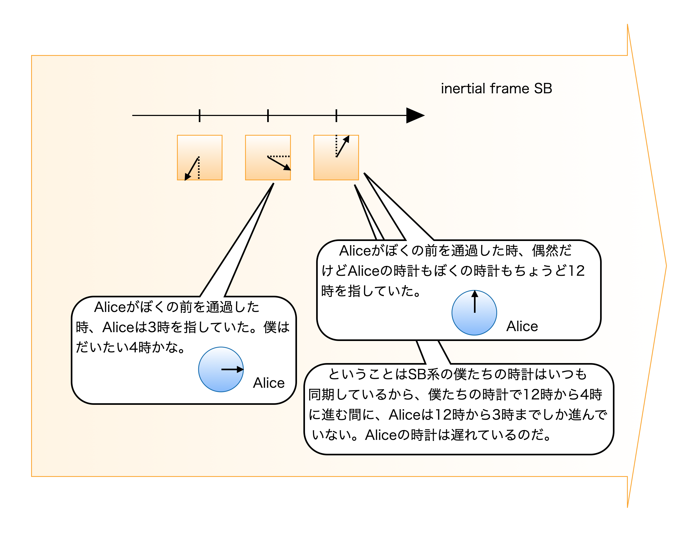

# Making Sense of Relativity

_Notes Toward Understanding Relativity_

## 目次

- はじめに
- 登場人物
  - Alice
  - Bob
  - Charlie
- チャプタ 1 特殊相対論
  - 光速不変の原理
  - ローレンツ変換
  - 登場人物と状況設定
  - 固有時と座標時
  - 時計の進み方
  - 同時性のずれ
  - 長さの収縮
- チャプタ 2 一般相対論
  - 登場人物と状況設定
  - 計量
  - Schwarzschild 解
  - 座標系はキャンバスである
  - 座標時と固有時
  - 重力赤方偏移
  - 固有長と座標長
  - 重力場での光速
  - キャンバスとしての座標系
  - 自由落下する観測者
  - 落下する Bob からの光
  - Bob と Charlie の再会
  - 計量と座標変換
  - 干渉計の思考実験
- Appendix
  - Appendix A: なぜ $ds^{2}$ がローレンツ変換で不変なのか？
  - Appendix B: なぜ SA 系から見て SB 系の座標時計の時刻はバラバラなのか？
  - Appendix C: 長さの収縮をローレンツ変換で計算する
  - Appendix D: 4元運動量と $E = mc^{2}$
- 参考文献
- 制作
- おわりに

## はじめに

相対論が描く世界像は直感的な理解が難しく、不可思議な現象を扱っているようにすら思えます。議論の式変形は追えるもののその意味するところがどうも腑に落ちないという方は少なくないのではないでしょうか。本書では簡単な状況を設定し、不可思議な現象の謎を解き明かします。

議論自体はかなりラフですので細かい所は気にせず、気軽に読み進めて行ってください。なお、基本的な式の導出や相対論自体の理論展開は本書では扱っていません。相対論の教科書は世に溢れていますのでそちらを参照してください。おそらく釈然としない気分になると思いますのでそうしたら本書に戻ってきてください。

それでははじめましょう！

## 登場人物

### Alice

年齢: 10歳

性格: 好奇心が強く、思ったことはすぐ口に出す。納得できないことをそのままにしない。

趣味: 星空を見ること、絵本を読むこと、きれいな石を集めること。

好きなもの: いちごミルク、青いリボン、ふしぎな話。

### Bob

年齢: 12歳

性格: 落ち着いていて、少し理屈っぽい。考える前に結論を言わず、まず観察するタイプ。

趣味: 工作、地図を見ること、時計を分解してまた組み立てること。

好きなもの: ハンバーガー、工具箱、新しいノート。

### Charlie

年齢: 11歳

性格: のんびりして見えるが、意外と鋭い。遠くから全体を見るのが得意。

趣味: 昼寝、散歩、雲の形を眺めること。

好きなもの: メロンパン、広い景色、双眼鏡。

## チャプタ 1 特殊相対論

### 光速不変の原理

慣性系とは等速直線運動をしている系のこと。静止系とは観測者が静止していると見なす慣性系のことである。

さて、慣性系から（真空の）光の速さを測定すると、必ず同じ値 $3 \times 10^{8}\lbrack m/s\rbrack$ になる。一定速さのロケットで光を追いかけながら光速を測定しても全く同じ速さなのだ。これは不思議な事だが実験事実だから仕方が無い。これを光速不変の原理と言う。

### ローレンツ変換

この本では基本的に空間を1次元とする。時間と合わせて合計2次元で議論を進める。2つの慣性系 SA と SB があり、SB 系は SA 系に対して一定速度 $V$ で移動している。SA の座標を $(t_{A},x_{A})$ であらわし、SB の座標 $(t_{B},x_{B})$ であらわすことにする。SB 系の空間座標を SA 系の座標で表現すると次の形で書けるだろう。ここで $\gamma$ は何らかの係数であり、後で決定する。

$$
x_{B} = \gamma(x_{A} - Vt_{A})
$$

SB 系の原点 $x_{B} = 0$ は SA 系で $x_{A} = Vt_{A}$ の場所であるし問題は無さそうである。逆に SB 系から SA 系への変換は逆に

$$
x_{A} = \gamma(x_{B} + Vt_{B})
$$

と書けるだろう。状況的には速度 $V$ の符号が変わるだけでその他は全て同じだからだ。

また、$t_{B}$ について解くこともできて、

$$
t_{B} = \frac{(1 - \gamma^{2})}{\gamma V}x_{A} + \gamma t_{A}
$$

となる。

ここで光速不変の原理を考えよう。SA 系と SB 系の原点が重なった瞬間にその原点から光を発したとする。光速を $c$ として、それぞれの座標系で

$$
x_{A} = ct_{A}
$$

$$
x_{B} = ct_{B}
$$

が成り立つ。これを先ほどの式に代入すると、

$$
ct_{B} = \gamma(ct_{A} - Vt_{A})
$$

$$
ct_{A} = \gamma(ct_{B} + Vt_{B})
$$

これより

$$
c^{2} = \gamma^{2}(c^{2} - V^{2})
$$

これを解いて

$$
\gamma = \frac{1}{\sqrt{1 - (V/c)^{2}}}
$$

まとめると、SA 系から SB 系への座標変換は

$$
x_{B} = \frac{x_{A} - Vt_{A}}{\sqrt{1 - (V/c)^{2}}}
$$

$$
t_{B} = \frac{t_{A} - Vx_{A}/c^{2}}{\sqrt{1 - (V/c)^{2}}}
$$

と書ける。

---

Alice「うーん……その式はあとで読むから、ちょっとだけ寝かせて……すぅ……」

Bob「Alice、完全に爆睡してるな。まあ、気持ちは分かるけど。」

Charlie「ぼくはもう少し式を追ってみるよ。」

---

### 登場人物と状況設定

2つの慣性系 SA 系と SB 系がある。Alice は SA 系で静止しており、時計をもっている。Bob は SB 系で静止して同じく時計をもっている。SA 系から見て SB 系は等速度 $V$ で移動している。

設定は以上である。

| 登場人物 | 状況設定 |
| --- | --- |
| Alice | 慣性系 SA にて静止。時計を持っている。 |
| Bob | 慣性系 SB にて静止。時計を持っている。 |

### 固有時と座標時

SA 系に密にちりばめられ座標系に固定された時計（図中、四角い時計）があり、これが座標時を刻む時計である。座標時計とでも呼んでおこう。座標時とはこのように座標系に固定された時計が刻む時刻のことである。座標時と言えばこの四角い時計の時刻を考えれば良い。

Alice は時計を持っており、これが Alice の固有時を刻む。固有時の定義としては物体に取り付けられた時計が刻む時刻である。図中は丸い時計（固有時計）として表示する。Alice の姿をわざわざ描かないが、丸い時計は Alice のことだと考えてほしい。

座標時計と固有時計の製造過程は特に違わない。同じメーカーが同じ精度で生産している。単に形が違うだけだ。

SA 系の全ての四角い時計と、SA 系に静止している Alice の時計は同期している。Bob が静止している SB 系も同じように構成されている。描かれる図は SA 系または SB 系で静止した視点で描かれるが、どちらの視点かは明記するので混乱はないだろう。

座標時の示す時刻に $w$ を使い、固有時が示す時刻に $\tau$ を使う。これらの単位は実は時間ではなく距離である（定数 $c$ で割ることで時間になる）。どういうことかというと定数である真空中の光速 $c$ を時間 $t$ にかけて

$$
w = ct
$$

と定義している。固有時も固有時を刻む時計の時刻に $c$ をかけてそれを $\tau$ とする。それでも本文中は $w$ や $\tau$ を時間のように扱うのでご注意願いたい。

SB 系は SA 系に対して速度 $V$ で移動している。SA 系で静止している Alice の固有時 $\tau_{A}$ と座標時 $w_{A}$ の関係は、同期しているのだからもちろん $\tau_{A} = w_{A}$ である。どの座標時計も同じ時刻を刻んでいる。Bob のいる SB 系も同じ事情だから $\tau_{B} = w_{B}$ である。さて以上を踏まえて調査にのり出そう。

*図 1.1 （視点：SA系）固有時計と座標時計*

*図 1.2 （視点：SA系）SA系とSB系の関係（イメージ）*

---

Alice「えっ、私の丸い時計が固有時計で、四角いのが座標時計なの？ 同じお店で買ったのに、なんかへんなの。」

---

### 時計の進み方

最初に SA 系から見た Bob の時計の進みを調査する。SA 系から見ると Bob は矢印の方向（右方向）に等速直線運動を行っている。Bob の固有時 $\tau_{B}$ と SA 系の座標時 $w_{A}$ の関係を考えてみよう。

Bob は移動しているので、SA 系上の P 点と Q 点を通過する。この2点通過を考える場合、Bob の固有時計と比較する SA 系の座標時計は実は1つではない。つまり、1個の Bob の固有時計と比較するのは、SA 系の2個（P 点と Q 点）の異なる座標時計なのだ。

P 点、Q 点に置かれた座標時計と、Bob の固有時計の関係を表にしてみた。

*図 1.3 （視点：SA系）Bob の固有時計と SA 系の座標時計*

|  | Bob（SB系） | SA系 |
| --- | --- | --- |
| P点 | 自分（Bob）の時計を見ると $\tau_{P}$ だった。 | P点の座標時計の前を Bob が通過したのは、P点の座標時計で計って時刻 $w_{P}$ だった。 |
| Q点 | 自分（Bob）の時計を見ると $\tau_{Q}$ だった。 | Q点の座標時計の前を Bob が通過したのは、Q点の座標時計で計って時刻 $w_{Q}$ だった。 |
| PQ間の経過時間 | 自分（Bob）が P 点から Q 点まで行くのに $d\tau_{B} = \tau_{Q} - \tau_{P}$ だけ時間がかかった。 | Bob が P 点から Q 点まで行くのに $dw_{A} = w_{Q} - w_{P}$ だけ時間がかかった、と言える。 |

大切なので繰り返すが、固有時 $d\tau_{B}$ は Bob が持つ1個の時計の進みであるが、座標時の $dw_{A}$ は P 点と Q 点の2個の時計が示した時刻の差なのだ（いつもそうではない。あくまでこの場合）。

さて、P 点と Q 点の空間距離を（SA 系で測って）$dx_{A}$ とする。線素を $ds^{2}$ とすると、

$$
ds^{2} = - dw_{A}^{2} + dx_{A}^{2}
$$

で定義される量はローレンツ変換で不変な量である（導出は Appendix A）。

Bob は自分の慣性系 SB で静止しているので、Bob から見れば $dx_{B} = 0$ である。したがって Bob 側では $ds^{2} = -dw_{B}^{2}$ ($=-d\tau_{B}^{2}$)となる。

---

Bob「僕の $ds^{2}$ は、ぼくの時計で計算できてこの値。」

Alice「ちょっとまって。えーと、えーと、私の時計たちで計算すると……うそ、$ds^{2}$ おんなじだ！」

---

$ds^{2}$ は時空（時間と空間。この本では空間が1次元なので時間とあわせて2次元）の中の隣接した2点間の距離とでも言える量である。だから $ds^{2}$ が出てきたときには常に「両端の2点」を気にかけよう。それでは Bob が P 点から Q 点に移動した際の線素を考えていく。

$ds^{2}$ はローレンツ変換で不変、つまり Bob が計算しても、SA 系で計算しても同じ大きさなのだから

$$
- d\tau_{B}^{2} = - dw_{A}^{2} + dx_{A}^{2}
$$

と書ける。変形して

$$
d\tau_{B} = dw_{A}\sqrt{1 - (dx_{A}/dw_{A})^{2}}
$$

$$
d\tau_{B} = dw_{A}\sqrt{1 - (V/c)^{2}}
$$

が得られる。従って $d\tau_{B} < dw_{A}$ である。Alice はこの結果を眺めて語りだした。SA 系の座標時 $w_{A}$ と自分の時計 $\tau_{A}$ は同期している。つまり同じと考えていい。

したがって Bob の時計は Alice の時計よりゆっくりと動く。

---

Alice「Bobの時計、ゆっくり進んでる。壊れてるね。」

---

*図 1.4 （視点：SA系）固有時の経過と座標時の経過*

|  | Bob（SB系） | SA系 |
| --- | --- | --- |
| P点からQ点までの時間 | Bobは自分で時計をもっているので、その時計で計って $d\tau_{B}$。 | P点に置いてある時計の前を Bob が通った時刻と、Q点に置いてある時計の前を Bob が通った時刻の差。これが $dw_{A}$。 |
| P点からQ点までの距離 | ゼロだ。分かりづらく感じる人のために書いておくと、Bob は SB 系の住人であり、SB 系で静止している。Bob の視点では、勝手に SA 系が移動していて、P 点が来て（これが時空の1点目）、次に Q 点がやって来る（これが時空の2点目）。この時空の2点間で Bob が SB 系で移動した距離はゼロだ。 | SA 系で見た $\overline{PQ}$ の距離 $dx_{A}$ である。 |

Alice は知らなかったのだが、Bob は SB 系の座標時計を使って Alice の固有時計の進み方を観測していたのだ。そして Bob は

> Alice の時計は Bob の時計よりゆっくり動く

という結論を得ていたのだ。まぁ立場を逆転させただけだから同じ事を言うのは当たり前だろう。

---

Bob「Aliceの時計、壊れてない？」

Alice「そんなことないよ。Bob の時計が壊れてるんじゃないの？」

---

これは理論の矛盾なのか？ それについて次のセクションで考えてみたい。

### 同時性のずれ

先ほどは Bob の固有時計を SA 系の座標時計で観測したが、今度は SB 系の座標時計それぞれを SA 系の座標時計で観測する。状況は特に変わっていないから SB 系にある個々の座標時計は SA 系からはゆっくりと動いているように見えるはずである。ただ Bob の主張（Alice の時計の進み方は遅い）を考慮すると、

> SB 系にある各座標時計の時刻はバラバラ

に見えるはずなのだ（SA 系から見て）。

SB 系の座標時計が Alice の固有時計をどのように観測するか考えてみよう。

*図 1.5 （視点：SA系）SA系から見た SB 系の座標時計*

図のように SB 系の先頭の時計と Alice の時計がたまたま12時を指していたとしよう。

*図 1.6 （視点：SA系）SB系の先頭（右端）の座標時計の時刻がたまたま Alice の時計と一致*

少し時間が経過した後の図を描けばこうなるだろう。

*図 1.7 （視点：SA系）SB系の2番目の座標時計が Alice の固有時計を観測*

視点を SA 系に固定すると、SA 系の全ての時計は進みが速い（図1.7にて、青い座標時計の針が12時方向から3時方向まで進んでいる）が、SB 系の各時計は進みは遅い（が、進むスピードはみな同じ）。

図中 SB 系の隣り合う2つの座標時計に注目してみる。2つとも SA 系から見ればゆっくり時を刻む。ゆっくりというのは今指している時刻の事ではなくて、針の進むスピードのことである。ところが驚いた事にこの SB 系の2つの座標時計はお互いに「同じ時刻である」と信じているのだ。その2つの座標時計が Alice の固有時計を観察していると次の様な状況が起きる。

SB 系先頭（右端）の時計の前を Alice が通過した瞬間、指している時刻はお互い同じだった（これはただの偶然）。ところが SB 系の2番目（右から2番目）の時計の前を Alice が通過すると、自分より Alice の方が遅れていることが分かった。SB 系の全ての座標時計は同期しているのだから、SB 系より Alice の時計の方が遅れている、というわけである。

SB 系の複数の座標時計と、SA 系の固有時計（Alice や各座標時計1個を固有時計と考える等）を比較すると、やはり SA 系の固有時の方が遅れるということが言えるのだ。Alice、Bob の主張はどちらも正しいことがわかる。特殊相対論では1つの固有時計と2つの座標時計を比較してしまうためこのような一見不思議な事が起きてしまう。しかし、なんの矛盾もないのだ。

*図 1.8 SB系の複数の座標時計から見た Alice の時計の進み*

---

Alice「Bobったら、あんなに厳しく『全部の時計の時刻をちゃんと合わせて』って言ってたのに、自分はどうなの？ あとでとっちめないと。」

Bob「うーん……でもやっぱり、Alice の時計のほうが壊れてるんじゃないかな？」

---

### 長さの収縮

今度は SB 系に静止して置かれた状態の棒の長さを、SA 系から測定してみよう。長さの測定とは、

> 同時に棒の両端の位置を特定することである

SA 系から観測して、その棒の両端を P 点と Q 点と特定（これらの2点は SA 系上の点である）したとする。

*図 1.9 （視点：SA系）SB系に置かれた棒の長さを SA 系で測定する状況*

この SA 系での測定作業を SB 系から見たらどうなるのだろうか？ ここからは SB 系の視点で図を描いていこう。SB 系からの視点でみると、棒の先端が SA 系の Q 点に来たときに、その Q 点を棒の先端としたようだ。SA 系の Q 点の座標時計は（図1.10の Q 点）12時だった。

*図 1.10 （視点：SB系）SB系に置かれた棒の先端の位置を SA 系で特定*

しかし不思議なことに、棒の後端の位置を測定する気配は無かった。ふと棒の後端を見ると、後端の場所に対応する SA 系の場所 X の座標時計はとても遅れていて、まだ時刻12時になっていなかった。

*図 1.11 （視点：SB系）SB系に置かれた棒の後端の位置を SA 系で特定*

棒の後端がようやく P 点に到着した。その時 SA 系の P 点の座標時計が時刻12時を指した。そう、この瞬間 SA 系の人は棒の後端の位置を P 点だと特定したのだ。

Alice は棒が短くなった！ と騒いでいるが、Bob から見れば、Alice は同時に棒の両端の位置を特定していないのだから無意味な測定である。

---

Bob「Alice、どんくさすぎるよ。同時に両端の位置を測らないと駄目だって、さっき言ったじゃないか……。」

---

では逆に SB 系から SA 系の $\overline{PQ}$ 間の距離を測るとどのようになるだろうか？

もちろん SB 系にて「同時」に P 点と Q 点の位置を特定する必要がある。座標時計の針がちょうど真下を向いたときに測定するとしよう。再び視点を SA 系に戻そう。まず最初に P 点に対応する SB 系の座標時計が位置を特定する。

*図 1.12 （視点：SA系）SB系が P 点の位置を計測*

しかし Q 点を計る座標時計はまだ針が真下を向いていない。しばらくするとようやく Q 点を特定できた。

*図 1.13 （視点：SA系）SB系が Q 点の位置を計測*

このように SB 系から SA 系の長さを測定するとはやり短く測ってしまう。実はこのような説明は大雑把すぎている。もう少し正確な話を知りたい方は Appendix B, C を参照してほしい。そうでない方は次の一般相対論へ進もう。

## チャプタ 2 一般相対論

一定の加速度で加速するロケットの中の宇宙飛行士と、彼が手にするりんごを考えよう。りんごを投げれば、それは放物運動をするように見える。

*加速するロケットの中のりんご*

しかし、その状況をロケット外部から見れば、りんごは等速直線運動をして、宇宙飛行士が加速運動しているのだ。

この考え方を地上に当てはめてみよう。地上でりんごを投げると放物運動をする。しかし、実はりんごは等速直線運動をしているだけで、私たちが地上と一緒に上空へ向かって加速運動をしているのだ！？

そんなことはない？ りんごには重力が働くのだから、等速直線運動であるわけがない？

ここで発想の転換が必要になる。重力の効果は空間（と時間）を曲げるだけだと考えるのだ。そしてりんごは「真っ直ぐ」に「2点間の最短距離を」進んでいると考える（厳密には測地線だが、ここでは気軽に最短距離という言い方を使う）。一方、空間が重力で曲がっているから、つまり、我々が実質上空へ加速運動（のようなことを）しているから、りんごが放物運動のように見えると解釈するのだ。

ロケットだと加速は1方向を向いているが、重力は天体中心方向を向き、ロケットの状況とは本質的に異なる。

地球の表面のどの部分も上空へ向かって加速しているようなそういう座標系を考えようとしたら、なかなか難しくなりそうだ。アインシュタインはリーマン幾何学を使いこれを解決してしまった。

- Projectile path is a misconception: 放物軌道は錯覚
- Actually a constant velocity path: 本当は等速直線運動

*放物線軌道は錯覚であるという見方*

### 登場人物と状況設定

この章では重力場における時間、空間の考え方を探ってみたい。大きな質量を持つ天体が1つある。天体の中心を空間座標の原点とし、空間の次元としてとりあえず動径方向の1次元を考えよう。

Alice は天体の重力を強く感じる場所（ビルの屋上）$r_{A}$ の場所に立っている。Charlie は、ほぼ無限遠方（$r_{C}$ とする）に固定され（つまり落ちてこない）、重力は感じない。状況設定はこれだけである。

Alice、Charlie はそれぞれ時計を持っており、固有時（単に各自が携帯している時計の時刻と定義）の測定はいつでも可能だ。

| 登場人物 | 状況設定 |
| --- | --- |
| Alice | 天体表面にあるビルの屋上（天体中心から $r_{A}$ の場所）で静止。強い重力を感じる。 |
| Charlie | 天体から無限遠方で Alice の様子を観察している。重力を感じない真の慣性系にいる。Charlie の場所は天体中心から $r_{C}$ 離れているとする。$r_{C}$ はほぼ無限大の大きさである。 |

### 計量

慣性系の計量を $\eta_{\mu\nu}$ とする。

$$
\eta_{\mu\nu} =
\begin{pmatrix}
-1 & 0 & 0 & 0 \\
0 & 1 & 0 & 0 \\
0 & 0 & 1 & 0 \\
0 & 0 & 0 & 1
\end{pmatrix}
$$

*慣性系の計量*

じつは慣性系であっても例えば極座標系のような座標系を使うと計量は $\eta_{\mu\nu}$ ではなくなり、これが混乱の元になるのだ（もちろん、曲率を計算することで慣性系か曲がった時空かは判別できるのであるが、本書ではそのことには立ち入らない。）。本書では慣性系ならば必ず計量は $\eta_{\mu\nu}$ と表現し、重力によって時空が曲がっている座標系の計量を $g_{\mu\nu}(\neq \eta_{\mu\nu})$ と書く事にする。（座標変換はいつでも可能だから、暗黙の座標変換が常に行われると考えればよい。慣性系の場合は暗黙の座標変換により計量は必ず $\eta_{\mu\nu}$ とする。）

さて、慣性系の座標を $X^{\mu}$ とし、座標変換先の座標を $x^{\mu}$ とすると、全微分から

$$
dX^{\mu} = \frac{\partial X^{\mu}}{\partial x^{\nu}}dx^{\nu}
$$

と書ける。線素は

$$
ds^{2} = \eta_{\mu\nu}dX^{\mu}dX^{\nu}
$$

と定義される。これを変形して

$$
ds^{2} = \eta_{\mu\nu}\frac{\partial X^{\mu}}{\partial x^{\rho}}dx^{\rho}\frac{\partial X^{\nu}}{\partial x^{\tau}}dx^{\tau}
$$

次のように書き直すと

$$
ds^{2} = g_{\rho\tau}dx^{\rho}dx^{\tau}
$$

計量 $g_{\rho\tau}$ は

$$
g_{\rho\tau} = \eta_{\mu\nu}\frac{\partial X^{\mu}}{\partial x^{\rho}}\frac{\partial X^{\nu}}{\partial x^{\tau}}
$$

となっている。

次の式に注目しよう。

$$
ds^{2} = g_{\rho\tau}dx^{\rho}dx^{\tau}
$$

（局所）慣性系で見た $ds^{2}$ という量について、重力場の人が同じ値を算出するために $g_{\rho\tau}$ を使って $g_{\rho\tau}dx^{\rho}dx^{\tau}$ を計算すればよいと読み取れる。つまり時空の2点間の線素 $ds^{2}$ を、（局所）慣性系から見て計算しても重力場から見て計算しても、どんな座標系を使っても計算できるようにするため計量 $g_{\rho\tau}$ があると読める。

$X^{\mu}$ と $x^{\lambda}$ の関係、つまり $g_{\rho\tau}$ が既にわかっているのならとてもあり難いことだが普通はそんなことは無い。$g_{\rho\tau}$ はエネルギー密度や運動量密度（$T^{\mu\nu}$）等で決定出来るようになっている（アインシュタイン方程式と呼ばれている式を使うが、この本では立ち入らない。）。

さて、曲がった時空での時間と距離の意味についてこれから考えて行こう。

ちなみに座標系 $x^{\mu}$ の基底ベクトルは

$$
{e_{\mu}}^{\lambda} = \frac{\partial X^{\lambda}}{\partial x^{\mu}}
$$

と定義されるので

$$
g_{\rho\tau} = \eta_{\mu\nu}{e_{\rho}}^{\mu}{e_{\tau}}^{\nu} = (\mathbf{e}_{\rho} \cdot \mathbf{e}_{\tau})
$$

計量は基底ベクトルの内積で表される。

### Schwarzschild 解

大抵の本に書かれているのが Schwarzschild 解である。1つの天体による重力場を球対称で考え、座標系と計量を求めたものである。そして次の結果がえられる。

$$
ds^{2} = - \left( 1 - \frac{a}{r} \right)dw^{2} + \frac{1}{1 - a/r}dr^{2} + r^{2}d\Omega^{2}
$$

ここで $a$ はシュワルツシルト半径と呼ばれ、

$$
a = \frac{2GM}{c^{2}}
$$

で定義される。$G$ は万有引力定数、$M$ は天体の質量である。また、

$$
d\Omega^{2} = d\theta^{2} + \sin^{2}\theta d\phi^{2}
$$

であるが、本書では動径方向のみを考えるので

$$
ds^{2} = - \left( 1 - \frac{a}{r} \right)dw^{2} + \frac{1}{1 - a/r}dr^{2}
$$

となる。さて、この Schwarzschild 解が何を意味しているのか、すぐに分かっただろうか？ この章では主としてこの解について考察して行く。

先ほどの式で最初に気になるのは $w$ と $r$ の存在である。$w-r$ 座標系とでも言うのだろうか？ 次の節で座標系について考えてみたい。

### 座標系はキャンバスである

重力場の方程式を解くと座標系と計量がいっぺんに得られる。このとき得られた座標系とは何なのだろう？

座標系とは単に現象を記述する、計算する上で必要なキャンバスのようなもので、そこに我々が知っている「時間そのもの」や「距離そのもの」を見いだすべきでは無い。

例えば空間座標系を考えてみよう。重力の無い全くフラットな空間をフラットな座標系 $r$ で記述しているとする。

このとき、

$$
R = f(r)
$$

という勝手な座標変換をしてみよう。

$$
dR = f'(r)dr
$$

であり、$r$ はフラットな座標系だから $dr$ は全ての空間で一定だが、$dR$ は場所によって長さが異なるわけだ。

何が言いたいかと言うと、たまたま重力場の方程式を解いて得られた座標系における座標値（$w,r$）も微小量（$dw,dr$）も信用すべき「時間そのもの」でもなければ「距離そのもの」でも無いと言う事だ。もっと言ってしまえば、$W = f(w,r)$ という具合に、時間と空間を渾然一体として座標変換してしまう事も可能であり、そうなると時間とも空間とも解釈不能な不思議な座標系を考えることになってしまう。だから $w$ とは何か、$r$ とは何かを単純に考える事はできない。

一方、物理学では測定という作業は欠かせない。この「測定される時間」や「測定される距離」というのは我々にとっておなじみの座標系だ。このおなじみの座標系とキャンバスとしての $w-r$ 座標系の関係こそが重要と言えるのだ。

### 座標時と固有時

Schwarzschild 解で空間を1次元とすれば

$$
ds^{2} = - \left( 1 - \frac{a}{r} \right)dw^{2} + \frac{1}{1 - a/r}dr^{2}
$$

となる。この式の $r$ に $\infty$ を代入すれば

$$
ds^{2} = - dw^{2} + dr^{2}
$$

となる。まさに慣性系での式そのものだ。Charlie 近傍の2点（時空の点）の線素はこのように表される。Charlie は重力を感じていないので、こうなることに何の矛盾も無い。Charlie が持っている時計の刻みを $\tau_{C}$ としてその時計進みの線素を考えれば（Charlie は静止しているから $dr_{C} = 0$）

$$
ds^{2} = - d\tau_{C}^{2} = - dw^{2}
$$

こうして

$$
d\tau_{C} = dw
$$

が得られた。つまり $dw$ というのは Charlie の固有時の進み $d\tau_{C}$ に等しいわけだ。ここで注意する事は、この $dw$ は Charlie の場所での $dw$ だということであり、別の場所の $dw$ は $d\tau_{C}$ とは異なるかもしれない。それを確認してみよう。

次に Alice の場所（$r = r_{A}$）で式を書き下そう。

$$
ds^{2} = - \left( 1 - \frac{a}{r_{A}} \right)dw^{2} + \frac{1}{1 - a/r_{A}}dr^{2}
$$

これが Alice 近傍の2点の線素を表す式になる。今度は単純ではなさそうだ。

さて、Alice の場所から座標時（$w$ のこと。キャンバスとしての時計）で時刻 $w_{A1}$ に光を発し、Charlie の所に届くまで $W$ の時間がかかるとしよう。

$$
w_{A1} + W = w_{C1}
$$

上の式は光が Charlie に座標時で $w_{C1}$ の時刻に届いた事を表現している。つまり、座標時とは座標系で考える時刻なので異なる場所、Alice と Charlie との関係式を立てることができる。だから「座標」時なのだ。一方、固有時は Alice 固有とか Charlie 固有の時間だ。他とは関係性を持たないので「固有」時なのだ。

さて、しばらくした後、時刻 $w_{A2}$ で再び Alice の場所から光を発したらどうなるだろうか？ もちろん Charlie の所に届くまでの時間は $W$ で変わらない（変わったら変だろう）。

$$
w_{A2} + W = w_{C2}
$$

差を取ると

$$
(w_{A2} - w_{A1}) = (w_{C2} - w_{C1})
$$

つまり、Alice の場所での時間差（あくまで座標時）がそのまま Charlie の場所で観測されるのだ。Alice の場所での座標時計の1秒というのは Charlieの場所での座標時計の1秒に相当する。微分形で

$$
dw_{A} = dw_{C}
$$

と書けるだろう。

しかし、この $dw$ というのは体験する時間の長さを表すとは限らないので注意が必要だ。座標時 $w$ はあくまでキャンバスとしての変数であることに注意する必要がある。

ここで固有時と座標時の関係に注目したい。重力があっても固有時の定義は物体に取り付けた時計の刻む時間のことで

$$
ds^{2} = - d\tau^{2}
$$

この式の $\tau$ だとしよう。しかしそもそも最初、固有時を慣性系の世界で定義した。重力を感じる Alice の固有時も果たしてこのように定義していいのだろうか？

Alice が最初慣性系にいたとする。時間も距離も我々の日常で使う物と変わらない。Alice は時計とものさしを持っていたとしよう。

そのまま Alice を重力場に移動させる。時間や空間が歪むだろうが、Alice の近傍全体が歪んでいるのであり、Alice は一緒に歪んでいるのでそのゆがみに気がつきようがない。Alice は持っている時計を見て、時計の進みが遅くなったとか早く進んでるとか感じ様が無いのだ。なぜならその時計と Alice 自身、その周辺は同じテンポで時を刻むはずだからだ。同様に空間に関しても Alice と一緒に近傍の空間が歪むのであるから、Alice 自身がそのゆがみに気がつき様がない。周囲が1/2に縮んだとしたら、Alice も1/2に縮んでいる訳であり、ものさしも1/2になっている訳であり、Alice 自身が周囲（近傍）の状況やものさしを見て、長さの変化に気がつくことは無いのだ。

従って、Alice は慣性系にいたときに比べて、時間的長さと空間的長さについては特に異変を感じることはない（重力と言う力は感じる）。ただし、ここで注意が必要だ。Alice は重力場の中で静止しているのであって、自由落下しているわけではない。だから Alice 自身の座標系を、そのまま慣性系だと思ってはいけない。

しかし Alice の近傍だけを、ごく短い時間、ごく短い距離について考えるならば、Alice が持っている時計とものさしで測った世界は、慣性系での世界に非常に近いものになる。Alice は自分が持っている時計を時間の基準にし、自分が持っているものさしを長さの基準にして世界を記述するしかない。そしてその極く近傍では、時空はほとんど平坦だと考えてよい。

そこで Alice が自分の時計で測る時間を $dw_{A}$、自分のものさしで測る長さを $dr_{A}$ と書くことにしよう。すると Alice の近傍だけを考える限り、

$$
ds^{2} \simeq - dw_{A}^{2} + dr_{A}^{2}
$$

と書くことができる。ここでの記号 $\simeq$ は「厳密に同一」という意味ではなく、「Alice 近傍の微小領域ではこの形でよく近似できる」という意味である。「見る」と言うのは、Alice が持っている時計と持っているものさしで測った世界である。条件は Alice 近傍で微小距離かつ瞬時ということだ。

定義としての固有時は

$$
ds^{2} = - d\tau^{2}
$$

だったが、Alice 自身に付いた時計の進みを考えるなら $dr_{A} = 0$ だから、

$$
ds^{2}( = - d\tau^{2}) \simeq - dw_{A}^{2} + 0^{2} = - dw_{A}^{2}
$$

となる。こうして、Alice が持っている時計の進みは固有時そのものと考えてよいことが分かる。つまり、重力場の中でも「物体が持っている時計」が固有時だとして問題はない。

以上の $dw_{A},dr_{A}$ は Alice が見る世界の座標系だったが、ここからは Schwarzschild 解に戻ろう。A の添字の無い $dw,dr$ は Schwarzschild 解の座標系になるのでご注意願いたい。静止している（$dr_{A} = 0$）Alice 自身の線素を、Alice の固有時を $\tau_{A}$ として表すと

$$
ds^{2} = - d\tau_{A}^{2} = - \left( 1 - \frac{a}{r_{A}} \right)dw^{2}
$$

変形して

$$
d\tau_{A} = dw\sqrt{1 - \frac{a}{r_{A}}}
$$

$ds$ とくれば、どの時空の2点に注目しているのか？ がいつも大切だ。静止した Alice 近傍の時空の2点だからその2点は $d\tau_{A}$ 両端の2点に一致している。つまり、固有時 $d\tau_{A}$ の時間というのはキャンバスである $w-r$ 座標系の座標時で測れば $dw\sqrt{1 - \frac{a}{r_{A}}}$ の大きさだということである。

だから数値的には $dw$ より $d\tau_{A}$ の方が小さい。$dw$ という大きさは Charlie の付近の進む時間（Charlie の固有時と言って良い）を意味的に表していた。つまり、固有時（持っている時計）に関しては Charlie より Alice の方がゆっくりと進む。

---

Alice「Charlieの時計が速く進むね」

Charlie「そう、ぼくの時計のほうが速い」

Alice「いじわるなBobと違って意見が合うねー」

Charlie「うん！」

---

### 重力赤方偏移

Alice から発せられた光が Charlie に届く状況を考える。Alice の場所で固有時（体験する時間）$d\tau_{A}$ の間、光を発し続けたとする。この $d\tau_{A}$ を座標時に変えてやれば、

$$
dw = d\tau_{A}\sqrt{\frac{1}{1 - a/r_{A}}}
$$

となるが、今までの議論から Charlie もその座標時の間、光を受け続ける。さらに Charlie が体験する時間、つまり固有時 $d\tau_{C}$ は $dw$ に等しかった。従って

$$
d\tau_{C} = d\tau_{A}\sqrt{\frac{1}{1 - a/r_{A}}}
$$

Alice が $d\tau_{A}$ の間に $N$ 回の光の振動を確認したとする。その光を Charlie は $d\tau_{C}$ の間で受け取るのだが、振動した回数は変わらない。同じ振動回数の光を、長い時間かかって受け取ることになる。こうして Charlie の場所では周波数の減少が観測される。

### 固有長と座標長

慣性系で長さ $\Delta L$ の棒が重力場でどのように見えるか考えてみよう。

長さとは同時に棒の両端の位置を特定する事だから、$dw = 0$ とすれば、Schwarzschild 解から

$$
ds^{2} = \frac{1}{1 - a/r}dr^{2}
$$

が得られる。Charlie 付近は $r = \infty$ だから

$$
ds^{2} = dr^{2}
$$

時空の2点を棒の両端にとれば、

$$
ds^{2} = \Delta L^{2}
$$

となる。この時

$$
d\sigma^{2} = ds^{2} = \Delta L^{2}
$$

と書いて、$d\sigma$ を固有長と呼ぶ。まさに慣性系での物体の長さを意味する。

さて、Alice の場所では

$$
ds^{2} = \frac{1}{1 - a/r_{A}}dr^{2}
$$

である。

Alice が無限遠方でその棒を手にして一緒に重力場に移動してきたとしたら、Alice 周辺の空間は歪むかもしれないが、Alice の持っているものさしも棒も一緒に歪むのであり、Alice はその棒の長さの変化を感じる事はできない。従って、Alice がものさしで測定する棒の長さは依然として $\Delta L$ なのだ。この固有長を Alice は見るわけで、Alice の体験する座標系は Schwarzschild 解と当然座標変換の関係で結ばれる。重要なのは線素 $ds^{2}$ はスカラーであり、どちらの座標系でも値は同じという事だ。すると Alice が体験する座標系で

$$
d\sigma^{2} = ds^{2} = \Delta L^{2}
$$

が言えるのだから、Schwarzschild 解の座標系、つまりキャンバスとしての座標 $r$ で表すと

$$
ds^{2} = \Delta L^{2} = \frac{1}{1 - a/r_{A}}dr^{2}
$$

となる。変形して

$$
dr = \Delta L\sqrt{1 - a/r_{A}}
$$

たとえば慣性系で10[m]の棒があるとしたら、それを重力場に持って行っても、その棒をものさし（棒とものさし、両方とも縮んでいる）で直接測っても10[m]の棒のままだ。これを Schwarzschild 解の $w-r$ 座標系（キャンバスとしての座標系）ではそれが10[m]以下になると言う事である。

しかし、$r_{A}$ における長さは、長さそのものと言うよりはキャンバスとしての値以上の意味は考えない方がいいように思える。あくまでキャンバス上では棒が短くなるが、それでは本当に短くなったのか？ と調べようとして現場に行けば、常に10[m]でしか無いのだ。

### 重力場での光速

特殊相対論の話で光は $ds^{2} = 0$ の軌道を描くことが分かっているので重力場でも同じことをしてみよう。

$$
ds^{2} = - \left( 1 - \frac{a}{r} \right)dw^{2} + \frac{1}{1 - a/r}dr^{2} = 0
$$

これを解けば

$$
\left| \frac{dr}{dw} \right| = 1 - \frac{a}{r}
$$

が得られる。これはキャンバスとしての Schwarzschild 座標系が表す光の座標速度の大きさである。もはやこのキャンバス上では光速不変は成り立っていない。

ただし無限遠方では、Schwarzschild 解で使っている座標時 $w$ は Charlie の固有時 $\tau_{C}$ に一致していた。つまり Charlie は無限遠方にいる限り、このキャンバスの時間を自分の時間として読んでよい。Charlie のいる場所では $r = \infty$ だから

$$
\frac{dr}{dw} = 1
$$

となり、Charlie は自分の目の前では慣性系での光速を観測する。自分の目の前の光速は相変わらず $c$ なのだ。

Alice が体験する世界は式の上で慣性系と特に変わらないので $c$ を見るはずだが、これを $w-r$ 座標系を使って計算してみよう。

Alice が体験する時間は固有時であり、

$$
d\tau_{A}^{2} = \left( 1 - \frac{a}{r_{A}} \right)dw^{2}
$$

という関係があった。そして Alice が体験する長さというのは真の長さであり、真の長さは $dr$ を $\sqrt{\frac{1}{1 - a/r_{A}}}$ 倍して

$$
d\sigma = dr\sqrt{\frac{1}{1 - a/r_{A}}}
$$

だ。Alice が見る光の速度は体験する長さを体験する時間で割れば良い。従って

$$
\frac{d\sigma}{d\tau_{A}} = \frac{dr\sqrt{\frac{1}{1 - a/r_{A}}}}{d\tau_{A}}
$$

$$
= \frac{dr\sqrt{\frac{1}{1 - a/r_{A}}}}{dw\sqrt{1 - a/r_{A}}}
$$

$$
= \frac{dr}{dw(1 - a/r_{A})} = 1
$$

となり、Alice は光速 $c$ を観測することになる。

### キャンバスとしての座標系

Schwarzschild 解で得られた座標系はキャンバスとしての座標系だった。

実際に体験する、あるいは測定する際の時間、距離はそれぞれ固有時、固有長である。

このことについてもう少し考えてみよう。

Charlie の体験する世界はもちろん Charlie の固有時間、固有長さなのだが、Schwarzschild 解で得られた座標系 $w,r$ が、たまたま Charlie の付近では時間も距離も Charlie が使う固有時、固有長さと等しくなっていた。

だから $w,r$ はあたかも Charlie が扱う座標系のように考えられた。しかしそれはあくまで Charlie の付近に限っての話である。

このことをもう少し具体的に考えて、例えば重い星の重力場の影響で光が曲がり、その光が Charlie に到達する状況を見て行こう。

光の曲がり具合はキャンバスとしての $w-r$ 座標系で計算される。しかし、重力場付近で実際に光がどのように曲がっているのかを $w-r$ 座標系だけで考えるのも限界がある。そういう計算が行えると言う事の方が大切に思える。

実際に Charlie が重力場付近での光の曲がりを観測しようとして、重力場付近に測定装置を置けば、それはその場所の観測者の固有時計と固有長さを基準にする測定装置であるので、少なくとも $w,r$ の値そのものを直接観測する訳ではない。

だから Charlie が光の曲がり具合を $w-r$ 座標系で表した時にその具体的な軌道を注視するよりは、光が Charlie 付近に到達した際の挙動に着目したほうがよい。

Charlie 付近に到着した光を Charlie の固有時、固有長さを基準に観測することになるが、それは $w,r$ と一致していた。だから Charlie が付近に到達した光を観測すればそれは $w-r$ 座標系での軌道（Charlie 付近に限る）をそのまま観測するはずなのだ。

*図 2.1 キャンバスとしての座標系上に光の軌道を描く*

要するに、Massive Body の付近では、軌道が計算されていることが大事であり、この軌道そのものを直接みるわけではない。この付近に観測装置をおいても、キャンバスとしての座標の値をそのまま観測するわけではない。
また、重力を感じない遠方でCharlieが待ち構え、実際に光を観測する。ここではキャンバスとしての座標系と Charlie の固有時間、固有長さが一致しており、キャンバスとしての座標系で計算した軌道をそのまま観測することになる。

### 自由落下する観測者

Alice は自らが体験する世界として計量は $\eta_{\mu\nu}$ としてよさそうだと考えられた。

それでは Alice の場所から自由落下した Bob がいたとしよう。（ちなみに Bob はパラシュートを持ってるから安心して欲しい。）Bob は自由落下しているので、Bob 近傍のごく小さな範囲では静止した慣性系にいるのと同じように扱える（計量は $\eta_{\mu\nu}$ の形で近似できる）。ただし厳密には、範囲を広げると注意が必要である。局所慣性系は、Bob の運動に沿って世界線上の各点ごとに取り直すもので、1つの座標系で落下全体を一度に表せるわけではない。するとAlice, Bobの両者は同じ計量を使うことになり、特殊相対論的な相対速度を持った関係になるのか？？ という疑問が生じる。

Alice や Charlie からみれば Bob は加速運動をするのだから、当然ローレンツ変換では結ばれない。しかし3人とも自分の近傍の計量は $\eta_{\mu\nu}$ を使っている。それでは違いはどこに出るのかというと、ひとつには固有時がそれぞれ異なっているわけだ。

どのような関係にあるのかをここで示そう。

Alice と Charlie の固有時の関係は既に求めている。

それでは Bob と Charlie の関係を調べてみよう。

局所慣性系にいる Bob が使う座標を $w_{B}-r_{B}$ として、Bob が観測した微小距離 $ds^{2}$ は

$$
ds^{2} = - dw_{B}^{2} + dr_{B}^{2}
$$

とする。この時空の2点の距離を Charlie の座標系でみれば次の式が成り立つ。

$$
ds^{2} = - \left( 1 - \frac{a}{r_{B}} \right)dw_{C}^{2} + \frac{1}{1 - a/r_{B}}dr_{C}^{2}
$$

この $ds$ の両端は Bob が見ようが Charlie が見ようが同じ時空の2点であるし、$ds^{2}$ のスカラー値は同じである。従って、

$$
ds^{2} = - dw_{B}^{2} + dr_{B}^{2} = - \left( 1 - \frac{a}{r_{B}} \right)dw_{C}^{2} + \frac{1}{1 - a/r_{B}}dr_{C}^{2}
$$

さて Bob の固有時を考えてみよう。$dr_{B} = 0$ とすればよい。

$$
- d\tau_{B}^{2} = - \left( 1 - \frac{a}{r_{B}} \right)dw_{C}^{2} + \frac{1}{1 - a/r_{B}}dr_{C}^{2}
$$

従って

$$
d\tau_{B}^{2} = \left( 1 - \frac{a}{r_{B}} \right)dw_{C}^{2} - \frac{1}{1 - a/r_{B}}dr_{C}^{2} < dw_{C}^{2}
$$

これで、少なくとも $d\tau_{B} < dw_{C}$ は言える。ここで比較条件を明確にしよう。Alice と Bob がほぼ同じ場所（$r_{A} \sim r_{B}$）にいるなら、重力による遅れの影響はほぼ同じである。一方で Bob は Alice に対して運動しているので、特殊相対論的な運動の効果で Alice からみて Bob の時計はさらに遅れる。従って

$$
d\tau_{B} < d\tau_{A}
$$

が成り立つ。さらに既に示した重力による関係

$$
d\tau_{A} < d\tau_{C}
$$

と合わせると、

$$
d\tau_{B} < d\tau_{A} < d\tau_{C}
$$

となる。なおこの結論は「Alice と Bob がほぼ同じ $r$ で比較される」という条件つきである。

---

Alice「男の子なんだから、飛ぶの！」

Bob「かんべんしてくれよ〜」

Alice「ほらっ！」

Bob「うわぁ〜〜……！」

---

### 落下する Bob からの光

Bob が自由落下しながら Charlie(無限遠方にいる) に向けて点滅光を発信する状況を考えてみよう。Bob は自分の固有時計を見ながら、1秒ごとに光を発信する。

Bob にとっては何も変わったことは起きていない。普通に時間が流れ、普通に1秒ごとに点滅光を送っているだけだ。

しかし Charlie から見ると、様子が違う。最初のうちは1秒ごとに届いていた点滅が、だんだん間隔が広がっていく。2秒ごと、5秒ごと、10秒ごと……。Bob がシュワルツシルト半径 $a$ に近づくにつれ、点滅の間隔はどんどん長くなっていく。

これを定量的に見てみよう。Bob が位置 $r_{B}$ にいるとき、Bob の固有時 $d\tau_{B}$ と Charlie の座標時 $dw_{C}$ の関係は、重力による効果と運動による効果の両方を含む。ここでは振る舞いをつかむため、静止している場合の関係式を近似的な目安として使う。

$$
d\tau_{B} = dw_{C}\sqrt{1 - \frac{a}{r_{B}}}
$$

を参考にすると、$r_{B} \to a$ のとき $d\tau_{B}$ に対応する $dw_{C}$ は非常に大きくなることが分かる。つまり、Bob が1秒間隔で発した点滅光を、Charlie は非常に長い間隔で受け取ることになる。なお、Charlie は無限遠方にいるので $d\tau_{C} = dw_{C}$ が成り立ち、座標時 $dw_{C}$ をそのまま自分の時計（固有時 $d\tau_{C}$）で観測できる。

さらに、届く光自体も赤方偏移して波長が伸び、どんどん暗くなっていく。Bob が固有時 $d\tau_{B}$ の間に $N$ 回の光の振動を発したとする。その光を Charlie は座標時 $dw_{C}$ の間に受け取るが、振動回数 $N$ は変わらない。周波数は単位時間あたりの振動回数だから、Bob が発した周波数を $\nu_{B}$、Charlie が観測する周波数を $\nu_{C}$ とすると

$$
\nu_{B} = \frac{N}{d\tau_{B}}, \quad \nu_{C} = \frac{N}{dw_{C}}
$$

したがって周波数の比は

$$
\frac{\nu_{C}}{\nu_{B}} = \frac{d\tau_{B}}{dw_{C}}
$$

となる。ここでも上と同じ近似（静止時の式を目安に使う近似）で、先ほどの関係式 $d\tau_{B} = dw_{C}\sqrt{1 - \frac{a}{r_{B}}}$ を代入すると

$$
\frac{\nu_{C}}{\nu_{B}} = \frac{dw_{C}\sqrt{1 - \frac{a}{r_{B}}}}{dw_{C}} = \sqrt{1 - \frac{a}{r_{B}}}
$$

が得られる。$r_{B} \to a$ でこの比はゼロに近づき、光の周波数は限りなく小さくなる。

そして Bob が地平線（$r = a$）に限りなく近づくと、Charlie にとっては点滅の間隔が無限に伸び、光もほとんど届かなくなる。まるで Bob が地平線に貼り付いて止まったかのように見えるのだ。

これは座標時と固有時の違いが極端に現れた例である。Bob の固有時では有限の時間で地平線を通過するが、Charlie の座標時では Bob が地平線に到達するのは「無限の未来」になる。これは Schwarzschild 座標（キャンバスとしての $w-r$ 座標）で記述したときの見え方である。光の座標速度

$$
\left| \frac{dr}{dw} \right| = 1 - \frac{a}{r}
$$

は $r \to a$ でゼロに近づくことと対応している。

---

Charlie「Bob からの光がだんだんゆっくりになってきた……」

Alice「Bob、大丈夫かな？心配…」

Charlie「うーん、ぼくらの時計ではずいぶん経ったけど、Bob はきっと普通に時間を過ごしてるよ。ただ、ぼくらには見えなくなっていくだけで。」

Bob「だいぶ落ちたけど何の変化もなし。そろそろ帰るかな」

---

### Bob と Charlie の再会

ここで思考実験を1つ追加しよう。Bob は自由落下で十分深い場所まで行ったあと、短時間だけロケットを噴射して進行方向を反転し、Charlie のいる無限遠方へ戻ってくるとする。

噴射中の時間は短いとし、議論の中心は往路と復路の自由運動区間に置く。往路ではすでに見た通り、Charlie から見ると Bob の時計は遅れて進む。では復路はどうか。復路でも Bob は重力場の中を運動しながら上昇してくるため、やはり Charlie と比べると Bob の固有時は遅れる。

つまり、往路でも復路でも

$$
d\tau_{B} < dw_{C}(=d\tau_{C})
$$

という関係が成り立つ区間を通るので、再会までに積み上がる固有時は

$$
\tau_{B,\mathrm{total}} < \tau_{C,\mathrm{total}}
$$

となる。したがって Bob と Charlie が同じ場所で再会して時計を見比べると、Bob の時計のほうが遅れている。つまり Bob のほうが若い。

なお「往復だからちょうど2倍遅れる」とまでは一般には言えない。どこで折り返すか、どんな速度履歴をたどるかで差の大きさは変わる。しかし、向きを反転して戻る過程でも Bob の時計が遅れ続ける、という点が重要である。

---

Bob「あー、ぼくの時計が遅れてる」

Charlie「本当だ！」

Alice「Bob、私のこと子供扱いしてたけど、少し歳の差縮まったからね！」

Bob「うっ（ほんの数秒だろ…）」

---

### 計量と座標変換

当初次のような式を書いて

$$
ds^{2} = \eta_{\mu\nu}dX^{\mu}dX^{\nu}
$$

$$
= g_{\lambda\sigma}dx^{\lambda}dx^{\sigma}
$$

慣性系の人が眺める $ds^{2}$ を、重力場の人が自分の座標系 $x^{\lambda}$ を使って計算するときに $g_{\lambda\sigma}$ をかけて計算すればいい、などと書いていたが考え直してみよう。ある $g_{\mu\nu}$ を持つ座標系 $x^{\mu}$ から別の座標系 $x^{'\lambda}$ への変換は

$$
ds^{2} = g_{\mu\nu}dx^{\mu}dx^{\nu}
$$

$$
= g_{\mu\nu}\frac{\partial x^{\mu}}{\partial x^{'\lambda}}dx^{'\lambda}\frac{\partial x^{\nu}}{\partial x^{'\sigma}}dx^{'\sigma}
$$

$$
= g_{\mu\nu}\frac{\partial x^{\mu}}{\partial x^{'\lambda}}\frac{\partial x^{\nu}}{\partial x^{'\sigma}}dx^{'\lambda}dx^{'\sigma}
$$

$$
= g_{\lambda\sigma}'dx^{'\lambda}dx^{'\sigma}
$$

と書ける。同じ形になる。そして同じ値の $ds^{2}$ を算出する。この座標変換をもっと進めていくと、ある点のごく近傍という局所的な範囲では、計量として $\eta_{\mu\nu}$ を持つ座標系に変換できる。計量が局所的に $\eta_{\mu\nu}$ になる座標系 $X^{\mu}$ をとすると、

$$
ds^{2} = g_{\mu\nu}dx^{\mu}dx^{\nu}
$$

$$
= \eta_{\mu\nu}dX^{\mu}dX^{\nu}
$$

と書ける。ここまでくると、今までの考え方は逆だったのかもしれないと思えてくる。つまり $g_{\mu\nu}$ は考えている座標系 $x^{\mu}$ にとっての $g_{\mu\nu}$ という形でいきなり出てくるのだ。（実際、Schwarzschild 解を求めるとき、座標系と計量はいっぺんに求まった。）それを計量 $\eta_{\mu\nu}$ の座標系へ座標変換することもできる、という話なのだろう。

実験装置を任意の場所に置いて観測すればそれは常に固有時、固有長さを基準とした値しか計測できない。だから計量 $\eta_{\mu\nu}$ への座標変換とは、まさに考えているその場所で、測定を行ったら何が計測されるかを知るための座標変換だと言えよう。

### 干渉計の思考実験

慣性系にて光源を1つ用意する。距離 $L$ だけ離れたところに鏡を置く。左右両方に鏡を置くとこのような配置になる。

鏡 <---------- $L$ ----------> 光源 <---------- $L$ ----------> 鏡

光源から出発し、左右の鏡で反射した光は再び光源の場所で出会い、干渉する。

この系をそのまま重力場に移動するとしよう。

右側の鏡は重力を強く感じるが、$L$ はとても大きいので光源と左側の鏡は重力をほとんど感じないとする。

この系はなんらかの手段によって、重力に逆らい、静止しているものとする。

この時、先ほどの光源の場所での光の干渉はどうなるだろうか？

重力場での往復をする光は、通る経路の時空のゆがみの影響を受ける。

その結果、光源に戻ってくるまでの光路長（往復に要する道のりに対応する量）が左右で変化する。

だから干渉縞はズレる。

もしも重力場を天体ではなくて、計量が飛んできた場合はどうだろうか？

計量の変化によって光路長が変われば、逆にそのことをもって計量の変化を検出できるということになる。

## Appendix

### Appendix A: なぜ $ds^{2}$ がローレンツ変換で不変なのか？

ここでは、時空の2点間を表す量として線素 $ds^{2}$ を考える。1次元空間での本書の符号規約では、線素は

$$
ds^{2} = -dw^{2} + dx^{2}
$$

と定義される（逆符号の規約 $ds^{2}=+dw^{2}-dx^{2}$ を使う流儀もあるが、本質は同じである）。この量がローレンツ変換で不変であることを確認しよう。1次元の場合のローレンツ変換を

$$
x_{B} = \gamma \left( x_{A} - \frac{V}{c}w_{A} \right), \quad
w_{B} = \gamma \left( w_{A} - \frac{V}{c}x_{A} \right)
$$

とする（$w = ct$）。

微分すると

$$
dx_{B} = \gamma \left( dx_{A} - \frac{V}{c}dw_{A} \right), \quad
dw_{B} = \gamma \left( dw_{A} - \frac{V}{c}dx_{A} \right)
$$

である。ここで $\beta = V/c$ とおくと

$$
\begin{aligned}
-dw_{B}^{2} + dx_{B}^{2}
&= -\gamma^{2}(dw_{A} - \beta dx_{A})^{2}
   +\gamma^{2}(dx_{A} - \beta dw_{A})^{2} \\
&= \gamma^{2}(1-\beta^{2})(-dw_{A}^{2} + dx_{A}^{2}) \\
&= -dw_{A}^{2} + dx_{A}^{2}
\end{aligned}
$$

となる（$\gamma^{2}(1-\beta^{2})=1$ を使った）。したがって

$$
ds^{2} = -dw_{A}^{2}+dx_{A}^{2} = -dw_{B}^{2}+dx_{B}^{2}
$$

であり、$ds^{2}$ はローレンツ変換で不変である。

### Appendix B: なぜ SA 系から見て SB 系の座標時計の時刻はバラバラなのか？

ミンコフスキー図を描けばこの状況がすぐ分かる。SA 系を基準に描くと SB 系の座標系は斜交している。水平線が SA 系にとって「ある瞬間」である。Alice はまさにこの水平線で切り取った世界を見ている。図のように SA 系の座標時計3台に注目すると、それぞれの空間的な位置と時刻で $e_{1}, e_{2}, e_{3}$ という3つの点（イベント）を描くことができる。

このように分析すると、実は今まで描いていた SA 系視点での SB 系との重なりの図は、イベント $e_{1}, e_{2}, e_{3}$ を横に並べて描いた図だったというわけだ。

*図 3.1 ミンコフスキー図。視点は SA 系。e1, e2, e3 の3つの同時刻（SA系）を考える。*

*図 3.2 （視点：SA系）3つの時空のイベント e1, e2, e3 を考える。イベント e1 とは XB1 と XA1 が重なった瞬間のこと。*

*図 3.3 （視点：SA系）3つのイベントの SB 系での時刻の考察。e3 イベントの時刻 WB3（SB系）が、e2 イベントの時刻 WB2（SB系）より進んでいることがわかる。*

### Appendix C: 長さの収縮をローレンツ変換で計算する

SB 系を SA 系から見たときの空間の短縮の具合をローレンツ変換で計算してみよう。

SA 系にて、時刻 $t_{A} = 0$ で「同時に」位置 $x_{A0}$ と位置 $x_{A1}$ から、SB 系側の座標系に針で印を付けたとしよう。この針の印が SB 系でどの位置に付けられるかローレンツ変換を使って計算する。

$$
x_{B0} = \frac{x_{A0} - V \times 0}{\sqrt{1 - (V/c)^{2}}}
$$

$$
x_{B1} = \frac{x_{A1} - V \times 0}{\sqrt{1 - (V/c)^{2}}}
$$

したがって、SB 系に付けられた針の印の間隔は

$$
x_{B1} - x_{B0} = \frac{x_{A1} - x_{A0}}{\sqrt{1 - (V/c)^{2}}}
$$

となり、SA 系での間隔よりも長くなる。という事は逆に SB 系に置かれた棒の長さを SA 系の人が「SA 系で同時に」測定すると短くなるということだ。これで終了なのだが、これだと本文の流れと違うのでここからは本文に沿った形で計算してみたい。興味の無い方は以下の議論はあまり気にしないでもらいたい。

ローレンツ変換の式

$$
t_{A} = \frac{Vx_{B}/c^{2} + t_{B}}{\sqrt{1 - (V/c)^{2}}}
$$

を変形して

$$
w_{A} = \frac{Vx_{B}/c + w_{B}}{\sqrt{1 - (V/c)^{2}}}
$$

とする。SB 系に置かれた長さ $L_{B}$ の棒の後端の位置を 0、先端の位置を $L_{B}$ とする（もちろん SB 系での位置）。SB 系の視点で時刻 $w_{B0}$ の時、棒の先端が SA 系の Q 点に来たとする。この時の SA の座標時計の時刻 $w_{A}(Q)$ を求める。

$$
x_{B} = L_{B}
$$

$$
w_{B} = w_{B0}
$$

とできるから、ローレンツ変換を使ってこの点の SA 系での $w_{A}(Q)$ を求めると、

$$
w_{A}(Q) = \frac{VL_{B}/c + w_{B0}}{\sqrt{1 - (V/c)^{2}}}
$$

となる。SA 系では時刻 $w_{A}(Q)$ にて棒の長さを測定をするのだ。$w_{A}(Q) = w_{A0}$（定数）とおく。

ここからは視点を変えて、SA 系での測定イベントを起点に逆算してみよう。SA 系は時刻 $w_{A0}$ で「同時に」棒の両端を測定するが、これを SB 系から見るとどうなるだろうか。先端側のイベント（Q 点）と後端側のイベント（P 点）は、SA 系ではどちらも時刻 $w_{A0}$ だが、SB 系から見ると異なる時刻になるはずだ。この「同時性のずれ」を具体的に計算してみる。

まず後端側イベント（P 点）を SB 系で見よう。後端は SB 系で常に

$$
x_{B}=0
$$

なので、ローレンツ変換

$$
w_{A}=\frac{Vx_{B}/c+w_{B}}{\sqrt{1-(V/c)^{2}}}
$$

に $w_{A}=w_{A0},\,x_{B}=0$ を代入すると

$$
w_{B}(P)=w_{A0}\sqrt{1-(V/c)^{2}}
$$

が得られる。

次に、先端側イベント Q と同じ SB 時刻 $w_{B0}$ における後端の位置を X とする。このとき後端イベント X は $x_{B}=0,\,w_{B}=w_{B0}$ だから

$$
w_{A}(X)=\frac{w_{B0}}{\sqrt{1-(V/c)^{2}}}
$$

となる。先に求めた

$$
w_{A0}=w_{A}(Q)=\frac{VL_{B}/c+w_{B0}}{\sqrt{1-(V/c)^{2}}}
$$

との差を取ると

$$
\Delta w_{A}=w_{A0}-w_{A}(X)=\frac{VL_{B}/c}{\sqrt{1-(V/c)^{2}}}
$$

である。これは SA 系で見た「後端が X から P へ移動する間の時間差」なので、

$$
\overline{XP}
=V\frac{\Delta w_{A}}{c}
=\frac{V^{2}L_{B}/c^{2}}{\sqrt{1-(V/c)^{2}}}
$$

が得られる。

さて、SB 系からすればこの X から P の部分を省いて Alice は棒を測定している、ということになる。SA 系で $\overline{PQ}$ の長さを $L_{A}$ とすれば、それに $\overline{XP}$ を足せば $\overline{QX}$ になる。ここで、SB 系の人が同時に棒の両端の位置を Q, X として SA 系に記録したとすると、SA 系での $\overline{QX}$ の長さは

$$
\frac{L_{B}}{\sqrt{1 - (V/c)^{2}}}
$$

となる（これは Appendix C の冒頭で調べた事）。従って、

$$
L_{A} + \frac{V^{2}L_{B}/c^{2}}{\sqrt{1 - (V/c)^{2}}} = \frac{L_{B}}{\sqrt{1 - (V/c)^{2}}}
$$

が成り立ち、変形して、

$$
L_{A} = L_{B}\sqrt{1 - (V/c)^{2}}
$$

これだけ SA 系では棒が縮んで見えるという事を表している。

*図 3.4 （視点：SB系）棒の先端が SA 系の Q 点に来た時、SA 系は棒の先端だとして記録する。*

*図 3.5 （視点：SB系）棒の後端が、SA 系の X 点から P 点に到着した状況。*
### Appendix D: 4元運動量と $E = mc^{2}$

相対論の本なので $E = mc^{2}$ を導いておこう。

動く物体を考えるため4元速度を定義する。

$$
\mathbf{u} = (u^{0},u^{1},u^{2},u^{3}) = \left( \frac{dw}{d\tau},\frac{dx}{d\tau},\frac{dy}{d\tau},\frac{dz}{d\tau} \right)
$$

$d\tau$ は運動物体の固有時であり、$dw,dx,dy,dz$ は運動物体を眺める観測者の座標系での時間、距離だ（正確には定数 $c$ がかかっていて距離の単位）。これは定義である。これに質量と光速の積 $mc$ をかけたものが4元運動量だ。

$$
\mathbf{p} = (p^{0},p^{1},p^{2},p^{3}) = mc\mathbf{u} = \left( mc\frac{dw}{d\tau},mc\frac{dx}{d\tau},mc\frac{dy}{d\tau},mc\frac{dz}{d\tau} \right)
$$

空間を1次元で考えてると

$$
\mathbf{p} = (p^{0},p^{1}) = mc\mathbf{u} = \left( mc\frac{dw}{d\tau},mc\frac{dx}{d\tau} \right)
$$

ここまでは定義なので疑問に思う要素は無い。さて、ローレンツ変換不変の量

$$
ds^{2} = - dw^{2} + dx^{2}
$$

を考える。固有時とは物体に取り付けた時計が示す時間だ。

上の式を見れば座標時 $dw$ の間に $dx$ だけ運動する物体があるのだが、その物体に取り付けた時計の示す時間こそが固有時である。$dx = 0$ の場合、すなわち座標系に対して静止している物体については、座標時 $dw$ と固有時 $d\tau$ が一致する。

$$
ds^{2} = - dw^{2} + dx^{2} = - d\tau^{2} + 0^{2} = - d\tau^{2}
$$

となる。ローレンツ変換不変量の $ds^{2}$ を固有時で表すことが出来た。つまり、運動する物体に取り付けた時計（固有時 $\tau$）とその運動を外から眺めている座標系での座標時 $dw$ と進んだ距離 $dx$ との関係は

$$
- d\tau^{2}( = ds^{2}) = - dw^{2} + dx^{2}
$$

である。両辺を $d\tau$ で割ると

$$
- 1 = - \left( \frac{dw}{d\tau} \right)^{2} + \left( \frac{dx}{d\tau} \right)^{2}
$$

両辺に $(mc)^{2}$ をかけると

$$
- (mc)^{2} = - \left( mc\frac{dw}{d\tau} \right)^{2} + \left( mc\frac{dx}{d\tau} \right)^{2}
$$

変形して

$$
\left( mc\frac{dw}{d\tau} \right)^{2} = (mc)^{2} + \left( mc\frac{dx}{d\tau} \right)^{2}
$$

4元運動量の定義の記号で書き直せば

$$
(p^{0})^{2} = (mc)^{2} + (p^{1})^{2}
$$

となる。物体の速度が光速に比べて十分遅い状況を考えよう。つまり $p^{1}$ は十分小さいとして $p^{0}c$ という量を計算すれば

$$
p^{0}c = c\sqrt{(mc)^{2} + (p^{1})^{2}}
$$

$$
= cmc\sqrt{1 + \left( \frac{p^{1}}{mc} \right)^{2}}
$$

$$
\simeq mc^{2}\left( 1 + \frac{1}{2}\left( \frac{p^{1}}{mc} \right)^{2} \right)
$$

ここで $t$ は通常の時間（秒）を表すものとし、$d\tau \simeq cdt$ だから、

$$
p^{1} = mc\frac{dx}{d\tau} \simeq mc\frac{dx}{cdt} = mv_{x}
$$

が言える。従って、

$$
p^{0}c \simeq mc^{2} + \frac{(p^{1})^{2}}{2m} \simeq mc^{2} + \frac{1}{2}mv_{x}^{2}
$$

となり運動エネルギーが出て来た。すると第一項の $mc^{2}$ はエネルギーを表す項であり、運動エネルギーとは別に存在するエネルギーだと読み取れる。こうして $p^{0}c$ が全エネルギーを表していることがわかる。

## 参考文献

- 物理入門コース9 相対性理論 中野董夫 岩波書店
- 時空と重力 藤井保憲 産業図書
- 一般相対性理論 P.A.M. ディラック ちくま学芸文庫
- EMANの物理学 <https://eman-physics.net/relativity/contents.html>

## 制作

- 書籍タイトル: Making Sense of Relativity
- Version: 1.0
- 発行日: 2026/3/7
- 著者: t-ishii66 / 大学で物理を学ぶ。システムエンジニア。最近の興味はAI。英会話苦戦中。
- 監修: GPT 5.3 Codex, Claude Opus 4.5
- イラスト: ChatGPT 5.3

## おわりに

最後までお読みいただきありがとうございました。本書の内容は慎重に議論を重ねましたが、万が一誤りなどがありましたら下記問い合わせ先にご一報頂けると幸いです。

問題報告窓口: https://forms.gle/d5QrngqCdRKYXhzs8

本書は著作権で保護されております。内容の一部または全ての複製は禁止されています。

## END
