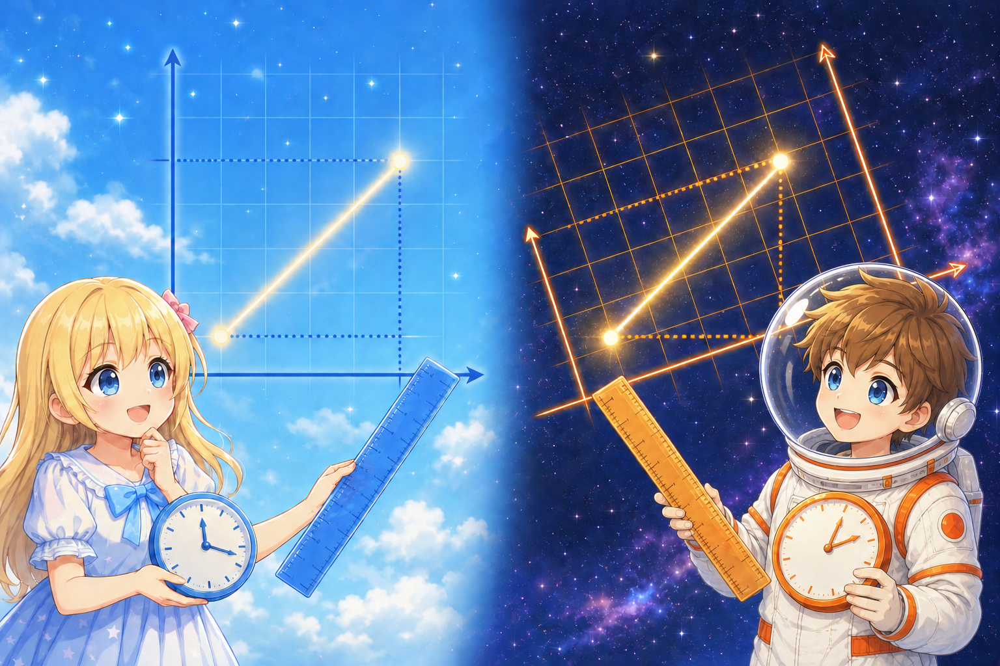
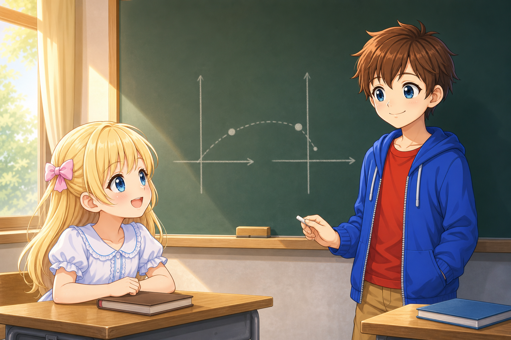

# A First Introduction to the Lorentz Transformation and Spacetime Invariants

## Introduction

Suppose Alice is standing on a station platform. A train carrying Bob passes in front of her at a constant speed. Inside the train, Bob throws a ball in the direction the train is moving.

To Bob, the ball appears to move forward from his hand. To Alice standing on the platform, however, the ball was already moving with the train before it was thrown, and after it is thrown, it appears to move even faster.

---

Alice: “Even though we are looking at the same ball, the speed I measure and the speed Bob measures are different.”

Bob: “Yes. But that does not mean either measurement is wrong.”

Alice: “Then there must be some rule that connects our two records, right?”

---

*Alice on the platform and Bob throwing a ball inside the moving train*

The position and speed of the ball measured by the two observers are not the same. But this does not mean that only one of them is correct and the other is wrong. They are recording the same event using different coordinates.

Then what rule should we use to transform the position and time recorded by one observer into the position and time recorded by the other?

At everyday speeds, a rule called the “Galilean transformation” is sufficient. But when dealing with speeds close to the speed of light, we need the “Lorentz transformation” instead.

In this document, we limit space to one dimension and consider, in order:

- what the Lorentz transformation is
- what changes under the Lorentz transformation
- what remains unchanged
- what the line element $ds^{2}$ represents

## Coordinates Are Numbers Assigned to Events

Suppose something happens at a certain place and at a certain time. For example, consider the event:

> At 10:00 a.m., a light bulb flashed at the center of the station platform.

In relativity, a single point for which we can specify “when and where it happened” is called an **event**.

If space is one-dimensional, an event can be represented by a pair consisting of a time $t$ and a position $x$:

$$
(t,x)
$$

What is important here is that $t$ and $x$ are not the event itself. They are coordinates assigned to the event by an observer. Even for the same event, observers in different states of motion may assign different coordinates.

## Two Observers

Let us consider two inertial frames, SA and SB.

An inertial frame is, simply put, a coordinate system used by an observer who is moving in a straight line at constant velocity, without accelerating or rotating.

- Alice is at rest in frame SA.
- Bob is at rest in frame SB.
- From Alice’s point of view, Bob is moving at a constant velocity $V$ in the positive direction of the $x$-axis.

Let the coordinates Alice assigns to an event be

$$
(t_{A},x_{A})
$$

and let the coordinates Bob assigns to the same event be

$$
(t_{B},x_{B}).
$$

We also assume that the origins of the two coordinate systems coincide when $t_{A}=t_{B}=0$.

What we want to find is the rule that connects $(t_{A},x_{A})$ and $(t_{B},x_{B})$.

*Alice and Bob recording the same event in their respective coordinates*

## First, the Galilean Transformation

In our everyday way of thinking, time passes in the same way for everyone. The coordinate transformation based on this idea is the Galilean transformation.

$$
x_{B}=x_{A}-Vt_{A}
$$

$$
t_{B}=t_{A}
$$

The first equation means that, from Alice’s point of view, Bob’s origin moves a distance $Vt_{A}$ during the time $t_{A}$, so that amount is subtracted from Alice’s position coordinate.

The second equation represents the assumption that Alice and Bob share the same time.

When dealing with objects such as balls and trains, which move much more slowly than light, this is a very good approximation.

## The Problem with Applying the Galilean Transformation to Light

Suppose light is traveling in the positive direction of the $x$-axis in Alice’s coordinate system. If the speed of light is $c$, then

$$
x_{A}=ct_{A}.
$$

Substituting this into the Galilean transformation gives

$$
x_{B}=(c-V)t_{A}.
$$

Because $t_{B}=t_{A}$, the speed of light measured by Bob should then be $c-V$.

Experiments, however, show that the speed of light in a vacuum has the same value $c$ when measured in any inertial frame. Even if Bob is moving as though he were chasing the light, the speed of light he measures is not $c-V$, but $c$. This is an experimental fact and cannot be overturned. We have no choice but to accept it.

---

Bob: “Since I am chasing the light, it seems as though it should look slower by that amount, but its speed is still $c$.”

Alice: “Then perhaps we have to question the idea that time is always the same for both of us?”

---

*Whether measured by Alice or Bob, the speed of light is the same value* $c$

Therefore, we cannot continue to use the everyday idea of time expressed by

$$
t_{B}=t_{A}.
$$

For the speed of light to be the same in every inertial frame, not only position but also time must change from one observer to another.

## The Lorentz Transformation

Let us find a rule that connects Alice’s and Bob’s coordinates while keeping the speed of light the same in every inertial frame.

In the Galilean transformation, the relation between the spatial coordinates is written as

$$
x_{B}=x_{A}-Vt_{A}.
$$

Let us preserve this form, but for the moment multiply it by an unknown coefficient $\gamma$ as a correction required to satisfy the invariance of the speed of light.

$$
x_{B}=\gamma(x_{A}-Vt_{A})
$$

At this stage, we do not yet know the value of $\gamma$.

---

Alice: “So, for now, we multiply the Galilean transformation equation by $\gamma$.”

Bob: “Yes. We will introduce it as a correction factor whose identity we do not yet know, and then determine its value from the invariance of the speed of light.”

---

Next, let us exchange the roles of Alice and Bob. From Alice’s point of view, Bob is moving at velocity $V$, but from Bob’s point of view, Alice is moving at velocity $-V$. Therefore, the transformation that takes Bob’s coordinates back to Alice’s coordinates can be written by reversing the sign of $V$:

$$
x_{A}=\gamma(x_{B}+Vt_{B}).
$$

There is no reason to treat either Alice or Bob as special, so we use the same coefficient $\gamma$ for the reverse transformation.

---

Alice: “From Bob’s point of view, I am now the one moving at velocity $-V$.”

Bob: “Right. That is why the sign of $V$ reverses when we exchange our points of view.”

---

Substituting

$$
x_{B}=\gamma(x_{A}-Vt_{A})
$$

into this equation gives

$$
x_{A}
=\gamma\left[\gamma(x_{A}-Vt_{A})+Vt_{B}\right].
$$

Solving this equation for $t_{B}$ gives

$$
t_{B}
=\gamma t_{A}
+\frac{1-\gamma^{2}}{\gamma V}x_{A}.
$$

The values substituted for $x_{A}$ and $x_{B}$ in these transformation equations can be the position coordinates that Alice and Bob respectively assign to the same event. It may be an event involving a ball, or an event through which light passes.

To determine $\gamma$, let us now substitute the position of light. Suppose light is emitted from the origin at the instant when the origins of the two coordinate systems coincide. Because the speed of light is $c$ whether measured by Alice or Bob,

$$
x_{A}=ct_{A},\qquad x_{B}=ct_{B}
$$

must hold. Substituting these into the two spatial-coordinate transformation equations gives

$$
ct_{B}=\gamma(c-V)t_{A}
$$

$$
ct_{A}=\gamma(c+V)t_{B}.
$$

Multiplying the two equations and rearranging gives

$$
c^{2}=\gamma^{2}(c^{2}-V^{2}).
$$

Therefore,

$$
\gamma=\frac{1}{\sqrt{1-V^{2}/c^{2}}}.
$$

The Greek letter $\gamma$ is read as “gamma.”

For this $\gamma$,

$$
\frac{1-\gamma^{2}}{\gamma V}
=-\frac{\gamma V}{c^{2}}
$$

holds, so the time equation obtained earlier becomes

$$
t_{B}=\gamma\left(t_{A}-\frac{Vx_{A}}{c^{2}}\right).
$$

The equations obtained in this way,

$$
\boxed{
\begin{aligned}
x_{B} &= \gamma(x_{A}-Vt_{A}) \\
t_{B} &= \gamma\left(t_{A}-\frac{Vx_{A}}{c^{2}}\right) \\
\gamma &= \frac{1}{\sqrt{1-V^{2}/c^{2}}}
\end{aligned}
}
$$

are the Lorentz transformation.

When $V$ is sufficiently smaller than $c$, $\gamma$ is almost 1, and the term $Vx_{A}/c^{2}$ in the time equation is also extremely small. Therefore, at everyday speeds, the Lorentz transformation is almost the same as the Galilean transformation.

But when $V$ approaches the speed of light, the difference can no longer be ignored.

The Lorentz transformation does not merely tell us that the position of a moving object appears different. It also tells us that the time assigned to the same event differs from one observer to another.

---

Alice: “So it is not only the position—the time also has a different value for Bob and me.”

Bob: “Right. But there should still be something that remains unchanged in both of our calculations.”

---

## What Changes and What Does Not

Under the Lorentz transformation, the following quantities generally change from one observer to another:

- the position $x$ of an event
- the time $t$ of an event
- the difference $\Delta x$ between the positions of two events
- the difference $\Delta t$ between the times of two events

Then does everything depend on the observer?

---

Alice: “If both position and time change, is there nothing that the two of us have in common?”

Bob: “Let us combine the difference in position and the difference in time into a single quantity instead of treating them separately.”

---

If the difference in position and the difference in time are combined in a particular way, the result has the same value whether Alice calculates it or Bob calculates it.

For the coordinate differences between two events, consider the quantity

$$
\Delta s^{2}
=-c^{2}(\Delta t)^{2}+(\Delta x)^{2}.
$$

This $\Delta s^{2}$ is called the **spacetime interval**.

Calculated using Alice’s coordinates, it is

$$
\Delta s_{A}^{2}
=-c^{2}(\Delta t_{A})^{2}+(\Delta x_{A})^{2}.
$$

Calculated using Bob’s coordinates, it is

$$
\Delta s_{B}^{2}
=-c^{2}(\Delta t_{B})^{2}+(\Delta x_{B})^{2}.
$$

The individual values of $\Delta t$ and $\Delta x$ differ between Alice and Bob. But when we use the Lorentz transformation,

$$
\Delta s_{A}^{2}=\Delta s_{B}^{2}
$$

holds.

This is an important invariant under the Lorentz transformation.

## Verifying That It Really Is Invariant

To make the equations easier to read, let

$$
w=ct,\qquad \beta=\frac{V}{c}.
$$

Because $w$ is time multiplied by the speed of light, it has the same units as length.

The Lorentz transformation can be written as

$$
\Delta x_{B}
=\gamma(\Delta x_{A}-\beta\Delta w_{A})
$$

$$
\Delta w_{B}
=\gamma(\Delta w_{A}-\beta\Delta x_{A}).
$$

Substituting these into the spacetime interval calculated by Bob gives

$$
\begin{aligned}
&-(\Delta w_{B})^{2}+(\Delta x_{B})^{2} \\
&\quad=-\gamma^{2}(\Delta w_{A}-\beta\Delta x_{A})^{2} \\
&\qquad+\gamma^{2}(\Delta x_{A}-\beta\Delta w_{A})^{2}.
\end{aligned}
$$

When the squares are expanded, the terms containing $\Delta w_{A}\Delta x_{A}$ cancel each other. Collecting the remaining terms gives

$$
\begin{aligned}
&-(\Delta w_{B})^{2}+(\Delta x_{B})^{2} \\
&\quad=\gamma^{2}(1-\beta^{2}) \\
&\qquad\times\left[-(\Delta w_{A})^{2}+(\Delta x_{A})^{2}\right].
\end{aligned}
$$

Here,

$$
\gamma^{2}(1-\beta^{2})=1,
$$

so

$$
\begin{aligned}
&-(\Delta w_{B})^{2}+(\Delta x_{B})^{2} \\
&\quad=-(\Delta w_{A})^{2}+(\Delta x_{A})^{2}.
\end{aligned}
$$

The left-hand side is the spacetime interval $\Delta s_{B}^{2}$ calculated by Bob, and the right-hand side is the spacetime interval $\Delta s_{A}^{2}$ calculated by Alice. In other words,

$$
\Delta s_{A}^{2}=\Delta s_{B}^{2}.
$$

---

Alice: “They really do have the same value!”

Bob: “Even though our individual times and spatial coordinates are different, we agree on the spacetime interval.”

---

*The spacetime interval between two events is the same even when calculated using different coordinates*

Time and position each change. Even so, the quantity obtained by combining them in the form

$$
\boxed{
\Delta s^{2}=-c^{2}(\Delta t)^{2}+(\Delta x)^{2}
}
$$

does not change.

The Lorentz transformation can also be regarded as a coordinate transformation that preserves this spacetime interval.

## Comparison with Distance in a Plane

If we keep the origin fixed and rotate the coordinate axes in an ordinary plane, the $x$ and $y$ coordinates of a point change. But the distance from the origin to that point,

$$
\Delta \ell^{2}=(\Delta x)^{2}+(\Delta y)^{2},
$$

does not change.

Something very similar happens in spacetime.

The space and time coordinates change under the Lorentz transformation, but

$$
\Delta s^{2}
=-c^{2}(\Delta t)^{2}+(\Delta x)^{2}
$$

does not change.

However, while the two terms are added when calculating distance in a plane, the time term and the space term have opposite signs in the spacetime interval. This difference expresses the difference between the nature of time and the nature of space.

## The Spacetime Interval of Light

When light connects two events,

$$
\Delta x=c\Delta t.
$$

Therefore,

$$
\begin{aligned}
\Delta s^{2}
&=-c^{2}(\Delta t)^{2}+(\Delta x)^{2} \\
&=-c^{2}(\Delta t)^{2}+c^{2}(\Delta t)^{2} \\
&=0.
\end{aligned}
$$

The spacetime interval between two events connected by light is 0 in every inertial frame. This is deeply connected to the fact that the speed of light remains $c$ after a Lorentz transformation.

---

Alice: “If the spacetime interval is 0, does that mean the light has not traveled anywhere?”

Bob: “No. Light travels through both space and time. It is just that the time term and the space term cancel each other exactly.”

---

## Three Types of Spacetime Interval

Using the sign convention adopted in this book,

$$
\Delta s^{2}=-c^{2}(\Delta t)^{2}+(\Delta x)^{2},
$$

spacetime intervals can be divided into the following three types:

- $\Delta s^{2}<0$: timelike separation
- $\Delta s^{2}=0$: lightlike separation
- $\Delta s^{2}>0$: spacelike separation

Two events with a timelike separation can be connected by an object moving more slowly than light. Events with a lightlike separation are connected by light. To connect events with a spacelike separation, one would have to travel faster than light.

This classification also does not change from one observer to another.

## From a Finite Interval to a Line Element

Up to this point, we have used the coordinate differences $\Delta t$ and $\Delta x$ between two separated events.

If the two events are brought indefinitely close together and the infinitesimal differences are written as $dt$ and $dx$, then

$$
ds^{2}=-c^{2}dt^{2}+dx^{2}.
$$

This infinitesimal spacetime interval is called the **line element**.

---

Alice: “The $\Delta$ we used before has become a $d$ here.”

Bob: “That is because we brought the two events indefinitely close together. This small spacetime interval is the line element $ds^{2}$.”

---

Using $w=ct$, we can also write

$$
ds^{2}=-dw^{2}+dx^{2}.
$$

This is the notation used in *Making Sense of Relativity*.

Before and after a Lorentz transformation,

$$
ds^{2}
=-dw_{A}^{2}+dx_{A}^{2}
=-dw_{B}^{2}+dx_{B}^{2}
$$

holds.

In other words, Alice and Bob divide time and space in different ways, but they agree on the spacetime interval between two events.

## Summary

- Even for the same event, the position and time coordinates differ between inertial frames.
- Because the Galilean transformation treats time as common to all observers, it is incompatible with the invariance of the speed of light.
- Under the Lorentz transformation, not only position but also time is transformed.
- Neither $\Delta t$ nor $\Delta x$ by itself is invariant under the Lorentz transformation.
- $-c^{2}(\Delta t)^{2}+(\Delta x)^{2}$ is invariant under the Lorentz transformation.
- The infinitesimal expression $ds^{2}=-c^{2}dt^{2}+dx^{2}$ is called the line element.
- The line element represents the “interval in spacetime” on which different observers agree.

In relativity, time and space are not regarded as separate absolute quantities. The way they are divided changes from one observer to another, but the spacetime interval formed by combining them does not change.

This invariant quantity plays a central role in special relativity.

---

Bob: “Even if Alice and I assign different values to position and time, the spacetime interval is the same. That is the important point of the Lorentz transformation.”

Alice: “Oh, I see.”

---

*For now, this is where our discussion of special relativity ends*
