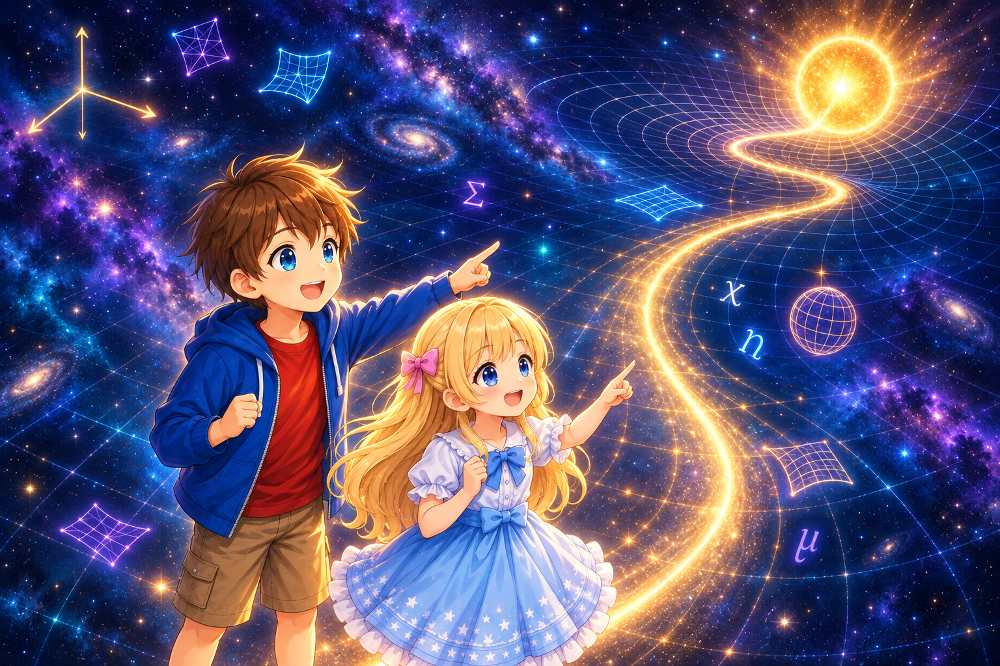

# A First Introduction to General Relativity

## From Tensors to Measuring Spacetime

*Coordinates, metrics, and curvature—Alice and Bob explore what lies beyond the equations used to describe spacetime*

---

Gravity changes the rate at which time passes.

It also bends the path of light.

An object in free fall is said to move “straight” through spacetime.

Then what kind of equations describe the shape of that spacetime?

This series begins by reviewing the Lorentz transformations introduced in special relativity and combining the coordinates of time and space using vectors, matrices, and indices.

Next, we examine how components change when the coordinates are changed, leading us to the idea of tensors. We then learn about the “metric,” which connects differences in coordinates to measurements made with clocks and rulers.

From there, we build up, step by step, a way to compare vectors at different locations, the paths followed by objects in free fall, and the curvature of spacetime. We then move on to the Einstein equation, which connects energy and momentum to curvature.

After deriving the Schwarzschild solution, which describes spacetime outside a spherical body, we connect its coordinates to measurements made with clocks and rulers. We work through gravitational time dilation, the redshift of light, free fall, and the event horizon, and finally arrive at measuring changes in the metric using light.

---

Alice: “When you look at the equations of general relativity, it is hard to tell what they are actually doing.”

Bob: “But if we build each new equation from the question that came before it, perhaps they will not seem to appear all at once.”

Alice: “Then let’s begin by combining the coordinate equations we already know into a single notation.”

---

## How to Read This Series

This is not a textbook intended to construct general relativity with full mathematical rigor.

Instead, it is a guide for following, together with Alice and Bob,

- why each idea is needed,
- what each part of an equation is doing, and
- how one equation leads to the next question.

When deriving an equation, we show as many of the intermediate calculations as possible. We check, one step at a time, which terms are used, what is substituted, and why the result follows. What matters is reaching the point where you can feel,

> Ah, so that is why this equation was needed.

Longer derivations are sometimes placed in appendices. You can first follow the main discussion, then turn to an appendix to check an equation that caught your attention.

## Before You Begin

This series assumes that you have first read “[A First Introduction to the Lorentz Transformation and Spacetime Invariants](../LorentzInvariantIntroduction.md).”

There, we saw that the spacetime interval

$$
ds^2=-dw^2+dx^2
$$

does not change under a Lorentz transformation.

From this point on, we will gradually extend that idea.

We will use basic algebra, differentiation, and integration. Matrices, indices, partial derivatives, and related tools are explained through examples as they appear in the text. No prior knowledge of tensors or differential geometry is required.

## What We Will Explore

1. [Combining Coordinates into One Notation](./01-VectorsAndIndices.md)
2. [Equations That Survive a Change of Coordinates](./02-IntroductionToTensors.md)
3. [The Metric as a Ruler for Spacetime](./03-MetricAsRuler.md)
4. [How Do We Compare Vectors at Different Locations?](./04-CovariantDerivative.md)
5. [Deriving the Christoffel Symbols from the Metric](./05-ChristoffelFromMetric.md)
6. [Carrying Vectors and Going Straight](./06-ParallelTransportAndGeodesics.md)
7. [Real Curvature Revealed by Going Around Once](./07-CurvatureFromParallelTransport.md)
8. [Connecting Matter and Curvature](./08-EinsteinEquation.md)
9. [Predicting a Spherically Symmetric Spacetime](./09-SphericallySymmetricSpacetime.md)
10. [Calculating the Schwarzschild Solution](./10-SchwarzschildSolution.md)
11. [Coordinates as a Canvas and Local Measurements](./11-CoordinatesAndLocalMeasurements.md)
12. [Gravitational Redshift and the Propagation of Light](./12-GravitationalRedshiftAndLight.md)
13. [Free Fall and the Event Horizon](./13-FreeFallAndEventHorizon.md)
14. [Measuring Changes in the Metric with Light](./14-MeasuringMetricChangesWithLight.md)

Rather than jumping straight to finished formulas, we will build the tools one at a time and connect the equations we obtain to observable phenomena.

We begin by combining the coordinates of time and space into a single notation.

> [01: Combining Coordinates into One Notation](./01-VectorsAndIndices.md)

## Credits

- Planning: t-ishii66
- Created by: GPT-5.6, GPT-6, t-ishii66
- Review: t-ishii66, Claude Opus 5
- English translation: GPT-5.6
- Illustrations: GPT-6
- Created: 2026/9/16
- Version: 1.0.0
