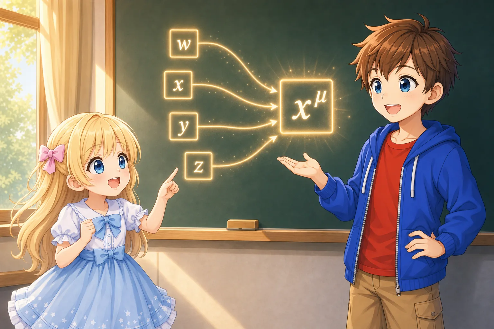
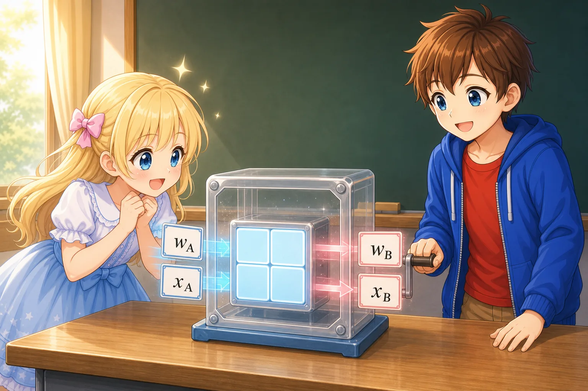
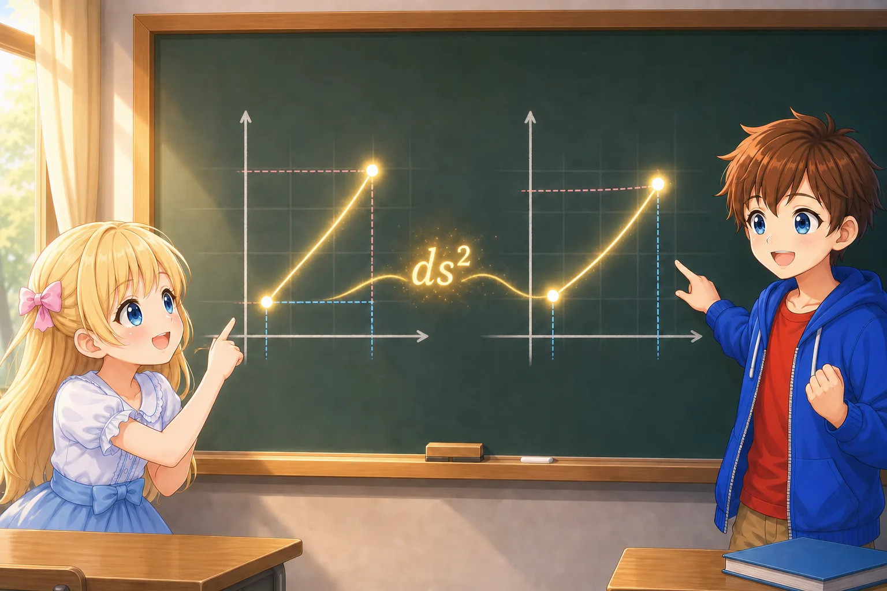

# Combining Coordinates into One Notation

## Introduction

In “A First Introduction to the Lorentz Transformation and Spacetime Invariants,” we considered the relationship between the coordinates $(w_A,x_A)$ used by Alice and the coordinates $(w_B,x_B)$ used by Bob. Here,

$$
w=ct
$$

and $w$ is a coordinate obtained by multiplying time by the speed of light, giving it the same units as length.

Alice’s and Bob’s coordinates were connected by a Lorentz transformation.

$$
x_B=\gamma(x_A-\beta w_A)
$$

$$
w_B=\gamma(w_A-\beta x_A)
$$

where

$$
\beta=\frac{V}{c},
\qquad
\gamma=\frac{1}{\sqrt{1-\beta^2}}
$$

The coordinate values are different for Alice and Bob. Even so, the line element

$$
ds^2=-dw^2+dx^2
$$

had the same value no matter which coordinates were used to calculate it.

$$
ds^2
=-dw_A^2+dx_A^2
=-dw_B^2+dx_B^2
$$

Up to this point, it was enough to write one time coordinate and one space coordinate. In general relativity, however, we treat time and three-dimensional space together, and we calculate equations with many more components.

We could write

$$
-dw^2+dx^2+dy^2+dz^2
$$

every time, but as the calculations become more complicated, it becomes harder to tell which components we are working with.

So let us prepare a way to write the coordinates together.

Almost no new laws of physics appear in this document. We will use vectors, matrices, and indices to rewrite, in a shorter form, the coordinates and line elements that we have previously written separately.

---

Alice: “Before we begin general relativity, are we going to learn how to use the notation?”

Bob: “Yes. But we are not learning completely new equations. Think of it as practice in writing equations we already know in a combined form.”

---

The separately listed $w,x,y,z$ are combined into the single symbol $x^\mu$

## Arranging Coordinates in a Column

First, let us arrange the time coordinate $w$ and the space coordinate $x$ in a vertical column.

$$
\begin{pmatrix}
w \\
x
\end{pmatrix}
$$

This groups together the two coordinates assigned to one event.

For example, if

$$
w=5,\qquad x=3
$$

then the coordinates of that event can be written as

$$
\begin{pmatrix}
5 \\
3
\end{pmatrix}
$$

A vertical arrangement of numbers like this is called a column vector.

However, merely arranging the coordinates vertically does not make the event itself a vector. An event is a point in spacetime, and $(w,x)$ are the coordinates attached to that point.

Here, we choose an origin and list the coordinates from that origin to the event. As long as we consider linear coordinate transformations with a shared origin, such as Lorentz transformations, we can treat this set of coordinates like a vector.

In general curved coordinates, rather than the coordinate values themselves, the small change $dx^\mu$ connecting two nearby points becomes important as a vector. We will return to this difference later.

## Numbering the Coordinates

When we use time and three-dimensional space, there are four coordinates:

$$
(w,x,y,z)
$$

Instead of listing them by letter every time, we assign them numbers.

$$
x^0=w
$$

$$
x^1=x
$$

$$
x^2=y
$$

$$
x^3=z
$$

We can then write all four coordinates together as

$$
x^\mu
$$

$\mu$ is the Greek letter “mu.” Here, $\mu$ is not one particular number. It represents any one of

$$
\mu=0,1,2,3
$$

Thus, depending on the situation, $x^\mu$ is a symbol representing one of $x^0,x^1,x^2,x^3$.

If we arrange all four in a column, the correspondence is

$$
x^\mu
\quad\longleftrightarrow\quad
\begin{pmatrix}
x^0 \\
x^1 \\
x^2 \\
x^3
\end{pmatrix}
=
\begin{pmatrix}
w \\
x \\
y \\
z
\end{pmatrix}
$$

In relativity, it is common to number the time coordinate $0$ and the space coordinates $1,2,3$.

## The Upper Number Is Not a Power

The symbols at the upper right of $x^\mu$ and $x^0$ do not represent powers here.

For example, when we write

$$
x^2
$$

the context tells us whether it represents “the second component” or “ $x$ squared.”

When it is written as an index,

$$
x^2=y
$$

and it does not mean

$$
x\times x
$$

If we want to write a square unambiguously, we can use parentheses:

$$
(x^1)^2
$$

---

Alice: “It feels a little strange that $x^2$ is $y$.”

Bob: “It does at first. Instead of calculating the number at the upper right, think of it as a label showing which component it is.”

---

Components with upper indices are called contravariant components, while components with lower indices are called covariant components. But there is no need to remember these names yet.

At this stage, let us think of it this way:

> An upper index is a label that shows how a component behaves under a coordinate transformation.

We will discuss the difference between upper and lower indices in the next document.

## Small Changes in Coordinates

Suppose the coordinates of an event are $x^\mu$. When we move from there to a very nearby event, we write the small change in the coordinates as

$$
dx^\mu
$$

Written component by component, this is

$$
dx^0=dw
$$

$$
dx^1=dx
$$

$$
dx^2=dy
$$

$$
dx^3=dz
$$

Written together, this becomes

$$
dx^\mu
\quad\longleftrightarrow\quad
\begin{pmatrix}
dw \\
dx \\
dy \\
dz
\end{pmatrix}
$$

If $x^\mu$ is the set of coordinates attached to an event, then $dx^\mu$ describes how much the coordinates of two nearby events differ.

The expression used in the section on Lorentz transformations,

$$
ds^2=-dw^2+dx^2
$$

was built from precisely these small coordinate changes $dw$ and $dx$.

From here, we will rewrite this expression using indices.

## Expressing the Same Calculation with One Symbol

Suppose we have four numbers $A_0,A_1,A_2,A_3$ and four numbers $B^0,B^1,B^2,B^3$.

Multiplying the corresponding components and adding them gives

$$
A_0B^0+A_1B^1+A_2B^2+A_3B^3
$$

Calculations like this appear repeatedly in relativity. We therefore use the convention that if the same index appears once as an upper index and once as a lower index within one term, we add over every possible value of that index.

In other words, simply writing

$$
A_\mu B^\mu
$$

means

$$
A_\mu B^\mu
=
A_0B^0+A_1B^1+A_2B^2+A_3B^3
$$

This is called Einstein summation notation, or the Einstein summation convention.

Using the symbol $\sum$, it means

$$
A_\mu B^\mu
=
\sum_{\mu=0}^{3}A_\mu B^\mu
$$

From now on, however, we will leave out the $\sum$.

---

Alice: “So when the same $\mu$ appears, we substitute the values from $0$ to $3$ and add them?”

Bob: “That’s right. It is a convention that hides the long addition and makes the form of the equation easier to see.”

---

Index notation does not create a new calculation. It only writes an addition we already know in a shorter form.

## When a Term Has Two Kinds of Indices

Consider the following expression:

$$
g_{\mu\nu}A^\mu B^\nu
$$

This time, there are two kinds of indices, $\mu$ and $\nu$.

We add over the values from $0$ to $3$ for $\mu$, and we also add over the values from $0$ to $3$ for $\nu$. Thus, there are $4\times4=16$ terms in all.

Written without omitting the sums, this is

$$
g_{\mu\nu}A^\mu B^\nu
=
\sum_{\mu=0}^{3}
\sum_{\nu=0}^{3}
g_{\mu\nu}A^\mu B^\nu
$$

Because $g_{\mu\nu}$ has two indices, it has a component corresponding to each combination of directions.

$$
g_{\mu\nu}
\quad\longleftrightarrow\quad
\begin{pmatrix}
g_{00} & g_{01} & g_{02} & g_{03} \\
g_{10} & g_{11} & g_{12} & g_{13} \\
g_{20} & g_{21} & g_{22} & g_{23} \\
g_{30} & g_{31} & g_{32} & g_{33}
\end{pmatrix}
$$

The two indices can be read as labels for the row and column.

For example, $g_{02}$ is located where the zeroth component in the time direction is combined with the second component in a space direction.

However, this does not mean that a tensor is merely a matrix. A matrix is a way of arranging and displaying a tensor’s components after choosing a coordinate system. We will discuss this difference in the next document.

## Writing the Metric in Components

Until now, we have written the metric of flat spacetime as

$$
\eta_{\mu\nu}
$$

$\eta$ is the Greek letter “eta.”

When we use time and three-dimensional space, its components are

$$
\eta_{\mu\nu}
=
\begin{pmatrix}
-1 & 0 & 0 & 0 \\
0 & 1 & 0 & 0 \\
0 & 0 & 1 & 0 \\
0 & 0 & 0 & 1
\end{pmatrix}
$$

In this matrix,

$$
\eta_{00}=-1
$$

and

$$
\eta_{11}=\eta_{22}=\eta_{33}=1
$$

while every other component is $0$.

Only the time direction has $-1$, while the three space directions have $1$. This corresponds to the signs in the familiar line element

$$
ds^2=-dw^2+dx^2+dy^2+dz^2
$$

## Writing the Line Element with Indices

Using index notation, the line element of flat spacetime can be written as

$$
ds^2
=
\eta_{\mu\nu}dx^\mu dx^\nu
$$

This may suddenly look like a difficult equation, but let us expand it according to the conventions we have introduced so far.

$\mu$ and $\nu$ each take the values $0,1,2,3$. However, because every component of $\eta_{\mu\nu}$ other than its diagonal components is $0$, the only terms that remain are

$$
ds^2
=
\eta_{00}dx^0dx^0
+
\eta_{11}dx^1dx^1
+
\eta_{22}dx^2dx^2
+
\eta_{33}dx^3dx^3
$$

Substituting the components of the metric gives

$$
ds^2
=
-(dx^0)^2
+
(dx^1)^2
+
(dx^2)^2
+
(dx^3)^2
$$

Furthermore,

$$
dx^0=dw,\qquad
dx^1=dx,\qquad
dx^2=dy,\qquad
dx^3=dz
$$

so we return to

$$
ds^2
=
-dw^2+dx^2+dy^2+dz^2
$$

In other words,

$$
\boxed{
ds^2
=
\eta_{\mu\nu}dx^\mu dx^\nu
}
$$

does not define a new line element.

It is a shorter way of writing the expression we already knew:

$$
ds^2=-dw^2+dx^2+dy^2+dz^2
$$

## Checking in Two Dimensions

If four-dimensional indices are still difficult to read, we can restrict ourselves to one time coordinate and one space coordinate, just as we did in the section on Lorentz transformations.

In this case,

$$
x^0=w,\qquad x^1=x
$$

and the metric is

$$
\eta_{\mu\nu}
=
\begin{pmatrix}
-1 & 0 \\
0 & 1
\end{pmatrix}
$$

The line element is

$$
ds^2
=
\eta_{\mu\nu}dx^\mu dx^\nu
$$

Expanding every term gives

$$
\begin{aligned}
ds^2
={}&
\eta_{00}dx^0dx^0
+
\eta_{01}dx^0dx^1 \\
&+
\eta_{10}dx^1dx^0
+
\eta_{11}dx^1dx^1.
\end{aligned}
$$

Here,

$$
\eta_{00}=-1,\qquad
\eta_{11}=1,\qquad
\eta_{01}=\eta_{10}=0
$$

so

$$
ds^2
=
-(dx^0)^2+(dx^1)^2
$$

which gives

$$
ds^2=-dw^2+dx^2
$$

Until you become comfortable with index notation, you can expand every term like this and return to an equation you know.

## Writing the Lorentz Transformation Together

The two-dimensional Lorentz transformations were

$$
w_B=\gamma(w_A-\beta x_A)
$$

and

$$
x_B=\gamma(x_A-\beta w_A)
$$

By arranging the coordinates in columns, we can combine these two equations into one.

$$
\begin{pmatrix}
w_B \\
x_B
\end{pmatrix}
=
\begin{pmatrix}
\gamma & -\gamma\beta \\
-\gamma\beta & \gamma
\end{pmatrix}
\begin{pmatrix}
w_A \\
x_A
\end{pmatrix}
$$

Let us multiply the matrix and column vector on the right-hand side.

The first component is

$$
\gamma w_A-\gamma\beta x_A
=
\gamma(w_A-\beta x_A)
$$

This is $w_B$.

The second component is

$$
-\gamma\beta w_A+\gamma x_A
=
\gamma(x_A-\beta w_A)
$$

This is $x_B$.

Therefore, the equation written with matrices merely combines the two Lorentz transformations into one.

*Instead of handling the two transformation equations separately, a matrix transforms the set of coordinates together*

This transformation matrix is sometimes represented by the symbol $\Lambda$.

$$
\Lambda
=
\begin{pmatrix}
\gamma & -\gamma\beta \\
-\gamma\beta & \gamma
\end{pmatrix}
$$

The Lorentz transformation can then be written even more briefly as

$$
x_B^\mu
=
{\Lambda^\mu}_\nu x_A^\nu
$$

In this equation, $\nu$ appears once as an upper index and once as a lower index, so we sum over $\nu$.

On the other hand, $\mu$ appears only once on each side. It is the number of the component that remains on both sides of the equation.

Setting $\mu=0$ gives the transformation of the time coordinate, and setting $\mu=1$ gives the transformation of the space coordinate.

An index that disappears through summation in this way is called a dummy index, while an index that remains on both sides of an equation is called a free index.

For now, it is enough to know how to read the notation using these rules:

- When the same index appears once as an upper index and once as a lower index within one term, sum over that index.
- An index that appears only once within one term shows which component the equation describes.

## Indices Can Also Reveal Mistakes in Equations

Index notation has benefits beyond making long equations shorter.

For example, in

$$
x_B^\mu
=
{\Lambda^\mu}_\nu x_A^\nu
$$

$\nu$ appears twice on the right-hand side and is summed over, leaving one $\mu$. There is likewise one $\mu$ on the left-hand side.

Thus, both sides represent the same kind of component.

On the other hand, if we were to write

$$
x_B^\mu
=
{\Lambda^\rho}_\nu x_A^\nu
$$

$\mu$ would remain on the left-hand side and $\rho$ on the right-hand side. Because the labels on the two sides do not match, we can tell that the equation is not correct as written.

Indices are not mere decoration. Within an equation, they record which directional components are used as inputs and which directional components are produced as outputs.

## What Is a Vector?

So far, we have arranged coordinates and small changes in coordinates in columns and treated them like vectors.

When you hear the word vector, you may picture an arrow drawn in space. An arrow has a direction and a magnitude. Even for the same arrow, its components change depending on which coordinate axes are used to measure it.

For example, in one coordinate system, an arrow on a plane may be represented as

$$
\begin{pmatrix}
3 \\
2
\end{pmatrix}
$$

while a coordinate system with rotated axes may assign it different components.

Even though the numbers in the components change, the physical arrow itself has not changed.

We use the same idea in relativity.

- Events and infinitesimal displacements are objects we can consider before choosing coordinates.
- $x^\mu$ and $dx^\mu$ are the components that represent those objects in a particular coordinate system.
- When the coordinates change, the components change.
- Even when the components change, the physical relationship they describe does not change with them.

However, a spacetime vector also includes a component in the time direction. In addition, the magnitude that combines the time direction and the space directions differs from an ordinary length in space and is calculated using

$$
ds^2=-dw^2+dx^2+dy^2+dz^2
$$

The negative sign on the time direction is a major difference between spacetime vectors and ordinary vectors in three-dimensional space.

## What Remains When the Coordinates Change

Alice and Bob assign different components to the same infinitesimal displacement.

$$
dx_A^\mu
\neq
dx_B^\mu
$$

can occur.

However, when they each calculate the line element in their own coordinates,

$$
\eta_{\mu\nu}dx_A^\mu dx_A^\nu
=
\eta_{\mu\nu}dx_B^\mu dx_B^\nu
$$

This is the index-notation version of the result we confirmed in the section on Lorentz transformations:

$$
-dw_A^2+dx_A^2
=
-dw_B^2+dx_B^2
$$

The coordinate components change, but the line element obtained by combining them with the metric does not.

This is our starting point for thinking about tensors.

---

Alice: “The coordinate values change, but the line element made by combining them does not.”

Bob: “That’s right. For this to happen, when we change coordinates, the components cannot each change however they please. They must change according to a fixed relationship.”

Alice: “Does that fixed way of changing lead to tensors?”

Bob: “Yes. Let’s look at that next.”

---

Even though the coordinate components have different values, the spacetime interval $ds^2$ found by Alice and Bob is the same

## Summary

- We can write the time and space coordinates together as $x^\mu$.
- $\mu=0,1,2,3$ represents the time direction and the three space directions.
- The upper index of $x^\mu$ is not a power, but a label for a component.
- We write the change in coordinates between two nearby events as $dx^\mu$.
- When the same index appears once as an upper index and once as a lower index, we sum over that index.
- The components of a quantity with two indices can be arranged in the form of a matrix in a particular coordinate system.
- A Lorentz transformation can be written together as a matrix.
- The line element of flat spacetime can be written as

  $$
  ds^2=\eta_{\mu\nu}dx^\mu dx^\nu
  $$

- Expanding this expression component by component returns us to

  $$
  ds^2=-dw^2+dx^2+dy^2+dz^2
  $$

- Index notation does not add new physics. It is a way to write relationships among components briefly and in a form that makes mistakes easier to notice.

## The Next Question

When we change coordinates, the vector components $dx^\mu$ change.

Even so,

$$
ds^2
=
g_{\mu\nu}dx^\mu dx^\nu
$$

must represent the same value.

Then $g_{\mu\nu}$ must also have a fixed way of changing that cancels the change in $dx^\mu$.

How must each component change so that changing coordinates does not destroy the meaning of the equation as a whole?

In the next document, we will begin with this question and move on to the idea of tensors.
