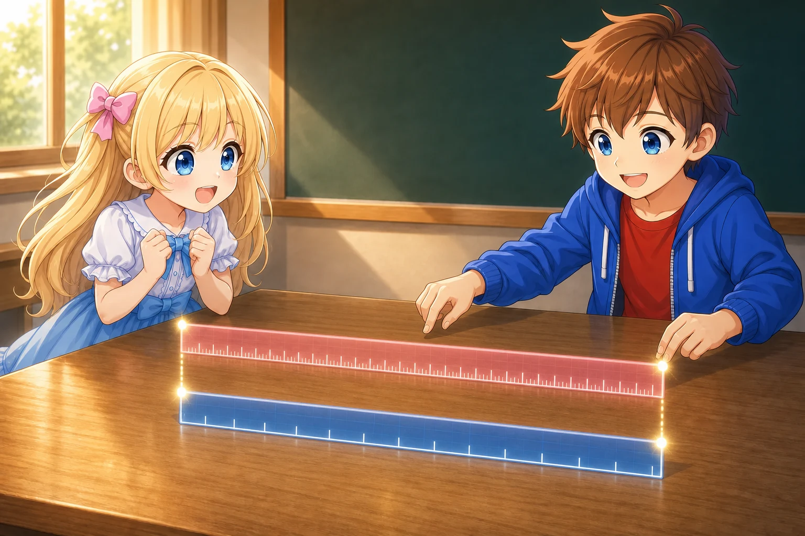
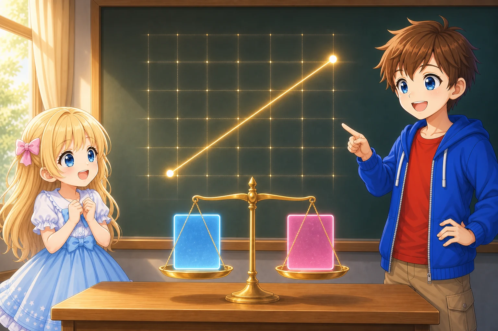

# The Metric as a Ruler for Spacetime

## Introduction

In the previous document, “Equations That Survive a Change of Coordinates,” we wrote the line element as

$$
ds^2 =
g_{\mu\nu}dx^\mu dx^\nu
$$

When we change coordinates, the numbers for the coordinate differences $dx^\mu$ change. The metric components $g_{\mu\nu}$ change along with them, so the line element $ds^2$ represents the same value.

For example, suppose that the line element of a plane is

$$
ds^2 =
dx^2+dy^2
$$

If we change the coordinates to

$$
x'=2x
$$

$$
y'=y
$$

then

$$
dx=\frac{1}{2}dx'
$$

$$
dy=dy'
$$

and therefore

$$
ds^2 =
\frac{1}{4}dx'^2+dy'^2
$$

Even though we are describing the same plane, the metric component in the $x$ direction has changed from $1$ to $1/4$.

Then what do the numbers in the metric components tell us?

In this document, we will consider

- how to read actual lengths and times from the metric,
- how proper length, proper time, and the path of light are related to the line element,
- what it means for metric components to change from place to place, and
- how to distinguish an apparent change caused by coordinates from true curvature.

Our goal is not to move on to a rigorous definition of curvature.

Instead, our goal is to develop a sense that

> The metric is a mechanism that converts coordinate numbers into quantities actually measured with clocks and rulers.

## Coordinate Differences and Actual Length

Let us first consider an ordinary plane.

In Cartesian coordinates $(x,y)$, if the coordinate differences between two nearby points are

$$
(dx,dy)
$$

then the distance $ds$ between them is found from

$$
ds^2 =
dx^2+dy^2
$$

This is the Pythagorean theorem for a small right triangle.

For example, if

$$
dx=3
$$

$$
dy=4
$$

then

$$
ds^2 =
3^2+4^2 =
25
$$

and therefore

$$
ds=5
$$

Here, the coordinate numbers and the markings on a ruler happen to have the same scale.

However, coordinates are only numbers assigned to locations. A coordinate difference is not always the same as the actual length.

Using the same example as before, let us use the coordinates

$$
x'=2x
$$

$$
y'=y
$$

The original coordinate differences were

$$
dx=3
$$

$$
dy=4
$$

so in the new coordinates,

$$
dx'=2dx=6
$$

$$
dy'=dy=4
$$

The coordinate difference in the $x$ direction doubles from $3$ to $6$, but that does not mean the actual distance has also doubled.

In the new coordinates,

$$
ds^2 =
\frac{1}{4}dx'^2+dy'^2
$$

so substituting the numbers gives

$$
ds^2 =
\frac{1}{4}\times 6^2+4^2 =
9+16 =
25
$$

Therefore,

$$
ds=5
$$

which is the same distance we calculated in the original coordinates.

The $1/4$ in this equation tells us that one unit in the new coordinate corresponds to half the length of one unit in the old coordinate.

---

Alice: “The number in the $x$ direction changed from $3$ to $6$, but the distance we found at the end is still $5$.”

Bob: “That is because one unit in the new coordinate is half as long as one unit in the old coordinate. Even though the number is $6$, the actual length is half of $6$, which is $3$.”

Alice: “The line element squares the length, so is that why we get $1/4$, the square of one half?”

Bob: “Yes. The $1/4$ in the metric converts the coordinate difference $dx'=6$ into an actual length. The metric connects coordinate numbers to lengths measured with a ruler.”

---

*Even when the coordinate numbers differ, the actual length obtained by converting them with the metric is the same*

## Reading the Components of the Metric

A general two-dimensional line element can be written as

$$
ds^2 =
g_{\mu\nu}dx^\mu dx^\nu
$$

Here, if

$$
x^1=x
$$

$$
x^2=y
$$

then expanding this equation gives

$$
ds^2 =
g_{11}(dx)^2
+g_{12}dx\,dy
+g_{21}dy\,dx
+g_{22}(dy)^2
$$

As we saw in the previous document, the metric has the symmetry

$$
g_{12}=g_{21}
$$

so we can write

$$
ds^2 =
g_{11}(dx)^2
+2g_{12}dx\,dy
+g_{22}(dy)^2
$$

$g_{11}$ is related to how a coordinate difference in the $x^1$ direction is converted into length.

$g_{22}$ is related to how a coordinate difference in the $x^2$ direction is converted into length.

$g_{12}$ is related to the angle at which the two coordinate directions meet.

In Cartesian coordinates,

$$
g_{\mu\nu} =
\begin{pmatrix}
1&0\\
0&1
\end{pmatrix}
$$

so

$$
g_{11}=1
$$

$$
g_{22}=1
$$

$$
g_{12}=g_{21}=0
$$

Therefore,

$$
ds^2=dx^2+dy^2
$$

The $1$s along the diagonal mean that each coordinate difference can be counted directly as a length.

The $0$s outside the diagonal mean that the two coordinate directions meet at right angles.

The metric is not simply a table of numbers. It is a table that tells us how to read lengths and angles from small coordinate differences when we use those coordinates.

## Using the Metric to Form the Inner Product of Vectors

Let two vectors be

$$
A^\mu
$$

and

$$
B^\nu
$$

Both have upper indices, so as they are, we cannot contract an upper index with a lower index.

We therefore use the metric to lower the index of one of the vectors, $B^\nu$.

$$
B_\mu =
g_{\mu\nu}B^\nu
$$

The metric $g_{\mu\nu}$ converts the upper-index components $B^\nu$ into the lower-index components $B_\mu$.

We can now contract this with the other vector $A^\mu$.

$$
A^\mu B_\mu
$$

Substituting the expression for $B_\mu$ in terms of the metric gives

$$
A^\mu B_\mu =
A^\mu g_{\mu\nu}B^\nu =
g_{\mu\nu}A^\mu B^\nu
$$

This value is called the inner product of the two vectors.

In other words, by lowering the index of one vector, the metric allows us to form an inner product from two vectors with upper indices.

In Cartesian coordinates on a plane,

$$
g_{\mu\nu} =
\begin{pmatrix}
1&0\\
0&1
\end{pmatrix}
$$

so

$$
A^\mu B_\mu =
g_{\mu\nu}A^\mu B^\nu =
A^1B^1+A^2B^2
$$

This is the same as the usual inner product,

$$
\boldsymbol{A}\cdot\boldsymbol{B}
$$

Now let the two vectors be the same, so that

$$
B^\mu=A^\mu
$$

Then the inner product of the vector with itself is

$$
A^\mu A_\mu =
g_{\mu\nu}A^\mu A^\nu
$$

Expanding this in Cartesian coordinates on a plane gives

$$
g_{\mu\nu}A^\mu A^\nu =
(A^1)^2+(A^2)^2
$$

which is the square of the vector’s length.

The coordinate difference $dx^\mu$ is also a vector representing a small displacement. If we lower its index as

$$
dx_\mu =
g_{\mu\nu}dx^\nu
$$

then its inner product with itself is

$$
dx^\mu dx_\mu =
g_{\mu\nu}dx^\mu dx^\nu
$$

This is the square of the length of the small displacement, namely, the line element.

$$
ds^2 =
dx^\mu dx_\mu =
g_{\mu\nu}dx^\mu dx^\nu
$$

Lowering an index with the metric, taking the inner product of two vectors, and forming the line element are not separate mechanisms.

> Lowering one index with the metric and contracting it with the other vector gives an inner product. Taking the inner product of a small displacement with itself gives the line element.

## The Metric of Spacetime

Spacetime with no curvature caused by gravity, where special relativity applies, is called flat spacetime. Its metric is the Minkowski metric. If we look only at its spatial part, it is ordinary Euclidean space.

In flat spacetime, we had

$$
ds^2 =
-dw^2+dx^2+dy^2+dz^2
$$

Here,

$$
w=ct
$$

and $w$ has units of distance.

Written with indices, this is

$$
ds^2 =
\eta_{\mu\nu}dx^\mu dx^\nu
$$

The Minkowski metric is

$$
\eta_{\mu\nu} =
\begin{pmatrix}
-1&0&0&0\\
0&1&0&0\\
0&0&1&0\\
0&0&0&1
\end{pmatrix}
$$

The major difference from ordinary space is that the component in the time direction is $-1$.

Because of this negative sign, the relationship between two events falls into three types.

- A timelike relationship, for which $ds^2<0$
- A spacelike relationship, for which $ds^2>0$
- A lightlike relationship, for which $ds^2=0$

This classification corresponds to the inside, outside, and surface of the light cone that we saw in the section on Lorentz transformations.

## Proper Time

Let us consider an inertial frame in which Alice is at rest.

Suppose that synchronized coordinate clocks are placed at each location in this coordinate system. We write the time shown by these coordinate clocks as

$$
w_A
$$

$w_A$ is the coordinate time that Alice’s coordinate system assigns to events. In this series, $w_A$ has already been multiplied by the speed of light $c$, so it has units of distance.

Now suppose that a ball moves in the $x$ direction through this coordinate system.

The ball passes two points, P and Q. Let the times when the ball passes points P and Q be $w_A(P)$ and $w_A(Q)$, respectively. The difference in coordinate time measured in Alice’s coordinate system is then

$$
\Delta w_A = w_A(Q)-w_A(P)
$$

In the limit as Q is brought arbitrarily close to P, we write this difference as $dw_A$. We write the coordinate distance traveled at that time as $dx_A$.

Calculating the line element between these two events in Alice’s coordinate system gives

$$
ds^2 =
-dw_A^2+dx_A^2
$$

The clocks used here are not the ball’s own clock, but the two coordinate clocks placed at points P and Q in Alice’s coordinate system.

$\Delta w_A$ is the difference between the time when the ball passes the clock at P and the time when it passes the clock at Q. Its limit as Q is brought arbitrarily close to P is $dw_A$.

Next, attach a single clock to the ball.

Write the time marked by that clock as it moves from P to Q as

$$
d\tau_{\mathrm{ball}}
$$

This is the proper time of the ball.

In this series, $\tau$ has also been multiplied in advance by the speed of light $c$. Therefore, $d\tau_{\mathrm{ball}}$, like $dw_A$, has units of distance.

In local coordinates moving together with the ball, the ball itself does not move through space.

Therefore, for the same two events of passing P and passing Q, the line element is

$$
ds^2 =
-d\tau_{\mathrm{ball}}^2
$$

Whether we calculate it in Alice’s coordinate system or consider the clock attached to the ball, the line element between the same two events is the same.

Therefore,

$$
-d\tau_{\mathrm{ball}}^2 =
-dw_A^2+dx_A^2
$$

Multiplying both sides by $-1$ gives

$$
d\tau_{\mathrm{ball}}^2 =
dw_A^2-dx_A^2
$$

In this equation, coordinate time and proper time clearly appear as different quantities.

- $dw_A$ is the difference in coordinate time that Alice’s coordinate system assigns to the two events
- $d\tau_{\mathrm{ball}}$ is the proper time actually marked by the single clock attached to the ball

If we write the ball’s ordinary velocity as seen in Alice’s coordinate system as $v_A$, then

$$
v_A=\frac{dx_A}{dt_A}
$$

On the other hand, this chapter uses $w_A=ct_A$ as the time coordinate, so

$$
\frac{dx_A}{dw_A}
=\frac{dx_A}{c\,dt_A}
=\frac{v_A}{c}
$$

Therefore, $dx_A/dw_A$ is not the ordinary velocity itself, but the dimensionless quantity obtained by dividing the velocity by the speed of light. It corresponds to $\beta$ from Chapter 1, and its absolute value is $1$ for light.

Solving the previous equation for $d\tau_{\mathrm{ball}}$ gives

$$
d\tau_{\mathrm{ball}} =
dw_A
\sqrt{
1-
\left(
\frac{dx_A}{dw_A}
\right)^2
}
$$

This tells us how much time the clock attached to the moving ball marks compared with Alice’s coordinate time.

If the ball is at rest in Alice’s coordinate system, then

$$
dx_A=0
$$

so

$$
d\tau_{\mathrm{ball}} =
dw_A
$$

Proper time and coordinate time are not always the same. They agree in the special case where we are using an inertial frame with $\eta_{\mu\nu}$, as we are here, and the object is at rest in that coordinate system.

In a general coordinate system, let $dx^\mu$ be the path followed by an object. If that path is timelike, then

$$
d\tau^2 =
-g_{\mu\nu}dx^\mu dx^\nu
$$

gives the proper time marked by the clock attached to that object.

The $dx^\mu$ on the right-hand side are changes in the coordinates, while the $d\tau$ on the left-hand side is the quantity marked by the object’s own clock.

The metric is also a mechanism for reading the proper time of an object moving along a path from the coordinate time and its movement through the coordinates.

*Coordinate clocks placed at each location assign times to the two events, while the single clock attached to the ball marks proper time along its path*

## Proper Length

For two nearby points with a spacelike relationship,

$$
ds^2>0
$$

We can choose suitable local inertial coordinates and measure the two points at the same time, making

$$
dw=0
$$

Then

$$
ds^2 =
dx^2+dy^2+dz^2
$$

This $ds$ is the proper length between the two points as measured locally with a ruler.

However, when considering the distance between two faraway points, we need to decide “which time’s space” we are measuring.

In curved spacetime, it may not be possible to define “simultaneous” uniquely for clocks that are far apart. Therefore, proper length is not as simple to handle as proper time.

In this document, we will go only as far as reading a small distance in a space chosen to be at the same time from the metric.

## The Line Element of Light

First, let us consider light moving in the $x$ direction in flat spacetime.

In a local inertial frame, light travels at speed $c$.

In this series,

$$
w=ct
$$

so for light moving to the right,

$$
dx=c\,dt=dw
$$

Including the case of light moving to the left, we have

$$
dx=\pm dw
$$

Substituting this into the line element of flat spacetime,

$$
ds^2=-dw^2+dx^2
$$

gives

$$
ds^2 =
-dw^2+(\pm dw)^2 =
0
$$

Thus, along the path traveled by light,

$$
ds^2=0
$$

The line element $ds^2$ is a scalar that represents the same value even when the coordinates are changed. If it is $0$ in one inertial coordinate system, it remains $0$ when calculated in another coordinate system.

Even in curved spacetime, we can choose local inertial coordinates in a sufficiently small region around a point. Light travels at speed $c$ within that small region, so once again,

$$
ds^2=0
$$

Therefore, even when written in general coordinates, the path of light satisfies

$$
g_{\mu\nu}dx^\mu dx^\nu=0
$$

This equation does not mean that “light’s own clock has stopped.” We cannot construct an inertial frame that is at rest with light.

It means that along the path of light, which travels locally at speed $c$, the contribution from the time direction and the contribution from the spatial direction cancel exactly, making the line element $0$.

Once we know the metric, we can also use this condition to read how light travels through the coordinates.

*Along the path of light, the contributions from the time and spatial directions cancel, making the line element zero*

## Polar Coordinates as a Different Scale

In the examples so far, we simply doubled the scale of a coordinate axis.

Next, let us place polar coordinates $(r,\theta)$ on a plane.

Their relationship with Cartesian coordinates $(x,y)$ is

$$
x=r\cos\theta
$$

$$
y=r\sin\theta
$$

$r$ represents the distance from the origin, and $\theta$ represents the direction as seen from the origin.

They describe points on the same plane, but the shapes of the coordinate lines change greatly.

- Lines of constant $r$ are circles
- Lines of constant $\theta$ are straight lines extending from the origin

The grid of Cartesian coordinates is made of squares, while the grid of polar coordinates looks like sectors of a circle.

However, the plane itself has not become curved just because the grid looks curved.

## Constructing the Line Element in Polar Coordinates

We begin with the line element in Cartesian coordinates.

$$
ds^2=dx^2+dy^2
$$

In polar coordinates,

$$
x=r\cos\theta
$$

so its small change is

$$
dx =
\cos\theta\,dr
-r\sin\theta\,d\theta
$$

Similarly,

$$
y=r\sin\theta
$$

so

$$
dy =
\sin\theta\,dr
+r\cos\theta\,d\theta
$$

We substitute these into

$$
ds^2=dx^2+dy^2
$$

First,

$$
dx^2 =
\cos^2\theta\,dr^2
-2r\sin\theta\cos\theta\,dr\,d\theta
+r^2\sin^2\theta\,d\theta^2
$$

Also,

$$
dy^2 =
\sin^2\theta\,dr^2
+2r\sin\theta\cos\theta\,dr\,d\theta
+r^2\cos^2\theta\,d\theta^2
$$

When we add the two, the terms containing $dr\,d\theta$ cancel.

$$
ds^2 =
\left(
\cos^2\theta+\sin^2\theta
\right)dr^2
+r^2
\left(
\sin^2\theta+\cos^2\theta
\right)d\theta^2
$$

Since

$$
\sin^2\theta+\cos^2\theta=1
$$

we obtain

$$
ds^2 =
dr^2+r^2d\theta^2
$$

This is the line element of a plane written in polar coordinates.

The metric components are

$$
g_{\mu\nu} =
\begin{pmatrix}
1&0\\
0&r^2
\end{pmatrix}
$$

One of the metric components, all of which were constant in Cartesian coordinates, now changes with the location $r$ in polar coordinates.

## Why Does the Angular Direction Have an $r^2$?

Let us read the polar-coordinate line element

$$
ds^2=dr^2+r^2d\theta^2
$$

directly.

If we move outward without changing the angle, then

$$
d\theta=0
$$

so

$$
ds^2=dr^2
$$

Therefore,

$$
ds=|dr|
$$

In the radial direction, the coordinate difference $dr$ is the actual length as it is.

On the other hand, if we move around a circle without changing the radius, then

$$
dr=0
$$

so

$$
ds^2=r^2d\theta^2
$$

Therefore,

$$
ds=r|d\theta|
$$

Even for the same angular difference $d\theta$, the actual distance traveled is longer the farther we are from the origin.

For example, let

$$
d\theta=0.1
$$

On the circle with $r=1$,

$$
ds=0.1
$$

On the circle with $r=10$,

$$
ds=1
$$

Even with the same angular difference of $0.1$, the actual lengths differ by a factor of ten.

The metric component

$$
g_{\theta\theta}=r^2
$$

performs this conversion.

---

Alice: “One unit of angle does not have the same length everywhere.”

Bob: “It is short near the origin and long far away. The distance traveled differs even for the same $d\theta$.”

Alice: “So that is why the number in the metric changes with $r$.”

Bob: “Yes. But do not forget that what we are looking at now is an ordinary plane.”

---

Even for the same $d\theta$, the actual arc length traveled is greater when the radius is greater

## A Plane Remains a Plane Even When the Components Change

In Cartesian coordinates,

$$
ds^2=dx^2+dy^2
$$

and the metric components were constant.

In polar coordinates,

$$
ds^2=dr^2+r^2d\theta^2
$$

and the metric component $g_{\theta\theta}$ changes from place to place.

However, both describe the same plane.

Changing from Cartesian coordinates to polar coordinates has not physically curved the plane.

What changed is the way numbers are assigned to points on the plane.

In polar coordinates, one unit of the coordinate in the angular direction represents a different length at different locations. This fact appears in the metric component $r^2$.

Therefore,

> The fact that metric components change from place to place is not enough to say that space or spacetime is truly curved.

This is an important point to remember when reading general relativity.

Depending on the choice of coordinates, even the metric components of flat space can change from place to place.

## Changes in the Metric Components Are Not Enough

When we write a plane in polar coordinates, the metric component

$$
g_{\theta\theta}=r^2
$$

changes from place to place.

However, this equation was originally obtained by rewriting the line element of a plane,

$$
ds^2=dx^2+dy^2
$$

using the coordinate transformation

$$
x=r\cos\theta,
\qquad
y=r\sin\theta
$$

In this example, we know from the process of deriving the equation that the change in the metric component arose from the choice of coordinates.

Then, when we are given only a metric, how can we tell whether changes in its components come from the choice of coordinates or from a geometric property of space or spacetime itself?

We cannot answer this question merely by looking at the metric components.

To move toward the answer, we first need to consider how to compare vectors at different locations.

As preparation, let us introduce one more tool for working with the metric.

## The Inverse Metric

In the previous document, we used the metric to lower the index of a vector.

$$
V_\mu =
g_{\mu\nu}V^\nu
$$

Conversely, to change a lower index back into an upper index, we use the inverse metric $g^{\mu\nu}$.

$$
V^\mu =
g^{\mu\nu}V_\nu
$$

The inverse metric is the quantity that undoes the conversion performed by the metric.

Using the metric and then the inverse metric brings us back to the state before either conversion was made.

Indeed, substituting

$$
V_\rho =
g_{\rho\nu}V^\nu
$$

into

$$
V^\mu =
g^{\mu\rho}V_\rho
$$

gives

$$
V^\mu =
g^{\mu\rho}g_{\rho\nu}V^\nu
$$

For this operation to return any vector $V^\nu$ to its original form, $g^{\mu\rho}g_{\rho\nu}$ must be a transformation that changes nothing.

We write this relationship as

$$
g^{\mu\rho}g_{\rho\nu} =
\delta^\mu_{\ \nu}
$$

$\delta^\mu_{\ \nu}$ is the Kronecker delta, which was

$$
\delta^\mu_{\ \nu} =
\begin{cases}
1 & \mu=\nu\\
0 & \mu\neq\nu
\end{cases}
$$

Viewed as matrices, $g^{\mu\nu}$ is the inverse matrix of $g_{\mu\nu}$.

In two-dimensional polar coordinates,

$$
g_{\mu\nu} =
\begin{pmatrix}
1&0\\
0&r^2
\end{pmatrix}
$$

so the inverse metric is

$$
g^{\mu\nu} =
\begin{pmatrix}
1&0\\
0&\dfrac{1}{r^2}
\end{pmatrix}
$$

Multiplying them together indeed gives

$$
\begin{pmatrix}
1&0\\
0&\dfrac{1}{r^2}
\end{pmatrix}
\begin{pmatrix}
1&0\\
0&r^2
\end{pmatrix} =
\begin{pmatrix}
1&0\\
0&1
\end{pmatrix}
$$

In general relativity, the inverse metric is needed when calculating the connection and curvature from the metric.

Here, it is enough to read this as

> The metric lowers indices, and the inverse metric raises indices.

## Summary

- The metric converts coordinate differences into lengths and times that are actually measured.
- The line element can be read as the inner product of a small displacement with itself.
- The metric of flat spacetime is the Minkowski metric.
- Along a timelike path,

  $$ds^2=-d\tau^2$$

  holds.
- In this series, $\tau$ has already been multiplied by $c$, so it has units of distance.
- A small spacelike distance can be read from the spatial line element after appropriately choosing the same time.
- Along the path of light,

  $$ds^2=0$$

  holds.
- When a plane is written in polar coordinates,

  $$ds^2=dr^2+r^2d\theta^2$$

  is obtained.
- In polar coordinates, the metric components change from place to place, but the plane itself is not curved.
- Changes in the metric components alone cannot distinguish an appearance caused by coordinates from a property of space or spacetime itself.
- The metric lowers indices, and the inverse metric raises indices.

## The Next Question

In polar coordinates, when the location changes, the directions of the coordinate directions themselves—the “radial direction” and the “angular direction”—also change.

For example, a vector pointing in the “radial direction” at one location and a vector pointing in the “radial direction” at another location may actually point in different directions even if their components are the same.

Then how can we compare two vectors at different locations?

If we simply subtract their components, we overlook changes in the coordinate directions used to represent those components.

In the next document, we will first introduce the “basis” that separates a vector into components. Then, from the idea of adding the change in the basis to the change in the components, we will move on to the Christoffel symbols and the covariant derivative.
