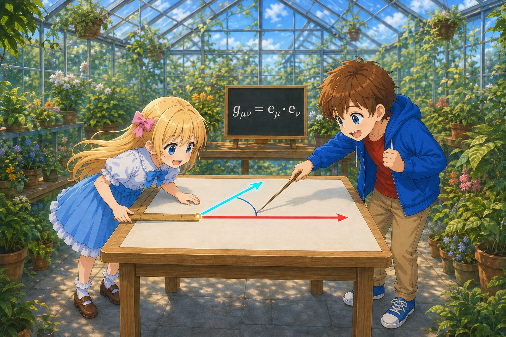
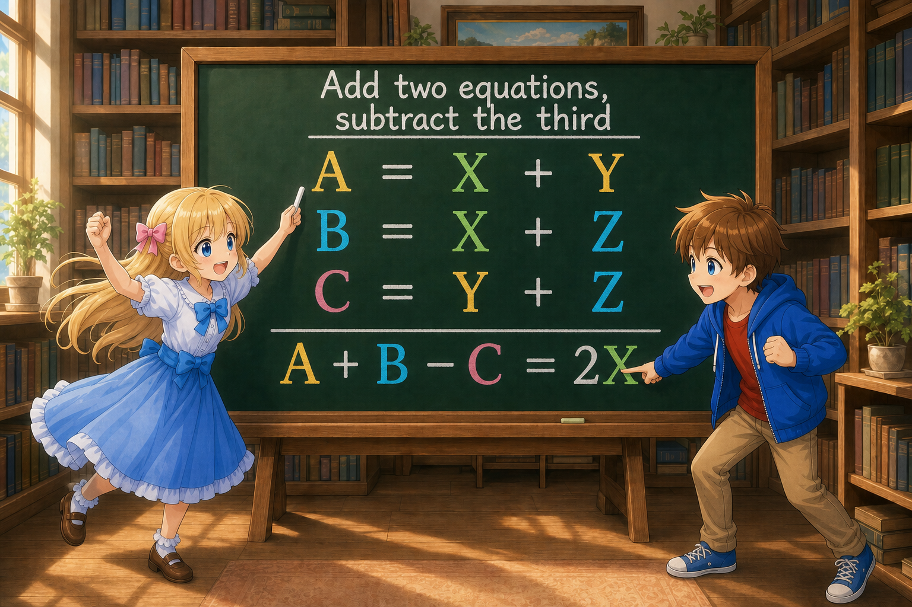
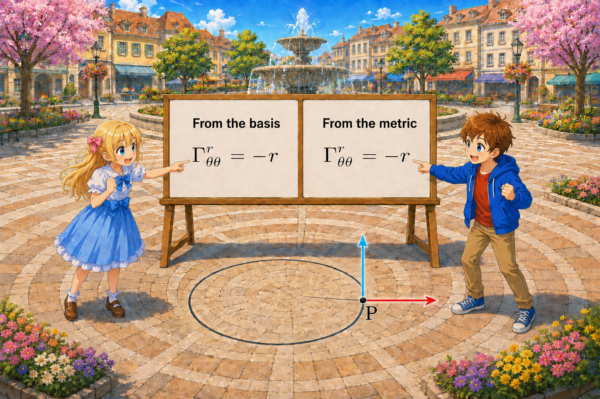

# Deriving the Christoffel Symbols from the Metric

## Introduction

In the previous document, “How Do We Compare Vectors at Different Locations?,” we wrote the change of the basis as,

$$
\partial_\mu\boldsymbol{e}_\nu =
\Gamma^\rho_{\mu\nu}\boldsymbol{e}_\rho
$$

$\Gamma^\rho_{\mu\nu}$ were the Christoffel symbols.

In plane polar coordinates, we made a basis from the position vector

$$
\boldsymbol{x}(r,\theta) =
\begin{pmatrix}
r\cos\theta\\
r\sin\theta
\end{pmatrix}
$$

and could differentiate that basis directly.

However, in general spacetime, we do not prepare an outside space and directly look at the spacetime basis from there.

In general relativity, the metric,

$$
g_{\mu\nu}
$$

is given first.

So, can we find the Christoffel symbols from the metric alone?

In this document, we will proceed in the following order:

- Read the metric as inner products between basis vectors
- Partially differentiate the metric
- Confirm that the covariant derivative of the metric is zero
- Use the condition that the lower two indices of the Christoffel symbols are symmetric
- Add and subtract three equations
- Raise an index with the inverse metric
- Check the formula in polar coordinates

The goal is to understand that

> The formula for the Christoffel symbols is obtained by appropriately combining partial derivatives of the metric.

## The Metric Is the Inner Product of Basis Vectors

Let the coordinate basis be $\boldsymbol{e}_\mu$.

In the previous document, we wrote the inner product of two vectors as,

$$
\boldsymbol{A}\cdot\boldsymbol{B} =
g_{\rho\sigma}A^\rho B^\sigma
$$

First, let us confirm how the basis vectors themselves are represented in components.

An arbitrary vector $\boldsymbol{V}$ can be written using the coordinate basis as,

$$
\boldsymbol{V} =
V^\rho\boldsymbol{e}_\rho
$$

If we set $\boldsymbol{V}=\boldsymbol{e}_\mu$ here, then

$$
\boldsymbol{e}_\mu =
(\boldsymbol{e}_\mu)^\rho\boldsymbol{e}_\rho
$$

For example, in two dimensions,

$$
\boldsymbol{e}_1 =
1\boldsymbol{e}_1+0\boldsymbol{e}_2,
\qquad
\boldsymbol{e}_2 =
0\boldsymbol{e}_1+1\boldsymbol{e}_2
$$

When a basis vector is represented in components using the same basis, only the component corresponding to itself is $1$, and the others are $0$. Therefore,

$$
(\boldsymbol{e}_\mu)^\rho =
{\delta^\rho}_\mu
$$

This equation holds when $\mu$ and $\rho$ are labels for the same coordinate basis.

For example, if we represent the basis vectors themselves using the polar-coordinate basis $\{\boldsymbol{e}_r,\boldsymbol{e}_\theta\}$,

$$
\boldsymbol{e}_r =
1\boldsymbol{e}_r+0\boldsymbol{e}_\theta,
\qquad
\boldsymbol{e}_\theta =
0\boldsymbol{e}_r+1\boldsymbol{e}_\theta
$$

Thus, the components with respect to the polar-coordinate basis are,

$$
(\boldsymbol{e}_r)^r=1,
\qquad
(\boldsymbol{e}_r)^\theta=0
$$

$$
(\boldsymbol{e}_\theta)^r=0,
\qquad
(\boldsymbol{e}_\theta)^\theta=1
$$

On the other hand, if we represent the same two vectors using the Cartesian coordinate basis of the plane, $\{\boldsymbol{e}_x,\boldsymbol{e}_y\}$,

$$
\boldsymbol{e}_r =
\cos\theta\,\boldsymbol{e}_x
+\sin\theta\,\boldsymbol{e}_y
$$

$$
\boldsymbol{e}_\theta =
-r\sin\theta\,\boldsymbol{e}_x
+r\cos\theta\,\boldsymbol{e}_y
$$

Thus, the components with respect to the Cartesian coordinate basis are,

$$
(\boldsymbol{e}_r)^x=\cos\theta,
\qquad
(\boldsymbol{e}_r)^y=\sin\theta
$$

$$
(\boldsymbol{e}_\theta)^x=-r\sin\theta,
\qquad
(\boldsymbol{e}_\theta)^y=r\cos\theta
$$

For components viewed across different coordinate bases, derivatives of coordinate transformations appear instead of the Kronecker delta. For example,

$$
(\boldsymbol{e}_r)^x =
\frac{\partial x}{\partial r} =
\cos\theta,
\qquad
(\boldsymbol{e}_r)^y =
\frac{\partial y}{\partial r} =
\sin\theta
$$

> **Tips: Why is $(\boldsymbol{e}_r)^x=\partial x/\partial r$?**
>
> The detailed derivation of this relation was given in the previous document, “[How Does the Polar-Coordinate Basis Change?](./04-CovariantDerivative.md#how-does-the-polar-coordinate-basis-change)”.
>
> There, we compared the coefficients of the total differential of the position vector,
>
> $$
> d\boldsymbol{x}
> =
> \frac{\partial\boldsymbol{x}}{\partial r}dr
> +
> \frac{\partial\boldsymbol{x}}{\partial\theta}d\theta
> $$
>
> and its representation using the coordinate basis,
>
> $$
> d\boldsymbol{x}
> =
> \boldsymbol{e}_r\,dr
> +
> \boldsymbol{e}_\theta\,d\theta
> $$
>
> to obtain,
>
> $$
> \boldsymbol{e}_r
> =
> \frac{\partial\boldsymbol{x}}{\partial r}
> $$
>
> Furthermore, if we write the position vector as,
>
> $$
> \boldsymbol{x}
> =
> x\boldsymbol{e}_x+y\boldsymbol{e}_y
> $$
>
> and differentiate the right-hand side, we get,
>
> $$
> \boldsymbol{e}_r
> =
> \frac{\partial x}{\partial r}\boldsymbol{e}_x
> +
> \frac{\partial y}{\partial r}\boldsymbol{e}_y
> $$
>
> Therefore, the components of $\boldsymbol{e}_r$ with respect to the Cartesian coordinate basis are $(\boldsymbol{e}_r)^x=\partial x/\partial r$ and $(\boldsymbol{e}_r)^y=\partial y/\partial r$.

In other words,

$$
(\boldsymbol{e}_\mu)^\rho =
{\delta^\rho}_\mu
$$

is the equation for representing a basis vector in components using the same basis. It does not mean that its components are always $0$ and $1$ when viewed from any basis.

Also, even if the components of $\boldsymbol{e}_\theta$ with respect to the polar-coordinate basis are $(0,1)$, this does not necessarily mean that its length is $1$. We will check this point in detail below, after calculating inner products.

Keeping this distinction in mind, let us calculate the inner product of two coordinate basis vectors. Substituting $(\boldsymbol{e}_\mu)^\rho={\delta^\rho}_\mu$ into the inner-product equation introduced in the previous document gives,

$$
\begin{aligned}
\boldsymbol{e}_\mu\cdot\boldsymbol{e}_\nu
&=
g_{\rho\sigma}
(\boldsymbol{e}_\mu)^\rho
(\boldsymbol{e}_\nu)^\sigma\\
&=
g_{\rho\sigma}
{\delta^\rho}_\mu
{\delta^\sigma}_\nu\\
&=
g_{\mu\nu}
\end{aligned}
$$

Thus, the metric components can be read as the inner products of the coordinate basis vectors,

$$
\boxed{
g_{\mu\nu}=\boldsymbol{e}_\mu\cdot\boldsymbol{e}_\nu
}
$$

Calculating the inner products of the polar-coordinate basis vectors represented above using the Cartesian coordinate basis gives,

$$
g_{rr}=\boldsymbol{e}_r\cdot\boldsymbol{e}_r=1
$$

$$
g_{r\theta}=\boldsymbol{e}_r\cdot\boldsymbol{e}_\theta=0
$$

$$
g_{\theta\theta}=\boldsymbol{e}_\theta\cdot\boldsymbol{e}_\theta=r^2
$$

The metric records the lengths of the basis vectors and the angles between them.

> **Tips: Why is the length not $1$ even when the components are $(0,1)$?**
>
> When $\boldsymbol{e}_\theta$ is represented in components using the polar-coordinate basis,
>
> $$
> (\boldsymbol{e}_\theta)^\rho
> =
> \begin{cases}
> 0 & \rho=r\\
> 1 & \rho=\theta
> \end{cases}
> $$
>
> In other words,
>
> $$
> \bigl(
> (\boldsymbol{e}_\theta)^r,
> (\boldsymbol{e}_\theta)^\theta
> \bigr)
> =
> (0,1)
> $$
>
> This only represents how many times each basis vector is used,
>
> $$
> \boldsymbol{e}_\theta
> =
> 0\boldsymbol{e}_r
> +
> 1\boldsymbol{e}_\theta
> $$
>
> and does not represent the length of the vector.
>
> The square of the length is found using the metric, not by simply summing the squares of the components,
>
> $$
> \begin{aligned}
> \lVert\boldsymbol{e}_\theta\rVert^2
> &=
> g_{\rho\sigma}
> (\boldsymbol{e}_\theta)^\rho
> (\boldsymbol{e}_\theta)^\sigma\\
> &=
> g_{\theta\theta}\\
> &=
> r^2
> \end{aligned}
> $$
>
> Therefore,
>
> $$
> \lVert\boldsymbol{e}_\theta\rVert=r
> $$
>
> This corresponds to the fact that at radius $r$, changing the angle by $d\theta$ actually moves us by $r\,d\theta$.
>
> The polar-coordinate basis vector $\boldsymbol{e}_\theta$ and the unit vector in the angular direction are not the same. If we write the unit vector as $\hat{\boldsymbol{e}}_\theta$,
>
> $$
> \hat{\boldsymbol{e}}_\theta
> =
> \frac{1}{r}\boldsymbol{e}_\theta
> $$
>
> then this vector has length $1$.

## Partially Differentiating the Metric

When we partially differentiate the metric component with respect to the coordinate $x^\lambda$,

$$
\begin{aligned}
\partial_\lambda g_{\mu\nu}
&=\partial_\lambda(\boldsymbol{e}_\mu\cdot\boldsymbol{e}_\nu)\\
&=(\partial_\lambda\boldsymbol{e}_\mu)\cdot\boldsymbol{e}_\nu
+\boldsymbol{e}_\mu\cdot(\partial_\lambda\boldsymbol{e}_\nu)
\end{aligned}
$$

Substituting,

$$
\partial_\lambda\boldsymbol{e}_\mu
=\Gamma^\rho_{\lambda\mu}\boldsymbol{e}_\rho,
\qquad
\partial_\lambda\boldsymbol{e}_\nu
=\Gamma^\rho_{\lambda\nu}\boldsymbol{e}_\rho
$$

gives,

$$
\begin{aligned}
\partial_\lambda g_{\mu\nu}
&=\Gamma^\rho_{\lambda\mu}
\boldsymbol{e}_\rho\cdot\boldsymbol{e}_\nu
+\Gamma^\rho_{\lambda\nu}
\boldsymbol{e}_\mu\cdot\boldsymbol{e}_\rho\\
&=\Gamma^\rho_{\lambda\mu}g_{\rho\nu}
+\Gamma^\rho_{\lambda\nu}g_{\mu\rho}
\end{aligned}
$$

Here, the partial derivative of the metric and the Christoffel symbols have become connected.

## Lowering the Index of the Christoffel Symbols

To make the equation easier to read, define a new quantity $\Gamma_{\sigma\mu\nu}$ by,

$$
\boxed{
\Gamma_{\sigma\mu\nu}
=g_{\sigma\rho}\Gamma^\rho_{\mu\nu}
}
$$

This is the quantity obtained by lowering the upper index of the Christoffel symbols with the metric.

The equation from just before becomes,

$$
\boxed{
\partial_\lambda g_{\mu\nu}
=\Gamma_{\nu\lambda\mu}
+\Gamma_{\mu\lambda\nu}
}
$$

This equation is the starting point of the derivation.

## Checking the Covariant Derivative of the Metric

Let us reread the equation we just obtained using the covariant derivative.

As derived in 04, the covariant derivative of a tensor $T_{\mu\nu}$ with two lower indices is,

$$
\nabla_\lambda T_{\mu\nu}
\coloneqq \partial_\lambda T_{\mu\nu}
-\Gamma^\rho_{\lambda\mu}T_{\rho\nu}
-\Gamma^\rho_{\lambda\nu}T_{\mu\rho}
$$

One correction term is added to the ordinary partial derivative for each lower index. These correction terms account for the change of the basis.

The metric $g_{\mu\nu}$ also has two lower indices, so applying this definition gives,

$$
\nabla_\lambda g_{\mu\nu}
=\partial_\lambda g_{\mu\nu}
-\Gamma^\rho_{\lambda\mu}g_{\rho\nu}
-\Gamma^\rho_{\lambda\nu}g_{\mu\rho}
$$

Substituting the equation obtained earlier by partially differentiating the inner product of the basis vectors,

$$
\partial_\lambda g_{\mu\nu}
=\Gamma^\rho_{\lambda\mu}g_{\rho\nu}
+\Gamma^\rho_{\lambda\nu}g_{\mu\rho}
\qquad (5.1)
$$

the terms on the right-hand side cancel, giving,

$$
\boxed{
\nabla_\lambda g_{\mu\nu}=0
}
$$

This condition is called metric compatibility.

Here, we actually drew the basis $\boldsymbol e_\mu$ on the plane, defined the metric from its inner products, and defined the Christoffel symbols from the change of the basis. Therefore, metric compatibility appeared as a property that could be confirmed from those definitions.

On the other hand, in general curved spacetime, we cannot directly compare basis vectors located at different places. Therefore, we first regard the metric, which specifies how lengths and inner products are measured, and the connection, which specifies how vectors are transported, as separate rules. From this viewpoint, metric compatibility does not automatically hold for every choice of connection. Below, we will adopt the property we just confirmed as a condition imposed on the connection.

This condition corresponds to the preservation of the inner product of two vectors during the parallel transport explained in the next chapter. The definition of parallel transport and the reason the inner product is preserved are explained in [06 “Parallel Transport Preserves Inner Products”](./06-ParallelTransportAndGeodesics.md#parallel-transport-preserves-inner-products).

## The Condition That the Lower Two Indices Are Symmetric

Let us first confirm what the word connection means here.

In 04, we saw that because the basis changes from place to place, comparing only the numbers that are the components of a vector does not tell us how the whole vector has changed.

So, imagine carrying an arrow at one place to a nearby place and comparing it with the arrow there. On a plane, we can think of this as “carrying it without changing its direction or length.” But in curved space, we need a rule for what it means to carry something “without changing it.”

This rule for carrying a vector to a nearby place so that we can compare it is called a connection. Carrying it according to that rule is parallel transport.

For example, imagine that there is an arrow representing the wind velocity at every place. Something that gives a vector at each place in this way is called a vector field.

Carry the wind-velocity arrow at a point $P$ to the nearby point $Q$ according to the rule of the connection. Then compare the “arrow carried from $P$” with the arrow representing the wind velocity at $Q$ at the same place. Dividing the difference between these two arrows by the displacement and taking the displacement toward zero measures the change, which is the covariant derivative in the direction of motion.

In the equation we have used so far,

$$
\nabla_\mu V^\rho
=\partial_\mu V^\rho
+\Gamma^\rho_{\mu\nu}V^\nu
$$

$\partial_\mu V^\rho$ represents the change in the component numbers, and $\Gamma^\rho_{\mu\nu}V^\nu$ represents the correction for comparing vectors according to that rule. In the plane example in 04, this correction arose from the change of the basis.

This $\Gamma^\rho_{\mu\nu}$ is the coefficient expressing the connection in the chosen coordinates. At this stage, we can follow the calculation ahead if we understand “choosing a connection” as choosing the $\Gamma^\rho_{\mu\nu}$ that appear in the equation for the covariant derivative.

The metric determines how the lengths and inner products of vectors are “measured.” The connection, on the other hand, determines how vectors are “transported and compared.” Metric compatibility ($\nabla_\lambda g_{\mu\nu}=0$) connects these two and is the condition requiring that the inner product remain preserved even during parallel transport.

However, the equation for metric compatibility alone does not determine $\Gamma^\rho_{\mu\nu}$ uniquely. So we add one more condition.

In the polar-coordinate example in 04, the lower two indices of the Christoffel symbols were symmetric. In this chapter as well, we assume this symmetry for the Christoffel symbols expressed in the coordinate basis. In other words, we assume

$$
\boxed{
\Gamma^\rho_{\mu\nu}=\Gamma^\rho_{\nu\mu}
}
$$

For example, we set $\Gamma^r_{r\theta}=\Gamma^r_{\theta r}$.

This is not a conclusion derived from metric compatibility; it is an additional condition introduced here. The example in 04 is a clue for becoming familiar with this condition, not a proof for the general case.

Below, we will use metric compatibility and this symmetry to find an explicit formula for the Christoffel symbols.

---

Alice: “Does partially differentiating the metric alone still leave more than one possible equation?”

Bob: “Yes. Here, in addition to metric compatibility, we assume that exchanging the lower two indices does not change the value. We find an explicit formula from those two conditions.”

---

## Three Equations with Permuted Indices

We use the equation obtained earlier,

$$
\partial_\lambda g_{\mu\nu}
=\Gamma_{\nu\lambda\mu}+\Gamma_{\mu\lambda\nu}
$$

What we want to find is $\Gamma_{\sigma\mu\nu}$.

Permute the indices to make the following three equations.

$$
\partial_\mu g_{\nu\sigma}
=\Gamma_{\sigma\mu\nu}+\Gamma_{\nu\mu\sigma}
$$

$$
\partial_\nu g_{\sigma\mu}
=\Gamma_{\mu\nu\sigma}+\Gamma_{\sigma\nu\mu}
$$

$$
\partial_\sigma g_{\mu\nu}
=\Gamma_{\nu\sigma\mu}+\Gamma_{\mu\sigma\nu}
$$

## Add Two and Subtract One

Add the first and second equations, and subtract the third.

The left-hand side becomes,

$$
\partial_\mu g_{\nu\sigma}
+\partial_\nu g_{\sigma\mu}
-\partial_\sigma g_{\mu\nu}
$$

Writing the right-hand side without omitting anything gives,

$$
\begin{aligned}
&
\Gamma_{\sigma\mu\nu}
+\Gamma_{\nu\mu\sigma}
+\Gamma_{\mu\nu\sigma}
+\Gamma_{\sigma\nu\mu}\\
&\quad
-\Gamma_{\nu\sigma\mu}
-\Gamma_{\mu\sigma\nu}
\end{aligned}
$$

By the assumed symmetry of the lower two indices,

$$
\Gamma_{\nu\mu\sigma}=\Gamma_{\nu\sigma\mu},
\qquad
\Gamma_{\mu\nu\sigma}=\Gamma_{\mu\sigma\nu}
$$

so these terms cancel through addition and subtraction.

Also,

$$
\Gamma_{\sigma\nu\mu}=\Gamma_{\sigma\mu\nu}
$$

so the two remaining terms are the same. Therefore,

$$
\partial_\mu g_{\nu\sigma}
+\partial_\nu g_{\sigma\mu}
-\partial_\sigma g_{\mu\nu}
=2\Gamma_{\sigma\mu\nu}
$$

Thus, we obtain

$$
\boxed{
\Gamma_{\sigma\mu\nu}
=\frac{1}{2}
\left(
\partial_\mu g_{\nu\sigma}
+\partial_\nu g_{\sigma\mu}
-\partial_\sigma g_{\mu\nu}
\right)
}
$$

## Raising the Index with the Inverse Metric

Using the inverse metric $g^{\rho\sigma}$, raise the index as follows:

$$
\Gamma^\rho_{\mu\nu}
=g^{\rho\sigma}\Gamma_{\sigma\mu\nu}
$$

Substituting the equation from just before,

$$
\boxed{
\Gamma^\rho_{\mu\nu}
=\frac{1}{2}
g^{\rho\sigma}
\left(
\partial_\mu g_{\sigma\nu}
+\partial_\nu g_{\sigma\mu}
-\partial_\sigma g_{\mu\nu}
\right)
}
\qquad (5.2)
$$

This is the formula for finding the Christoffel symbols from the metric.

Let us confirm that the resulting equation satisfies the symmetry assumed at the beginning. Exchanging $\mu$ and $\nu$ gives,

$$
\Gamma^\rho_{\nu\mu}
=\frac{1}{2}g^{\rho\sigma}
\left(
\partial_\nu g_{\sigma\mu}
+\partial_\mu g_{\sigma\nu}
-\partial_\sigma g_{\nu\mu}
\right)
$$

The first two terms have only exchanged order, and the last term is also the same as before because of the symmetry of the metric, $g_{\nu\mu}=g_{\mu\nu}$. Therefore,

$$
\Gamma^\rho_{\nu\mu}=\Gamma^\rho_{\mu\nu}
$$

is confirmed. This confirms that the obtained equation is consistent with the assumption we adopted; note that it does not derive the symmetry itself. This symmetry is not a property that necessarily holds for a general connection; in this book, it is adopted as an additional condition. A detailed explanation of its geometric background is outside the scope of this book.

The three terms in the formula were not chosen suddenly. They are the result of combining the three equations made by partially differentiating the metric as,

$$
\text{first equation}+\text{second equation}-\text{third equation}
$$

## Checking in Polar Coordinates

In plane polar coordinates,

$$
g_{\mu\nu}
=\begin{pmatrix}1&0\\0&r^2\end{pmatrix},
\qquad
g^{\mu\nu}
=\begin{pmatrix}1&0\\0&\dfrac{1}{r^2}\end{pmatrix}
$$

The only metric component that changes from place to place is $g_{\theta\theta}=r^2$, so the only nonzero partial derivative is,

$$
\partial_r g_{\theta\theta}=2r
$$

## Finding $\Gamma^r_{\theta\theta}$

Substitute $\rho=r,\mu=\theta,\nu=\theta$ into the formula.

$$
\begin{aligned}
\Gamma^r_{\theta\theta}
&=\frac{1}{2}g^{r\sigma}
\left(
\partial_\theta g_{\sigma\theta}
+\partial_\theta g_{\sigma\theta}
-\partial_\sigma g_{\theta\theta}
\right)
\end{aligned}
$$

$g^{r\sigma}$ is nonzero only when $\sigma=r$, so

$$
\begin{aligned}
\Gamma^r_{\theta\theta}
&=\frac{1}{2}g^{rr}
\left(
\partial_\theta g_{r\theta}
+\partial_\theta g_{r\theta}
-\partial_r g_{\theta\theta}
\right)\\
&=\frac{1}{2}(0+0-2r)\\
&=-r
\end{aligned}
$$

## Finding $\Gamma^\theta_{r\theta}$

Next, substitute $\rho=\theta,\mu=r,\nu=\theta$.

$$
\begin{aligned}
\Gamma^\theta_{r\theta}
&=\frac{1}{2}g^{\theta\sigma}
\left(
\partial_r g_{\sigma\theta}
+\partial_\theta g_{\sigma r}
-\partial_\sigma g_{r\theta}
\right)
\end{aligned}
$$

$g^{\theta\sigma}$ is nonzero only when $\sigma=\theta$, so

$$
\begin{aligned}
\Gamma^\theta_{r\theta}
&=\frac{1}{2}g^{\theta\theta}
\left(
\partial_r g_{\theta\theta}
+\partial_\theta g_{\theta r}
-\partial_\theta g_{r\theta}
\right)\\
&=\frac{1}{2}\frac{1}{r^2}(2r+0-0)\\
&=\frac{1}{r}
\end{aligned}
$$

By the assumed symmetry of the lower two indices,

$$
\Gamma^\theta_{\theta r}
=\Gamma^\theta_{r\theta}
=\frac{1}{r}
$$

## The Remaining Components

Substituting the other indices into the same formula gives,

$$
\Gamma^r_{rr}=0
$$

$$
\Gamma^r_{r\theta}=\Gamma^r_{\theta r}=0
$$

$$
\Gamma^\theta_{rr}=0,
\qquad
\Gamma^\theta_{\theta\theta}=0
$$

Therefore, the nonzero components are,

$$
\boxed{
\Gamma^r_{\theta\theta}=-r,
\qquad
\Gamma^\theta_{r\theta}
=\Gamma^\theta_{\theta r}
=\frac{1}{r}
}
$$

This agrees with the result obtained by directly differentiating the polar-coordinate basis in the previous document.

---

Alice: “Even without being able to look directly at the basis, we can get the same answer from the change in the metric.”

Bob: “Yes. The metric contains the lengths of the basis vectors and the angles between them, so by examining how it changes, we can also understand how the basis changes.”

---

## What Was Assumed?

The metric compatibility confirmed from a concrete basis in the first half was adopted here as a condition imposed on a general connection. The formula in this document was not obtained unconditionally from the metric alone; it uses the following two conditions.

1. Metric compatibility

   $$
   \nabla_\lambda g_{\mu\nu}=0
   $$

2. The lower two indices of the Christoffel symbols are symmetric

   $$
   \Gamma^\rho_{\mu\nu}=\Gamma^\rho_{\nu\mu}
   $$

When these two conditions are adopted, the Christoffel symbols are uniquely determined from the given metric.

In general relativity, we usually use objects satisfying these two conditions.

> When metric compatibility and symmetry of the lower two indices are imposed as conditions, the Christoffel symbols can be found from the metric.

As a supplementary note about the names, the symmetry of the lower two indices in the coordinate basis is called “zero torsion.” A connection satisfying metric compatibility and this symmetry is called the “Levi-Civita connection.” In this chapter, it is enough to keep track of which two conditions were used to find the equation, rather than focusing on the names.

## Summary

- The metric components can be read as the inner products of the basis vectors.
- When the metric is partially differentiated, two terms involving the change of the basis appear.
- We assume that the lower two indices of the Christoffel symbols are symmetric.
- We make three equations by permuting the indices, add two, and subtract one.
- Raising an index with the inverse metric gives,

  $$
  \Gamma^\rho_{\mu\nu} =
  \frac{1}{2}
  g^{\rho\sigma}
  \left(
  \partial_\mu g_{\sigma\nu}
  +
  \partial_\nu g_{\sigma\mu} -
  \partial_\sigma g_{\mu\nu}
  \right)
  $$

- The resulting formula indeed satisfies the assumed symmetry of the lower two indices.
- In polar coordinates, we obtain the same Christoffel symbols as when we directly differentiate the basis.

## The Next Question

We can now find the Christoffel symbols from the metric.

Using the covariant derivative, we can express how a vector changes at its location.

Then what conditions should we impose in order to carry one vector from one place to another?

Also, what does it mean to “move as straight as possible” in space or spacetime?

In the next document, we will define parallel transport from the covariant derivative along a path, and proceed to geodesics and free fall.
