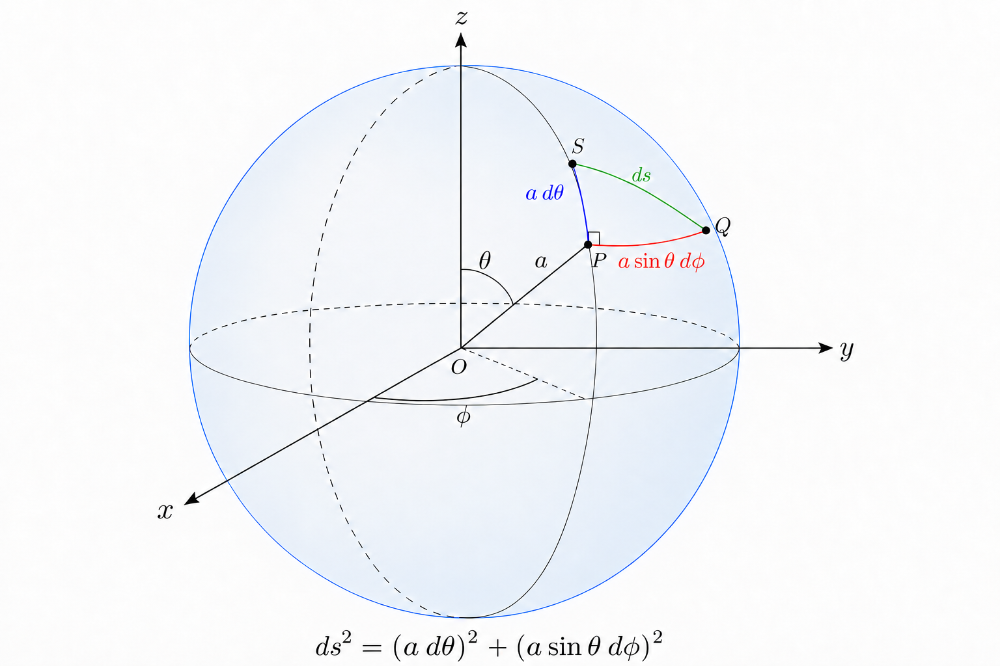
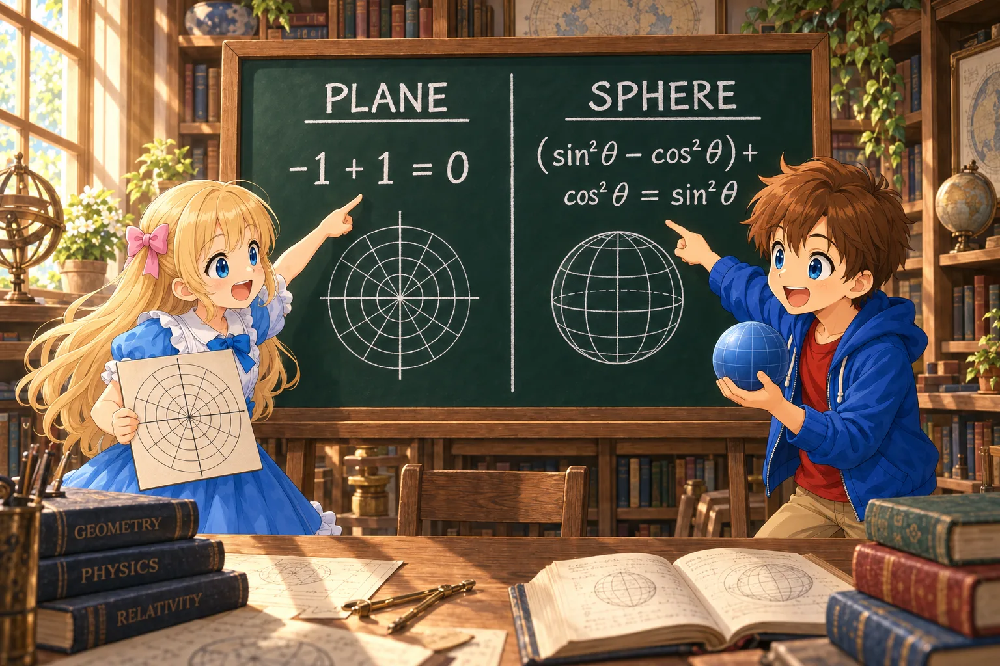

# Real Curvature Revealed by Going Around Once

## Introduction

In the previous document, “Carrying Vectors and Going Straight,” we wrote the condition for parallel transporting a vector along a path as

$$
\frac{DV^\rho}{D\lambda}
=
\frac{dV^\rho}{d\lambda}
+
\Gamma^\rho_{\mu\nu}
\frac{dx^\mu}{d\lambda}
V^\nu
=0
\tag{7.1}
$$

Also, a path that parallel transports its tangent vector along itself is a geodesic, whose equation was

$$
\frac{d^2x^\rho}{d\lambda^2}
+
\Gamma^\rho_{\mu\nu}
\frac{dx^\mu}{d\lambda}
\frac{dx^\nu}{d\lambda}
=0
$$

However, the fact that the Christoffel symbols are nonzero alone does not mean that space or spacetime is curved.

Christoffel symbols appear when a plane is expressed in polar coordinates, but they all become zero when the same plane is expressed in Cartesian coordinates.

So how can we find real curvature that cannot be removed by choosing coordinates?

In this document, we will consider, in order,

- parallel transport along different paths
- parallel transport around a small closed curve
- differences in the order of covariant differentiation
- the Riemann curvature tensor
- a comparison of a plane and a sphere
- the Ricci tensor and curvature scalar

The goal is to develop the intuition that

> The change remaining when a vector is parallel transported around a small closed curve tells us about curvature that cannot be removed by coordinates.

## Carrying a Vector Along Two Paths

Suppose there are two different paths from the same point $P$ to the same point $Q$.

One path first moves in the $x^\mu$ direction and then in the $x^\nu$ direction.

The other reverses the order: it first moves in the $x^\nu$ direction and then in the $x^\mu$ direction.

Parallel transport the same vector at $P$ along each path.

On a plane, the vectors arriving at $Q$ are the same whichever path is used.

In curved space, however, the two results do not necessarily agree.

### Try It on a Globe

The lines on the globe are the paths along which the vector is carried, and the two arrows Bob is holding are for comparing their directions after arrival. Let us examine the difference they found in the next figure.

On the equator of a globe, choose two points $P$ and $Q$ whose longitudes differ by 90 degrees. Let $Q$ be east of $P$. Place a north-pointing arrow at $P$, and carry it to $Q$ along the surface by two routes.

The equator and meridians used here are “straight paths” on the sphere. When parallel transporting along such a path, **keep the angle between the arrow and the direction of travel constant**. However, even if you change your own direction at a bend in the path, do not rotate the arrow along with you.

- **Path east along the equator:** The initially north-pointing arrow points to the left of the direction of travel. Carrying it while preserving that relationship leaves it pointing north at $Q$.
- **Path via the North Pole:** First travel north along a meridian. The arrow continues pointing in the direction of travel. At the North Pole, switch to the meridian leading toward $Q$; the path turns 90 degrees to the right. If the arrow is not rotated, it now points to the left of the direction of travel. Continuing south to the equator, it points east at $Q$.

Although the same arrow was carried along both paths without being rotated arbitrarily, **the arrows at arrival differ by 90 degrees!** On a sphere, the orientation of the plane tangent to the surface changes as the location changes. Because the arrow is carried while matching that surface, its final direction depends on the path taken.

The colored lines represent the paths, and the arrows represent the vectors being carried. In the right-hand figure, even though the path bends at the North Pole, the arrow keeps its orientation.

---

Alice: “The final directions differ even though we never rotated the arrows along the way.”

Bob: “There is still a difference even when we compare them at the same place. Let’s follow this offset with equations too.”

---

### Join the Two Paths and Go Around Once

If we go from $P$ to $Q$ along one path and return to $P$ by tracing the other path in reverse, we make a closed path. If there is an offset between the arrows on arrival, the arrow brought back will not return to its initial direction.

The globe used a large path so that the effect would be easy to see. From here, let us investigate the same thing with a very small closed curve.

Therefore, it seems that we can find the curvature at a location by checking

> whether a parallel-transported vector returns to its original state after one circuit.

## Comparing the Order of Covariant Derivatives

Change in the $x^\mu$ direction is represented by the covariant derivative

$$
\nabla_\mu
$$

If we first take a covariant derivative in the $x^\nu$ direction and then in the $x^\mu$ direction, we obtain

$$
\nabla_\mu\nabla_\nu V^\rho
$$

With the opposite order,

$$
\nabla_\nu\nabla_\mu V^\rho
$$

The difference between them is

$$
\left(
\nabla_\mu\nabla_\nu
-
\nabla_\nu\nabla_\mu
\right)V^\rho
$$

Such a difference caused by the order of two operations is called a commutator.

Using the notation

$$
[\nabla_\mu,\nabla_\nu]
=
\nabla_\mu\nabla_\nu
-
\nabla_\nu\nabla_\mu
$$

we can write it briefly as

$$
[\nabla_\mu,\nabla_\nu]V^\rho
$$

This commutator represents the difference produced by carrying a vector along two different paths.

## For a Scalar, the Order Difference Disappears

First apply two covariant derivatives to a scalar $f$.

The first covariant derivative of a scalar is the same as an ordinary partial derivative:

$$
\nabla_\nu f
=
\partial_\nu f
$$

Because $\partial_\nu f$ has a lower index, the second covariant derivative is

$$
\nabla_\mu\nabla_\nu f
=
\partial_\mu\partial_\nu f
-
\Gamma^\lambda_{\mu\nu}\partial_\lambda f
$$

Reversing the order gives

$$
\nabla_\nu\nabla_\mu f
=
\partial_\nu\partial_\mu f
-
\Gamma^\lambda_{\nu\mu}\partial_\lambda f
$$

Ordinary partial derivatives can be interchanged:

$$
\partial_\mu\partial_\nu f
=
\partial_\nu\partial_\mu f
$$

Also, the connection used here has no torsion, so

$$
\Gamma^\lambda_{\mu\nu}
=
\Gamma^\lambda_{\nu\mu}
$$

Therefore,

$$
\boxed{
[\nabla_\mu,\nabla_\nu]f=0
}
$$

A scalar has no direction, so carrying it around a closed curve cannot record an offset in direction.

To see curvature, we need to use a vector that has a direction.

## For a Vector, the Order Difference Remains

The covariant derivative of a vector is

$$
\nabla_\nu V^\rho
=
\partial_\nu V^\rho
+
\Gamma^\rho_{\nu\sigma}V^\sigma
$$

$\nabla_\nu V^\rho$ is a tensor with an upper index $\rho$ and a lower index $\nu$.

Here, rather than applying $\nabla_\mu$ only to the second term on the right, $\Gamma^\rho_{\nu\sigma}V^\sigma$, we take another covariant derivative of all of $\nabla_\nu V^\rho$.

To see the procedure, temporarily set

$$
T^\rho{}_{\nu}=\nabla_\nu V^\rho
$$

Following the rule of adding a positive connection term for an upper index and a negative one for a lower index,

$$
\nabla_\mu T^\rho{}_{\nu}
=
\partial_\mu T^\rho{}_{\nu}
+
\Gamma^\rho_{\mu\lambda}T^\lambda{}_{\nu}
-
\Gamma^\lambda_{\mu\nu}T^\rho{}_{\lambda}
$$

The second term on the right is the correction for $\rho$, and the third is the correction for $\nu$. The index $\nu$ introduced by the first derivative is also subject to a correction on the second.

Substituting $T^\rho{}_{\nu}=\nabla_\nu V^\rho$ gives

$$
\begin{aligned}
\nabla_\mu\nabla_\nu V^\rho
&=
\partial_\mu(\nabla_\nu V^\rho)\\
&\quad
+\Gamma^\rho_{\mu\lambda}
\nabla_\nu V^\lambda\\
&\quad
-\Gamma^\lambda_{\mu\nu}
\nabla_\lambda V^\rho
\end{aligned}
$$

Substituting the first covariant-derivative formula into the three places on the right gives

$$
\begin{aligned}
\nabla_\mu\nabla_\nu V^\rho
&=
\partial_\mu\partial_\nu V^\rho
+(\partial_\mu\Gamma^\rho_{\nu\sigma})V^\sigma
+\Gamma^\rho_{\nu\sigma}\partial_\mu V^\sigma\\
&\quad
+\Gamma^\rho_{\mu\lambda}
\left(\partial_\nu V^\lambda
+\Gamma^\lambda_{\nu\sigma}V^\sigma\right)\\
&\quad
-\Gamma^\lambda_{\mu\nu}
\left(\partial_\lambda V^\rho
+\Gamma^\rho_{\lambda\sigma}V^\sigma\right)
\end{aligned}
$$

The first line uses the product rule for $\partial_\mu$. The second and third lines come from the connection corrections for the two indices.

We first took a covariant derivative of all of $\nabla_\nu V^\rho$ as one tensor, and only then substituted $\nabla_\nu V^\rho=\partial_\nu V^\rho+\Gamma^\rho_{\nu\sigma}V^\sigma$. The two terms on the right are not tensors individually, which is why this order matters.

Similarly,

$$
\begin{aligned}
\nabla_\nu\nabla_\mu V^\rho
&=
\partial_\nu(\nabla_\mu V^\rho)\\
&\quad
+\Gamma^\rho_{\nu\lambda}
\nabla_\mu V^\lambda\\
&\quad
-\Gamma^\lambda_{\nu\mu}
\nabla_\lambda V^\rho
\end{aligned}
$$

Subtract the two equations.

For a connection without torsion,

$$
\Gamma^\lambda_{\mu\nu}
=
\Gamma^\lambda_{\nu\mu}
$$

so the terms arising from changes in the lower indices $\mu,\nu$ cancel.

Collecting the remaining terms gives

$$
\begin{aligned}
[\nabla_\mu,\nabla_\nu]V^\rho
&=
\Bigl(
\partial_\mu\Gamma^\rho_{\nu\sigma}
-
\partial_\nu\Gamma^\rho_{\mu\sigma}\\
&\qquad
+\Gamma^\rho_{\mu\lambda}
\Gamma^\lambda_{\nu\sigma}
-
\Gamma^\rho_{\nu\lambda}
\Gamma^\lambda_{\mu\sigma}
\Bigr)V^\sigma
\end{aligned}
$$

The expression in parentheses contains no vector $V^\sigma$ itself. It is determined only by the connection and its partial derivatives.

## The Riemann Curvature Tensor

Therefore, define

$$
\boxed{
\begin{aligned}
{R^\rho}_{\sigma\mu\nu}
&=
\partial_\mu\Gamma^\rho_{\nu\sigma}
-
\partial_\nu\Gamma^\rho_{\mu\sigma}\\
&\quad
+\Gamma^\rho_{\mu\lambda}
\Gamma^\lambda_{\nu\sigma}
-
\Gamma^\rho_{\nu\lambda}
\Gamma^\lambda_{\mu\sigma}
\end{aligned}
}
\tag{7.2}
$$

This is the Riemann curvature tensor.

Using this definition, the commutator of covariant derivatives is

$$
\boxed{
[\nabla_\mu,\nabla_\nu]V^\rho
=
{R^\rho}_{\sigma\mu\nu}V^\sigma
}
$$

The left-hand side takes the whole tensor $\nabla_\nu V^\rho$ and covariantly differentiates it again, then takes the difference between the orders, so it is a tensor. Also, when the commutator on the left is expanded, all terms containing partial derivatives of $V^\sigma$ cancel, leaving only terms proportional to $V^\sigma$ on the right. Whatever vector $V^\sigma$ is substituted, the right-hand side must transform under coordinate changes in the same way as the left. Therefore ${R^\rho}_{\sigma\mu\nu}$ multiplying $V^\sigma$ itself transforms as a tensor with one upper and three lower indices.

Each index has its own role.

- $\mu,\nu$ indicate which two directions are used to compare the order of covariant differentiation.
- $\sigma$ indicates the direction in which the initial vector points.
- $\rho$ indicates the direction in which the change caused by the order difference appears.

The Riemann curvature tensor does not represent curvature with just one number.

It records separately the surface around which we go, the direction of the vector we carry, and the direction in which the result changes.

## Relation to a Small Closed Curve

The difference caused by the order of covariant derivatives is connected to the offset produced when a vector is carried around a small closed curve. Let us verify this by comparing two paths.

Let $Q$ be the point reached from $P$ by moving $h$ in the $x^\mu$ direction and $k$ in the $x^\nu$ direction. Calling the intermediate points $A,B$, the two paths are

- $P\to A\to Q$: first in the $\mu$ direction, then in the $\nu$ direction.
- $P\to B\to Q$: first in the $\nu$ direction, then in the $\mu$ direction.

Here $\mu,\nu$ are fixed, and there is no summation over these two indices.

### Comparing the Results Carried Along the Two Paths

In the parallel-transport equation (7.1) from the beginning, move only in the $x^\mu$ direction and set the path parameter to $\lambda=x^\mu$:

$$
\frac{dV^\rho}{dx^\mu}
+\Gamma^\rho_{\mu\sigma}V^\sigma=0
$$

Moving the connection term to the other side gives

$$
\frac{dV^\rho}{dx^\mu}
=-\Gamma^\rho_{\mu\sigma}V^\sigma
$$

Using the first-order approximation “initial value plus distance times rate of change” after moving a small width $h$,

$$
V_A^\rho
=V^\rho+h\frac{dV^\rho}{dx^\mu}+O(h^2)
=V^\rho-h\Gamma^\rho_{\mu\sigma}V^\sigma+O(h^2)
$$

On the next edge, use the connection and vector at $A$. The connection also changes:

$$
\Gamma^\rho_{\nu\sigma}(A)
=\Gamma^\rho_{\nu\sigma}(P)
+h\,\partial_\mu\Gamma^\rho_{\nu\sigma}(P)+O(h^2)
$$

Next, moving from $A$ a width $k$ in the $\nu$ direction gives

$$
V_{PAQ}^\rho
=V_A^\rho-k\Gamma^\rho_{\nu\lambda}(A)V_A^\lambda+O(k^2)
$$

Substitute the connection expansion found above and

$$
V_A^\lambda
=V^\lambda-h\Gamma^\lambda_{\mu\sigma}V^\sigma+O(h^2)
$$

Below, coefficients whose positions are omitted are all evaluated at $P$.

$$
\begin{aligned}
V_{PAQ}^\rho
={}&V^\rho-h\Gamma^\rho_{\mu\sigma}V^\sigma\\
&-k\left(
\Gamma^\rho_{\nu\lambda}
+h\,\partial_\mu\Gamma^\rho_{\nu\lambda}
\right)
\left(
V^\lambda-h\Gamma^\lambda_{\mu\sigma}V^\sigma
\right)+\cdots
\end{aligned}
$$

Expanding the product, the part multiplied by $-k$ gives

$$
\begin{aligned}
&-k\Gamma^\rho_{\nu\lambda}V^\lambda\\
&-hk(\partial_\mu\Gamma^\rho_{\nu\lambda})V^\lambda\\
&+hk\Gamma^\rho_{\nu\lambda}\Gamma^\lambda_{\mu\sigma}V^\sigma
\end{aligned}
$$

The last term is positive because the outer $-k$ multiplies the vector correction $-h$. The product of the connection correction and vector correction is an $h^2k$ term, so it is omitted.

Renaming the summed index $\lambda$ in the first two terms to $\sigma$ and collecting everything,

$$
\begin{aligned}
V_{PAQ}^\rho
={}&V^\rho
-h\Gamma^\rho_{\mu\sigma}V^\sigma
-k\Gamma^\rho_{\nu\sigma}V^\sigma\\
&+hk\left(
-\partial_\mu\Gamma^\rho_{\nu\sigma}
+\Gamma^\rho_{\nu\lambda}\Gamma^\lambda_{\mu\sigma}
\right)V^\sigma+\cdots
\end{aligned}
$$

All coefficients are evaluated at $P$. The two $hk$ terms represent the **effect of the connection changing** and the **effect of the vector components changing** due to the first movement.

For the other path, exchange $\mu$ with $\nu$ and $h$ with $k$. Subtracting the two results cancels the terms arising from only one direction, leaving

$$
\begin{aligned}
V_{PAQ}^\rho-V_{PBQ}^\rho
=-hk\Bigl(
&\partial_\mu\Gamma^\rho_{\nu\sigma}
-\partial_\nu\Gamma^\rho_{\mu\sigma}\\
&+\Gamma^\rho_{\mu\lambda}\Gamma^\lambda_{\nu\sigma}
-\Gamma^\rho_{\nu\lambda}\Gamma^\lambda_{\mu\sigma}
\Bigr)V^\sigma+\cdots
\end{aligned}
$$

The expression in parentheses is the Riemann curvature tensor found earlier. Therefore,

$$
V_{PAQ}^\rho-V_{PBQ}^\rho
=-hk\,{R^\rho}_{\sigma\mu\nu}V^\sigma
+O(h^2k,hk^2)
$$

The omitted terms containing only $h^2$ or only $k^2$ are common to both paths, so they do not remain in the difference.

### The Path Difference Becomes the Offset After One Circuit

Carry the two vectors that arrived at $Q$ back along the same route $Q\to B\to P$. One returns along the path it came from and therefore returns to the original vector; the other becomes the vector carried around

$$
P\to A\to Q\to B\to P
$$

once. In other words, carrying the difference between the two vectors back to $P$ gives the offset $\Delta V^\rho$ after one circuit.

The difference is already of order $hk$, so corrections added along the return path are at least of order $h^2k$ or $hk^2$. Thus,

$$
\boxed{
\Delta V^\rho
=-{R^\rho}_{\sigma\mu\nu}V^\sigma\,hk
+O(h^2k,hk^2)
}
$$

**The offset produced by a small circuit is proportional to the product $hk$ of the two sides, and curvature determines its coefficient.** $hk$ is the coordinate area and need not be the physically measured area. Reversing the direction around the circuit also reverses the sign of the leading offset.

Thus, by examining the Riemann curvature tensor, we can determine how much and in which direction a vector is displaced after one trip around a small closed curve. In this sense, the Riemann curvature tensor evaluates how space or spacetime is curved, and in which directions.

We have now seen that the same curvature appears in the commutator of covariant derivatives and in parallel transport along a small closed curve.

---

Alice: “The difference in the order of differentiation led to the offset of the arrow we saw on the globe!”

Bob: “The indices even include which surface we go around and which arrow we carry.”

---

## The Difference from Christoffel Symbols

Christoffel symbols change with coordinates, and at a particular point they can be made to satisfy

$$
\Gamma^\rho_{\mu\nu}=0
$$

by choosing suitable coordinates.

However, it is generally impossible to eliminate how the Christoffel symbols change around that point.

The Riemann curvature tensor contains, in a fixed combination, the change in the connection

$$
\partial_\mu\Gamma^\rho_{\nu\sigma}
-
\partial_\nu\Gamma^\rho_{\mu\sigma}
$$

and the products of connections

$$
\Gamma^\rho_{\mu\lambda}\Gamma^\lambda_{\nu\sigma}
-
\Gamma^\rho_{\nu\lambda}\Gamma^\lambda_{\mu\sigma}
$$

Individual terms change with coordinates. But the full combination

$$
{R^\rho}_{\sigma\mu\nu}
$$

transforms as a tensor.

Therefore, if the Riemann curvature tensor is zero in one coordinate system, it is zero in another as well.

Conversely, if the Riemann curvature tensor is nonzero at a point, the curvature itself cannot be removed by a coordinate transformation.

> Christoffel symbols include apparent changes caused by coordinates, whereas the Riemann curvature tensor represents geometric curvature that cannot be removed by coordinates.

## Checking a Plane in Polar Coordinates

In polar coordinates on a plane, the nonzero Christoffel symbols were

$$
\Gamma^r_{\theta\theta}=-r,
\qquad
\Gamma^\theta_{r\theta}
=
\Gamma^\theta_{\theta r}
=
\frac{1}{r}
$$

The Christoffel symbols are not zero. Even so, the curvature of the plane should be zero.

As a representative example, calculate

$$
{R^r}_{\theta r\theta}
$$

Substituting

$$
\rho=r,\qquad
\sigma=\theta,\qquad
\mu=r,\qquad
\nu=\theta
$$

into the definition gives

$$
\begin{aligned}
{R^r}_{\theta r\theta}
&=
\partial_r\Gamma^r_{\theta\theta}
-\partial_\theta\Gamma^r_{r\theta}\\
&\quad
+\Gamma^r_{r\lambda}\Gamma^\lambda_{\theta\theta}
-\Gamma^r_{\theta\lambda}\Gamma^\lambda_{r\theta}
\end{aligned}
$$

The first term is

$$
\partial_r\Gamma^r_{\theta\theta}
=
\partial_r(-r)
=
-1
$$

The second and third terms are zero.

In the fourth term, only $\lambda=\theta$ remains:

$$
\begin{aligned}
-\Gamma^r_{\theta\theta}\Gamma^\theta_{r\theta}
&=-(-r)\frac{1}{r}\\
&=1
\end{aligned}
$$

Therefore,

$$
\boxed{
{R^r}_{\theta r\theta}
=
-1+1
=0
}
$$

The $-1$ from the partial derivative of the Christoffel symbol and the $+1$ from the product of Christoffel symbols cancel.

In two dimensions, the independent information in the Riemann curvature tensor consists of only one component. The other components are related to it by symmetry, so

$$
{R^\rho}_{\sigma\mu\nu}=0
$$

The Christoffel symbols in polar coordinates were not zero, but they only represented the fact that the coordinate basis changes from place to place.

When the Riemann curvature tensor is formed, these apparent coordinate changes cancel, revealing that the curvature of the plane is zero.

---

Bob: “The polar-coordinate equations were complicated, but the calculation correctly shows that it is a plane.”

Alice: “Then what remains uncanceled on a sphere?”

---

## On a Sphere, the Cancellation Is Incomplete

Consider a sphere of radius $a$.

Using polar angle $\theta$ and azimuthal angle $\phi$ as coordinates on the sphere, the line element is

$$
ds^2
=
a^2d\theta^2
+
a^2\sin^2\theta\,d\phi^2
$$

The metric components are

$$
g_{\theta\theta}=a^2,
\qquad
g_{\phi\phi}=a^2\sin^2\theta,
\qquad
g_{\theta\phi}=0
$$

Calculating the Christoffel symbols from this metric, the nonzero ones are

$$
\Gamma^\theta_{\phi\phi}
=
-\sin\theta\cos\theta
$$

$$
\Gamma^\phi_{\theta\phi}
=
\Gamma^\phi_{\phi\theta}
=
\cot\theta
$$

As with the plane in polar coordinates, calculate

$$
{R^\theta}_{\phi\theta\phi}
$$

$$
\begin{aligned}
{R^\theta}_{\phi\theta\phi}
&=
\partial_\theta\Gamma^\theta_{\phi\phi}
-\partial_\phi\Gamma^\theta_{\theta\phi}\\
&\quad
+\Gamma^\theta_{\theta\lambda}\Gamma^\lambda_{\phi\phi}
-\Gamma^\theta_{\phi\lambda}\Gamma^\lambda_{\theta\phi}
\end{aligned}
$$

The second and third terms are zero.

The first term is

$$
\begin{aligned}
\partial_\theta\Gamma^\theta_{\phi\phi}
&=\partial_\theta(-\sin\theta\cos\theta)\\
&=\sin^2\theta-\cos^2\theta
\end{aligned}
$$

In the fourth term, the case $\lambda=\phi$ remains:

$$
\begin{aligned}
-\Gamma^\theta_{\phi\phi}\Gamma^\phi_{\theta\phi}
&=-(-\sin\theta\cos\theta)\cot\theta\\
&=\cos^2\theta
\end{aligned}
$$

Therefore,

$$
\boxed{
{R^\theta}_{\phi\theta\phi}
=
\sin^2\theta
}
$$

On the plane, the two contributions canceled completely, but on the sphere $\sin^2\theta$ remains.

On the left, the plane gives $-1+1=0$. On the right, the sphere’s $\cos^2\theta$ terms cancel, leaving $\sin^2\theta$. Notice the difference in the calculation results they are pointing to.

This means that when a vector is parallel transported around a small closed curve on a sphere, an offset in its direction remains after one circuit.

At a pole, $\sin\theta=0$. However, at a pole, every value of $\phi$ represents the same point, so the azimuthal direction can no longer be distinguished as a coordinate. In other words, the sphere does not become nonsmooth there; the coordinate assignment using $\theta$ and $\phi$ simply stops working.

Therefore, even if this component involving the $\phi$ direction becomes zero at a pole, the curvature of the sphere itself does not become zero only at the pole.

## Curvature Remains Even After Removing the Connection at One Point

As we saw in Chapter 6, [“How Do the Christoffel Symbols Transform?”](./06-ParallelTransportAndGeodesics.md#how-do-the-christoffel-symbols-transform), by choosing the second derivatives of a coordinate transformation appropriately, even in curved spacetime we can arrange, at one point,

$$
\Gamma^\rho_{\mu\nu}=0
$$

Physically, this corresponds to choosing coordinates that are freely falling near that point.

Looking only at that point, objects move just as they do in special relativity.

However, we cannot eliminate differences from locations a little farther away.

Even if the Christoffel symbols are zero at that point,

$$
\partial_\mu\Gamma^\rho_{\nu\sigma}
$$

need not also be zero.

If the Riemann curvature tensor is nonzero, relative differences appear in the motion of nearby freely falling objects.

We can eliminate gravity at one point, but we cannot eliminate tidal effects appearing across a region with finite extent.

In this sense, curvature represents the part of a gravitational field that cannot be removed by a coordinate transformation.

## The Ricci Tensor

The Riemann curvature tensor has four indices:

$$
{R^\rho}_{\sigma\mu\nu}
$$

They are needed to record all the directional dependence of curvature, but to connect matter with the curvature of spacetime, we also use quantities that collect some of this information.

Contract the upper index $\rho$ with the third lower index $\mu$ and set

$$
\boxed{
R_{\sigma\nu}
=
{R^\rho}_{\sigma\rho\nu}
}
$$

This is called the Ricci tensor.

While the Riemann curvature tensor records in detail how a vector’s direction changes after one circuit of a closed curve, the Ricci tensor is related to how a bundle of nearby geodesics spreads out or contracts.

## The Curvature Scalar

The Ricci tensor has two lower indices.

Contracting the two indices using the inverse metric $g^{\sigma\nu}$ gives the single number

$$
\boxed{
R
=
g^{\sigma\nu}R_{\sigma\nu}
}
$$

This is called the curvature scalar, or the Ricci scalar.

The value of the curvature scalar does not change under a coordinate transformation.

However, the curvature scalar being zero alone does not imply that every component of the Riemann curvature tensor is zero.

When many directions of information are contracted into a single number, some of them may cancel each other.

---

Alice: “A single number is easier to read, but there are things it cannot tell us by itself.”

Bob: “Right. Even if the total is zero, the things added together do not all have to be zero. To find out how it curves in each direction, we need the information in the original tensor.”

---

Therefore, the relationship is

- The Riemann curvature tensor represents the detailed directional dependence of curvature.
- The Ricci tensor contracts part of that information into a summary.
- The curvature scalar summarizes it further as a single number.

For a two-dimensional sphere of radius $a$,

$$
R=\frac{2}{a^2}
$$

This equation also shows that a smaller sphere is more strongly curved, while increasing the radius brings it closer to a plane.

## Summary

- The fact that Christoffel symbols are nonzero alone does not mean that there is curvature.
- The difference between vectors parallel transported along different paths can be studied as a difference in the order of covariant derivatives.
- The commutator of covariant derivatives acting on a scalar is zero when there is no torsion.
- The commutator of covariant derivatives acting on a vector is

  $$
  [\nabla_\mu,\nabla_\nu]V^\rho
  =
  {R^\rho}_{\sigma\mu\nu}V^\sigma
  $$

- The Riemann curvature tensor is

  $$
  {R^\rho}_{\sigma\mu\nu}
  =
  \partial_\mu\Gamma^\rho_{\nu\sigma}
  -
  \partial_\nu\Gamma^\rho_{\mu\sigma}
  +
  \Gamma^\rho_{\mu\lambda}
  \Gamma^\lambda_{\nu\sigma}
  -
  \Gamma^\rho_{\nu\lambda}
  \Gamma^\lambda_{\mu\sigma}
  $$

- The Riemann curvature tensor represents the change remaining when a vector is carried once around a small closed curve.
- Christoffel symbols can sometimes be removed by a coordinate choice, but a nonzero Riemann curvature tensor cannot be removed by a coordinate transformation.
- Christoffel symbols appear when a plane is expressed in polar coordinates, but the Riemann curvature tensor is zero.
- On a sphere, the Riemann curvature tensor does not become zero, and path dependence remains in parallel transport.
- The Ricci tensor is

  $$
  R_{\sigma\nu}
  =
  {R^\rho}_{\sigma\rho\nu}
  $$

- The curvature scalar is

  $$
  R
  =
  g^{\sigma\nu}R_{\sigma\nu}
  $$

## The Next Question

We now have the tools for describing the curvature of spacetime.

However, a major question remains.

What determines how spacetime is curved?

In special relativity, energy and momentum played central roles in physical phenomena.

In general relativity, we need to connect the tensor representing the energy and momentum of matter with the tensor representing the curvature of spacetime.

However, simply connecting the Ricci tensor directly to matter would not be consistent with the conservation laws that must be satisfied.

In the next document, [“Connecting Matter and Curvature”](./08-EinsteinEquation.md), we will construct the Einstein tensor from the Ricci tensor and curvature scalar, and proceed to the Einstein equation that connects matter and spacetime.
