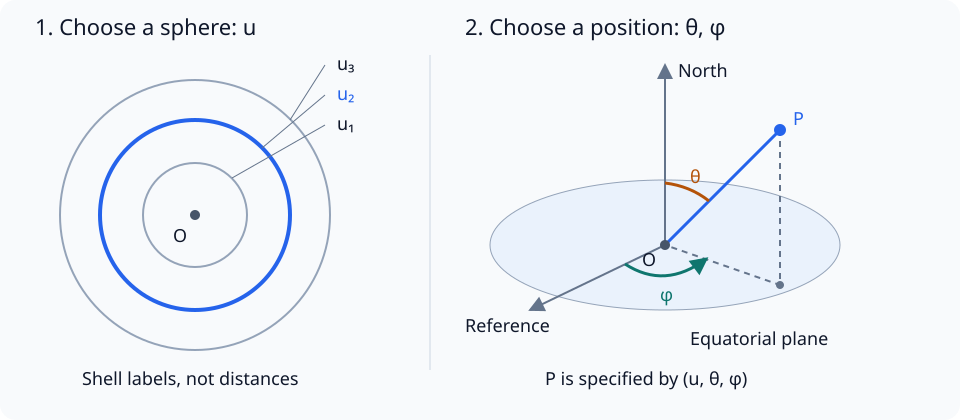
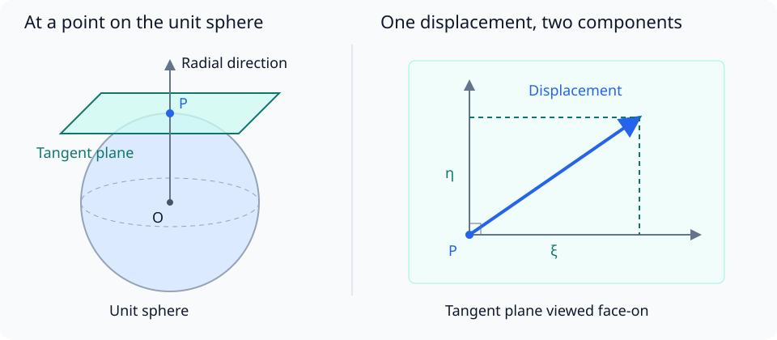
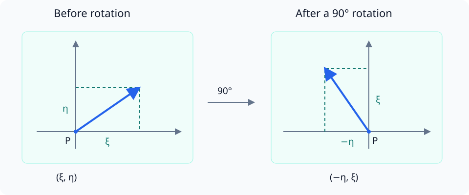

# Predicting a Spherically Symmetric Spacetime

## Introduction

In the previous document [“Connecting Matter and Curvature”](./08-EinsteinEquation.md), we constructed the Einstein equation. We also confirmed that, when the cosmological constant is zero and there is no matter or electromagnetic field,

$$
R_{\mu\nu}=0
$$

holds.

This time, we want to use this equation to find the spacetime outside a round star. What is unknown is the metric. However, a symmetric four-dimensional metric has ten independent components. Before calculating all of them as unknown functions, let us consider how far the star’s symmetry can narrow down the form of the metric.

---

Alice: “We have the equation, but what should we substitute into it?”

Bob: “First, let’s decide what kind of spacetime we are looking for. For a round star, the situation should be the same even if we change our orientation.”

---

Here we consider a static spacetime outside a non-rotating, spherically symmetric star. Static means that we can choose coordinates suited to stationary observers in which the situation does not change with time and the time and spatial directions are orthogonal. This chapter deals with the region where such coordinates can be used.

## Starting from Ten Components

For a spherically symmetric situation, it is convenient to use two angles. Let the time coordinate be $w=ct$, let $u$ be a coordinate distinguishing the spheres, and let the angles be $\theta,\phi$.

Here, $u$ does not yet mean an actual distance. It is a marker attached to the spheres surrounding the center, from inside to outside. Later, we will choose a different way to attach these markers.

First choose one sphere with $u$, then specify a position on it using two angles. $\theta$ is the angle measured from the direction of the North Pole, and $\phi$ is the angle measured around the equatorial plane from a reference direction. The positive direction of $\phi$ is defined as the direction of rotation when a right-handed screw advances in the positive direction of the North axis. Usually, $0\leq\theta\leq\pi$ and $0\leq\phi<2\pi$.

The concentric circles in the figure represent a cross-section of the spheres. Their radii and spacing do not directly represent actual measured distances or differences in $u$. Also, the axes and guide lines in the right-hand figure are there to show the definitions of the angles; they do not assume that space is flat.

Writing the general line element in these four coordinates gives

$$
\begin{aligned}
ds^2={}&g_{ww}\,dw^2+g_{uu}\,du^2
+g_{\theta\theta}\,d\theta^2+g_{\phi\phi}\,d\phi^2\\
&+2g_{wu}\,dw\,du
+2g_{w\theta}\,dw\,d\theta
+2g_{w\phi}\,dw\,d\phi\\
&+2g_{u\theta}\,du\,d\theta
+2g_{u\phi}\,du\,d\phi
+2g_{\theta\phi}\,d\theta\,d\phi
\end{aligned}
$$

Thus, there are ten independent components: the four diagonal components together with the coefficients of the six cross terms.

The coefficient of each cross term is 2 because, for example, $g_{wu}\,dw\,du$ and $g_{uw}\,du\,dw$ are equal by the symmetry of the metric.

## Spherical Symmetry Means There Is No Special Direction on a Sphere

Spherical symmetry means that the geometry of spacetime does not change when we rotate around the center. The direction from the center outward can be distinguished, but among the directions along one sphere there is no special orientation.

At a point on a sphere, let a small displacement along the sphere have two components $\xi,\eta$. Here we use two orthogonal directions on a unit sphere to represent the direction. How actual lengths are measured will be determined by the metric below.

The right-hand figure shows the tangent plane at point $P$ from the front. The diagonal arrow represents one small displacement, and its horizontal and vertical components are $\xi,\eta$. It is one displacement split into two directions, not two separate displacements. The radial direction is perpendicular to this tangent plane, so $\xi,\eta$ contain no radial displacement.

We want to examine the cross terms between a displacement in the time or radial direction and a displacement along the sphere. From the general line element written at the beginning, take out just the four relevant terms and call their sum $X$.

$$
\begin{aligned}
X={}&2g_{w\theta}\,dw\,d\theta
+2g_{w\phi}\,dw\,d\phi\\
&+2g_{u\theta}\,du\,d\theta
+2g_{u\phi}\,du\,d\phi
\end{aligned}
$$

For example, the first term is the product of the time-direction displacement $dw$ and the angular displacement $d\theta$, multiplied by the coefficient $2g_{w\theta}$. The first two terms combine time and angle, while the last two combine radial direction and angle. Terms involving only time and radial direction, or terms involving two angles, have not been extracted here.

Next, express the angular displacement using the two orthogonal components $\xi,\eta$ introduced above. Away from the poles, if we choose the directions of increasing $\theta$ and increasing $\phi$, then on a unit sphere,

$$
\xi=d\theta,\qquad \eta=\sin\theta\,d\phi
$$

In the $\phi$ direction, the radius of the parallel is $\sin\theta$, so the angular change $d\phi$ is multiplied by this factor. Therefore, substituting $d\theta=\xi$ and $d\phi=\eta/\sin\theta$ into the four terms above gives

$$
\begin{aligned}
X={}&2g_{w\theta}\,dw\,\xi
+2\frac{g_{w\phi}}{\sin\theta}\,dw\,\eta\\
&+2g_{u\theta}\,du\,\xi
+2\frac{g_{u\phi}}{\sin\theta}\,du\,\eta
\end{aligned}
$$

Let us give the four coefficients at this point short names:

$$
L_1=g_{w\theta},\qquad
L_2=\frac{g_{w\phi}}{\sin\theta},\qquad
M_1=g_{u\theta},\qquad
M_2=\frac{g_{u\phi}}{\sin\theta}
$$

Factoring out $2dw$ from the two terms containing time and $2du$ from the two terms containing the radial direction gives

$$
X=2dw(L_1\xi+L_2\eta)+2du(M_1\xi+M_2\eta)
$$

We have not introduced new physical quantities; we have only rewritten the cross terms of the original metric in a form that makes the two directions on the sphere easier to see. Next, let us confirm from spherical symmetry that these four coefficients are zero.

If we rotate halfway around the radial direction passing through the point, the point itself and the time and radial directions remain unchanged, while only the displacement along the sphere is reversed:

$$
(\xi,\eta)\longrightarrow(-\xi,-\eta)
$$

Therefore, the sign of all the cross terms above changes. On the other hand, the terms involving only time and the radial direction, and the terms quadratic in the displacement along the sphere, do not change.

By spherical symmetry, the line element must be the same before and after the rotation. If we call the cross terms $X$, then $X=-X$, so $X=0$ is required. Since $dw,du,\xi,\eta$ can be chosen arbitrarily,

$$
L_1=L_2=M_1=M_2=0
$$

follows. Thus, in the original angular coordinates as well,

$$
g_{w\theta}=g_{w\phi}=g_{u\theta}=g_{u\phi}=0
$$

Next, consider a displacement only along the sphere, without changing either time or the sphere’s marker. Setting $dw=du=0$ leaves only terms containing $\xi,\eta$ in the line element. Let the coefficients of their squares and cross term be $a,d,2b$, respectively. This part is then

$$
a\xi^2+2b\xi\eta+d\eta^2
$$

$a$ is the coefficient multiplying the square of the displacement in the $\xi$ direction, $d$ is the corresponding coefficient for the $\eta$ direction, and $b$ determines the cross term between the two directions.

In the figure, the arrow representing the displacement is rotated 90 degrees counterclockwise while the two axes used to measure its components are held fixed. The original rightward component $\xi$ becomes upward, and the original upward component $\eta$ becomes leftward. Thus, after the rotation, the horizontal component is $-\eta$ and the vertical component is $\xi$.

This corresponds to a rotation around the radial axis passing through the point. Substituting $(\xi,\eta)\to(-\eta,\xi)$ makes the expression

$$
a\eta^2-2b\xi\eta+d\xi^2
$$

Let us check why the expressions before and after rotation must agree. What we just did was rotate around the radial axis passing through point $P$, so point $P$ itself did not move; only the direction of the displacement along the sphere changed. Spherical symmetry means that the geometry does not change under such a rotation, so the length of the rotated small displacement must also equal its original length.

The expression here represents the square of that small length. Therefore, using the same coefficients $a,b,d$ at the same point,

$$
a\xi^2+2b\xi\eta+d\eta^2
=a\eta^2-2b\xi\eta+d\xi^2
$$

must hold. This equality is necessary not just for one particular displacement, but for every $\xi,\eta$. Comparing the coefficients of $\xi^2,\xi\eta,\eta^2$ gives

$$
a=d,\qquad b=0
$$

Therefore, the metric along the sphere has the form

$$
a(\xi^2+\eta^2)
$$

The coefficients in the two directions are equal, and there is no cross term.

Furthermore, because a rotation around the center can move to any point on the sphere, this common coefficient $a$ does not depend on the position on the sphere. In a static situation, it does not depend on time either. It can still have different values on different spheres, so rewrite $a$ as a function $C(u)$ of only the sphere’s marker $u$. That is, $a=C(u)$, and the part along the sphere becomes

$$
C(u)(\xi^2+\eta^2)
$$

## Determining the Angular Metric

The line element of a sphere of radius $a$ used in Chapter 7 was

$$
d\ell^2=a^2d\theta^2+a^2\sin^2\theta\,d\phi^2
$$

The length corresponding to an angular change in the $\theta$ direction is $a\,d\theta$. In the $\phi$ direction, the radius of the parallel is $a\sin\theta$, so the length is $a\sin\theta\,d\phi$.

The displacement on the unit sphere used above can be written in the usual angular coordinates, away from the poles, as

$$
\xi=d\theta,\qquad \eta=\sin\theta\,d\phi
$$

Substituting this into $C(u)(\xi^2+\eta^2)$ gives

$$
d\ell_{\mathrm{angular}}^2
=C(u)\left(d\theta^2+\sin^2\theta\,d\phi^2\right)
$$

Thus, the angular components are

$$
g_{\theta\theta}=C(u),\qquad
g_{\phi\phi}=C(u)\sin^2\theta,\qquad
g_{\theta\phi}=0
$$

We did not assume the metric of a sphere from the beginning; this form was narrowed down by the condition that the line element does not change under rotations.

Writing

$$
d\Omega^2=d\theta^2+\sin^2\theta\,d\phi^2
$$

for short, the angular part is $C(u)d\Omega^2$.

The factor $\sin^2\theta$ in $g_{\phi\phi}$ does not contradict spherical symmetry. It expresses a property of angular coordinates: the same $d\phi$ corresponds to a shorter length as we approach a pole.

## Considering the Time-Radial Cross Term

The coefficients involving only time and the radial direction also do not depend on position on the sphere. Since we use coordinates suited to a situation with no change in time, they do not depend on time either. Let us name them

$$
g_{ww}=-A(u),\qquad g_{wu}=D(u),\qquad g_{uu}=B(u)
$$

Then the metric has the form

$$
ds^2=-A(u)\,dw^2+2D(u)\,dw\,du+B(u)\,du^2+C(u)\,d\Omega^2
$$

We have factored out a minus sign from the time coefficient to match the sign convention $(-+++)$.
Here we consider a region where $A(u)>0$.

Spherical symmetry alone does not make the $dw\,du$ term vanish. Neither time nor the radial direction selects a particular direction on the sphere.

This term can be removed by redefining the time coordinate. Define a new time coordinate by

$$
\widetilde w=w+f(u),
\qquad
dw=d\widetilde w-f'(u)\,du
$$

where $f'(u)=df/du$. First expand the three terms involving time and the radial direction separately. To keep the equations short, omit the argument $(u)$ from the coefficients:

$$
\begin{aligned}
-A\,dw^2
&=-A(d\widetilde w-f'\,du)^2\\
&=-A\,d\widetilde w^2+2Af'\,d\widetilde w\,du-A(f')^2du^2,\\
2D\,dw\,du
&=2D(d\widetilde w-f'\,du)du\\
&=2D\,d\widetilde w\,du-2Df'\,du^2
\end{aligned}
$$

while $B\,du^2$ remains unchanged. Grouping the terms by $d\widetilde w^2$, $d\widetilde w\,du$, and $du^2$ gives

$$
\begin{aligned}
&-A\,dw^2+2D\,dw\,du+B\,du^2\\
&=-A\,d\widetilde w^2
+2(Af'+D)\,d\widetilde w\,du
+\left(B-A(f')^2-2Df'\right)du^2
\end{aligned}
$$

The coefficient of the cross term is $2(Af'+D)$, so choose

$$
f'(u)=-\frac{D(u)}{A(u)}
$$

to make it zero. On an interval where $A(u)>0$ and the coefficients are smooth, choose a reference point $u_0$ and set

$$
f(u)=-\int_{u_0}^{u}\frac{D(v)}{A(v)}\,dv
$$

which satisfies this condition. $v$ is the variable used for integration.

With this choice, the coefficient in the radial direction also changes as

$$
B-A(f')^2-2Df'
=B-\frac{D^2}{A}+\frac{2D^2}{A}
=B+\frac{D^2}{A}
$$

Therefore,

$$
ds^2=-A(u)\,d\widetilde w^2
+\left(B(u)+\frac{D(u)^2}{A(u)}\right)du^2
+C(u)\,d\Omega^2
$$

On a fixed sphere, $f(u)$ is constant, so this change corresponds to shifting the zero point of the time scale separately on each sphere. It has not changed the geometry of spacetime.

Let us write the coefficient in the radial direction after removing the cross term as

$$
\widetilde B(u)=B(u)+\frac{D(u)^2}{A(u)}
$$

Writing the time coordinate as $w$ again, we have

$$
ds^2=-A(u)\,dw^2+\widetilde B(u)\,du^2+C(u)\,d\Omega^2
$$

## Determining the Radius from the Area of a Sphere

First, let us find the area of one sphere. The current $u$ is a marker distinguishing spheres, and its value alone does not tell us the area of a sphere. The metric, on the other hand, connects small differences in the angular coordinates $d\theta,d\phi$ to actual lengths measured along the sphere. Thus, using the metric, we can find the side lengths of small patches into which the sphere is divided, and add their areas to find the area of the whole sphere.

For an ordinary sphere, the relation between radius $r$ and area $S$ is $S=4\pi r^2$. Here too, first calculate the area $S$, then define $r$ so that it can be written as $4\pi r^2$.

Take out a sphere with $u=\text{constant}$ and $w=\text{constant}$. We found above from spherical symmetry that the angular metric is $C(u)(d\theta^2+\sin^2\theta\,d\phi^2)$. In this metric, the $\theta$ and $\phi$ directions are orthogonal. Therefore, we can find the area by multiplying the lengths of the two sides of a small patch.

Divide the chosen sphere finely with parallels and meridians, and consider a small patch. For its two sides, call the length of the side where $\phi$ is fixed and $\theta$ changes by $d\theta$, $d\ell_\theta$, and the length of the side where $\theta$ is fixed and $\phi$ changes by $d\phi$, $d\ell_\phi$. Both are lengths measured along the sphere, not distances from the center to the sphere.

If $d\ell$ is the length of a small displacement along the sphere, then

$$
d\ell^2=C(u)d\Omega^2
=C(u)d\theta^2+C(u)\sin^2\theta\,d\phi^2
$$

Since the two angular directions are orthogonal, a small displacement crossing the patch diagonally can be written in the same form as the Pythagorean theorem:

$$
d\ell^2=d\ell_\theta^2+d\ell_\phi^2
$$

If we set one angular change to zero and move only in each direction, respectively, then

$$
d\ell_\theta^2=C(u)\,d\theta^2,\qquad
d\ell_\phi^2=C(u)\sin^2\theta\,d\phi^2
$$

Taking the angular widths to be positive and taking square roots gives

$$
d\ell_\theta=\sqrt{C(u)}\,d\theta,\qquad
d\ell_\phi=\sqrt{C(u)}\sin\theta\,d\phi
$$

Multiplying the lengths of the two orthogonal sides, the small area of the patch is

$$
dS
=\sqrt{g_{\theta\theta}g_{\phi\phi}}\,d\theta\,d\phi
=C(u)\sin\theta\,d\theta\,d\phi
$$

Integrating over the whole sphere gives

$$
\begin{aligned}
S&=\int_0^{2\pi}\int_0^\pi C(u)\sin\theta\,d\theta\,d\phi\\
&=C(u)\left(\int_0^{2\pi}d\phi\right)
\left(\int_0^\pi\sin\theta\,d\theta\right)\\
&=C(u)\cdot2\pi\cdot[-\cos\theta]_0^\pi\\
&=4\pi C(u)
\end{aligned}
$$

Now define $r$ so that the area $S=4\pi C(u)$ found this way can be written as $4\pi r^2$:

$$
r=\sqrt{\frac{S}{4\pi}}=\sqrt{C(u)}
$$

We call this $r$ the **area radius**. We have kept $C(u)$ in the calculation; we are not considering only a sphere of radius 1.

Next, using this definition of $r$, let us mark the spheres again. Instead of the old marker $u$, we use the area radius $r$ of each sphere as the radial coordinate.

However, to use it as a coordinate, nearby spheres must be distinguishable by different values of $r$. Here we consider a region where $C(u)>0$ and

$$
\frac{dr}{du}=\frac{C'(u)}{2\sqrt{C(u)}}>0
$$

This makes $r$ increase outward, so $u$ can conversely be expressed as a function of $r$.

Substituting $du=(du/dr)dr$ gives

$$
\widetilde B(u)\,du^2
=\widetilde B(u(r))\left(\frac{du}{dr}\right)^2dr^2
$$

Define the new radial coefficient by

$$
B(r)=\widetilde B(u(r))\left(\frac{du}{dr}\right)^2
$$

We abbreviate $A(u(r))$ in the time direction as $A(r)$. Since $C(u)=r^2$ in the angular direction,

$$
\boxed{
ds^2=-A(r)\,dw^2+B(r)\,dr^2
+r^2\left(d\theta^2+\sin^2\theta\,d\phi^2\right)
}
\qquad (9.1)
$$

is obtained. Only the two functions $A(r),B(r)$ remain unknown.

## r Is Not Necessarily a Distance Measured from the Center

The $r$ introduced here is used as a coordinate for drawing events in spacetime. Imagine the canvas on which the diagram is drawn: $r$ is a scale specifying “which sphere.” Then $\theta,\phi$ specify a position on that sphere, and $w$ specifies the time, allowing us to mark a point on the canvas corresponding to one event.

However, the scale of $r$ uses the rule that the area of a sphere is $4\pi r^2$. This rule tells us the size of each sphere. It still does not tell us how far apart neighboring spheres are when measured with a ruler.

For example, consider the two spheres $r$ and $r+dr$. If we choose the same angular position $\theta,\phi$, the two points lie along the radial direction. The difference in the scale on the canvas is $dr$, but the actual length measured between the two points is found using the radial coefficient $B(r)$ of the metric.

The length here is a small length measured with the ruler of an observer stationary at that location. In the local inertial coordinates suited to that observer’s clock and ruler, the time difference between the two simultaneous points is zero, and $ds^2=d\ell^2$.

Express the separation between the same two points in the original coordinates. Since $dw=d\theta=d\phi=0$, equation (9.1) gives $ds^2=B(r)dr^2$. Combining the two expressions gives

$$
d\ell^2=B(r)\,dr^2
$$

In this way, the metric connects coordinate differences on the canvas with times and lengths actually measured by an observer. Here, $B(r)$ connects the coordinate difference $dr$ with the length $d\ell$ measured by a ruler.

Taking $B(r)>0$ and the length to be positive gives

$$
d\ell=\sqrt{B(r)}\,|dr|
$$

If $B(r)\ne1$, the coordinate difference $dr$ and the measured length do not agree.

---

Alice: “Even though we call it a radius, it isn’t necessarily a distance measured from the center.”

Bob: “Here we used the area of a sphere to set the radius scale. The radial distance is read using $B(r)$.”

---

Let us make the same distinction for time. Suppose an observer remains stationary with coordinates $r,\theta,\phi$ fixed and has a clock with them. Multiplying the ordinary time shown by this clock by $c$ gives the proper time $\tau$ used in this series. Write the increment between two nearby events as $d\tau$.

On the other hand, $w$ is the coordinate time assigned to events when drawing them on the canvas. The difference in coordinate time assigned to the same two events is $dw$, and we have not decided in advance that it equals the $d\tau$ shown by the observer’s clock. Both have units of length, but dividing both by the same constant $c$ gives ordinary time, so their ratio is also the ratio of the rates at which time passes.

In local inertial coordinates suited to the observer’s clock and ruler, the observer is stationary at that instant, so the infinitesimal interval along the clock’s worldline is $ds^2=-d\tau^2$. Written in the original coordinates, the same interval has $ds^2=-A(r)dw^2$ because $dr=d\theta=d\phi=0$. Combining the two gives

$$
-d\tau^2=-A(r)\,dw^2
$$

Reversing the signs on both sides gives

$$
d\tau^2=A(r)\,dw^2
$$

This equation expresses that the metric coefficient $A(r)$ connects the time difference $dw$ on the canvas with the time $d\tau$ shown by the observer’s clock. Taking a future-directed time increment gives

$$
d\tau=\sqrt{A(r)}\,dw
$$

$A(r)$ represents the correspondence between coordinate time and the proper time of a stationary clock, while $B(r)$ represents the correspondence between radial coordinate and measured length.

## Matching Flat Spacetime Far Away

Sufficiently far from an isolated star, where the effects of gravity can be neglected, spacetime approaches the flat spacetime of special relativity. Writing flat spacetime in spherical coordinates gives

$$
ds^2=-dw^2+dr^2+r^2d\Omega^2
$$

The angular part already has this form because we chose the area radius. The radial part must also approach the flat metric, so we need $B(r)\to1$.

For the time direction, let us match the scale of coordinate time $w$ to the time shown by a clock at rest far away. Then $d\tau=dw$ asymptotically, so $d\tau^2=A(r)dw^2$ gives $A(r)\to1$.

Here we fixed one reference for the time-direction scale on the canvas. The proper time $\tau$ of a clock at rest sufficiently far from the star and the coordinate time $w$ are chosen to advance by the same amount. We use this scale $w$ near the star as well, but a clock placed there does not necessarily show proper time advancing by the same amount as $w$. The quantity representing that correspondence is $A(r)$.

Therefore,

$$
A(r)\longrightarrow1,
\qquad
B(r)\longrightarrow1
\qquad(r\longrightarrow\infty)
$$

are the boundary conditions for the functions we seek.

This does not mean that we set $A=B=1$ even at finite $r$. We will find how they change near the star from the field equations.

## Writing the Metric and Inverse Metric Side by Side

For the calculations in the next chapter, let us write the metric as a matrix, with the coordinate order $(w,r,\theta,\phi)$.

$$
g_{\mu\nu}=
\begin{pmatrix}
-A(r)&0&0&0\\
0&B(r)&0&0\\
0&0&r^2&0\\
0&0&0&r^2\sin^2\theta
\end{pmatrix}
$$

The inverse metric satisfies $g^{\mu\alpha}g_{\alpha\nu}=\delta^\mu_\nu$. Since this is a diagonal matrix, for example, its time component is

$$
g^{ww}(-A)=1
\quad\Longrightarrow\quad
g^{ww}=-\frac1A
$$

Taking the reciprocal of the other diagonal components in the same way and setting the off-diagonal components to zero gives

$$
g^{\mu\nu}=
\begin{pmatrix}
-1/A(r)&0&0&0\\
0&1/B(r)&0&0\\
0&0&1/r^2&0\\
0&0&0&1/(r^2\sin^2\theta)
\end{pmatrix}
$$

Except at the poles, where angular coordinates cannot be used, assume $A,B>0$ in the static region considered here.

## What Symmetry Determines and What Equations Determine

In this chapter, we have not yet solved $R_{\mu\nu}=0$.

We determined the form of the angular part from spherical symmetry and removed the time-radial cross term in the static situation. Then, by defining the radial coordinate from the area of a sphere, we narrowed the ten metric components down to the two unknown functions $A(r),B(r)$.

However, symmetry alone does not determine what form these two functions take.

In the next document [“Calculating the Schwarzschild Solution”](./10-SchwarzschildSolution.md), we will calculate the Christoffel symbols and Ricci tensor from equation (9.1), then find $A(r),B(r)$ so that they satisfy the vacuum equation $R_{\mu\nu}=0$. From here, we proceed to the concrete calculation of the Schwarzschild solution.
