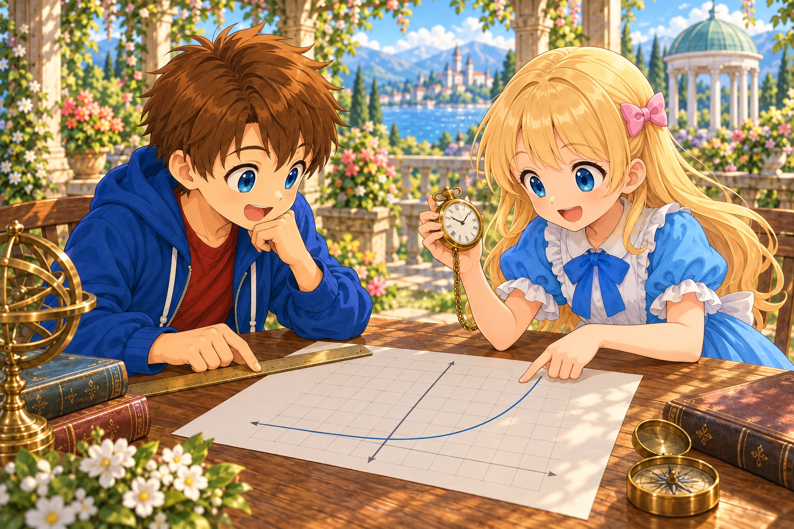

# Calculating the Schwarzschild Solution

## Introduction

In the previous document [“Predicting a Spherically Symmetric Spacetime”](./09-SphericallySymmetricSpacetime.md), we narrowed a static, spherically symmetric metric down to the form

$$
ds^2=-A(r)\,dw^2+B(r)\,dr^2
+r^2(d\theta^2+\sin^2\theta\,d\phi^2)
$$

Here, $w=ct$, and $r$ is the area radius chosen so that the area of a sphere is $4\pi r^2$.

The unknowns are the two functions $A(r),B(r)$. In this chapter, we will find these two functions so that, in a region with no matter or electromagnetic field and with a zero cosmological constant,

$$
R_{\mu\nu}=0
$$

is satisfied. As in the previous chapter, we consider the static region where $A,B>0$.

---

Alice: “There are now two unknown functions, but the equation still contains the Ricci tensor.”

Bob: “Let’s differentiate the metric to construct the connection, and calculate the Ricci tensor from the connection. Then we’ll have the differential equations that $A,B$ must satisfy.”

---

## Which Components of the Metric Change

Taking the coordinate order to be $(w,r,\theta,\phi)$, the metric and inverse metric are

$$
g_{\mu\nu}=
\begin{pmatrix}
-A&0&0&0\\
0&B&0&0\\
0&0&r^2&0\\
0&0&0&r^2\sin^2\theta
\end{pmatrix},
\qquad
g^{\mu\nu}=
\begin{pmatrix}
-1/A&0&0&0\\
0&1/B&0&0\\
0&0&1/r^2&0\\
0&0&0&1/(r^2\sin^2\theta)
\end{pmatrix}
$$

To keep the equations short, we have omitted the arguments of $A(r),B(r)$. Below, a prime denotes differentiation with respect to $r$.

Let us first list the derivatives of the nonzero metric components.

$$
\begin{aligned}
\partial_r g_{ww}&=-A',&
\partial_r g_{rr}&=B',\\
\partial_r g_{\theta\theta}&=2r,&
\partial_r g_{\phi\phi}&=2r\sin^2\theta,\\
\partial_\theta g_{\phi\phi}&=2r^2\sin\theta\cos\theta
\end{aligned}
$$

All others are zero. In particular, no component depends on $w$ or $\phi$. However, $g_{\phi\phi}$ depends on $\theta$ because of the nature of the angular coordinates.

## Finding the Christoffel Symbols

Equation [(5.2)](./05-ChristoffelFromMetric.md#eq-christoffel-from-metric) in Chapter 5 was

$$
\Gamma^\rho_{\mu\nu}
=\frac12g^{\rho\sigma}
\left(
\partial_\mu g_{\sigma\nu}
+\partial_\nu g_{\sigma\mu}
-\partial_\sigma g_{\mu\nu}
\right)
$$

This time, the inverse metric is diagonal, so when the upper index $\rho$ is fixed, only $\sigma=\rho$ remains in the sum.

### Components Involving Time and the Radial Direction

First, for $\Gamma^w_{wr}$,

$$
\begin{aligned}
\Gamma^w_{wr}
&=\frac12g^{ww}
\left(
\partial_w g_{wr}
+\partial_r g_{ww}
-\partial_w g_{wr}
\right)\\
&=\frac12\left(-\frac1A\right)(-A')
=\frac{A'}{2A}
\end{aligned}
$$

Next, for $\Gamma^r_{ww}$, the time derivatives are zero, so

$$
\begin{aligned}
\Gamma^r_{ww}
&=\frac12g^{rr}
\left(
\partial_w g_{rw}
+\partial_w g_{rw}
-\partial_r g_{ww}
\right)\\
&=\frac1{2B}A'
=\frac{A'}{2B}
\end{aligned}
$$

Notice that the two minus signs cancel. Finally,

$$
\Gamma^r_{rr}
=\frac1{2B}(B'+B'-B')
=\frac{B'}{2B}
$$

### Components Involving the Radial and Angular Directions

Using $g_{\theta\theta}=r^2$ gives

$$
\Gamma^r_{\theta\theta}
=-\frac1{2B}\partial_r(r^2)
=-\frac rB,
\qquad
\Gamma^\theta_{r\theta}
=\frac1{2r^2}\partial_r(r^2)
=\frac1r
$$

The $\phi$ direction follows the same procedure:

$$
\Gamma^r_{\phi\phi}
=-\frac1{2B}\partial_r(r^2\sin^2\theta)
=-\frac{r\sin^2\theta}{B},
$$

$$
\Gamma^\phi_{r\phi}
=\frac1{2r^2\sin^2\theta}
\partial_r(r^2\sin^2\theta)
=\frac1r
$$

From angular derivatives, we obtain

$$
\Gamma^\theta_{\phi\phi}
=-\frac1{2r^2}\partial_\theta(r^2\sin^2\theta)
=-\sin\theta\cos\theta,
$$

$$
\Gamma^\phi_{\theta\phi}
=\frac1{2r^2\sin^2\theta}
\partial_\theta(r^2\sin^2\theta)
=\frac{\cos\theta}{\sin\theta}
=\cot\theta
$$

The components obtained by exchanging the two lower indices have the same values. These are all the nonzero components.

### Abbreviations Used in the Calculation

Let us abbreviate the three quantities that appear repeatedly as

$$
\alpha=\frac{A'}{2A},\qquad
\beta=\frac{B'}{2B},\qquad
q=\frac{A'}{2B}
$$

These do not introduce new unknown functions; they are simply other names for $A,B$ and their derivatives.

Organizing the connection components gives the following table.

| Component | Value |
|---|---|
| $\Gamma^w_{wr}=\Gamma^w_{rw}$ | $\alpha$ |
| $\Gamma^r_{ww}$ | $q$ |
| $\Gamma^r_{rr}$ | $\beta$ |
| $\Gamma^r_{\theta\theta}$ | $-r/B$ |
| $\Gamma^r_{\phi\phi}$ | $-r\sin^2\theta/B$ |
| $\Gamma^\theta_{r\theta}=\Gamma^\theta_{\theta r}$ | $1/r$ |
| $\Gamma^\phi_{r\phi}=\Gamma^\phi_{\phi r}$ | $1/r$ |
| $\Gamma^\theta_{\phi\phi}$ | $-\sin\theta\cos\theta$ |
| $\Gamma^\phi_{\theta\phi}=\Gamma^\phi_{\phi\theta}$ | $\cot\theta$ |

## From the Connection to the Ricci Tensor

In [Equation (7.2)](./07-CurvatureFromParallelTransport.md#eq-riemann-curvature) of Chapter 7, contracting the first upper index with the third index gives the Ricci tensor.

Substituting ${R^\lambda}_{\mu\lambda\nu}$ into the definition of curvature gives

$$
\begin{aligned}
R_{\mu\nu}
={}&\partial_\lambda\Gamma^\lambda_{\nu\mu}
-\partial_\nu\Gamma^\lambda_{\lambda\mu}\\
&+\Gamma^\lambda_{\lambda\sigma}\Gamma^\sigma_{\nu\mu}
-\Gamma^\lambda_{\nu\sigma}\Gamma^\sigma_{\lambda\mu}
\end{aligned}
\qquad (10.1)
$$

The indices $\lambda,\sigma$ are each summed over the four values $w,r,\theta,\phi$.

To find each component from here, we will calculate the four terms on the right-hand side of this equation in order.

Let us first find the sums of connection components that appear in the third term and elsewhere.

$$
\begin{aligned}
\Gamma^\lambda_{\lambda r}
&=\Gamma^w_{wr}+\Gamma^r_{rr}
+\Gamma^\theta_{\theta r}+\Gamma^\phi_{\phi r}\\
&=\alpha+\beta+\frac2r
\end{aligned}
$$

We abbreviate this as $S=\alpha+\beta+2/r$. Also,

$$
\Gamma^\lambda_{\lambda\theta}=\cot\theta,\qquad
\Gamma^\lambda_{\lambda w}
=\Gamma^\lambda_{\lambda\phi}=0
$$

## Calculating the Time Component Rww

Set $\mu=\nu=w$ in Equation (10.1).

In the first term, $\Gamma^\lambda_{ww}$ is nonzero only for $\lambda=r$, so

$$
\partial_\lambda\Gamma^\lambda_{ww}
=\partial_r\Gamma^r_{ww}
=q'
$$

The second term is zero because it is a time derivative.

In the third term, only $\sigma=r$ remains, giving

$$
\Gamma^\lambda_{\lambda\sigma}\Gamma^\sigma_{ww}
=Sq
$$

In the fourth term, the two pairs $(\lambda,\sigma)=(w,r),(r,w)$ remain.

$$
\begin{aligned}
-\Gamma^\lambda_{w\sigma}\Gamma^\sigma_{\lambda w}
&=-\Gamma^w_{wr}\Gamma^r_{ww}
-\Gamma^r_{ww}\Gamma^w_{rw}\\
&=-2\alpha q
\end{aligned}
$$

Adding the four terms gives

$$
R_{ww}=q'+qS-2\alpha q
=q'+q\left(-\alpha+\beta+\frac2r\right)
$$

Now use $q=(A/B)\alpha$. From the product and quotient rules,

$$
\left(\frac AB\right)'
=\frac AB\left(\frac{A'}A-\frac{B'}B\right)
=\frac AB(2\alpha-2\beta)
$$

so

$$
q'=\frac AB\left[\alpha'+(2\alpha-2\beta)\alpha\right]
$$

Substituting this and collecting terms gives

$$
\boxed{
R_{ww}
=\frac AB
\left(\alpha'+\alpha^2-\alpha\beta+\frac{2\alpha}{r}\right)
}
\qquad (10.2)
$$

## Calculating the Radial Component Rrr

This time set $\mu=\nu=r$.

The first term is $\beta'$, the second is $-S'$, and the third is $\beta S$.

In the fourth term, $\Gamma^\lambda_{r\sigma}$ is nonzero for the four cases with $\lambda=\sigma$. Therefore,

$$
-\Gamma^\lambda_{r\sigma}\Gamma^\sigma_{\lambda r}
=-\left(\alpha^2+\beta^2+\frac1{r^2}+\frac1{r^2}\right)
$$

Thus,

$$
R_{rr}
=\beta'-S'+\beta S-\alpha^2-\beta^2-\frac2{r^2}
$$

Differentiating $S=\alpha+\beta+2/r$ gives

$$
S'=\alpha'+\beta'-\frac2{r^2}
$$

and therefore

$$
\begin{aligned}
R_{rr}
={}&\beta'-\alpha'-\beta'+\frac2{r^2}\\
&+\alpha\beta+\beta^2+\frac{2\beta}{r}
-\alpha^2-\beta^2-\frac2{r^2}
\end{aligned}
$$

The terms $\beta'$, $\beta^2$, and $2/r^2$ cancel pairwise, leaving

$$
\boxed{
R_{rr}
=-\alpha'-\alpha^2+\alpha\beta+\frac{2\beta}{r}
}
\qquad (10.3)
$$

## Finding AB from the Two Equations

---

Alice: “Both contain $\alpha'$ and $\alpha^2$. How do we solve this?”

Bob: “Multiply the time-component equation by $B/A$ and then add them. Those terms will cancel. First, let’s extract a relation between the two unknown functions.”

---

The region outside the star we are considering is a vacuum region with no matter or electromagnetic field, even though gravity is present. Since the cosmological constant is zero, the vacuum equation gives $R_{ww}=R_{rr}=0$. Therefore, from Equations (10.2) and (10.3),

$$
\begin{aligned}
0
&=\frac BA R_{ww}+R_{rr}\\
&=\frac{2(\alpha+\beta)}r
\end{aligned}
$$

Since we are considering a region with $r>0$,

$$
\boxed{\alpha+\beta=0\qquad\Longleftrightarrow\qquad\beta=-\alpha}
$$

Returning to the definitions gives

$$
\frac{A'}A+\frac{B'}B=0
$$

The left-hand side is the derivative of $\ln(AB)$. Hence,

$$
\frac{d}{dr}\ln(AB)=0
\quad\Longrightarrow\quad
AB=K
$$

where $K$ is a constant independent of $r$.

Using the conditions chosen in the previous chapter, $A\to1$ and $B\to1$ far away, gives $K=1$, so

$$
\boxed{B=\frac1A}
$$

For the first time, the two unknown functions have been reduced to one.

## Calculating the Angular Component Rθθ

To find the remaining function, set $\mu=\nu=\theta$ in Equation (10.1).

In the first term, only $\lambda=r$ remains, so

$$
\partial_\lambda\Gamma^\lambda_{\theta\theta}
=\frac{d}{dr}\left(-\frac rB\right)
=-\frac1B+\frac{rB'}{B^2}
$$

In the second term, only $\lambda=\phi$ remains, giving

$$
-\partial_\theta\Gamma^\lambda_{\lambda\theta}
=-\frac{d}{d\theta}\cot\theta
=\frac1{\sin^2\theta}
$$

and the third term is $-rS/B$.

In the fourth term, $(\lambda,\sigma)=(r,\theta),(\theta,r),(\phi,\phi)$ remain.

$$
\begin{aligned}
-\Gamma^\lambda_{\theta\sigma}\Gamma^\sigma_{\lambda\theta}
&=-\left[
\left(-\frac rB\right)\frac1r
+\frac1r\left(-\frac rB\right)
+\cot^2\theta
\right]\\
&=\frac2B-\cot^2\theta
\end{aligned}
$$

Adding the four terms and using $1/\sin^2\theta-\cot^2\theta=1$ gives

$$
R_{\theta\theta}
=1+\frac1B+\frac{rB'}{B^2}-\frac{rS}{B}
$$

Substitute $B'/B=2\beta$ and $S=\alpha+\beta+2/r$ to obtain

$$
\begin{aligned}
R_{\theta\theta}
&=1+\frac1B+\frac{2r\beta}{B}
-\frac rB\left(\alpha+\beta+\frac2r\right)\\
&=1-\frac1B+\frac rB(\beta-\alpha)
\end{aligned}
$$

Therefore,

$$
\boxed{
R_{\theta\theta}
=1-\frac1B+\frac rB(\beta-\alpha)
}
\qquad (10.4)
$$

## Solving the Remaining Differential Equation

We already know that $B=1/A$ and $\beta=-\alpha$, so Equation (10.4) becomes

$$
R_{\theta\theta}
=1-A-2rA\alpha
$$

Since $\alpha=A'/(2A)$, we have $2A\alpha=A'$, and the vacuum condition is

$$
1-A-rA'=0
$$

In other words,

$$
A+rA'=1
$$

The left-hand side is precisely the derivative of the product $rA$.

$$
\frac{d}{dr}(rA)=1
$$

Integrating both sides with respect to $r$ gives

$$
rA=r+C
$$

where $C$ is an integration constant. Writing this constant as $C=-\ell$ gives

$$
A=1-\frac{\ell}{r},\qquad
B=\left(1-\frac{\ell}{r}\right)^{-1}
\qquad (10.5)
$$

At this stage, neither the value nor the sign of $\ell$ has been determined. Since $A$ is dimensionless, $\ell$ has units of length.

## Checking the Equations We Have Not Used

The condition obtained by adding two equations does not by itself guarantee that each one is zero. Let us substitute the functions we found back into the original equations and check.

Substituting $\beta=-\alpha$ and $B=1/A$ into Equation (10.2) gives

$$
R_{ww}=A^2\left(\alpha'+2\alpha^2+\frac{2\alpha}{r}\right)
$$

Here,

$$
\alpha'
=\frac{A''}{2A}-\frac{(A')^2}{2A^2},
\qquad
2\alpha^2=\frac{(A')^2}{2A^2}
$$

so

$$
R_{ww}
=\frac A2\left(A''+\frac{2A'}r\right)
$$

For $A=1-\ell/r$,

$$
A'=\frac{\ell}{r^2},\qquad
A''=-\frac{2\ell}{r^3}
$$

and therefore $R_{ww}=0$, as expected. Moreover, $\frac BA R_{ww}+R_{rr}=0$ shows that $R_{rr}=0$ also holds.

### The Other Angular Component

$R_{\phi\phi}$ can likewise be checked by calculating the four terms of Equation (10.1) in order.

In the first term, the $r$ and $\theta$ derivatives remain:

$$
\begin{aligned}
\partial_\lambda\Gamma^\lambda_{\phi\phi}
&=\partial_r\left(-\frac{r\sin^2\theta}{B}\right)
+\partial_\theta(-\sin\theta\cos\theta)\\
&=\sin^2\theta\left(-\frac1B+\frac{rB'}{B^2}\right)
+\sin^2\theta-\cos^2\theta
\end{aligned}
$$

The second term is zero because it is a $\phi$ derivative. The third term is

$$
-\frac{r\sin^2\theta}{B}S-\cos^2\theta
$$

In the fourth term, the four pairs $(r,\phi),(\phi,r),(\theta,\phi),(\phi,\theta)$ remain, giving

$$
-\left[
2\left(-\frac{r\sin^2\theta}{B}\right)\frac1r
+2(-\sin\theta\cos\theta)\cot\theta
\right]
=\frac{2\sin^2\theta}{B}+2\cos^2\theta
$$

Adding these, the terms containing $\cos^2\theta$ cancel, and we obtain

$$
\begin{aligned}
R_{\phi\phi}
&=\sin^2\theta
\left(1+\frac1B+\frac{rB'}{B^2}-\frac{rS}{B}\right)\\
&=\sin^2\theta\,R_{\theta\theta}
=0
\end{aligned}
$$

### About the Off-Diagonal Components

The Ricci tensor inherits the spherical symmetry of this metric. As in the discussion of rotations used for the metric in Chapter 9, the cross components between time or the radial direction and the angular directions, as well as the off-diagonal components between angular directions, are zero.

The remaining $R_{wr}$ can be shown to vanish by reversing only the time coordinate, $w'=-w$, while leaving the spatial coordinates unchanged. The present metric is independent of time and has no $dw\,dr$ term, so it is unchanged by this reversal.

On the other hand, the two indices of $R_{wr}$ represent the time direction $w$ and radial direction $r$. Using the transformation law for a tensor with two lower indices, and noting that $r'=r$, gives

$$
\begin{aligned}
R_{w'r'}
&=\frac{\partial w}{\partial w'}
\frac{\partial r}{\partial r'}R_{wr}\\
&=(-1)(1)R_{wr}\\
&=-R_{wr}
\end{aligned}
$$

The sign of this component reverses because one minus sign is introduced for the time-direction index.

Since a component constructed from the same geometry must have the same value after this time-independent reversal, we have

$$
R_{wr}=-R_{wr}
\quad\Longrightarrow\quad
R_{wr}=0
$$

This confirms that all components of the vacuum equation are satisfied.

## Relating the Integration Constant to the Star’s Mass

---

Alice: “We solved the equations, but $\ell$ is still there.”

Bob: “The vacuum equations alone do not specify the mass of the star at the center. Let’s compare with Newtonian gravity far away and determine the meaning of this constant.”

---

In [Equation (8.1)](./08-EinsteinEquation.md#eq-newtonian-time-metric) of Chapter 8, we found the time-direction metric in a weak gravitational field. There, we used $x^0=w=ct$, so $g_{00}$ is the same component as $g_{ww}$ used here. Thus,

$$
g_{ww}=g_{00}\simeq-\left(1+\frac{2\Phi}{c^2}\right)
$$

where $\Phi$ is the gravitational potential per unit mass.

Outside a spherically symmetric body, choosing $\Phi\to0$ far away gives

$$
\Phi=-\frac{GM}{r}
$$

and therefore

$$
g_{ww}\simeq-\left(1-\frac{2GM}{c^2r}\right)
$$

On the other hand, for the solution we have just found,

$$
g_{ww}=-A=-\left(1-\frac{\ell}{r}\right)
$$

Comparing the coefficients of $1/r$ far away determines

$$
\ell=\frac{2GM}{c^2}
$$

Here $M$ is the mass of the body as read from its gravitational field far away.

We used the Newtonian approximation to determine the meaning of the integration constant. Equation (10.5) itself was obtained by solving the vacuum equation without approximation.

## The Schwarzschild Solution

The length

$$
r_{\mathrm s}=\frac{2GM}{c^2}
$$

is called the Schwarzschild radius. This is a length determined by the mass $M$, and is different from the radius to the surface of the star.

For example, the radius of the Sun’s surface is [about 700,000 km](https://science.nasa.gov/sun/facts/), while the Schwarzschild radius calculated from the Sun’s mass is [about 3 km](https://www.einstein-online.info/en/explandict/schwarzschild-radius/). For an ordinary star like the Sun, $r_{\mathrm s}$ is much smaller than the radius of the star’s surface.

However, this does not mean that there is an event horizon at $r=3\,\mathrm{km}$ inside the Sun. What we found this time is the vacuum solution outside the star, and it cannot be extended unchanged into the interior where matter is present.

Substituting $\ell=r_{\mathrm s}$ into Equation (10.5) gives

$$
A(r)=1-\frac{r_{\mathrm s}}r,\qquad
B(r)=\left(1-\frac{r_{\mathrm s}}r\right)^{-1}
$$

Substituting these into the original line element gives

$$
\boxed{
\begin{aligned}
ds^2
&=-A(r)\,dw^2+B(r)\,dr^2
+r^2(d\theta^2+\sin^2\theta\,d\phi^2)\\
&=-\left(1-\frac{r_{\mathrm s}}r\right)dw^2
+\frac{dr^2}{1-r_{\mathrm s}/r}\\
&\quad+r^2(d\theta^2+\sin^2\theta\,d\phi^2)
\end{aligned}
}
$$

This is the Schwarzschild solution.

The solution found in this chapter is used in the vacuum region outside the star’s surface. For an ordinary star, the surface radius is larger than $r_{\mathrm s}$, so $r>r_{\mathrm s}$ also holds outside it. There is matter inside the star, so the same vacuum equation cannot be used there.

If $M=0$, then $r_{\mathrm s}=0$, and we return to the line element of flat spacetime,

$$
ds^2=-dw^2+dr^2+r^2d\Omega^2
$$

Even when $M\ne0$, the metric approaches this form sufficiently far away.

## Connecting the Solution to Clocks and Rulers

Let us substitute $A,B$ into the formulas for a stationary clock and a ruler in the radial direction found in Chapter 9.

$$
\begin{aligned}
d\tau
&=\sqrt{A(r)}\,dw
=\sqrt{1-\frac{r_{\mathrm s}}r}\,dw,\\
d\ell
&=\sqrt{B(r)}\,|dr|
=\frac{|dr|}{\sqrt{1-r_{\mathrm s}/r}}
\end{aligned}
$$

By solving the metric, we have determined concretely the coefficients that connect coordinate differences with measurements. However, the first equation applies to a clock stationary at that location. For a moving clock, displacement in spatial directions also contributes to the line element.

---

Alice: “The $A,B$ that were initially just names have become the way clocks and rulers are read.”

Bob: “Next, while distinguishing the numbers in these coordinates from the times and lengths actually measured, let’s read what the equations are telling us.”

---

At $r=r_{\mathrm s}$, zeroes and divergences appear in the coefficients of this coordinate representation. However, that alone does not mean that spacetime itself is broken. We will examine the range in which stationary observers and these coordinates can be used again in a later chapter.

In the next document [“Coordinates as a Canvas and Local Measurements”](./11-CoordinatesAndLocalMeasurements.md), we will reconsider coordinates as markers attached to events in spacetime and organize their correspondence with measurements made by local clocks and rulers.
