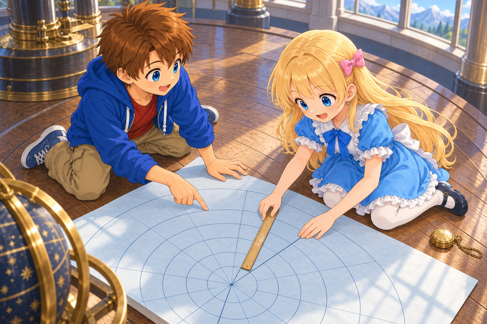

# Coordinates as a Canvas and Local Measurements

## Introduction

In the previous document [“Calculating the Schwarzschild Solution”](./10-SchwarzschildSolution.md), for the region outside a spherically symmetric body, we obtained

$$
ds^2
=-\left(1-\frac{r_{\mathrm s}}r\right)dw^2
+\frac{dr^2}{1-r_{\mathrm s}/r}
+r^2(d\theta^2+\sin^2\theta\,d\phi^2)
$$

where $r_{\mathrm s}=2GM/c^2$.

In this chapter, we consider the static vacuum region $r>r_{\mathrm s}$ outside the star. To make the equations shorter, let us write

$$
f(r)=1-\frac{r_{\mathrm s}}r
$$

In this region, $f(r)>0$.

What can we learn using the metric we found? First, let us begin by distinguishing the coordinates assigned to events from the values shown by clocks and rulers.

---

Alice: “We found the equation, but how can we determine the readings of clocks and rulers from coordinate differences such as $dw$ and $dr$?”

Bob: “Let us check that one step at a time. The metric we just found is the factor that connects the coordinate markings to measured values.”

---

## Drawing Events on the Canvas

For example, let us consider one event: “A light flashed at a certain place.” We assign that event four numbers,

$$
(w,r,\theta,\phi)
$$

$r$ specifies which spherical surface, while $\theta,\phi$ specify which position on that surface. $w$ is the coordinate in the time direction of the event.

If we consider only one angular direction, we can draw events as points on a canvas whose horizontal axis is $r$ and whose vertical axis is $w$. The motion of an object becomes a line connecting the points at each time.

However, measuring the interval between two points on paper does not directly give the distance or elapsed time in the universe. We need to connect the coordinate markings placed on the paper to the readings of an observer’s clock or ruler.

The metric has this role.

Our coordinates already use two conventions.

- We chose $r$ so that the area of a spherical surface is $4\pi r^2$.
- We chose the markings of the time-direction coordinate $w$ to match the rate of clocks at rest far away.

For this reason, $r,w$ are convenient markings. However, when converting coordinate differences $dr,dw$ near the star into actual clock or ruler readings, we must use the metric at that location.

## What Does $ds^2$ Represent?

Using the metric, we write

$$
ds^2
=-f(r)dw^2+\frac{dr^2}{f(r)}
+r^2d\theta^2+r^2\sin^2\theta\,d\phi^2
\qquad (11.1)
$$

This $ds^2$ is the spacetime interval between two nearby events.

A clock or ruler does not directly display “ $ds^2$.” Depending on what is being measured, it corresponds to measured values as follows.

For a small interval along the clock’s own path, use the proper time $d\tau$ recorded by that clock:

$$
ds^2=-d\tau^2
$$

As in Chapter 3, $\tau$ already has $c$ multiplied into it and has the same units of distance as $w$.

On the other hand, for two nearby points that are simultaneous for a particular observer, use the small length $d\ell$ measured by that observer:

$$
ds^2=d\ell^2
$$

In the latter case, the condition “simultaneous for that observer” is important. For two events that also have a time difference, $ds^2$ cannot simply be read as the square of a distance.

Even if we reassign coordinates to the same two events, the value of $ds^2$ does not change if the components of the metric are transformed along with them. By combining coordinates and the metric, we continue to represent the same interval.

## A Clock at Rest at That Location

First, suppose Alice has her own clock and is at rest at a certain place near the star, supported by a platform. “At rest” means that $r,\theta,\phi$ do not change. Here, let us write the proper time recorded by Alice’s clock as $\tau$.

Along Alice and her clock’s path,

$$
dr=d\theta=d\phi=0
$$

so all the spatial terms in equation (11.1) become zero. Therefore,

$$
ds^2=-f(r)dw^2.
$$

Let us verify why we can write $ds^2=-d\tau^2$ even in a gravitational field. Suppose Bob also has his own clock and, right next to Alice, begins free fall from a state at rest relative to Alice. Ignoring the sizes and separation of the two people, suppose they have the same position and velocity at the instant of departure. In the local inertial coordinates adapted to Bob, the metric can be made to have the form of special relativity at the starting point. If we write the time-direction coordinate as $W$ and the spatial directions as $X,Y,Z$,

$$
ds^2=-dW^2+dX^2+dY^2+dZ^2
$$

$W$, like $w$, has units of distance, and at the starting point its markings are matched to the increment of the proper time on Bob’s clock.

*Alice supported by a platform and Bob in free fall. The clocks they each carry record their respective proper times. The illustration shows them after the fall has begun.*

Bob is in free fall, while Alice remains supported by the platform. In Bob’s local inertial frame, Alice’s body and the clock in her hand begin to accelerate together. Even so, can we use $ds^2=-d\tau^2$ for Alice’s clock at the instant of departure?

Let the instant when Bob begins free fall be $W=0$, and take that location as the origin of the spatial coordinates. Let $X$ be the direction in which Alice’s body begins to move as seen by Bob. Alice’s position over a very short interval can be written as

$$
X(W)=\frac12\left.\frac{d^2X}{dW^2}\right|_{W=0}W^2
+\text{terms of third order and higher}
$$

There is no term first order in $W$ because Alice and Bob initially have zero relative velocity. The difference in position caused by acceleration first appears at second order. On the other hand, the change in the time-direction coordinate is $W$ itself, and is first order. Therefore, over a sufficiently short interval, the displacement in the spatial direction is smaller than the change in the time direction.

Expressed using derivatives at the starting point,

$$
\left.\frac{dX}{dW}\right|_{W=0}
=\left.\frac{dY}{dW}\right|_{W=0}
=\left.\frac{dZ}{dW}\right|_{W=0}=0
$$

In other words, for an infinitesimal displacement along Alice’s path at the instant of departure, $dX=dY=dZ=0$. At that instant, Alice is at rest relative to Bob’s local inertial frame, so just as for a clock at rest in special relativity, the increment of proper time on Alice’s clock is $d\tau=dW$. Therefore,

$$
ds^2=-d\tau^2
$$

is obtained. Since $ds^2$ has the same value after changing coordinates, it equals the $-f(r)dw^2$ calculated in the original coordinates.

After a finite amount of time, Alice and Bob move apart. Even so, because their first-order changes agree at the instant of departure, the differential relation $ds^2=-d\tau^2$ holds exactly at that point. At each point along Alice’s path, we can choose again a local inertial frame whose motion matches Alice at that instant and use the same reasoning. Alice herself does not need to be in free fall.

Thus, connecting the two expressions for the same interval,

$$
-d\tau^2=-f(r)dw^2.
$$

Reversing the signs on both sides and taking the future-directed coordinate increment $dw>0$ gives

$$
\boxed{d\tau=\sqrt{f(r)}\,dw}
\qquad (11.2)
$$

The left side is the increment of proper time on Alice’s clock. The $dw$ on the right side is the difference in coordinate time assigned to the same two events. Since both $\tau$ and $w$ are quantities obtained by multiplying ordinary time by $c$, $\sqrt{f(r)}$ directly represents the ratio of the rates of the clocks.

For example, if $f(r)=0.81$ at a place where the clock is at rest, then $d\tau=0.9\,dw$. In seconds, while coordinate time advances by $1$ second, the clock records $0.9$ seconds. Dividing both by the same constant $c$ does not change the ratio. This does not mean that the clock is malfunctioning. The observer carrying that clock conducts experiments using the time recorded by their own clock.

This value represents the rate compared with coordinate time $w$. What is seen when looking at a distant clock through light will be considered in the next chapter, including how light propagates.

---

Alice: “So this does not mean that my clock feels slow to me?”

Bob: “That’s right. The clock in your hand records proper time. We are comparing its reading with the increment of a common coordinate time.”

---

## A Ruler Placed at That Location

*Alice and Bob comparing the coordinate diagram with a ruler. Can a length measured on paper be used directly as a measurement in spacetime?*

Next, let us consider the same stationary observer measuring the distance between two nearby points.

This metric has no cross terms between time and space. Therefore, for a stationary observer, the locally simultaneous spatial direction corresponds to the direction in which we set $dw=0$.

If we keep the angles fixed and measure a small distance in the radial direction,

$$
dw=d\theta=d\phi=0
$$

then from equation (11.1),

$$
ds^2=\frac{dr^2}{f(r)}.
$$

For this stationary observer, let $d\ell$ be the small length between two simultaneous points measured with that observer’s ruler. Since $ds^2=d\ell^2$,

$$
\boxed{d\ell=\frac{|dr|}{\sqrt{f(r)}}}
\qquad (11.3)
$$

follows.

For example, at a place where $f(r)=0.81$, over a very short interval,

$$
d\ell=\frac{|dr|}{0.9}
$$

The difference in coordinate markings and the length measured with a ruler do not agree.

The angular directions can be found by the same procedure. If we move only in the $\theta$ direction,

$$
dw=dr=d\phi=0
\quad\Longrightarrow\quad
d\ell_\theta=r|d\theta|.
$$

If we move only in the $\phi$ direction,

$$
dw=dr=d\theta=0
\quad\Longrightarrow\quad
d\ell_\phi=r\sin\theta\,|d\phi|.
$$

Here we use the usual angular coordinates with $0<\theta<\pi$.

In the radial direction, $1/\sqrt{f(r)}$, and in the angular directions, $r$ and $r\sin\theta$, are the factors that convert coordinate differences into lengths.

## Matching Clocks and Rulers Gives the Form of Special Relativity

Let us bring together the correspondences so far. Matching the clock of an observer stationary at a point and rulers in three mutually perpendicular directions, write the local infinitesimal components as

$$
\begin{aligned}
dW&=\sqrt{f(r)}\,dw,\\
dX&=\frac{dr}{\sqrt{f(r)}},\\
dY&=r\,d\theta,\\
dZ&=r\sin\theta\,d\phi
\end{aligned}
\qquad (11.4)
$$

$dW$ is the local time-direction component and, like $dw$ and $d\tau$, has units of distance. $dX,dY,dZ$ also have units of distance. The $X$ direction is radial, while the $Y,Z$ directions lie along the spherical surface. Here we do not put absolute values on the spatial components because we also represent their orientations.

Squaring these gives

$$
dW^2=f(r)dw^2,\qquad
dX^2=\frac{dr^2}{f(r)},
$$

$$
dY^2=r^2d\theta^2,\qquad
dZ^2=r^2\sin^2\theta\,d\phi^2.
$$

Replacing each term in equation (11.1),

$$
\boxed{ds^2=-dW^2+dX^2+dY^2+dZ^2}
$$

is obtained. This is the form of special relativity at that point, matched to the observer’s clock and rulers.

For the observer’s own clock, $dX=dY=dZ=0$, so

$$
ds^2=-dW^2=-d\tau^2
$$

and $dW=d\tau$.

Also, if events are simultaneous for that observer, then $dW=0$, so

$$
ds^2=dX^2+dY^2+dZ^2=d\ell^2
$$

Thus we can see that clock measurements and ruler measurements are read from the same line element.

### Matching at One Point and Matching Over a Wide Region

The $dW,dX,dY,dZ$ here are infinitesimal components matched to clocks and rulers at that point. We must not regard these relations as the definition of one set of coordinates $W,X,Y,Z$ that can be used throughout spacetime.

For example, as $r$ changes, the conversion factor in $dW=\sqrt{f(r)}\,dw$ also changes. A time scale matched to a clock at one location will not necessarily match a clock at another location in the same way.

At each point, we can choose local inertial coordinates adapted to the observer at that instant. However, we cannot connect the choices at every point and cover a wide region of curved spacetime with one inertial coordinate system.

Also, an observer who remains at the same $r$ near the star differs from an observer in free fall. Continuing to remain stationary requires support from a platform, rocket, or something similar. Even if we use a local inertial frame that matches the observer’s motion for just one moment, this does not mean that the observer continues afterward in inertial motion.

---

Alice: “If we can make it have the form of special relativity at that point, doesn’t gravity disappear?”

Bob: “Being able to match clocks and rulers at one point is different from representing a wide region with one inertial frame. The information about curvature remains in how things connect when we move from place to place.”

---

## The Distance Between Two Distant Points Is Found by Adding Small Lengths

Equation (11.3) was an equation for a small interval. So how should we find the distance from $r_1$ to $r_2$ along the same angular direction?

Here, we consider the distance measured by arranging rulers in the radial direction along a cross-section where the coordinate $w$ is constant, with the rulers stationary. Let $r_2>r_1>r_{\mathrm s}$, and suppose the entire interval lies outside the star.

Dividing the interval into small pieces, for each small piece,

$$
\Delta\ell_k\simeq
\frac{\Delta r_k}{\sqrt{f(r_k)}}
$$

where $r_k$ is the position chosen within that small interval.

The total length is found by adding these:

$$
L\simeq\sum_k\frac{\Delta r_k}{\sqrt{f(r_k)}}.
$$

As the interval is divided into infinitely small pieces,

$$
\boxed{
L=\int_{r_1}^{r_2}\frac{dr}{\sqrt{1-r_{\mathrm s}/r}}
}
$$

is obtained.

In general, this cannot be found simply by multiplying the coordinate difference $r_2-r_1$ by one factor. The factor changes within the interval, so we add the small lengths at each location.

Note that this is the distance obtained by arranging rulers along the simultaneous cross-section specified here. If one person measures the distance by sending light back and forth, it must be calculated separately according to that measurement method.

## With a Moving Clock, the Spatial Term Also Remains

So far, we considered a clock at rest with respect to the coordinates. Now let us consider Bob, who is in free fall in the radial direction, and the clock Bob carries.

Let the proper time recorded by this clock be $\tau_{\mathrm{Bob}}$, and write its infinitesimal increment as $d\tau_{\mathrm{Bob}}$. Although $\theta,\phi$ do not change, $dr$ is not zero for Bob while he is falling, so

$$
-d\tau_{\mathrm{Bob}}^2
=-f(r)dw^2+\frac{dr^2}{f(r)}.
$$

Reversing the signs on both sides,

$$
d\tau_{\mathrm{Bob}}^2
=f(r)dw^2-\frac{dr^2}{f(r)}.
$$

Taking the future-directed coordinate increment $dw>0$ and taking the square root,

$$
d\tau_{\mathrm{Bob}}
=dw\sqrt{
f(r)-\frac1{f(r)}
\left(\frac{dr}{dw}\right)^2
}.
\qquad (11.5)
$$

For a stationary clock, $dr=0$, so we return to equation (11.2). For a moving clock, however, its motion also affects proper time. Although we used Bob’s free fall as an example, the equation also holds for radial motion other than free fall, because the equation of motion for free fall was not used in the derivation.

### Rewriting It Using the Speed Measured There

Suppose stationary observer Alice is at the place Bob passes through, carrying a clock and rulers. The local components matched to Alice are, from equation (11.4),

$$
dX=\frac{dr}{\sqrt{f(r)}},\qquad
dW=\sqrt{f(r)}\,dw
$$

Converting $dW$ into elapsed time in seconds gives $dW/c$. Let the radial speed of Bob measured by Alice using the clock and rulers at that place be $v_{\mathrm{Bob}}$. Then

$$
v_{\mathrm{Bob}}
=\frac{dX}{dW/c}
=c\frac{dX}{dW}
=\frac{c}{f(r)}\frac{dr}{dw}.
\qquad (11.6)
$$

Since both $w$ and $r$ have units of distance, $dr/dw$ is a dimensionless ratio. When converting to the speed measured by a clock and ruler, $c$ appears as in the equation above.

Therefore,

$$
\frac{dr}{dw}=\frac{f(r)}c v_{\mathrm{Bob}}.
$$

Substituting this into equation (11.5),

$$
\begin{aligned}
d\tau_{\mathrm{Bob}}
&=dw\sqrt{
f(r)-\frac{f(r)^2v_{\mathrm{Bob}}^2}{c^2f(r)}
}\\
&=\sqrt{f(r)}\,dw
\sqrt{1-\frac{v_{\mathrm{Bob}}^2}{c^2}}\\
&=dW\sqrt{1-\frac{v_{\mathrm{Bob}}^2}{c^2}}.
\end{aligned}
$$

When expressed using the observer’s clock and rulers, this becomes the equation for the proper time of a moving clock that we learned in special relativity.

Here too, it is the metric that connects the ratio of coordinate changes $dr/dw$ with Bob’s speed $v_{\mathrm{Bob}}$ measured by Alice at that location.

## What Is Expressed by Coordinates, and What Is Being Measured?

Let us organize the correspondences used in this chapter.

| What is being compared | Expression in coordinates | Expression matched to a stationary observer |
|---|---|---|
| Small elapsed time on a clock | $dw$ | $dW=\sqrt{f(r)}\,dw$. For the observer’s own clock, $dW=d\tau$ |
| Small displacement in the radial direction | $dr$ | $dX=dr/\sqrt{f(r)}$. The length is $\lvert dX\rvert$ |
| Small displacement along the spherical surface | $d\theta,d\phi$ | $dY=r\,d\theta,\ dZ=r\sin\theta\,d\phi$ |
| Speed in the radial direction | $dr/dw$ | $v_{\mathrm{Bob}}=c(dr/dw)/f(r)$ |

Coordinates are used to organize and draw events. The metric connects differences in those coordinates to the readings of the specified observer’s clock and rulers.

In the next document [“Gravitational Redshift and the Propagation of Light”](./12-GravitationalRedshiftAndLight.md), let us investigate light using this correspondence. We will consider how the frequency of light reaching a distant place changes, and how the propagation of light on the canvas is connected to the speed of light measured at that place.
