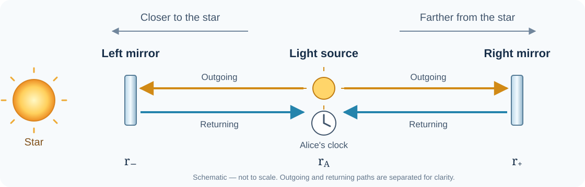
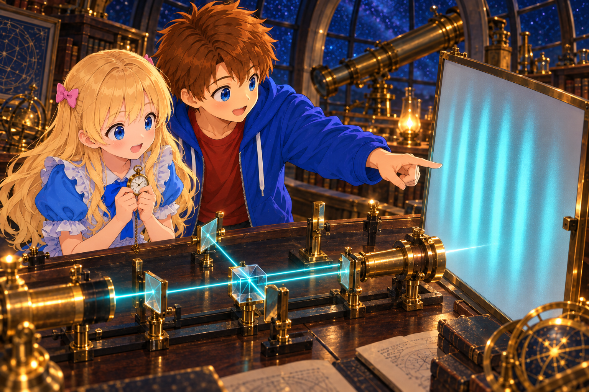

# Measuring Changes in the Metric with Light

## Introduction

In the previous document, [“Free Fall and the Event Horizon”](./13-FreeFallAndEventHorizon.md), we considered the clock carried by the falling Bob separately from light that reaches far away.

Here, let us turn our attention to measurement using light itself.

If we know the metric, we can calculate how clocks run and the paths light follows. Then, conversely, if we send out light and measure the time until it returns, perhaps we can learn something about the metric.

First, we will send light on a round trip along one path. Next, we will compare two paths to mirrors placed on the left and right of the light source. Finally, we will reach the point of reading that difference as a shift in the light wave.

Let us see how the metric is connected to a light signal that actually returns to us.

In this chapter as well, we use $w=ct$, and write proper time $\tau$ in units of distance. The elapsed time shown by a clock in seconds is $\Delta\tau/c$.

---

Alice: “We can measure distance with light without lining up rulers all the way, can’t we?”

Bob: “Yes. But let’s decide which clock measures the time. If the light we send returns to the same place, we can measure it with just one clock.”

---

## Measuring a Round Trip of Light with One Clock

*The sending and receiving are measured with a single clock beside Alice. The outward and return paths are drawn with different colors and positions to make them easy to distinguish.*

Consider an experiment in which Alice sends light, it reflects from a distant mirror, and then returns to Alice.

Let the proper time recorded by Alice’s clock between sending and receiving be $\Delta\tau_{\mathrm A}$.

In flat spacetime, if Alice and the mirror are at rest relative to each other and the distance between them is $L$, the round trip takes $2L/c$ seconds. In proper time measured in units of distance,

$$
\Delta\tau_{\mathrm A}=2L
$$

There is no need to synchronize a distant clock with Alice’s clock. We only need to compare the reading of the clock beside her when the light is sent with its reading when the light returns.

In a gravitational field, let us find this round-trip time from the metric.

## Sending Light on a Round Trip Outside a Star

Consider the same static vacuum region as in Chapter 12.

$$
ds^2=-f(r)dw^2+\frac{dr^2}{f(r)}+r^2d\Omega^2,
\qquad
f(r)=1-\frac{r_{\mathrm s}}r.
$$

Alice remains at rest at $r=r_{\mathrm A}$, and a mirror is held at rest outside her at $r=r_{\mathrm B}$. Both are outside $r_{\mathrm s}$, and we assume that the path of the light does not pass through the star’s matter.

For radial light, $d\Omega=0$ and $ds^2=0$, so

$$
0=-f\,dw^2+\frac{dr^2}{f}.
$$

Rearranging both sides gives

$$
dw=\frac{|dr|}{f(r)}.
\tag{14.1}
$$

We included the absolute value so that $dw$ is positive for light moving into the future on both the outward and return journeys.

The increase in coordinate time on the outward journey is

$$
\Delta w_{\mathrm{out}}
=\int_{r_{\mathrm A}}^{r_{\mathrm B}}\frac{dr}{f(r)}.
$$

The metric does not depend on time, and the position of the mirror does not change, so the return journey takes the same coordinate time. Therefore,

$$
\Delta w_{\mathrm{round}}
=2\int_{r_{\mathrm A}}^{r_{\mathrm B}}\frac{dr}{f(r)}.
$$

So far, this is a difference in time on the coordinate canvas. To convert it to Alice’s clock, we use

$$
d\tau_{\mathrm A}=\sqrt{f(r_{\mathrm A})}\,dw
$$

along the path of the stationary Alice. Thus,

$$
\boxed{
\Delta\tau_{\mathrm A}
=2\sqrt{f(r_{\mathrm A})}
\int_{r_{\mathrm A}}^{r_{\mathrm B}}\frac{dr}{f(r)}
}
\tag{14.2}
$$

The metric is involved both in the path of the light and in the clock Alice uses to measure the time.

## Sending Light to the Left and Right of the Source

This time, place mirrors on the left and right of the light source where Alice is. Let the left side be the direction toward the star, and the right side the direction away from it.

Let the radius of the left mirror be $r_-$ and the radius of the right mirror be $r_+$, with $r_-<r_{\mathrm A}<r_+$. The light source and the mirrors are each held at rest at their positions, and we assume that the entire path of the light lies in the vacuum region outside the star.

Consider an apparatus that splits the light and sends it to the left and right, then brings the light reflected by each mirror back together at the light source. The small optical components needed to do this are omitted from the diagram.

First, far enough away that the effect of gravity can be ignored, use rulers to make the lengths from the light source to the left and right mirrors both equal to $L$. The round-trip time on each side is then $2L/c$ seconds.

Suppose we slowly move this apparatus close to the star, then hold it at rest while keeping the lengths on the left and right equal to $L$. Here, length means the length measured by lining up rulers at rest at their respective locations from the light source to each mirror. We do not consider light while the apparatus is moving; we compare the round trips after it has been brought to rest.

In this arrangement, where the path on the left is closer to the star, will the round-trip times differ even though the two paths have the same length?

The right mirror is outside the light source, so we can replace $r_{\mathrm B}$ in equation (14.2) with $r_+$. For the round trip to the left mirror, we integrate from the smaller radius $r_-$ to $r_{\mathrm A}$. Because the light passes through the same interval on the outward and return journeys, this is also twice the one-way value.

The two proper times recorded by Alice’s clock are

$$
\begin{aligned}
\Delta\tau_{\mathrm L}
&=2\sqrt{f(r_{\mathrm A})}
\int_{r_-}^{r_{\mathrm A}}\frac{dr}{f(r)},\\
\Delta\tau_{\mathrm R}
&=2\sqrt{f(r_{\mathrm A})}
\int_{r_{\mathrm A}}^{r_+}\frac{dr}{f(r)}.
\end{aligned}
\tag{14.3}
$$

Both the left and right results have been converted to the same clock carried by Alice, so the factor in front is common to them. The difference appears in the integrals along their respective paths.

---

Alice: “So we don’t need to put a clock by the left mirror and read it.”

Bob: “Right. We bring both beams back here and compare them using the same clock.”

---

## The Difference Between the Two Round-Trip Times

Let the round-trip times in seconds be $T_{\mathrm L}=\Delta\tau_{\mathrm L}/c$ and $T_{\mathrm R}=\Delta\tau_{\mathrm R}/c$. Taking the difference between the two parts of equation (14.3) gives

$$
\boxed{
\delta T=T_{\mathrm L}-T_{\mathrm R}
=\frac{2\sqrt{f(r_{\mathrm A})}}c
\left[
\int_{r_-}^{r_{\mathrm A}}\frac{dr}{f(r)}
-\int_{r_{\mathrm A}}^{r_+}\frac{dr}{f(r)}
\right]
}
\tag{14.4}
$$

This is the difference between the two round-trip times read from the clock at the light source.

This time, the lengths on the left and right measured with rulers are both kept equal to $L$. Let us use this condition to determine which round trip takes longer.

### The Coordinate Widths Differ Even When the Lengths Are the Same

The equation for a small length found in Chapter 11 is

$$
d\ell=\frac{|dr|}{\sqrt{f(r)}}.
$$

Therefore, the positions of the mirrors on the left and right satisfy

$$
\int_{r_-}^{r_{\mathrm A}}\frac{dr}{\sqrt{f(r)}}=L,
\qquad
\int_{r_{\mathrm A}}^{r_+}\frac{dr}{\sqrt{f(r)}}=L.
$$

Rewriting this in terms of a small coordinate width gives

$$
|dr|=\sqrt{f(r)}\,d\ell.
$$

The closer we are to the star, the smaller $f(r)$ becomes, so the coordinate width corresponding to the same ruler length $d\ell$ also becomes smaller.

Along the left path, $f(r)<f(r_{\mathrm A})$, while along the right path, $f(r)>f(r_{\mathrm A})$. They are equal at the position of the light source. Adding up $|dr|$ along each path gives

$$
r_{\mathrm A}-r_-
<\sqrt{f(r_{\mathrm A})}\,L
<r_+-r_{\mathrm A}.
$$

Thus, even though the lengths measured with rulers are $L$ on both sides, the coordinate width on the left is smaller.

### The Light on the Left Returns Later Even Though the Coordinate Width Is Smaller

Does the smaller coordinate width on the left eliminate the difference between the round-trip times?

Substituting $|dr|=\sqrt{f(r)}\,d\ell$ into equation (14.1), which describes the motion of light, gives

$$
dw=\frac{|dr|}{f(r)}
=\frac{d\ell}{\sqrt{f(r)}}.
$$

Converting this further to Alice’s clock at the light source, the increase on her clock while light crosses that small interval is

$$
d\tau_{\mathrm A}
=\sqrt{f(r_{\mathrm A})}\,dw
=\sqrt{\frac{f(r_{\mathrm A})}{f(r)}}\,d\ell.
$$

Notice here that $d\ell$ and $d\tau_{\mathrm A}$ correspond to different locations.

$d\ell$ is the small length measured by a ruler at rest at the position $r$ through which the light passes. In contrast, $d\tau_{\mathrm A}$ is the increase on Alice’s clock at the position of the light source, $r_{\mathrm A}$.

In other words, this equation tells us “how much time passes on Alice’s clock while light travels across the small interval $d\ell$ at position $r$.” It is not an equation that measures both length and time only at Alice’s location.

Alice is not directly measuring a distant small interval beside her. However, if we add the result over the entire round-trip path, it becomes the proper time actually recorded by Alice’s clock from sending to receiving. Proper time in this chapter is measured in units of distance, so the elapsed time in seconds is this value divided by $c$.

Along the left path, $f(r)<f(r_{\mathrm A})$, so the square-root factor is greater than 1. Along the right path, it is instead less than 1.

For both paths, adding $d\ell$ over the one-way journey gives the length $L$. Therefore, for the round trips,

$$
\Delta\tau_{\mathrm L}>2L,
\qquad
\Delta\tau_{\mathrm R}<2L.
$$

Converting these to times in seconds gives

$$
\boxed{T_{\mathrm L}>\frac{2L}{c}>T_{\mathrm R}}
$$

Thus, $\delta T=T_{\mathrm L}-T_{\mathrm R}$ in equation (14.4) is positive.

Even after accounting for the smaller coordinate width on the left, light on the left takes longer to return, although the two paths have the same length when measured with rulers.

## The Locally Measured Speed of Light Does Not Change

The fact that the light on the left returns later does not mean that the locally measured speed of light becomes less than $c$.

As we also confirmed in Chapter 12, the small length and proper time measured by an observer at rest at that location are

$$
d\ell=\frac{|dr|}{\sqrt{f(r)}},
\qquad
d\tau=\sqrt{f(r)}\,dw.
$$

For light, substituting $dw=|dr|/f(r)$ gives

$$
\frac{d\ell}{d\tau/c}
=\frac{|dr|/\sqrt{f(r)}}{\sqrt{f(r)}\,dw/c}
=c\frac{|dr|}{f(r)\,dw}
=c.
$$

The local speed of light is always $c$. By contrast, the round-trip times considered here were measured with a single clock at the light source for light that passed through distant locations. The metric along the entire path is involved in those times.

## Reading the Time Difference as a Shift in the Light Wave

*Alice holds a clock while Bob points to the interference fringes. This illustrates reading a small difference in round-trip times as brightness and darkness when the light is brought together.*

So far, we have sent two beams of light at the same time and compared when they return.

In an interferometer, continuous light is sent to the left and right, and the returning light is brought together. Assume that its wavelength is short enough for the light to be treated as rays and that the two beams have the same polarization when they are combined. The difference in their round-trip times appears as a shift in the oscillations of the light.

Let the frequency of Alice’s light source be $\nu_0$, and let $T$ be the reading in seconds on Alice’s clock. Write the phase of the oscillation of the light source as

$$
\varphi_{\mathrm{source}}(T)=2\pi\nu_0T.
$$

When the phase increases by $2\pi$, the light completes one oscillation.

The metric and mirror positions in this case do not change with time, so the round-trip times $T_{\mathrm L},T_{\mathrm R}$ are constant. The beams that return at time $T$ were sent out at $T-T_{\mathrm L}$ and $T-T_{\mathrm R}$, respectively.

Leaving out the phase from reflection that is common to both paths,

$$
\varphi_{\mathrm L}(T)=2\pi\nu_0(T-T_{\mathrm L}),
\qquad
\varphi_{\mathrm R}(T)=2\pi\nu_0(T-T_{\mathrm R}).
$$

Defining the difference as $\Delta\varphi=\varphi_{\mathrm R}-\varphi_{\mathrm L}$ gives

$$
\begin{aligned}
\Delta\varphi
&=2\pi\nu_0\left[(T-T_{\mathrm R})-(T-T_{\mathrm L})\right]\\
&=2\pi\nu_0(T_{\mathrm L}-T_{\mathrm R}).
\end{aligned}
$$

Therefore, the time difference $\delta T$ in equation (14.4) appears as the phase difference

$$
\boxed{\Delta\varphi=2\pi\nu_0\delta T}
\tag{14.5}
$$

$\nu_0\delta T$ is the difference in the number of oscillations, and multiplying it by $2\pi$ gives the phase difference.

When the crests of the two waves overlap, they strengthen each other; when a crest overlaps a trough, they weaken each other. When the phase difference changes, the brightness of the combined light or the position of the interference fringes changes. The apparatus also has its own phase difference, but by comparing changes in the same apparatus, we can read changes in the difference between the round-trip times.

---

Alice: “Instead of trying to read a tiny time difference directly from a clock display, we compare the waves of light.”

Bob: “Yes. We can read it as the number of oscillations by which the light has shifted.”

---

## What It Means to Measure Changes in the Metric with Light

Let us lay out the chain of calculations we have followed.

| What we examine | What we use in the calculation |
|---|---|
| The coordinate relation followed by light | The metric and $ds^2=0$ |
| The proper time until the light returns | An integral along the path and conversion to the clock at the light source |
| The difference between two round-trip times | $T_{\mathrm L}-T_{\mathrm R}$ measured with the same clock |
| The phase difference between the returning beams | $2\pi\nu_0\delta T$ in equation (14.5) |

In a static gravitational field like the one considered here, the phase difference is also constant after the apparatus has been fixed in place. We investigate the difference by comparing it with arrangements under different conditions or with a reference obtained when the effect of gravity can be ignored.

Now consider further what happens **when the metric changes with time**. If the difference between the round-trip times of the light changes, the phase difference between the returning beams also changes. If the change is slow enough to be ignored during one round trip, we can follow it in the same way using the round-trip time at each moment. For rapid changes, we must also include changes that occur while the light is traveling.

This gives us a glimpse ahead toward **gravitational waves**. When a gravitational wave passes, the time light takes to make a round trip to a distant mirror can change. Reading that change through interference is the basic idea behind detecting gravitational waves. An actual calculation treats both the metric of the wave and the way the mirrors move.

What a measuring device shows directly is a light signal. By calculating that signal from the metric and comparing it with observations, we can investigate spacetime. However, a single phase difference does not reveal every component of the metric.

---

