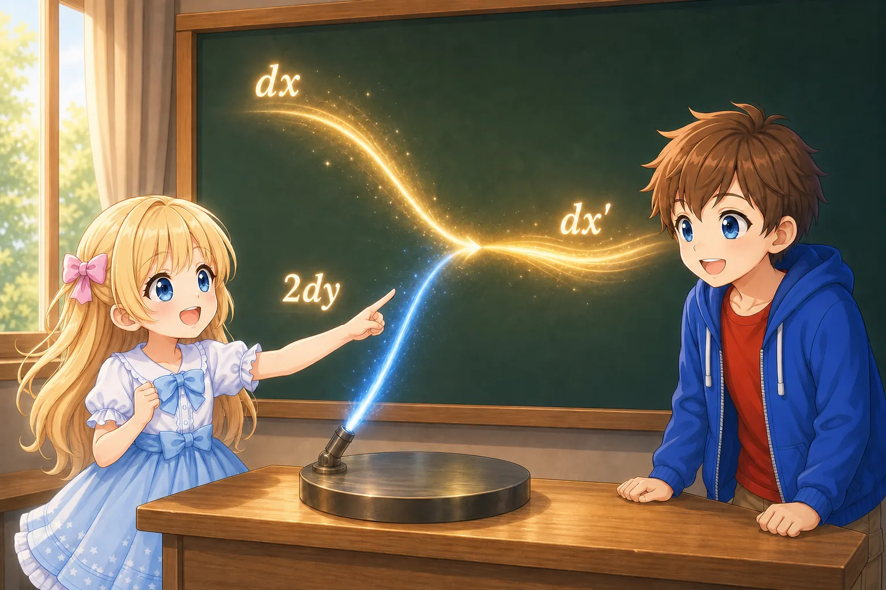

# 座標を変えても壊れない式

## はじめに

前の文書「座標をまとめて書いてみる」では、時間と空間の座標を、

$$
x^\mu
$$

とまとめて書いた。また、平坦な時空の線素を、

$$
ds^2 =
\eta_{\mu\nu}dx^\mu dx^\nu
$$

と書いた。

これは、

$$
ds^2 =
-dw^2+dx^2+dy^2+dz^2
$$

を添字記法で短くしたものだった。

座標を変えると、同じ二つのイベントに割り当てられる座標の差 $dx^\mu$ は変わる。それにもかかわらず、線素 $ds^2$ は同じ値でなければならない。

それなら、 $dx^\mu$ が変わる分を打ち消すように、計量にも決まった変わり方があるはずである。

この文書では、

- 座標を変えると $dx^\mu$ はどう変わるか
- 上付き添字と下付き添字は何が違うのか
- 計量はどう変わるのか
- テンソルとは何となく何なのか

を順番に考える。

厳密なテンソルの定義を作ることが目的ではない。

> ある物理現象を表す方程式があるとき、座標系を変えて成分の数字が変わっても、その方程式をまったく同じ形で書けるように、それぞれの量には決まった変わり方がある

という感覚をつかむことが目標である。

## 座標を変えるとはどういうことか

平面上に一点 P があるとしよう。

ある座標系では、P の座標が、

$$
(x,y)=(3,2)
$$

だったとする。

ここで座標軸の目盛りを変えれば、同じ P に別の座標を割り当てられる。

例えば、新しい座標を、

$$
x'=2x
$$

$$
y'=y
$$

と決める。

すると P の新しい座標は、

$$
(x',y')=(6,2)
$$

になる。

P が別の場所へ動いたわけではない。 $x$ 方向の座標値を2倍にする、新しい目盛りを使っただけである。

---

Alice「同じ場所なのに、 $x=3$ とも $x'=6$ とも書けるんだね。」

Bob「うん。場所が変わったのではなく、場所に付ける数字の規則を変えたんだ。」

---

*点 P は動いていない。同じ場所に、二つの座標が異なる数字を割り当てている*

座標変換によって変わるのは、物理的な対象そのものではなく、その対象を表す座標成分である。

## 座標変換を式で書く

一般には、新しい座標 $x'^\mu$ を古い座標 $x^\nu$ の関数として、

$$
x'^\mu =
x'^\mu(x^0,x^1,x^2,x^3)
$$

と書ける。

短く、

$$
x'^\mu=x'^\mu(x)
$$

と書くこともある。

これは、四つの新しい座標それぞれが、古い座標を使って決められるという意味である。

例えば二次元なら、

$$
x'=x'(x,y)
$$

$$
y'=y'(x,y)
$$

である。

座標変換は、必ずしも一つの座標を単純に2倍するだけではない。新しい $x'$ が古い $x$ と $y$ の両方に依存することもある。

## 小さな座標差はどう変わるか

新しい座標が、

$$
x'^\mu=x'^\mu(x)
$$

で与えられているとする。

「全微分」という言葉を初めて見ると、難しい計算が始まるように感じるかもしれない。しかし、ここでの考え方は単純である。

まず二次元で、新しい座標が、

$$
x'=x+2y
$$

と決められている場合を考えよう。

$x$ だけが $dx$ だけ変化すれば、 $x'$ は、

$$
dx
$$

だけ変化する。

一方、 $y$ だけが $dy$ だけ変化すれば、 $x'$ は、

$$
2dy
$$

だけ変化する。

$x$ と $y$ が同時に変化したなら、新しい座標 $x'$ の変化は、二つの方向から来た変化を足して、

$$
dx'=dx+2dy
$$

となる。

---

Alice「 $x$ が変わった影響と、 $y$ が変わった影響を、最後に足せばいいんだね。」

Bob「そう。それぞれの古い座標が、新しい座標をどれだけ動かすかを調べて、全部足すんだ。」

---

$x$ 方向から来る $dx$ と、 $y$ 方向から来る $2dy$ を足すと、新しい座標の変化 $dx'$ になる

もう少し一般に、

$$
x'=x'(x,y)
$$

という関係なら、 $x$ 方向の小さな変化が $x'$ へ与える影響は、

$$
\frac{\partial x'}{\partial x}dx
$$

である。

ここに現れた、

$$
\frac{\partial x'}{\partial x}
$$

は、 $y$ をひとまず動かさず、 $x$ だけを少し変えたとき、 $x'$ がどれくらい変わるかを表す倍率である。

同じように、 $y$ 方向から来る影響は、

$$
\frac{\partial x'}{\partial y}dy
$$

である。

二つの方向から来た変化を足せば、

$$
dx' =
\frac{\partial x'}{\partial x}dx
+
\frac{\partial x'}{\partial y}dy
$$

となる。

これが全微分の考え方である。

> 新しい座標の小さな変化を、古い各座標方向から来る小さな変化へ分け、それらを全部足す。

時間と三次元空間をまとめた場合も、やっていることは同じである。

古い座標が $dx^\nu$ だけ変化したとき、新しい座標の変化は、

$$
dx'^\mu =
\frac{\partial x'^\mu}{\partial x^\nu}dx^\nu
$$

と書ける。

右辺では $\nu$ が上と下に一回ずつ現れているので、 $\nu=0,1,2,3$ について和を取る。

展開すれば、

$$
\begin{aligned}
dx'^\mu
={}&
\frac{\partial x'^\mu}{\partial x^0}dx^0
+
\frac{\partial x'^\mu}{\partial x^1}dx^1 \\
&+
\frac{\partial x'^\mu}{\partial x^2}dx^2
+
\frac{\partial x'^\mu}{\partial x^3}dx^3
\end{aligned}
$$

となる。

偏微分、

$$
\frac{\partial x'^\mu}{\partial x^\nu}
$$

は、古い座標 $x^\nu$ を少し変えたとき、新しい座標 $x'^\mu$ がどれだけ変わるかを表している。

これらを並べた行列をヤコビ行列という。

名前よりも、

> 古い座標の小さな変化を、新しい座標の小さな変化へ移す倍率の表

と考えればよい。

## 座標を2倍する例

時間と空間を一つずつ持つ二次元の時空を考える。

古い座標を $(w,x)$、新しい座標を $(w',x')$ とする。

座標変換を、

$$
w'=w
$$

$$
x'=2x
$$

と決める。

時間座標は変えず、空間座標の数字だけを2倍する変換である。

小さな座標差は、

$$
dw'=dw
$$

$$
dx'=2dx
$$

となる。

ヤコビ行列で書けば、

$$
\begin{pmatrix}
dw' \\
dx'
\end{pmatrix} =
\begin{pmatrix}
1 & 0 \\
0 & 2
\end{pmatrix}
\begin{pmatrix}
dw \\
dx
\end{pmatrix}
$$

である。

新しい座標では、同じ空間的な隔たりが2倍の数字で表される。

しかし、物理的な距離まで2倍になったわけではない。

## 逆向きの変換

先ほどの座標変換、

$$
w'=w,\qquad x'=2x
$$

は、逆に解けば、

$$
w=w'
$$

$$
x=\frac{x'}{2}
$$

となる。

したがって、

$$
dw=dw'
$$

$$
dx=\frac{1}{2}dx'
$$

である。

一般の座標変換でも、逆変換が存在する範囲では、

$$
dx^\mu =
\frac{\partial x^\mu}{\partial x'^\rho}dx'^\rho
$$

と書ける。

ここで、古い座標から新しい座標への変換は、

$$
dx'^\rho =
\frac{\partial x'^\rho}{\partial x^\sigma}dx^\sigma
$$

である。

この式を、先ほどの逆変換、

$$
dx^\mu =
\frac{\partial x^\mu}{\partial x'^\rho}dx'^\rho
$$

へ代入すると、

$$
\begin{aligned}
dx^\mu
&=
\frac{\partial x^\mu}{\partial x'^\rho}dx'^\rho \\
&=
\frac{\partial x^\mu}{\partial x'^\rho}
\frac{\partial x'^\rho}{\partial x^\sigma}dx^\sigma
\end{aligned}
$$

となる。

古い座標の小さな変化 $dx^\sigma$ を新しい座標へ移し、そこから再び古い座標へ戻した結果が $dx^\mu$ である。

二つの座標変換を続けても、最初の小さな変化が別のものになるわけではない。第0成分は第0成分へ、第1成分は第1成分へ、そのまま戻らなければならない。

したがって、二つのヤコビ行列を組み合わせた部分は、

$$
\frac{\partial x^\mu}{\partial x'^\rho}
\frac{\partial x'^\rho}{\partial x^\sigma} =
{\delta^\mu}_\sigma
$$

と書ける。

${\delta^\mu}_\sigma$ はクロネッカーのデルタと呼ばれ、

$$
{\delta^\mu}_\sigma =
\begin{cases}
1 & \mu=\sigma \\
0 & \mu\neq\sigma
\end{cases}
$$

である。

行列でいえば単位行列、

$$
\begin{pmatrix}
1&0&0&0\\
0&1&0&0\\
0&0&1&0\\
0&0&0&1
\end{pmatrix}
$$

に相当する。

つまり、古い座標から新しい座標へ変換し、逆変換で戻れば、何も変換しなかったのと同じになる。

## 上付き添字を持つ成分

$dx^\mu$ は、

$$
dx'^\mu =
\frac{\partial x'^\mu}{\partial x^\nu}dx^\nu
$$

と変換された。

一般に、上付き添字を一つ持つベクトル $V^\mu$ も、同じ形で、

$$
V'^\mu =
\frac{\partial x'^\mu}{\partial x^\nu}V^\nu
$$

と変換される。

この変換規則に従う成分を反変成分と呼ぶ。

「反変」という名前を無理に暗記する必要はない。今は、

> 上付き添字を持つベクトル成分は、座標差 $dx^\mu$ と同じく、古い座標から新しい座標へ移す倍率 $\partial x'^\mu/\partial x^\nu$ を使って変換される

と読めればよい。

例えば、

$$
x'=2x
$$

なら、

$$
V'^x=2V^x
$$

となる。

新しい座標の数字が古い座標の2倍になるため、その座標で表すベクトル成分も2倍になる。

## 下付き添字を持つ量

それでは、下付き添字を持つ $A_\mu$ は何だろうか。

まず、上付きベクトル $V^\mu$ と組み合わせて、

$$
A_\mu V^\mu
$$

という量を考える。

添字について和を取るので、

$$
A_\mu V^\mu =
A_0V^0+A_1V^1+A_2V^2+A_3V^3
$$

である。

この組み合わせが座標に依存しない一つの数を表すとする。

上付き成分 $V^\mu$ が座標変換で2倍になるなら、積を同じ値に保つため、対応する下付き成分は半分にならなければならない。

例えば一次元で、

$$
V'^x=2V^x
$$

なら、

$$
A'_x=\frac{1}{2}A_x
$$

と変われば、

$$
A'_xV'^x =
\left(\frac{1}{2}A_x\right)(2V^x) =
A_xV^x
$$

となる。

上付き成分と下付き成分は、互いの変化を打ち消す向きに変換される。

一般には、

$$
A'_\mu =
\frac{\partial x^\nu}{\partial x'^\mu}A_\nu
$$

と変換する。

上付き成分では、

$$
\frac{\partial x'^\mu}{\partial x^\nu}
$$

を使ったが、下付き成分では逆向きの、

$$
\frac{\partial x^\nu}{\partial x'^\mu}
$$

を使う。

この変換規則に従うものを共変ベクトル、または双対ベクトルという。

---

Alice「上付きが2倍になったら、下付きは半分になるんだね。」

Bob「うん。二つを掛けた結果を変えないために、逆向きに変わるんだ。」

---

上付き成分が2倍、下付き成分が半分になると、組み合わせた $A_xV^x$ は変わらない

## 下付き添字の具体例

下付き添字を持つ量の例として、あるスカラー $f$ の変化を考えよう。

スカラーとは、座標を変えても同じ値を表す量である。

例えば、空間の各点に温度 $f$ が定められているとする。座標の付け方を変えても、その場所の実際の温度は変わらない。

温度の小さな変化は、

$$
df =
\frac{\partial f}{\partial x^\mu}dx^\mu
$$

と書ける。

ここで、

$$
\partial_\mu f
\equiv
\frac{\partial f}{\partial x^\mu}
$$

と置けば、

$$
df =
\partial_\mu f\,dx^\mu
$$

となる。

$df$ は、同じ二点の温度差を表すので、座標を変えても同じ値である。

一方、 $dx^\mu$ は上付き成分として変換される。

したがって、その変化を打ち消すため、

$$
\partial_\mu f
$$

は下付き成分として変換される。

実際、連鎖律から、

$$
\frac{\partial f}{\partial x'^\mu} =
\frac{\partial x^\nu}{\partial x'^\mu}
\frac{\partial f}{\partial x^\nu}
$$

となる。

これは、

$$
A'_\mu =
\frac{\partial x^\nu}{\partial x'^\mu}A_\nu
$$

と同じ形である。

下付き添字は、上付き添字を単に下へ移して書いただけではない。座標変換に対して逆向きに振る舞う成分である。

## 縮約すると添字が消える

上付きベクトル $V^\mu$ と下付きベクトル $A_\mu$ を組み合わせると、

$$
A_\mu V^\mu
$$

となる。

同じ添字 $\mu$ が上と下に一回ずつ現れているので、 $\mu$ について和を取る。その結果、式には添字が残らない。

このように、上付き添字と下付き添字を一組にして和を取り、添字を減らす操作を縮約という。

座標変換後の値を計算すると、

$$
A'_\mu V'^\mu =
\left(
\frac{\partial x^\nu}{\partial x'^\mu}A_\nu
\right)
\left(
\frac{\partial x'^\mu}{\partial x^\rho}V^\rho
\right)
$$

となる。

二つのヤコビ行列をまとめると、

$$
A'_\mu V'^\mu =
\frac{\partial x^\nu}{\partial x'^\mu}
\frac{\partial x'^\mu}{\partial x^\rho}
A_\nu V^\rho
$$

である。

座標変換と逆変換は互いに打ち消し合うので、

$$
\frac{\partial x^\nu}{\partial x'^\mu}
\frac{\partial x'^\mu}{\partial x^\rho} =
{\delta^\nu}_\rho
$$

となる。したがって、

$$
A'_\mu V'^\mu =
{\delta^\nu}_\rho A_\nu V^\rho =
A_\nu V^\nu
$$

である。

つまり、

$$
\boxed{
A'_\mu V'^\mu =
A_\mu V^\mu
}
$$

となり、縮約して得られた値は座標変換の前後で変わらない。

## 計量には下付き添字が二つある

線素は、

$$
ds^2 =
g_{\mu\nu}dx^\mu dx^\nu
$$

と書かれる。

$dx^\mu$ と $dx^\nu$ は、どちらも上付き成分として変換される。

したがって、二つの変化を打ち消すため、計量 $g_{\mu\nu}$ には下付き添字が二つある。

ここで、計量にはもう一つ大切な性質がある。

二次元の線素を成分ごとに展開すると、

$$
ds^2 =
g_{11}(dx^1)^2
+g_{12}dx^1dx^2
+g_{21}dx^2dx^1
+g_{22}(dx^2)^2
$$

となる。

普通の数の掛け算では、

$$
dx^1dx^2 =
dx^2dx^1
$$

なので、中央の二つの項は、

$$
g_{12}dx^1dx^2
+g_{21}dx^2dx^1 =
(g_{12}+g_{21})dx^1dx^2
$$

とまとめられる。

線素から見えるのは $g_{12}$ と $g_{21}$ の和であり、二つの違いではない。

そこで、一般相対論で使う計量は、

$$
g_{12}=g_{21}
$$

として扱う。一般の添字で書けば、

$$
\boxed{
g_{\mu\nu}=g_{\nu\mu}
}
$$

である。添字を入れ替えても同じ成分になるので、これを計量の対称性という。

この性質により、計量の成分を行列として並べると、左上から右下へ引いた対角線を挟んで同じ数字が並ぶ。

座標変換によって、

$$
dx^\mu =
\frac{\partial x^\mu}{\partial x'^\rho}dx'^\rho
$$

$$
dx^\nu =
\frac{\partial x^\nu}{\partial x'^\sigma}dx'^\sigma
$$

と書ける。

これらを線素へ代入すると、

$$
\begin{aligned}
ds^2
&=
g_{\mu\nu}dx^\mu dx^\nu \\
&=
g_{\mu\nu}
\frac{\partial x^\mu}{\partial x'^\rho}dx'^\rho
\frac{\partial x^\nu}{\partial x'^\sigma}dx'^\sigma
\end{aligned}
$$

となる。

座標変換に関係する部分をまとめれば、

$$
ds^2 =
\left(
g_{\mu\nu}
\frac{\partial x^\mu}{\partial x'^\rho}
\frac{\partial x^\nu}{\partial x'^\sigma}
\right)
dx'^\rho dx'^\sigma
$$

である。

新しい座標でも線素を、

$$
ds^2 =
g'_{\rho\sigma}dx'^\rho dx'^\sigma
$$

と書きたい。

二つの式を比べると、新しい座標での計量成分は、

$$
\boxed{
g'_{\rho\sigma} =
g_{\mu\nu}
\frac{\partial x^\mu}{\partial x'^\rho}
\frac{\partial x^\nu}{\partial x'^\sigma}
}
$$

と決めればよい。

計量には下付き添字が二つあるので、逆向きのヤコビ行列が二つ掛かる。

これは、座標差 $dx^\mu$ が変わる分を計量が打ち消し、線素 $ds^2$ を同じ値に保つための変換規則である。

## 座標を2倍したときの計量

先ほどの二次元時空へ戻ろう。

古い座標では、

$$
ds^2 =
-dw^2+dx^2
$$

だったとする。

ここで、

$$
w'=w
$$

$$
x'=2x
$$

という座標変換を行った。

逆変換は、

$$
w=w'
$$

$$
x=\frac{x'}{2}
$$

なので、

$$
dw=dw'
$$

$$
dx=\frac{1}{2}dx'
$$

である。

これを古い線素へ代入すると、

$$
\begin{aligned}
ds^2
&=
-dw^2+dx^2 \\
&=
-dw'^2+\left(\frac{1}{2}dx'\right)^2 \\
&=
-dw'^2+\frac{1}{4}dx'^2
\end{aligned}
$$

となる。

したがって、新しい座標での計量は、

$$
g'_{\mu\nu} =
\begin{pmatrix}
-1&0\\
0&1/4
\end{pmatrix}
$$

である。

古い座標では、

$$
g_{\mu\nu} =
\begin{pmatrix}
-1&0\\
0&1
\end{pmatrix}
$$

だった。

座標変換によって、空間方向の計量成分が、

$$
1
\longrightarrow
\frac{1}{4}
$$

へ変わった。

一方、座標差は、

$$
dx
\longrightarrow
dx'=2dx
$$

と2倍になった。

新しい座標で空間部分を計算すると、

$$
\frac{1}{4}dx'^2 =
\frac{1}{4}(2dx)^2 =
dx^2
$$

となる。

座標差が2倍になった分を、計量成分が $1/4$ になることで打ち消している。

その結果、

$$
-dw'^2+\frac{1}{4}dx'^2 =
-dw^2+dx^2
$$

となり、線素は同じ値を保つ。

---

Alice「座標の数字を2倍にしたら、計量の数字は $1/4$ になるんだ。」

Bob「線素では座標差を二乗するからね。 $(2dx)^2$ を打ち消すには、計量が $1/4$ になればいい。」

Alice「計量が変わったからといって、時空そのものが変わったわけではないんだね。」

Bob「そう。今回は同じ平坦な時空を、違う目盛りで書いただけだよ。」

---

## 計量成分と計量そのもの

座標変換の前後で、

$$
g_{\mu\nu} =
\begin{pmatrix}
-1&0\\
0&1
\end{pmatrix}
$$

から、

$$
g'_{\mu\nu} =
\begin{pmatrix}
-1&0\\
0&1/4
\end{pmatrix}
$$

へ変わった。

二つの行列は見た目が違う。

しかし、別の時空を表しているわけではない。同じ計量を、異なる座標で成分表示した結果である。

これは、同じ矢印を異なる座標軸で測ると、ベクトル成分が変わることに似ている。

- 計量は座標を選ぶ前から考えられる幾何学的な対象である
- $g_{\mu\nu}$ は、その計量をある座標で表した成分である
- 座標を変えると成分表示は変わる
- 成分が変わっても、線素が表す幾何学的な間隔は変わらない

したがって、

> 計量が変わった

という言い方には注意が必要である。

例えば、天体が近づき、その重力によって物理的な時空の状態そのものが変化した、という意味の場合もあれば、同じ計量の成分が座標変換によって変わっただけの場合もある。

この二つは区別しなければならない。

## 計量で添字を下げる

上付きベクトル $V^\nu$ に計量を組み合わせて、

$$
V_\mu =
g_{\mu\nu}V^\nu
$$

という量を作る。

右辺では $\nu$ について和を取り、 $\mu$ が一つ残る。その結果、下付き添字を一つ持つ $V_\mu$ が得られる。

この操作を添字を下げるという。

平坦な二次元時空で、

$$
g_{\mu\nu} =
\begin{pmatrix}
-1&0\\
0&1
\end{pmatrix}
$$

なら、

$$
V_0 =
g_{00}V^0+g_{01}V^1 =
-V^0
$$

$$
V_1 =
g_{10}V^0+g_{11}V^1 =
V^1
$$

となる。

つまり、

$$
V^\mu =
\begin{pmatrix}
V^0\\
V^1
\end{pmatrix}
$$

に対して、

$$
V_\mu =
\begin{pmatrix}
-V^0\\
V^1
\end{pmatrix}
$$

である。

時間方向の符号だけが変わっている。

添字を上下へ動かすことは、単に記号の位置を移動することではない。計量を使って別の種類の成分へ変換する操作である。

添字を上げる逆の操作には、逆計量 $g^{\mu\nu}$ を使う。

逆計量については、計量そのものを詳しく扱う次の文書で考える。

## テンソルという見方

ここまで、上付き成分、下付き成分、計量が、座標変換によってそれぞれ決まった仕方で変わることを見てきた。

変換の式だけを見ると、別々の規則をいくつも覚えるように感じるかもしれない。しかし、すべての規則は一つの目的へ向かっている。

例えば線素は、古い座標では、

$$
ds^2 =
g_{\mu\nu}dx^\mu dx^\nu
$$

と書ける。

座標を変えた後も、

$$
ds^2 =
g'_{\rho\sigma}dx'^\rho dx'^\sigma
$$

と、まったく同じ形で書ける。

座標成分の数字は変わる。それでも、各成分が互いの変化を打ち消すため、同じ線素を同じ形の方程式で表せる。

この文書では、これをテンソルの中心的な考え方とする。

> テンソルとは、座標変換によって座標の数字が変わっても、ある物理的・幾何学的関係を表す方程式を元と同じ形で書けるように、決まった規則で成分が変わる量である。

---

Alice「上付きと下付きで変わり方が違うのは、別々の規則を覚えさせるためじゃなかったんだね。」

Bob「うん。組み合わせて方程式を作ったとき、座標を変えても同じ形で読めるように、それぞれが変わっていたんだ。」

Alice「座標ごとに違う物理法則を作り直さなくていいんだ！」

---

*成分の数字や座標の向きが変わっても、物理的な関係を表す方程式の組み立て方は同じまま残る*

スカラー、反変ベクトル、共変ベクトル、計量は、添字の数や位置が異なるテンソルである。分類名を暗記することより、添字の位置から変換の仕方と組み合わせ方を読めることが大切である。

また、テンソルの成分を行列として並べることはできるが、数字を並べただけでテンソルになるわけではない。座標変換に対して決まった規則で成分が変わることが、テンソルであるための重要な点である。

## まとめ

この文書で登場した量と変換規則を並べると、次のようになる。

- スカラー $f$

  $$f'=f$$

- 反変ベクトル $V^\mu$

  $$V'^\mu = \frac{\partial x'^\mu}{\partial x^\nu}V^\nu$$

- 共変ベクトル $A_\mu$

  $$A'_\mu = \frac{\partial x^\nu}{\partial x'^\mu}A_\nu$$

- 計量 $g_{\mu\nu}$

  $$g'_{\rho\sigma} = g_{\mu\nu} \frac{\partial x^\mu}{\partial x'^\rho} \frac{\partial x^\nu}{\partial x'^\sigma}$$

変換規則の形を暗記することより、次の関係をつかむことが大切である。

- 上付き成分と下付き成分は、組み合わせたときに互いの座標変換を打ち消す。
- 計量は二つの座標差の変化を打ち消し、線素 $ds^2$ を座標によらない値にする。
- テンソルを使うと、物理的・幾何学的関係を表す方程式を、異なる座標系でも同じ形で書ける。

## 次の疑問

座標を2倍した例では、同じ平坦な時空を表しているのに、空間方向の計量成分は $1$ から $1/4$ へ変わった。

それなら、計量成分の数字から、時計の進みや物差しの長さをどのように読み取ればよいのだろうか。

また、計量成分が場所によって変わるとき、それは座標の選び方による見かけなのか、それとも時空が本当に曲がっているのだろうか。

次の文書では、計量を「時空の物差し」として読み、直交座標と極座標を使ってこの疑問を考える。
