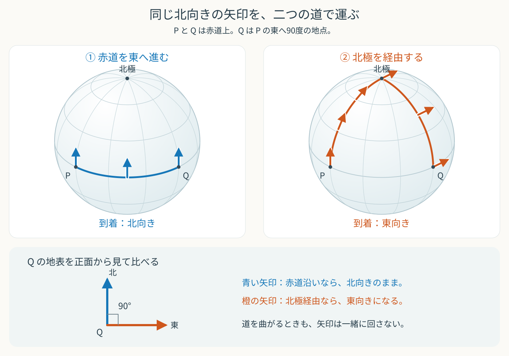

# 一周すると分かる本物の曲がり

## はじめに

前の文書「ベクトルを運び、真っ直ぐ進む」では、ベクトルを経路に沿って平行移動する条件を、

$$
\frac{DV^\rho}{D\lambda}
=
\frac{dV^\rho}{d\lambda}
+
\Gamma^\rho_{\mu\nu}
\frac{dx^\mu}{d\lambda}
V^\nu
=0
\tag{1}
$$

と書いた。

また、接ベクトルを自分自身に沿って平行移動する経路が測地線であり、その方程式は、

$$
\frac{d^2x^\rho}{d\lambda^2}
+
\Gamma^\rho_{\mu\nu}
\frac{dx^\mu}{d\lambda}
\frac{dx^\nu}{d\lambda}
=0
$$

だった。

しかし、クリストッフェル記号がゼロでないことだけでは、空間や時空が曲がっているとは言えない。

平面を極座標で表すとクリストッフェル記号は現れるが、同じ平面を直交座標で表せばすべてゼロになるからである。

それでは、座標の選び方では消せない、本物の曲がりをどう見つければよいのだろうか。

この文書では、

- 異なる経路に沿う平行移動
- 小さな閉曲線を一周する平行移動
- 共変微分を行う順序の違い
- リーマン曲率テンソル
- 平面と球面の比較
- リッチテンソルと曲率スカラー

を順番に考える。

> ベクトルを小さな閉曲線に沿って平行移動したときに残る変化が、座標では消せない曲率を教える

という感覚をつかむことが目標である。

## 二つの経路でベクトルを運ぶ

同じ点 $P$ から同じ点 $Q$ まで、二つの異なる経路があるとする。

一つは、まず $x^\mu$ の方向へ進み、その後で $x^\nu$ の方向へ進む経路である。

もう一つは、進む順序を入れ替え、まず $x^\nu$ の方向へ進み、その後で $x^\mu$ の方向へ進む経路である。

点 $P$ にある同じベクトルを、それぞれの経路に沿って平行移動する。

平面では、どちらの経路を通っても、点 $Q$ に到着したベクトルは同じになる。

しかし、曲がった空間では、二つの結果が一致するとは限らない。

### 地球儀の上で試してみよう

地球儀の赤道上に、経度が90度離れた二点 $P$ と $Q$ を取ろう。$Q$ は $P$ の東にあるとする。$P$ に北向きの矢印を置き、地表に沿わせたまま、二つの道で $Q$ まで運んでみる。

ここで使う赤道と経線は、球面上の「真っ直ぐな道」である。この道に沿って平行移動するときは、**矢印と道の進行方向との角度を保つ**。ただし、道の曲がり角で自分が向きを変えても、矢印まで一緒に回してはいけない。

- **赤道を東へ進む道：** 初めの北向きの矢印は、進行方向の左を向いている。その関係を保って運ぶと、$Q$ でも北向きになる。
- **北極を経由する道：** まず経線に沿って北極へ進む。矢印は進行方向を向いたままである。北極で $Q$ へ向かう経線に乗り換えると、道は右へ90度曲がる。矢印を回さずにおくと、今度は進行方向の左を向く。そのまま赤道へ南下すると、$Q$ では東向きになる。

同じ矢印を、どちらも途中で勝手に回さずに運んだのに、**到着した矢印は90度ずれている！** 球面では、場所が変わるにつれて地表に沿う平面の向きも変わる。その地表に合わせながら矢印を運ぶため、通った道によって最後の向きが変わるのである。

色の付いた線は通る道、矢印は運んでいるベクトルを表す。右の図では、北極で道が曲がっても、矢印はそのままの向きを保っている。

### 二つの道をつないで一周する

一方の道で $P$ から $Q$ へ行き、もう一方の道を逆にたどって $P$ へ戻れば、閉じた道を一周できる。到着時の矢印にずれがあれば、戻ってきた矢印も初めの向きには戻らない。

地球儀では見やすいように大きな道を使ったが、ここからは、ごく小さな閉曲線で同じことを調べよう。

したがって、

> 平行移動したベクトルが一周後に元へ戻るか

を調べれば、その場所の曲がりを見つけられそうである。

## 共変微分の順序を比べる

$x^\mu$ の方向への変化は、共変微分

$$
\nabla_\mu
$$

で表せる。

まず $x^\nu$ の方向へ共変微分し、その後で $x^\mu$ の方向へ共変微分すると、

$$
\nabla_\mu\nabla_\nu V^\rho
$$

となる。

反対の順序なら、

$$
\nabla_\nu\nabla_\mu V^\rho
$$

である。

二つの差は、

$$
\left(
\nabla_\mu\nabla_\nu
-
\nabla_\nu\nabla_\mu
\right)V^\rho
$$

となる。このような二つの演算の順序による差を、交換子と呼ぶ。

記号

$$
[\nabla_\mu,\nabla_\nu]
=
\nabla_\mu\nabla_\nu
-
\nabla_\nu\nabla_\mu
$$

を使えば、

$$
[\nabla_\mu,\nabla_\nu]V^\rho
$$

と短く書ける。

この交換子が、二つの異なる経路に沿ってベクトルを運んだ結果の違いを表す。

## スカラーでは順序の違いが消える

まず、スカラー $f$ に二回の共変微分を作用させる。

スカラーの一回目の共変微分は普通の偏微分と同じなので、

$$
\nabla_\nu f
=
\partial_\nu f
$$

である。

$\partial_\nu f$ は下付き添字を持つため、二回目の共変微分では、

$$
\nabla_\mu\nabla_\nu f
=
\partial_\mu\partial_\nu f
-
\Gamma^\lambda_{\mu\nu}\partial_\lambda f
$$

となる。

順序を入れ替えると、

$$
\nabla_\nu\nabla_\mu f
=
\partial_\nu\partial_\mu f
-
\Gamma^\lambda_{\nu\mu}\partial_\lambda f
$$

である。

普通の偏微分は順序を入れ替えられる。

$$
\partial_\mu\partial_\nu f
=
\partial_\nu\partial_\mu f
$$

また、ここで使っている接続には捩れがないので、

$$
\Gamma^\lambda_{\mu\nu}
=
\Gamma^\lambda_{\nu\mu}
$$

である。

したがって、

$$
\boxed{
[\nabla_\mu,\nabla_\nu]f=0
}
$$

となる。

スカラーは向きを持たないため、閉曲線に沿って運んでも、向きのずれを記録できない。

曲率を見るには、向きを持つベクトルを使う必要がある。

## ベクトルでは順序の違いが残る

ベクトルの共変微分は、

$$
\nabla_\nu V^\rho
=
\partial_\nu V^\rho
+
\Gamma^\rho_{\nu\sigma}V^\sigma
$$

である。

$\nabla_\nu V^\rho$ は、上付き添字 $\rho$ と下付き添字 $\nu$ を持つテンソルである。

ここでは、右辺第二項 $\Gamma^\rho_{\nu\sigma}V^\sigma$ だけに $\nabla_\mu$ を作用させるのではなく、$\nabla_\nu V^\rho$ 全体をもう一度共変微分する。

その手順を見るために、いったん、

$$
T^\rho{}_{\nu}=\nabla_\nu V^\rho
$$

と置く。上付き添字にはプラスの接続項、下付き添字にはマイナスの接続項を加える規則から、

$$
\nabla_\mu T^\rho{}_{\nu}
=
\partial_\mu T^\rho{}_{\nu}
+
\Gamma^\rho_{\mu\lambda}T^\lambda{}_{\nu}
-
\Gamma^\lambda_{\mu\nu}T^\rho{}_{\lambda}
$$

となる。右辺第二項は $\rho$ に対する補正、第三項は $\nu$ に対する補正である。一回目の微分で増えた添字 $\nu$ も、二回目には補正の対象になる。

ここに $T^\rho{}_{\nu}=\nabla_\nu V^\rho$ を戻すと、

$$
\begin{aligned}
\nabla_\mu\nabla_\nu V^\rho
&=
\partial_\mu(\nabla_\nu V^\rho)\\
&\quad
+
\Gamma^\rho_{\mu\lambda}
\nabla_\nu V^\lambda\\
&\quad
-
\Gamma^\lambda_{\mu\nu}
\nabla_\lambda V^\rho
\end{aligned}
$$

となる。

さらに、一回目の共変微分の式を右辺の三か所に代入すると、

$$
\begin{aligned}
\nabla_\mu\nabla_\nu V^\rho
&=
\partial_\mu\partial_\nu V^\rho
+(\partial_\mu\Gamma^\rho_{\nu\sigma})V^\sigma
+\Gamma^\rho_{\nu\sigma}\partial_\mu V^\sigma\\
&\quad
+\Gamma^\rho_{\mu\lambda}
\left(\partial_\nu V^\lambda
+\Gamma^\lambda_{\nu\sigma}V^\sigma\right)\\
&\quad
-\Gamma^\lambda_{\mu\nu}
\left(\partial_\lambda V^\rho
+\Gamma^\rho_{\lambda\sigma}V^\sigma\right)
\end{aligned}
$$

となる。一行目では、$\partial_\mu$ による積の微分を使った。二行目と三行目は、二つの添字に対する接続の補正から来ている。

ここでは、まず $\nabla_\nu V^\rho$ 全体を一つのテンソルとして共変微分し、その後で $\nabla_\nu V^\rho=\partial_\nu V^\rho+\Gamma^\rho_{\nu\sigma}V^\sigma$ を代入した。右辺の二項は、それぞれ単独ではテンソルではないためである。

同様に、

$$
\begin{aligned}
\nabla_\nu\nabla_\mu V^\rho
&=
\partial_\nu(\nabla_\mu V^\rho)\\
&\quad
+
\Gamma^\rho_{\nu\lambda}
\nabla_\mu V^\lambda\\
&\quad
-
\Gamma^\lambda_{\nu\mu}
\nabla_\lambda V^\rho
\end{aligned}
$$

となる。

二つの式を引く。

捩れがない接続では、

$$
\Gamma^\lambda_{\mu\nu}
=
\Gamma^\lambda_{\nu\mu}
$$

なので、下付き添字 $\mu,\nu$ の変化から来る項は打ち消し合う。

残った項を整理すると、

$$
\begin{aligned}
[\nabla_\mu,\nabla_\nu]V^\rho
&=
\Bigl(
\partial_\mu\Gamma^\rho_{\nu\sigma}
-
\partial_\nu\Gamma^\rho_{\mu\sigma}\\
&\qquad
+
\Gamma^\rho_{\mu\lambda}
\Gamma^\lambda_{\nu\sigma}
-
\Gamma^\rho_{\nu\lambda}
\Gamma^\lambda_{\mu\sigma}
\Bigr)V^\sigma
\end{aligned}
$$

となる。

括弧の中には、ベクトル $V^\sigma$ そのものは含まれていない。接続とその偏微分だけで決まっている。

## リーマン曲率テンソル

そこで、

$$
\boxed{
\begin{aligned}
{R^\rho}_{\sigma\mu\nu}
&=
\partial_\mu\Gamma^\rho_{\nu\sigma}
-
\partial_\nu\Gamma^\rho_{\mu\sigma}\\
&\quad
+
\Gamma^\rho_{\mu\lambda}
\Gamma^\lambda_{\nu\sigma}
-
\Gamma^\rho_{\nu\lambda}
\Gamma^\lambda_{\mu\sigma}
\end{aligned}
}
$$

と定義する。

これがリーマン曲率テンソルである。

この定義を使えば、共変微分の交換子は、

$$
\boxed{
[\nabla_\mu,\nabla_\nu]V^\rho
=
{R^\rho}_{\sigma\mu\nu}V^\sigma
}
$$

と書ける。

各添字には、それぞれ役割がある。

- $\mu,\nu$ は、どの二方向について共変微分の順序を比べるかを表す。
- $\sigma$ は、最初のベクトルがどの方向を向いているかを表す。
- $\rho$ は、順序の違いによって生じた変化がどの方向に現れるかを表す。

リーマン曲率テンソルは、曲率を一つの数だけで表すものではない。

どの面に沿って一周し、どの方向のベクトルを運び、その結果がどの方向へ変化したかを区別して記録する。

## 小さな閉曲線との関係

共変微分の順序による違いは、ベクトルを小さな閉曲線に沿って運んだときのずれと結びついている。二つの経路を比べて確かめよう。

出発点 $P$ から、$x^\mu$ 方向へ $h$、$x^\nu$ 方向へ $k$ 進んだ点を $Q$ とする。途中の点をそれぞれ $A,B$ とすれば、二つの経路は、

- $P\to A\to Q$：先に $\mu$ 方向、次に $\nu$ 方向。
- $P\to B\to Q$：先に $\nu$ 方向、次に $\mu$ 方向。

となる。ここでは $\mu,\nu$ を固定し、この二つの添字については和を取らない。

### 二つの経路で運んだ結果を比べる

冒頭の平行移動の式(1) で、$x^\mu$ 方向だけに進み、経路のパラメータを $\lambda=x^\mu$ とすると、

$$
\frac{dV^\rho}{dx^\mu}
+\Gamma^\rho_{\mu\sigma}V^\sigma=0
$$

となる。平行移動の条件「$=0$」を使って移項すれば、

$$
\frac{dV^\rho}{dx^\mu}
=-\Gamma^\rho_{\mu\sigma}V^\sigma
$$

を得る。微小な幅 $h$ だけ進んだ後の値を「元の値＋移動量×変化率」で一次近似すると、

$$
V_A^\rho
=V^\rho+h\frac{dV^\rho}{dx^\mu}+O(h^2)
=V^\rho-h\Gamma^\rho_{\mu\sigma}V^\sigma+O(h^2)
$$

となる。次の辺では、移動先 $A$ での接続とベクトルを使う。接続も、

$$
\Gamma^\rho_{\nu\sigma}(A)
=\Gamma^\rho_{\nu\sigma}(P)
+h\,\partial_\mu\Gamma^\rho_{\nu\sigma}(P)+O(h^2)
$$

と変化する。次に、$A$ から $\nu$ 方向へ幅 $k$ だけ進むと、同じ平行移動の式から、

$$
V_{PAQ}^\rho
=V_A^\rho-k\Gamma^\rho_{\nu\lambda}(A)V_A^\lambda+O(k^2)
$$

となる。ここに、上で求めた接続の展開と、

$$
V_A^\lambda
=V^\lambda-h\Gamma^\lambda_{\mu\sigma}V^\sigma+O(h^2)
$$

を代入する。以下、位置を省略した係数はすべて $P$ での値とする。

$$
\begin{aligned}
V_{PAQ}^\rho
={}&V^\rho-h\Gamma^\rho_{\mu\sigma}V^\sigma\\
&-k\left(
\Gamma^\rho_{\nu\lambda}
+h\,\partial_\mu\Gamma^\rho_{\nu\lambda}
\right)
\left(
V^\lambda-h\Gamma^\lambda_{\mu\sigma}V^\sigma
\right)+\cdots
\end{aligned}
$$

積を展開すると、$-k$ を掛けた部分から、

$$
\begin{aligned}
&-k\Gamma^\rho_{\nu\lambda}V^\lambda\\
&-hk(\partial_\mu\Gamma^\rho_{\nu\lambda})V^\lambda\\
&+hk\Gamma^\rho_{\nu\lambda}\Gamma^\lambda_{\mu\sigma}V^\sigma
\end{aligned}
$$

が現れる。最後の項がプラスなのは、外側の $-k$ とベクトルの補正の $-h$ が掛かるためである。接続とベクトルの補正どうしの積は $h^2k$ の項なので省略する。

最初の二項で和を取る添字 $\lambda$ を $\sigma$ に書き換え、全体をまとめると、

$$
\begin{aligned}
V_{PAQ}^\rho
={}&V^\rho
-h\Gamma^\rho_{\mu\sigma}V^\sigma
-k\Gamma^\rho_{\nu\sigma}V^\sigma\\
&+hk\left(
-\partial_\mu\Gamma^\rho_{\nu\sigma}
+\Gamma^\rho_{\nu\lambda}\Gamma^\lambda_{\mu\sigma}
\right)V^\sigma+\cdots
\end{aligned}
$$

となる。係数はすべて $P$ での値である。$hk$ の二項は、最初の移動によって**接続が変わる効果**と、**ベクトルの成分が変わる効果**を表す。

もう一方の経路では、$\mu$ と $\nu$、$h$ と $k$ を交換すればよい。二つの結果を引くと、一方向だけに由来する項は消え、

$$
\begin{aligned}
V_{PAQ}^\rho-V_{PBQ}^\rho
=-hk\Bigl(
&\partial_\mu\Gamma^\rho_{\nu\sigma}
-\partial_\nu\Gamma^\rho_{\mu\sigma}\\
&+\Gamma^\rho_{\mu\lambda}\Gamma^\lambda_{\nu\sigma}
-\Gamma^\rho_{\nu\lambda}\Gamma^\lambda_{\mu\sigma}
\Bigr)V^\sigma+\cdots
\end{aligned}
$$

が残る。括弧の中は、先ほど求めたリーマン曲率テンソルである。したがって、

$$
V_{PAQ}^\rho-V_{PBQ}^\rho
=-hk\,{R^\rho}_{\sigma\mu\nu}V^\sigma
+O(h^2k,hk^2)
$$

となる。途中で省略した $h^2$ だけ、$k^2$ だけの項も、両経路で共通なので差には残らない。

### 経路の差が、一周後のずれになる

$Q$ に着いた二本を、同じ帰り道 $Q\to B\to P$ で運ぼう。一方は来た道を戻るので元のベクトルに戻り、もう一方は、

$$
P\to A\to Q\to B\to P
$$

を一周したベクトルになる。つまり、二本の差を $P$ へ運び戻したものが、一周後のずれ $\Delta V^\rho$ である。

差はすでに $hk$ の大きさなので、帰り道で加わる補正は $h^2k$ や $hk^2$ 以上になる。よって、

$$
\boxed{
\Delta V^\rho
=-{R^\rho}_{\sigma\mu\nu}V^\sigma\,hk
+O(h^2k,hk^2)
}
$$

を得る。

**小さな一周で生じるずれは、二辺の積 $hk$ に比例し、その係数を曲率が決める。** $hk$ は座標上の面積であり、実際に測る面積とは限らない。回る向きを逆にすると、ずれの主要項の符号も逆になる。

これで、共変微分の交換子と、小さな閉曲線に沿う平行移動に、同じ曲率が現れることが分かった。

## クリストッフェル記号との違い

クリストッフェル記号は座標によって変わり、ある点では、適切な座標を選ぶことで、

$$
\Gamma^\rho_{\mu\nu}=0
$$

にできる。

しかし、その点の周囲でクリストッフェル記号がどのように変化するかまで、一般には消すことができない。

リーマン曲率テンソルには、

$$
\partial_\mu\Gamma^\rho_{\nu\sigma}
-
\partial_\nu\Gamma^\rho_{\mu\sigma}
$$

という接続の変化と、

$$
\Gamma^\rho_{\mu\lambda}\Gamma^\lambda_{\nu\sigma}
-
\Gamma^\rho_{\nu\lambda}\Gamma^\lambda_{\mu\sigma}
$$

という接続どうしの積が、決まった組み合わせで含まれている。

個々の項は座標によって変わる。しかし、すべてを組み合わせた

$$
{R^\rho}_{\sigma\mu\nu}
$$

はテンソルとして変換する。

したがって、ある座標系でリーマン曲率テンソルがゼロなら、別の座標系でもゼロである。

反対に、ある点でリーマン曲率テンソルがゼロでなければ、座標変換によってその曲率そのものを消すことはできない。

> クリストッフェル記号は座標による見かけの変化を含むが、リーマン曲率テンソルは座標では消せない幾何学的な曲がりを表す。

## 平面を極座標で確かめる

平面の極座標では、ゼロでないクリストッフェル記号は、

$$
\Gamma^r_{\theta\theta}=-r,
\qquad
\Gamma^\theta_{r\theta}
=
\Gamma^\theta_{\theta r}
=
\frac{1}{r}
$$

だった。

クリストッフェル記号はゼロではない。それでも平面の曲率はゼロになるはずである。

代表として、

$$
{R^r}_{\theta r\theta}
$$

を計算してみよう。

定義へ、

$$
\rho=r,\qquad
\sigma=\theta,\qquad
\mu=r,\qquad
\nu=\theta
$$

を代入すると、

$$
\begin{aligned}
{R^r}_{\theta r\theta}
&=
\partial_r\Gamma^r_{\theta\theta}
-
\partial_\theta\Gamma^r_{r\theta}\\
&\quad
+
\Gamma^r_{r\lambda}
\Gamma^\lambda_{\theta\theta}
-
\Gamma^r_{\theta\lambda}
\Gamma^\lambda_{r\theta}
\end{aligned}
$$

となる。

第一項は、

$$
\partial_r\Gamma^r_{\theta\theta}
=
\partial_r(-r)
=
-1
$$

である。

第二項と第三項はゼロである。

第四項では、$\lambda=\theta$ の場合だけが残り、

$$
\begin{aligned}
-
\Gamma^r_{\theta\theta}
\Gamma^\theta_{r\theta}
&=
-(-r)\frac{1}{r}\\
&=1
\end{aligned}
$$

となる。

したがって、

$$
\boxed{
{R^r}_{\theta r\theta}
=
-1+1
=0
}
$$

である。

クリストッフェル記号の偏微分から生じた $-1$ と、クリストッフェル記号どうしの積から生じた $+1$ が打ち消し合った。

二次元では、リーマン曲率テンソルの独立な情報は一つだけである。ほかの成分も対称性によってこの成分と結びついているため、

$$
{R^\rho}_{\sigma\mu\nu}=0
$$

となる。

極座標のクリストッフェル記号はゼロではなかったが、それは座標基底が場所によって変化することを表していただけだった。

リーマン曲率テンソルを作ると、その座標による見かけの変化が打ち消され、平面の曲率がゼロであることが分かる。

## 球面では打ち消しきれない

半径 $a$ の球面を考える。

球面上の座標を、極角 $\theta$ と方位角 $\phi$ で表すと、線素は、

$$
ds^2
=
a^2d\theta^2
+
a^2\sin^2\theta\,d\phi^2
$$

である。

計量成分は、

$$
g_{\theta\theta}=a^2,
\qquad
g_{\phi\phi}=a^2\sin^2\theta,
\qquad
g_{\theta\phi}=0
$$

となる。

この計量からクリストッフェル記号を求めると、ゼロでないものは、

$$
\Gamma^\theta_{\phi\phi}
=
-\sin\theta\cos\theta
$$

$$
\Gamma^\phi_{\theta\phi}
=
\Gamma^\phi_{\phi\theta}
=
\cot\theta
$$

である。

平面の極座標と同じように、

$$
{R^\theta}_{\phi\theta\phi}
$$

を計算する。

$$
\begin{aligned}
{R^\theta}_{\phi\theta\phi}
&=
\partial_\theta\Gamma^\theta_{\phi\phi}
-
\partial_\phi\Gamma^\theta_{\theta\phi}\\
&\quad
+
\Gamma^\theta_{\theta\lambda}
\Gamma^\lambda_{\phi\phi}
-
\Gamma^\theta_{\phi\lambda}
\Gamma^\lambda_{\theta\phi}
\end{aligned}
$$

第二項と第三項はゼロである。

第一項は、

$$
\begin{aligned}
\partial_\theta
\Gamma^\theta_{\phi\phi}
&=
\partial_\theta
(-\sin\theta\cos\theta)\\
&=
\sin^2\theta-\cos^2\theta
\end{aligned}
$$

となる。

第四項では $\lambda=\phi$ の場合が残り、

$$
\begin{aligned}
-
\Gamma^\theta_{\phi\phi}
\Gamma^\phi_{\theta\phi}
&=
-(-\sin\theta\cos\theta)\cot\theta\\
&=
\cos^2\theta
\end{aligned}
$$

となる。

したがって、

$$
\boxed{
{R^\theta}_{\phi\theta\phi}
=
\sin^2\theta
}
$$

である。

平面では二つの寄与が完全に打ち消し合ったが、球面では $\sin^2\theta$ が残った。

これは、球面上でベクトルを小さな閉曲線に沿って平行移動すると、一周後に向きのずれが残ることを表している。

極では $\sin\theta=0$ になるが、これは極座標が極で特異になるためであり、球面の曲率が極だけゼロになるという意味ではない。

## 一点で接続を消しても曲率は残る

曲がった時空でも、ある一点の近くで自由落下する座標を選べば、その点において、

$$
\Gamma^\rho_{\mu\nu}=0
$$

とすることができる。

その一点だけを見れば、物体は特殊相対論の場合と同じように運動する。

しかし、少し離れた場所との違いまで消すことはできない。

その点でクリストッフェル記号がゼロでも、

$$
\partial_\mu\Gamma^\rho_{\nu\sigma}
$$

までゼロになるとは限らないからである。

リーマン曲率テンソルがゼロでなければ、隣り合う自由落下物体の運動には相対的なずれが現れる。

一点では重力を消せても、広がりを持つ領域で現れる潮汐的な効果までは消せない。

この意味で、曲率は重力場のうち、座標変換では取り除けない部分を表している。

## リッチテンソル

リーマン曲率テンソルには四つの添字がある。

$$
{R^\rho}_{\sigma\mu\nu}
$$

曲率のすべての方向依存性を記録するには必要だが、物質と時空の曲率を結びつけるには、ここから情報をまとめた量も使う。

上付き添字 $\rho$ と三番目の下付き添字 $\mu$ を縮約して、

$$
\boxed{
R_{\sigma\nu}
=
{R^\rho}_{\sigma\rho\nu}
}
$$

と置く。

これをリッチテンソルと呼ぶ。

リーマン曲率テンソルが、ベクトルの向きが閉曲線の一周でどう変化するかを詳しく記録するのに対し、リッチテンソルは、近くを進む測地線の束がどのように広がったり縮んだりするかに関係する。

## 曲率スカラー

リッチテンソルには二つの下付き添字がある。

逆計量 $g^{\sigma\nu}$ を使って二つの添字を縮約すると、

$$
\boxed{
R
=
g^{\sigma\nu}R_{\sigma\nu}
}
$$

という一つの数が得られる。

これを曲率スカラー、またはリッチスカラーと呼ぶ。

曲率スカラーは座標変換によって値が変わらない。

ただし、曲率スカラーがゼロであることだけから、リーマン曲率テンソルのすべての成分がゼロだとは限らない。

多くの方向に関する情報を一つの数へ縮約する過程で、互いに打ち消し合う場合があるからである。

したがって、

- リーマン曲率テンソルは曲率の詳しい方向依存性を表す
- リッチテンソルはその一部を縮約してまとめる
- 曲率スカラーはさらに一つの数へまとめる

という関係になる。

半径 $a$ の二次元球面では、

$$
R=\frac{2}{a^2}
$$

となる。

半径が小さい球ほど強く曲がり、半径を大きくすると平面へ近づくことが、この式にも表れている。

## まとめ

- クリストッフェル記号がゼロでないことだけでは、曲率があるとは言えない。
- 異なる経路に沿って平行移動したベクトルの違いは、共変微分の順序の違いとして調べられる。
- スカラーに対する共変微分の交換子は、捩れがない場合にはゼロになる。
- ベクトルに対する共変微分の交換子は、

  $$
  [\nabla_\mu,\nabla_\nu]V^\rho
  =
  {R^\rho}_{\sigma\mu\nu}V^\sigma
  $$

  となる。
- リーマン曲率テンソルは、

  $$
  {R^\rho}_{\sigma\mu\nu}
  =
  \partial_\mu\Gamma^\rho_{\nu\sigma}
  -
  \partial_\nu\Gamma^\rho_{\mu\sigma}
  +
  \Gamma^\rho_{\mu\lambda}
  \Gamma^\lambda_{\nu\sigma}
  -
  \Gamma^\rho_{\nu\lambda}
  \Gamma^\lambda_{\mu\sigma}
  $$

  である。
- リーマン曲率テンソルは、小さな閉曲線に沿ってベクトルを一周させたときに残る変化を表す。
- クリストッフェル記号は座標によって消せることがあるが、ゼロでないリーマン曲率テンソルを座標変換で消すことはできない。
- 平面を極座標で表すとクリストッフェル記号は現れるが、リーマン曲率テンソルはゼロになる。
- 球面ではリーマン曲率テンソルがゼロにならず、平行移動の経路依存性が残る。
- リッチテンソルは、

  $$
  R_{\sigma\nu}
  =
  {R^\rho}_{\sigma\rho\nu}
  $$

  である。
- 曲率スカラーは、

  $$
  R
  =
  g^{\sigma\nu}R_{\sigma\nu}
  $$

  である。

## 次の疑問

時空の曲率を記述する道具がそろった。

しかし、まだ大きな疑問が残っている。

時空をどのように曲げるかを決めているものは何だろうか。

特殊相対論では、エネルギーと運動量が物理現象の中心的な役割を担っていた。

一般相対論では、物質のエネルギーや運動量を表すテンソルと、時空の曲率を表すテンソルを結びつける必要がある。

ただし、リッチテンソルをそのまま物質と結びつけるだけでは、満たさなければならない保存則と整合しない。

次の文書では、リッチテンソルと曲率スカラーからアインシュタインテンソルを作り、物質と時空を結ぶアインシュタイン方程式へ進む。
