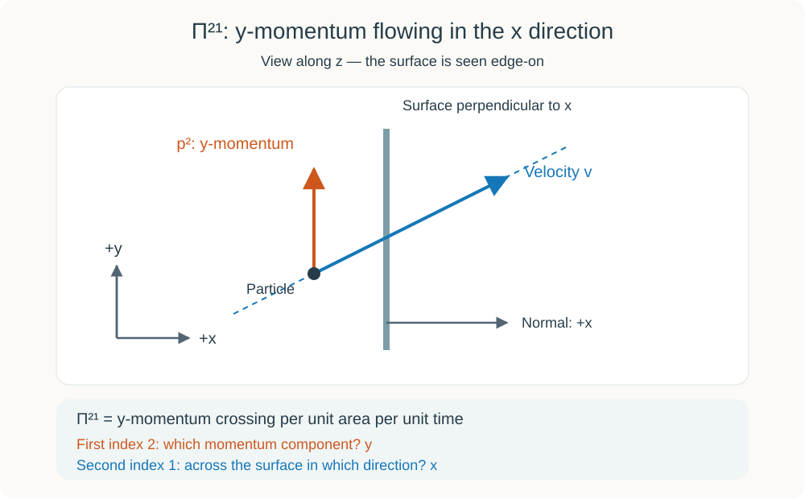
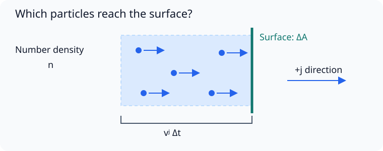
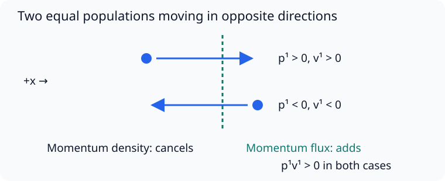
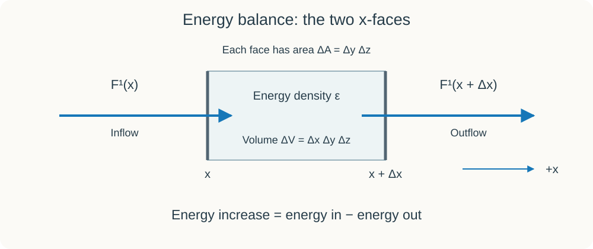
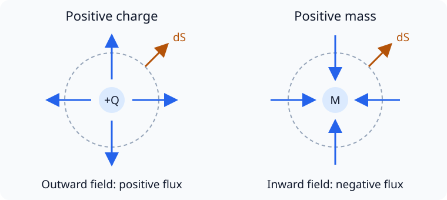

# 物質と曲率を結びつける

## はじめに

前の文書[「一周すると分かる本物の曲がり」](./07-CurvatureFromParallelTransport.md)では、計量から接続を求め、接続から曲率を計算した。

小さな閉曲線に沿ってベクトルを一周させると、そのずれにリーマン曲率テンソルが現れた。さらに、添字を縮約して、

$$
R_{\mu\nu}={R^\rho}_{\mu\rho\nu},
\qquad
R=g^{\mu\nu}R_{\mu\nu}
$$

というリッチテンソルと曲率スカラーを作った。

しかし、ここまでは計量を与えられたときの計算だった。

---

Alice「曲がり方を測る道具はできたね。でも、星の周りの時空がどう曲がるかは、何で決まるの？」

Bob「星の質量が関係するはずだね。でも特殊相対論では、エネルギーと運動量も一緒に考えた。ここでも必要になるんじゃないかな。」

---

今度は、物質の状態から計量を探す側へ進もう。この二つを結びつける物理法則が、アインシュタイン方程式である。

## 自由落下する観測者の時計と物差し

物質のエネルギーや運動量を式にする前に、それを誰が、どのような時計と物差しで測るのかを決めておこう。

まず、空気抵抗を無視できる場所で、小さな実験室を丸ごと落とす思考実験を考える。実験室の中の観測者も、手を離した小球も、一緒に落ちていく。十分に狭い範囲を短い時間だけ見れば、初めに観測者に対して静止していた小球は、そばに浮かんでいるように見える。

地上に置いた実験室では、小球は床へ落ちる。ところが、実験室も一緒に落ちれば、観測者と小球の間には、そのような落下が見えなくなる。

このように、床やひもに支えられず、空気抵抗やロケットの推力など、重力以外の力を受けずに運動することを**自由落下**と呼ぶ。ここでは、自分自身が時空に及ぼす影響や、大きさによる効果を無視できる、小さな観測者や物体を考える。

自由落下は、地面へまっすぐ落ちる運動だけを指すのではない。エンジンを止めて地球の周りを回る人工衛星も、空気抵抗などを無視すれば自由落下している。

---

Alice「地上ではじっと立っている人のほうが、何も力を受けていないように見えるけれど。」

Bob「立っていられるのは、床が足を押しているからだね。一緒に落ちている実験室では、その支えがいらなくなるんだ。」

---

この違いは、観測者が持つ加速度計で区別できる。地上で床に支えられた加速度計はゼロを示さないが、理想的に自由落下する加速度計はゼロを示す。地上の座標で位置が加速して見えることと、観測者自身が押されていることは、同じではない。

第6章では、重力以外の力を受けない物体が進む道を、時空の測地線として表した。曲がった時空での自由落下とは、この測地線に沿う運動である。地上から見た軌道が曲がっていても、時空の幾何学に沿って、進む向きを自分で変えずに運動している。

では、自由落下する観測者が、ある時刻、ある場所で、物質のエネルギーや運動量を測定するとしよう。この時刻と場所で指定される時空の一点を座標の原点にして、時間軸を観測者の時計に、空間の三つの軸を観測者の互いに直交する物差しに合わせる。その点では観測者が静止し、計量と接続が、

$$
g_{\mu\nu}=\eta_{\mu\nu}=\mathrm{diag}(-1,1,1,1)
=\begin{pmatrix}
-1 & 0 & 0 & 0\\
0 & 1 & 0 & 0\\
0 & 0 & 1 & 0\\
0 & 0 & 0 & 1
\end{pmatrix},
\qquad
\Gamma^\rho_{\mu\nu}=0
$$

となるように座標を選べる。これを、その観測者に合わせた**局所慣性座標**と呼ぶ。この点では、時計と物差しの関係を特殊相対論と同じ形で書けるため、エネルギーや運動量の成分も、特殊相対論での測定と同じように読める。

ただし、「局所」という言葉が大切である。上の条件がその点で成り立っても、実験室全体の時空が平坦になるわけではない。十分に小さな範囲では特殊相対論で近似できるが、範囲や観測時間を広げると、曲率の影響が現れる。

例えば、地球へ向かって横に並んで落ちる二つの小球は、それぞれ地球の中心へ向かうため、少しずつ近づく。このような自由落下する物体どうしの相対的な加速を、潮汐効果と呼ぶ。第7章で見たように、一点でクリストッフェル記号をゼロにしても、曲率が残っていれば、この効果までは消せない。

これから使う自由落下する観測者は、こうして曲がった時空の一点で、物質の状態を自分の時計と物差しで測る観測者である。測定される物質まで、その観測者と一緒に自由落下している必要はない。

## 小さな箱に何が入ってくるか

今説明した自由落下する観測者に合わせた局所慣性座標で、原点の周りに、ごく小さな仮想的な箱を考える。これは物質を閉じ込める壁ではなく、出入りを数えるために設けた境界である。箱の面を通して、粒子や光が出入りする。

時間座標はこれまでどおり $x^0=w=ct$、空間座標は $x^1=x,x^2=y,x^3=z$ とする。 $i,j$ は $1,2,3$ の値を取る、空間方向の添字である。

まず、観測者が同じ時刻に測った箱の体積を $\Delta V$、中にあるエネルギーを $\Delta E$ とする。体積あたりのエネルギー、

$$
\varepsilon=\frac{\Delta E}{\Delta V}
$$

を**エネルギー密度**と呼ぶ。ここで数えるエネルギーには、粒子の静止エネルギーも含める。

箱の中の粒子は、運動量も持っている。その合計の $i$ 方向成分を $\Delta p_{\mathrm{total}}^i$ とすると、

$$
\pi^i=\frac{\Delta p_{\mathrm{total}}^i}{\Delta V}
$$

が**運動量密度**である。ここで $\pi^i$ は運動量密度を表す記号であり、円周率ではない。

エネルギー密度は一つの量だが、運動量密度には三方向の成分がある。例えば、同じ大きさの運動量を持つ粒子が左右に同数ずつ動いていれば、運動量は打ち消し合う。しかし、それぞれの粒子が持つエネルギーは足し合わされる。

以下では、粒子一個ずつの細かな違いを平均して、密度を滑らかな量として扱えるとする。そのうえで、箱は曲率の影響を無視できるほど小さく取る。

## 密度だけでは、次の瞬間が分からない

箱の中の密度が分かっても、それだけでは次の瞬間の状態は分からない。右から光が入ってくればエネルギーが増え、左へ粒子が出ていけばエネルギーも運動量も持ち去られる。

そこで、箱の面を通して運ばれる量を考える。 $j$ 方向に垂直な面について、単位時間・単位面積あたりに、正の $j$ 方向へ正味で運ばれるエネルギーを $F^j$ と書く。これが**エネルギー流束**である。逆向きの流れは負として数える。

運動量については、さらに「どの方向の運動量か」を指定する必要がある。 $j$ 方向に垂直な面を通して、単位時間・単位面積あたりに運ばれる $i$ 方向の運動量を、

$$
\Pi^{ij}
$$

と書く。第一の添字 $i$ は運ばれる運動量の成分、第二の添字 $j$ は面を通る方向を表す。

例えば $\Pi^{21}$ は、 $x$ 方向に垂直な面を通して運ばれる、 $y$ 方向の運動量である。粒子が斜めに動けば、 $x$ 方向へ面を通過しながら、 $y$ 方向の運動量も運べる。

図は $z$ 軸方向から見ており、右が $x$、上が $y$ である。 $x$ 方向に垂直な面が縦線に見えている。青い矢印は粒子の速度、橙の矢印はその粒子が持つ運動量の $y$ 成分 $p^2$ を表す。橙の矢印が上を向いていても、それを持つ粒子は面を右へ横切る。 $\Pi^{21}$ は、この面を単位時間・単位面積あたりに通過する $y$ 方向の運動量を数える。

---

Alice「エネルギーの流れは三方向なのに、運動量の流れには添字が二つあるんだね。」

Bob「どちらへ運ぶかに加えて、どの方向の運動量を運ぶかも必要だからだね。」

---

## 同じ速度で動く粒子を数える

密度と流束の関係を、簡単な粒子の集団で確かめよう。質量 $m$ の粒子が、すべて同じ方向に同じ速さで動いているとする。つまり、どの粒子も同じ速度ベクトル $\boldsymbol v=(v^1,v^2,v^3)$ を持つ。ただし、三つの成分 $v^1,v^2,v^3$ が互いに等しいという意味ではない。

例えば、すべての粒子が $(v^1,v^2,v^3)=(2,3,0)\,\mathrm{m/s}$ で動く集団でもよい。

この観測者が測る粒子数密度を $n$、粒子一個のエネルギーを $E$、運動量を $p^i$ とすれば、

$$
\varepsilon=nE,
\qquad
\pi^i=np^i
$$

である。単位体積の中にある粒子の数に、一個あたりの量を掛ければよい。

次に、 $j$ 方向に垂直な、面積 $\Delta A$ の面を考える。まず $v^j>0$ としよう。短い時間 $\Delta t$ の間にこの面を通過するのは、面の手前で、厚さ $v^j\Delta t$ の範囲にいた粒子である。その範囲の体積は、

$$
\Delta V_{\mathrm{pass}}=v^j\Delta t\,\Delta A
$$

なので、通過する粒子数は、

$$
\Delta N=n v^j\Delta t\,\Delta A
$$

となる。

---

Alice「面を通る粒子の数なのに、体積を使って数えるんだね。」

Bob「うん。その時間内に面へ届く粒子が、最初にどの範囲にいたかを考えるんだ。その体積に粒子数密度を掛ければ、通過する数になる。」

---

一個がエネルギー $E$ を運ぶため、エネルギー流束（単位時間・単位面積あたりに、正の $j$ 方向へ正味で運ばれるエネルギー）は、

$$
F^j=\frac{E\Delta N}{\Delta t\,\Delta A}=nEv^j
$$

である。同様に、一個が運ぶ $i$ 方向の運動量は $p^i$ だから、

$$
\Pi^{ij}=\frac{p^i\Delta N}{\Delta t\,\Delta A}=np^iv^j
$$

となる。 $v^j<0$ の場合も、面を通る向きを符号で数えれば同じ式を使える。ここでは $i,j$ を固定しており、和は取っていない。

これで、箱の中の密度と、面を通る流束を、同じ粒子の運動から求められた。

## エネルギーと運動量を一つの表にする

第6章の[「四元速度から四元運動量へ」](./06-ParallelTransportAndGeodesics.md#四元速度から四元運動量へ)では、粒子のエネルギーと運動量を、

$$
p^\mu=(E/c,p^1,p^2,p^3)
$$

という四元運動量にまとめた。密度と流束についても、同じように四つの成分をまとめたい。

そこで、次の配置で量を並べる。

$$
T^{\mu\nu}=
\begin{pmatrix}
\varepsilon & F^1/c & F^2/c & F^3/c\\
c\pi^1 & \Pi^{11} & \Pi^{12} & \Pi^{13}\\
c\pi^2 & \Pi^{21} & \Pi^{22} & \Pi^{23}\\
c\pi^3 & \Pi^{31} & \Pi^{32} & \Pi^{33}
\end{pmatrix}.
$$

第一の添字 $\mu$ が行、第二の添字 $\nu$ が列を指定する。最初の列は箱の中の密度を、それ以外の三列は各方向への流束を表す。最初の行はエネルギーに、残りの三行は三方向の運動量に対応する。

|  | 最初の列：密度 | 残りの3列：各方向への流束 |
| --- | --- | --- |
| 最初の行：エネルギー | $\varepsilon$ | $F^j/c$ |
| 残りの3行：運動量 | $c\pi^i$ | $\Pi^{ij}$ |

行と列は、同じ成分を別の観点から分類している。行は「何の量か」、列は「密度か、それともどの方向への流束か」を表す。右下の $3\times3$ の部分は、運動量の行と流束の列が交わる領域である。例えば $\Pi^{21}$ は、 $y$ 方向の運動量の行と、 $x$ 方向への流束の列が交わる成分なので、「 $y$ 方向の運動量を $x$ 方向へ運ぶ」流束を表す。

表に現れる定数 $c$ によって、すべての成分はエネルギー密度と同じ単位になっている。次に、この表が一つのテンソルとして書けることを確かめよう。

## なぜテンソルになるのか

量を四角く並べただけでは、テンソルであるとは言えない。座標を変えたときに、二つの上付き添字に対応する変換則を満たす必要がある。

先ほどの、すべて同じ速度で動く粒子に戻ろう。その粒子とともに動く観測者が測る粒子数密度を $n_0$ とする。これは粒子の静止系で定義した密度であり、座標の選び方によらないスカラーである。

粒子が速度 $\boldsymbol v$ で動いて見える系では、同じ粒子の集団の体積が運動方向にローレンツ収縮する。そのため粒子数密度は、

$$
n=\gamma n_0,
\qquad
\gamma=\frac{1}{\sqrt{1-|\boldsymbol v|^2/c^2}}
$$

となる。また、粒子の四元速度と四元運動量は、

$$
u^\mu=\frac{dx^\mu}{d\tau}=\gamma(1,v^1/c,v^2/c,v^3/c),
\qquad
p^\mu=mcu^\mu
$$

である。ここで $u^\mu$ は、箱を通って流れる粒子の四元速度であり、第6章の $U^\mu$ と同じ定義を使う。 $\tau$ は距離の単位を持つので、この局所慣性座標での $u^\mu$ は無次元である。 $v^i$ は、その粒子の速度を、箱を設定した観測者が測ったものである。

これらを使うと、先ほどの表の全成分は、

$$
\boxed{T^{\mu\nu}=n_0mc^2\,u^\mu u^\nu}
$$

と書ける。実際、 $E=\gamma mc^2$、 $p^i=\gamma mv^i$、 $n=\gamma n_0$ を使えば、

$$
\begin{aligned}
T^{00}&=n_0m\gamma^2c^2=nE=\varepsilon,\\
T^{0j}&=n_0m\gamma^2cv^j=nEv^j/c=F^j/c,\\
T^{i0}&=n_0m\gamma^2v^ic=cnp^i=c\pi^i,\\
T^{ij}&=n_0m\gamma^2v^iv^j=np^iv^j=\Pi^{ij}.
\end{aligned}
$$

密度から数えた量も、面を通る粒子から数えた量も、同じ式の成分になっている。

$u^\mu$ は四元ベクトルなので、座標変換に対して、

$$
u'^\alpha=\frac{\partial x'^\alpha}{\partial x^\mu}u^\mu
$$

と変換する。したがって、その積は、

$$
T'^{\alpha\beta}
=\frac{\partial x'^\alpha}{\partial x^\mu}
\frac{\partial x'^\beta}{\partial x^\nu}
T^{\mu\nu}
$$

と変換する。これは、二つの上付き添字を持つテンソルの変換則そのものである。つまり、先ほどの表は、エネルギーと運動量の密度・流束が一つのテンソルとして変換するように、成分の配置と $c$ の係数を選んで定義したものなのである。そのことを、四元速度の積で表すことで確かめられた。こうして構成した $T^{\mu\nu}$ を、**エネルギー運動量テンソル**と呼ぶ。

また、 $u^\mu u^\nu=u^\nu u^\mu$ だから、このテンソルは対称である。特に、

$$
T^{0i}=T^{i0}
\quad\Longrightarrow\quad
F^i=c^2\pi^i
$$

となる。エネルギーの流れと運動量密度は、独立に選べる量ではなく、同じ粒子の運動の二つの側面なのである。

さまざまな速度の粒子がある場合は、同じ速度を持つ集団ごとに分け、その寄与を足し合わせればよい。集団を $a$ で区別すると、

$$
T^{\mu\nu}=\sum_a n_{0,a}m_ac^2 u_a^\mu u_a^\nu
$$

となる。テンソルの和もテンソルであり、対称性も保たれる。この粒子による構成から、次に気体の圧力を考えよう。

ここで導いたのは、質量を持つ粒子が運ぶエネルギーと運動量の寄与である。光には静止系がなく、相互作用を担う場のエネルギーもこの粒子の式だけでは数えられない。それらには別の構成が必要だが、密度と流束をまとめるという役割は共通している。

一般の曲がった座標に移っても、テンソルの変換則を使える。

## 圧力も運動量の受け渡し

箱に気体が入っているとしよう。箱全体は静止していても、中の分子は飛び回っている。

例えば、 $x$ 方向へ進む粒子では $p^1$ も $v^1$ も正なので、積 $p^1v^1$ は正になる。逆向きに進む粒子では両方が負になり、やはり積は正になる。

したがって、左右へ動く粒子の運動量密度が打ち消し合っても、運動量流束 $T^{11}=\sum_a n_a p_a^1v_a^1$ は残る。気体全体が静止していることは、運動量の受け渡しがないことを意味しない。

---

Alice「左右の運動量が打ち消し合うなら、圧力も消えそうに思ってしまう。」

Bob「運動量密度では運動量を足すけれど、流束では通過する向きも数えるんだ。左向きの粒子は運動量も速度も負だから、その積は正になる。壁が左右から押されていても、それぞれの壁への力は残るよね。」

---

分子が壁にぶつかって跳ね返ると、分子の運動量が変わる。その分だけ壁へ運動量が渡る。単位時間あたりに渡される運動量が力であり、それを壁の面積で割ったものが圧力である。

したがって、圧力は運動量流束として表される。

例えば $T^{11}$ は、 $x$ 方向に垂直な面を通して、単位時間・単位面積あたりに受け渡される $x$ 方向の運動量である。ここでは、面に垂直な方向と、受け渡される運動量の方向が一致している。単位時間あたりの運動量の受け渡しは力なので、 $T^{11}$ は、その面を垂直に押す単位面積あたりの力、つまり圧力に対応する。

同じように、 $T^{22}$ は $y$ 方向に垂直な面への圧力、 $T^{33}$ は $z$ 方向に垂直な面への圧力に対応する。気体とともに静止する観測者が、どの方向にも同じ圧力 $P$ を測るなら、

$$
T^{11}=T^{22}=T^{33}=P
$$

となる。三つが等しいのは、気体をどの向きの面で区切っても、同じ圧力が働くからである。なお、気体全体が観測者に対して流れている場合には、流れが運ぶ運動量も寄与するため、これらの成分をそのまま気体の静止系での圧力 $P$ と読むことはできない。

特に $T^{xx}$ は、 $x$ 方向に垂直な面を通じた、 $x$ 方向の運動量の受け渡しを表す。 $T^{xy}$ なら、 $y$ 方向に垂直な面を通じて、面に沿う $x$ 方向の運動量が渡る。これは、面を横にずらすような応力に関係する。

流体とともに静止し、どの方向にも同じ圧力 $P$ を測る観測者を考えよう。粘性や熱の流れを無視できる流体では、その局所慣性座標で、

$$
T^{\mu\nu} =
\begin{pmatrix}
\varepsilon & 0 & 0 & 0\\
0 & P & 0 & 0\\
0 & 0 & P & 0\\
0 & 0 & 0 & P
\end{pmatrix}
$$

と書ける。 $\varepsilon$ は、静止エネルギーや内部エネルギーを含めたエネルギー密度である。このような理想化を完全流体と呼ぶ。

気体全体が静止していても、圧力の成分は残る。一般相対論で曲率と結びつけるのは、質量密度だけではない。エネルギーの流れや、圧力、応力も含む物質の状態である。光や電磁場もエネルギーと運動量を持つため、 $T^{\mu\nu}$ に寄与する。

以下では、曲率側の添字に合わせて、

$$
T_{\mu\nu}=g_{\mu\alpha}g_{\nu\beta}T^{\alpha\beta}
$$

という下付き添字の形も使う。同じテンソルの添字を、計量で下げたものである。

## 箱の中の増減と、面を通る流れ

小さな箱へ入るエネルギーが出ていくエネルギーより多ければ、その差が箱の中に蓄えられる。

この収支を、先ほど定義したエネルギー密度 $\varepsilon$ とエネルギー流束 $F^1,F^2,F^3$ で表してみよう。ここでは、相互作用する物質や場のエネルギーをすべて含め、箱の中でエネルギーが正味で生まれたり消えたりしない場合を考える。

観測者に合わせた局所慣性座標で、辺の長さが $\Delta x,\Delta y,\Delta z$ の、座標に対して静止した小さな箱を取る。体積は $\Delta V=\Delta x\Delta y\Delta z$ である。箱と観測時間は十分に小さく取り、以下では主要な項を残して収支を立てる。

### まず、左右の二つの面を比べる

まず $x$ 方向だけを考えよう。左の面を $x$、右の面を $x+\Delta x$ とし、両方の面積を $\Delta A=\Delta y\Delta z$ とする。

図の二本の矢印は、どちらも正の $x$ 方向を向いている。この向きの流れは、左の面では箱へ入り、右の面では箱から出る。ここが、収支の符号を決める。

$F^1$ は、単位時間・単位面積あたりに運ばれるエネルギーだった。時刻と $y,z$ の表示を省略して、左の面での値を $F^1(x)$、右の面での値を $F^1(x+\Delta x)$ と書こう。短い時間 $\Delta t$ の間に左から入るエネルギーと、右から出るエネルギーは、それぞれ、

$$
\begin{aligned}
\text{左からの流入}&\simeq F^1(x)\,\Delta A\,\Delta t,\\
\text{右への流出}&\simeq F^1(x+\Delta x)\,\Delta A\,\Delta t
\end{aligned}
$$

となる。したがって、この二つの面を通る流れによる箱のエネルギーの増加は、

$$
\begin{aligned}
\Delta E_x
&\simeq \bigl[F^1(x)-F^1(x+\Delta x)\bigr]\Delta A\,\Delta t\\
&\simeq -\frac{\partial F^1}{\partial x}\Delta x\,\Delta A\,\Delta t\\
&=-\frac{\partial F^1}{\partial x}\Delta V\,\Delta t
\end{aligned}
$$

である。二行目では、近くの二つの面での流束の差を、

$$
F^1(x+\Delta x)-F^1(x)
\simeq \frac{\partial F^1}{\partial x}\Delta x
$$

と表した。

例えば右の面での流束が左より大きければ、入る量より出る量が多く、箱のエネルギーは減る。この場合、 $\partial F^1/\partial x>0$ なので、 $\Delta E_x$ が負になることと一致している。両面で流束が同じなら、流れがあっても、この二面による箱のエネルギーの増減はゼロである。

$F^1$ が負なら、実際の流れは矢印と逆向きになる。その場合も、符号を含めて同じ「左の値−右の値」で収支を計算できる。

### 三方向の流れを足す

$y$ 方向と $z$ 方向にも、それぞれ向かい合う二つの面がある。同じ計算をすると、

$$
\Delta E_y\simeq-\frac{\partial F^2}{\partial y}\Delta V\,\Delta t,
\qquad
\Delta E_z\simeq-\frac{\partial F^3}{\partial z}\Delta V\,\Delta t
$$

となる。六つの面すべてを通る流れによる増加は、この三つの和である。

一方、箱の体積は固定しているので、箱の中のエネルギーの増加は、密度の変化を使って、

$$
\Delta E_{\mathrm{box}}
\simeq \bigl[\varepsilon(t+\Delta t)-\varepsilon(t)\bigr]\Delta V
\simeq \frac{\partial\varepsilon}{\partial t}\Delta t\,\Delta V
$$

と書ける。これが流入と流出による増加の合計に等しいので、

$$
\frac{\partial\varepsilon}{\partial t}\Delta V\,\Delta t
=-\left(
\frac{\partial F^1}{\partial x}
+\frac{\partial F^2}{\partial y}
+\frac{\partial F^3}{\partial z}
\right)\Delta V\,\Delta t
$$

を主要な項の等式として得る。両辺を $\Delta V\,\Delta t$ で割り、箱と時間間隔を小さくする極限を取れば、

$$
\frac{\partial\varepsilon}{\partial t}
+\frac{\partial F^1}{\partial x}
+\frac{\partial F^2}{\partial y}
+\frac{\partial F^3}{\partial z}
=0
$$

となる。これがエネルギーの局所的な保存則である。第一項は、単位体積あたりのエネルギーの増加率を表す。残りの三項の和は、単位時間・単位体積あたりに箱から正味で流れ出るエネルギーを表す。両者の和がゼロなのは、流れ出る分だけ箱の中のエネルギーが減るからである。

### テンソルの成分でまとめる

$T^{00}=\varepsilon$、 $T^{0i}=F^i/c$、 $\partial_0=(1/c)\partial_t$ を使えば、この式は、

$$
\partial_\nu T^{0\nu}=0
$$

とまとめられる。運動量についても、エネルギー密度とエネルギー流束を、運動量密度と運動量流束に置き換えれば、上の議論をそのまま使える。「箱の中の増加」と「面からの正味の流出」を足すとゼロになるので、

$$
\frac{\partial\pi^i}{\partial t}
+\sum_{j=1}^3\frac{\partial\Pi^{ij}}{\partial x^j}=0
$$

である。 $T^{i0}=c\pi^i$、 $T^{ij}=\Pi^{ij}$ を使えば、これは $\partial_\nu T^{i\nu}=0$ となる。エネルギーと三方向の運動量の収支が、一つの式

$$
\partial_\nu T^{\mu\nu}=0
$$

にまとまった。

曲がった時空の一般の座標では、場所による基底の変化も含める必要がある。そのため、普通の微分を共変微分に置き換え、

$$
\boxed{\nabla_\nu T^{\mu\nu}=0}
$$

と書く。これは、相互作用する物質や場を合わせたエネルギー運動量の、局所的な保存則である。例えば気体と光がエネルギーを交換するなら、両方を含めて収支を取る。

添字を下げ、計量との共変微分の整合性を使うと、同じ内容を、

$$
\nabla^\mu T_{\mu\nu}=0,
\qquad
\nabla^\mu=g^{\mu\alpha}\nabla_\alpha
$$

とも書ける。

ただし、これは任意の曲がった時空で「宇宙全体のエネルギーを足せば一定」という意味ではない。離れた場所のエネルギーをどう比べ、全体の保存量を定義するかには、時空の対称性など追加の条件が必要になる。

## リッチテンソルの発散を調べる

物質側では、エネルギー運動量テンソルが、

$$
\nabla^\mu T_{\mu\nu}=0
$$

を満たすことが分かった。次に、曲率側のリッチテンソルについて、同じ形の微分を調べよう。

ここで計算する $\nabla^\mu R_{\mu\nu}$ は、共変微分をしたうえで、微分の添字とテンソルの添字を縮約したものである。このような微分を**発散**と呼ぶ。添字 $\mu$ について和を取り、 $\nu$ が一つ残る。共変微分の全成分 $\nabla_\alpha R_{\mu\nu}$ を調べることとは区別しよう。

### 曲率の定義を振り返る

第7章では、リーマン曲率テンソルから、

$$
R_{\sigma\nu}={R^\rho}_{\sigma\rho\nu},
\qquad
R=g^{\sigma\nu}R_{\sigma\nu}
$$

というリッチテンソルと曲率スカラーを作った。

これから添字を縮約しやすくするため、リーマン曲率テンソルの最初の添字も計量で下げて、

$$
R_{\alpha\sigma\mu\nu}
=g_{\alpha\rho}{R^\rho}_{\sigma\mu\nu}
$$

と書く。この形では、リッチテンソルの定義は、

$$
R_{\sigma\nu}
=g^{\alpha\mu}R_{\alpha\sigma\mu\nu}
$$

となる。第一と第三の添字を、逆計量で縮約している。

### 曲率の微分を結ぶビアンキ恒等式

リーマン曲率テンソルは、接続から作られるため、その成分を自由に選べるわけではない。曲率の共変微分どうしにも、次の関係が成り立つ。

$$
\nabla_\lambda R_{\alpha\sigma\mu\nu}
+\nabla_\mu R_{\alpha\sigma\nu\lambda}
+\nabla_\nu R_{\alpha\sigma\lambda\mu}
=0.
$$

これを**微分ビアンキ恒等式**と呼ぶ。 $\alpha,\sigma$ を固定し、残りの三つの添字 $\lambda,\mu,\nu$ を順に入れ替えて作った三項の和がゼロになる、という式である。

これは物質の分布や運動に課す法則ではなく、ここまで使ってきた計量と接続から作る曲率が満たす、幾何学的な恒等式である。恒等式そのものは、章末の[「付録：微分ビアンキ恒等式の導出」](#付録微分ビアンキ恒等式の導出)で、曲率の定義から導く。ここでは、この恒等式がリッチテンソルの発散をどう決めるかを、添字の縮約で確かめよう。

計算には、次の性質も使う。導出は章末の[「付録：曲率テンソルの対称性」](#付録曲率テンソルの対称性)で確かめられる。

$$
R_{\alpha\sigma\mu\nu}
=-R_{\sigma\alpha\mu\nu},
\qquad
R_{\alpha\sigma\mu\nu}
=-R_{\alpha\sigma\nu\mu},
\qquad
R_{\sigma\nu}=R_{\nu\sigma}.
$$

最初の二つは、リーマン曲率テンソルが最初の二添字、最後の二添字のそれぞれについて反対称であることを表す。最後の式はリッチテンソルの対称性である。これらも、計量と整合し、下二添字が対称な接続を使っていることから成り立つ。

### 一回目の縮約でリッチテンソルを作る

ビアンキ恒等式に $g^{\alpha\mu}$ を掛け、 $\alpha,\mu$ について和を取る。計量の共変微分はゼロなので、逆計量を共変微分の内側へ入れてよい。

まず、ビアンキ恒等式の第一項 $\nabla_\lambda R_{\alpha\sigma\mu\nu}$ に注目しよう。これに $g^{\alpha\mu}$ を掛けるのは、曲率の第一と第三の添字を縮約して、リッチテンソルを作るためである。

ただし、今回は曲率そのものではなく、その共変微分を縮約している。そこで、積の微分則を使って、逆計量を共変微分の内側へ入れられることを確かめよう。

$$
\nabla_\lambda\left(g^{\alpha\mu}R_{\alpha\sigma\mu\nu}\right)
=(\nabla_\lambda g^{\alpha\mu})R_{\alpha\sigma\mu\nu}
+g^{\alpha\mu}\nabla_\lambda R_{\alpha\sigma\mu\nu}
$$

逆計量の共変微分もゼロなので、右辺の第一項は消える。したがって、

$$
g^{\alpha\mu}\nabla_\lambda R_{\alpha\sigma\mu\nu}
=\nabla_\lambda\left(g^{\alpha\mu}R_{\alpha\sigma\mu\nu}\right)
$$

となる。括弧の中は、この節の冒頭で振り返ったリッチテンソルの定義、

$$
g^{\alpha\mu}R_{\alpha\sigma\mu\nu}=R_{\sigma\nu}
$$

そのものである。 $\alpha,\mu$ について和を取ることで、この二つの添字が消え、 $\sigma,\nu$ が残る。これを代入すれば、

$$
g^{\alpha\mu}\nabla_\lambda R_{\alpha\sigma\mu\nu}
=\nabla_\lambda R_{\sigma\nu}
$$

となる。つまり、第一項の縮約は、リッチテンソルを $x^\lambda$ 方向に共変微分したものになる。

第二項では、 $g^{\alpha\mu}\nabla_\mu=\nabla^\alpha$ なので、

$$
g^{\alpha\mu}\nabla_\mu R_{\alpha\sigma\nu\lambda}
=\nabla^\alpha R_{\alpha\sigma\nu\lambda}
$$

である。

第三項では、最後の二添字を交換すると符号が変わることに注意する。

$$
g^{\alpha\mu}R_{\alpha\sigma\lambda\mu}
=-g^{\alpha\mu}R_{\alpha\sigma\mu\lambda}
=-R_{\sigma\lambda}.
$$

したがって、一回目の縮約によって、

$$
\nabla_\lambda R_{\sigma\nu}
+\nabla^\alpha R_{\alpha\sigma\nu\lambda}
-\nabla_\nu R_{\sigma\lambda}
=0
$$

を得る。

### 二回目の縮約で発散を取り出す

さらに $g^{\sigma\nu}$ を掛け、 $\sigma,\nu$ について和を取ろう。

第一項は、リッチテンソルを縮約すると曲率スカラーになるので、

$$
g^{\sigma\nu}\nabla_\lambda R_{\sigma\nu}
=\nabla_\lambda R
=\partial_\lambda R
$$

である。最後の等号では、スカラーの共変微分が偏微分に等しいことを使った。

第二項で縮約する曲率については、最初の二添字を交換して、

$$
g^{\sigma\nu}R_{\alpha\sigma\nu\lambda}
=-g^{\sigma\nu}R_{\sigma\alpha\nu\lambda}
=-R_{\alpha\lambda}
$$

となる。そのため第二項は $-\nabla^\alpha R_{\alpha\lambda}$ になる。

第三項は、そのまま、

$$
-g^{\sigma\nu}\nabla_\nu R_{\sigma\lambda}
=-\nabla^\sigma R_{\sigma\lambda}
$$

である。

三項を合わせると、

$$
\partial_\lambda R
-\nabla^\alpha R_{\alpha\lambda}
-\nabla^\sigma R_{\sigma\lambda}
=0
$$

となる。 $\alpha$ と $\sigma$ はどちらも和を取るための添字なので、第二項と第三項は同じ量である。したがって、

$$
\partial_\lambda R-2\nabla^\mu R_{\mu\lambda}=0
$$

を得る。残る添字 $\lambda$ を $\nu$ と書き換えれば、

$$
\boxed{\nabla^\mu R_{\mu\nu}=\frac12\partial_\nu R}
$$

となる。これが、ビアンキ恒等式を縮約して得られる関係である。

### 物質側の保存則との違い

リッチテンソルの発散は、一般にはゼロではない。曲率スカラーが場所や時刻によって変化すれば、その変化が右辺に現れる。

ここで、物質側と曲率側を並べてみよう。

$$
\nabla^\mu T_{\mu\nu}=0,
\qquad
\nabla^\mu R_{\mu\nu}=\frac12\partial_\nu R.
$$

物質側の発散はゼロだが、曲率側でリッチテンソルだけを使うと、曲率スカラーの微分が残る。この違いを踏まえて、物質と曲率を結びつける式を考えよう。

---

Alice「長い添字の計算で、何が分かったのか整理したいな。」

Bob「リッチテンソルの発散を取ると、ゼロではなく曲率スカラーの微分が残る、と分かったんだ。次は、その残りを打ち消す項を探そう。」

---

## リッチテンソルをそのまま使えるか

曲率側にも物質側にも、二つの下付き添字を持つテンソルがそろった。

比例係数を $\kappa$ として、

$$
R_{\mu\nu}\stackrel{?}{=}\kappa T_{\mu\nu}
$$

と書いてみる。

添字の形は合っている。しかし、物質側に保存則がある以上、曲率側にもそれと整合する性質が必要である。

比例係数 $\kappa$ を定数として両辺に $\nabla^\mu$ を作用させると、右辺は物質の保存則によりゼロになる。左辺には、前節で導いた関係を使えるので、

$$
\frac12\partial_\nu R=0
$$

が必要になる。

このままでは、曲率スカラー $R$ がどの方向にも変化しない、という余分な条件を課してしまう。一般の物質分布を扱うには、先ほどの候補では不十分なのである。

そこで、この $\tfrac12\partial_\nu R$ を打ち消す項を探そう。

ただし $R$ だけではスカラーなので、 $R_{\mu\nu}$ とそのまま引き算できない。計量を掛けて $g_{\mu\nu}R$ とすれば、同じ添字を持つテンソルになる。

## 保存則と整合する組み合わせ

第5章で使ったように、計量の共変微分はゼロである。また、スカラーの共変微分は偏微分と同じなので、

$$
\begin{aligned}
\nabla^\mu(g_{\mu\nu}R)
&=(\nabla^\mu g_{\mu\nu})R+g_{\mu\nu}\nabla^\mu R\\
&=\partial_\nu R
\end{aligned}
$$

となる。したがって、

$$
\boxed{G_{\mu\nu}=R_{\mu\nu}-\frac12g_{\mu\nu}R}
$$

と定義すれば、

$$
\begin{aligned}
\nabla^\mu G_{\mu\nu}
&=\frac12\partial_\nu R-\frac12\partial_\nu R\\
&=0
\end{aligned}
$$

になる。この $G_{\mu\nu}$ を、アインシュタインテンソルと呼ぶ。

リッチテンソル、計量、曲率スカラーから作っているため、これもテンソルである。しかも、物質の運動を指定する前から、幾何学的な恒等式として共変微分の縮約がゼロになる。

---

Alice「半分を引くのには、ちゃんと理由があったんだね。」

Bob「うん。曲率を表すだけでなく、エネルギーと運動量の収支にも合う組み合わせになったんだ。」

---

ここでの $1/2$ は、見た目を整えるための係数ではない。二つの微分が打ち消し合うために必要な係数である。

## アインシュタイン方程式

こうして、曲率側の $G_{\mu\nu}$ と物質側の $T_{\mu\nu}$ を結びつける候補ができた。

比例係数は、弱い重力場で物体が光より十分遅く動く場合に、ニュートンの重力理論へ戻るように決める。その結果は、

$$
\boxed{
G_{\mu\nu}
=\frac{8\pi G}{c^4}T_{\mu\nu}
}
$$

である。これが、ここから使うアインシュタイン方程式である。

$G_{\mu\nu}$ はアインシュタインテンソル、係数に現れる添字なしの $G$ はニュートンの万有引力定数である。同じ文字だが、役割が異なる。

左辺を展開すれば、

$$
R_{\mu\nu}-\frac12g_{\mu\nu}R
=\frac{8\pi G}{c^4}T_{\mu\nu}
$$

となる。左辺は時空の曲率、右辺は物質や場のエネルギー、運動量、圧力、応力を表す。

ここまでの議論は、方程式の形が自然である理由を示したものである。保存則だけから重力の法則を一意に証明したわけではない。物質と幾何学をこのように結ぶこと自体は物理法則であり、ニュートン極限や観測との比較で確かめる必要がある。

なお、より一般には左辺に $\Lambda g_{\mu\nu}$ を加えることができる。 $\Lambda$ は宇宙定数で、一定ならこの項も保存則と整合する。このシリーズでは、孤立した天体の周りのシュヴァルツシルト解へ進むため、以後 $\Lambda=0$ とする。

## 係数をニュートンの重力に合わせる

係数 $8\pi G/c^4$ の由来も、短く確かめておこう。近似の条件と計算の各段階は、章末の[「付録：係数をニュートンの重力に合わせる」](#付録係数をニュートンの重力に合わせる)で詳しく説明する。

時間変化を無視できる弱い重力場で、 $x^0=w=ct$ とする。ニュートンの重力ポテンシャルを $\Phi$ とすると、低速の物体の測地線方程式がニュートンの運動方程式と一致するためには、

$$
g_{00}\simeq-\left(1+\frac{2\Phi}{c^2}\right)
\qquad (8.1)
$$

となる。実際、計量から接続を求める式の主要項は $\Gamma^i_{00}\simeq\partial_i\Phi/c^2$ なので、測地線方程式は $d^2x^i/dt^2\simeq-\partial_i\Phi$ になる。

一方、場の方程式をいったん $G_{\mu\nu}=\kappa T_{\mu\nu}$ と書き、両辺を $g^{\mu\nu}$ で縮約する。時空は四次元なので $g^{\mu\nu}g_{\mu\nu}=4$ であり、

$$
R-\frac12\cdot4R=\kappa T,
\qquad
T=g^{\mu\nu}T_{\mu\nu}
$$

から $R=-\kappa T$ を得る。これを元へ戻すと、

$$
R_{\mu\nu}=\kappa\left(T_{\mu\nu}-\frac12g_{\mu\nu}T\right)
$$

となる。

圧力と内部運動のエネルギーを静止エネルギーに比べて無視できる物質では、質量密度を $\rho$ として、 $T_{00}\simeq\rho c^2$、 $T\simeq-\rho c^2$ である。時間成分は、

$$
R_{00}\simeq\frac{\kappa}{2}\rho c^2
$$

となる。

同じ弱い静的な場では、曲率の式の主要項は、

$$
R_{00}\simeq\sum_{i=1}^3\partial_i\Gamma^i_{00}
\simeq\frac{1}{c^2}\nabla_{\!\mathrm{space}}^2\Phi
$$

である。ここで $\nabla_{\!\mathrm{space}}^2=\partial_x^2+\partial_y^2+\partial_z^2$ は、ニュートン理論の空間微分の和であり、共変微分の記号とは区別している。

ニュートンの重力ポテンシャルが満たすポアソン方程式は、

$$
\nabla_{\!\mathrm{space}}^2\Phi=4\pi G\rho
$$

である。二つの $R_{00}$ を比較すると、

$$
\frac{\kappa}{2}\rho c^2=\frac{4\pi G}{c^2}\rho,
\qquad
\kappa=\frac{8\pi G}{c^4}
$$

を得る。既知の弱い重力とつながるように、物質と曲率の結びつきの強さが決まった。

## 真空なら平坦なのか

星の外側の、物質も電磁場もない領域を考える。そこでは、

$$
T_{\mu\nu}=0
$$

なので、アインシュタイン方程式は、

$$
R_{\mu\nu}-\frac12g_{\mu\nu}R=0
$$

になる。先ほどの縮約で $T=0$ とすれば $R=0$ だから、結局、

$$
\boxed{R_{\mu\nu}=0}
$$

を得る。これが、四次元で宇宙定数をゼロとした場合の真空の方程式である。

---

Alice「ゼロになってしまったけれど、星の外では重力がなくなるの？」

Bob「ここでゼロになったのはリッチテンソルだよ。リーマン曲率テンソルを縮約して作ったことを思い出してみよう。」

---

ゼロになったのはリッチテンソルである。前章で見たように、それはリーマン曲率テンソルの一部の添字について和を取ったものだった。

和がゼロでも、足した各項がすべてゼロとは限らない。四次元の時空では、

$$
R_{\mu\nu}=0
\quad\text{でも}\quad
{R^\rho}_{\sigma\mu\nu}\ne0
$$

ということが起こる。

星の外側でも、隣り合う自由落下物体には相対的な加速が生じ得る。星へ向かう方向や距離によって落下の仕方が違う、という潮汐的な効果である。真空の方程式は、この曲率まで消すことを要求していない。

その場所に物質がないことと、時空が平坦なことは、別なのである。

第7章の球面の例は二次元だった。そこで曲率の独立な情報が一つだったことを、四次元の時空へそのまま持ち込んではいけない。

## 未知なのは計量

アインシュタイン方程式

$$
G_{\mu\nu}=\frac{8\pi G}{c^4}T_{\mu\nu}
$$

の左辺 $G_{\mu\nu}$ は、時空の曲率を表す量である。この方程式を解くときに未知量として求めるのは、その曲率のもとになる計量 $g_{\mu\nu}$ である。

候補となる計量を決めれば、その逆計量と偏微分から $\Gamma^\rho_{\mu\nu}$ が求まる。さらに接続を微分してリッチテンソルを作り、縮約して曲率スカラーを求めれば、左辺の $G_{\mu\nu}$ を計算できる。

接続には計量の一階微分が、曲率には二階微分が含まれる。つまり、アインシュタイン方程式は、計量とその微分が満たすべき微分方程式なのである。

ただし、ある一点の $T_{\mu\nu}$ の値だけから、その点の計量が直ちに決まるわけではない。物質の分布や運動に加え、境界条件や初期条件を使って解を探す。物質の運動も未知なら、物質の方程式と計量の方程式を一緒に解く必要がある。

真空でも、同じ $R_{\mu\nu}=0$ を満たす計量は一つではない。星がある場合は、その内部とのつながりや、遠く離れた場所での条件などが、外側の解を選ぶ。

今までは、計量から曲率を計算していた。これからは、計算した曲率が方程式を満たすように、計量を探すのである。

---

Alice「曲率を計算できたら終わり、ではないんだね。」

Bob「うん。候補の計量から曲率を計算して、それが物質側と釣り合うことを要求するんだ。その条件を、境界条件や初期条件と一緒に満たす計量を求めるのが、方程式を解くということだよ。」

---

その計量が分かれば、第3章の時計と物差し、第6章の光や物体の測地線へ戻って、観測される現象を調べられる。

## まとめ

- エネルギー運動量テンソルは、エネルギー密度だけでなく、エネルギーや運動量の流れ、圧力、応力をまとめたものである。
- 物質や場を合わせた局所的な保存則は $\nabla^\mu T_{\mu\nu}=0$ と書ける。
- 曲率側では $G_{\mu\nu}=R_{\mu\nu}-\tfrac12g_{\mu\nu}R$ が $\nabla^\mu G_{\mu\nu}=0$ を満たす。
- この両者を結ぶ物理法則が $G_{\mu\nu}=(8\pi G/c^4)T_{\mu\nu}$ であり、比例係数はニュートンの重力と比較して決める。
- 宇宙定数をゼロとした四次元の真空では $R_{\mu\nu}=0$ となるが、リーマン曲率テンソルまでゼロとは限らない。
- 場の方程式は、物質の状態や境界条件などに合わせて、時空の計量を求める方程式である。

## 次の疑問

物質と時空を結ぶ方程式ができた。では、一つの丸い星の周りで、実際に計量を求めてみよう。

十個ある対称な計量の成分を、最初からすべて未知関数として扱うのは大変である。しかし、星が球対称で、外側の時空が時間とともに変わらないなら、方向や時刻を変えても同じ状況を表すはずだ。

次の文書[「球対称な時空を予想する」](./09-SphericallySymmetricSpacetime.md)では、この対称性を使って計量の候補を組み立てる。真空の方程式を解く前に、未知の関数をどこまで減らせるかを考えよう。

## さらに確かめたい読者へ

保存則、アインシュタイン方程式、ニュートン極限についての詳しい導出は、Sean Carroll の [Lecture Notes on General Relativity, Chapter 4](https://www.preposterousuniverse.com/wp-content/uploads/grnotes-four.pdf) を参照できる。本章で使った微分ビアンキ恒等式は、次の付録で導出する。

## 付録：曲率テンソルの対称性

本文で使ったリーマン曲率テンソルの反対称性と、リッチテンソルの対称性を導こう。ここでも、任意の一点 $q$ で接続がゼロになる局所慣性座標を使う。

### 曲率を計量の二階微分で表す

第5章で、計量と接続の整合性を表す[式 (5.1)](./05-ChristoffelFromMetric.md#eq-metric-compatibility)を導いた。その式の添字を $\lambda\to\mu$、 $\mu\to\alpha$、 $\nu\to\rho$、 $\rho\to\beta$ と一斉に付け替えると、

$$
\partial_\mu g_{\alpha\rho}
=\Gamma^\beta_{\mu\alpha}g_{\beta\rho}
+\Gamma^\beta_{\mu\rho}g_{\alpha\beta}
$$

なので、点 $q$ では計量の一階偏微分もゼロになる。ただし、二階偏微分までゼロになるわけではない。

最初の添字を下げた接続の成分を、

$$
\Gamma_{\alpha\nu\sigma}
=g_{\alpha\rho}\Gamma^\rho_{\nu\sigma}
$$

と書く。第5章で求めた接続の[式 (5.2)](./05-ChristoffelFromMetric.md#eq-christoffel-from-metric)に計量を掛ければ、

$$
\Gamma_{\alpha\nu\sigma}
=\frac12\left(
\partial_\nu g_{\alpha\sigma}
+\partial_\sigma g_{\alpha\nu}
-\partial_\alpha g_{\nu\sigma}
\right)
$$

となる。これは計算のための記号であり、接続がテンソルになったという意味ではない。

第7章の曲率の定義[式 (7.2)](./07-CurvatureFromParallelTransport.md#eq-riemann-curvature)で最初の添字を計量で下げる。点 $q$ では接続どうしの積が消えるので、

$$
\left.R_{\alpha\sigma\mu\nu}\right|_q
=\left.g_{\alpha\rho}
\left(
\partial_\mu\Gamma^\rho_{\nu\sigma}
-\partial_\nu\Gamma^\rho_{\mu\sigma}
\right)\right|_q
$$

である。一方、積の微分から、

$$
\partial_\mu\Gamma_{\alpha\nu\sigma}
=(\partial_\mu g_{\alpha\rho})\Gamma^\rho_{\nu\sigma}
+g_{\alpha\rho}\partial_\mu\Gamma^\rho_{\nu\sigma}
$$

となる。点 $q$ では右辺の第一項がゼロになるため、曲率は、

$$
\left.R_{\alpha\sigma\mu\nu}\right|_q
=\left.
\left(
\partial_\mu\Gamma_{\alpha\nu\sigma}
-\partial_\nu\Gamma_{\alpha\mu\sigma}
\right)\right|_q
$$

と書ける。

ここから対称性を確かめるまで、式はすべて点 $q$ で評価するものとし、 $\left.\cdots\right\vert_q$ を省略する。

直前の式は、二つの接続の微分の差、

$$
R_{\alpha\sigma\mu\nu}
=\partial_\mu\Gamma_{\alpha\nu\sigma}
-\partial_\nu\Gamma_{\alpha\mu\sigma}
$$

である。この二項を別々に計算しよう。

第一項で使う接続は、先ほど求めた、

$$
\Gamma_{\alpha\nu\sigma}
=\frac12\left(
\partial_\nu g_{\alpha\sigma}
+\partial_\sigma g_{\alpha\nu}
-\partial_\alpha g_{\nu\sigma}
\right)
$$

である。これを $x^\mu$ で偏微分すると、括弧内の各項に $\partial_\mu$ が作用して、

$$
\partial_\mu\Gamma_{\alpha\nu\sigma}
=\frac12\left(
\partial_\mu\partial_\nu g_{\alpha\sigma}
+\partial_\mu\partial_\sigma g_{\alpha\nu}
-\partial_\mu\partial_\alpha g_{\nu\sigma}
\right)
$$

となる。

第二項では、接続の式の $\nu$ を $\mu$ に置き換えた、

$$
\Gamma_{\alpha\mu\sigma}
=\frac12\left(
\partial_\mu g_{\alpha\sigma}
+\partial_\sigma g_{\alpha\mu}
-\partial_\alpha g_{\mu\sigma}
\right)
$$

を使う。これを $x^\nu$ で偏微分すると、

$$
\partial_\nu\Gamma_{\alpha\mu\sigma}
=\frac12\left(
\partial_\nu\partial_\mu g_{\alpha\sigma}
+\partial_\nu\partial_\sigma g_{\alpha\mu}
-\partial_\nu\partial_\alpha g_{\mu\sigma}
\right)
$$

となる。

曲率は第一項から第二項を引いたものなので、第二項の括弧内にある三項は、すべて符号が反転する。特に、第二項の最後にあるマイナスの項は、引き算によってプラスになる。二つの結果を合わせると、

$$
\begin{aligned}
R_{\alpha\sigma\mu\nu}
&=\frac12\bigl(
\partial_\mu\partial_\nu g_{\alpha\sigma}
+\partial_\mu\partial_\sigma g_{\alpha\nu}
-\partial_\mu\partial_\alpha g_{\nu\sigma}\\
&\qquad
-\partial_\nu\partial_\mu g_{\alpha\sigma}
-\partial_\nu\partial_\sigma g_{\alpha\mu}
+\partial_\nu\partial_\alpha g_{\mu\sigma}
\bigr).
\end{aligned}
$$

計量は十分に滑らかであるとする。二階偏微分の順序を交換すれば、第一項と第四項が打ち消し合う。残りを並べ直すと、

$$
\begin{aligned}
R_{\alpha\sigma\mu\nu}
=\frac12\bigl(
&\partial_\mu\partial_\sigma g_{\alpha\nu}
+\partial_\nu\partial_\alpha g_{\sigma\mu}\\
&-\partial_\mu\partial_\alpha g_{\sigma\nu}
-\partial_\nu\partial_\sigma g_{\alpha\mu}
\bigr)
\end{aligned}
$$

となる。この式を使って、添字を交換したときの変化を調べよう。

### 最初と最後の二添字の反対称性

まず、最初の二添字 $\alpha,\sigma$ を交換すると、

$$
\begin{aligned}
R_{\sigma\alpha\mu\nu}
=\frac12\bigl(
&\partial_\mu\partial_\alpha g_{\sigma\nu}
+\partial_\nu\partial_\sigma g_{\alpha\mu}\\
&-\partial_\mu\partial_\sigma g_{\alpha\nu}
-\partial_\nu\partial_\alpha g_{\sigma\mu}
\bigr)
=-R_{\alpha\sigma\mu\nu}.
\end{aligned}
$$

元の式でプラスだった二項がマイナスになり、マイナスだった二項がプラスになっている。

次に、最後の二添字 $\mu,\nu$ を交換すると、

$$
\begin{aligned}
R_{\alpha\sigma\nu\mu}
=\frac12\bigl(
&\partial_\nu\partial_\sigma g_{\alpha\mu}
+\partial_\mu\partial_\alpha g_{\sigma\nu}\\
&-\partial_\nu\partial_\alpha g_{\sigma\mu}
-\partial_\mu\partial_\sigma g_{\alpha\nu}
\bigr)
=-R_{\alpha\sigma\mu\nu}.
\end{aligned}
$$

こちらも同じように、四項すべての符号が反転する。したがって、

$$
\boxed{
R_{\alpha\sigma\mu\nu}
=-R_{\sigma\alpha\mu\nu},
\qquad
R_{\alpha\sigma\mu\nu}
=-R_{\alpha\sigma\nu\mu}
}
$$

である。

### 二つの添字の組を交換する

リッチテンソルの対称性を導くために、もう一つ性質を確かめよう。二つの添字の組 $(\alpha,\sigma)$ と $(\mu,\nu)$ を交換すると、

$$
\begin{aligned}
R_{\mu\nu\alpha\sigma}
=\frac12\bigl(
&\partial_\alpha\partial_\nu g_{\mu\sigma}
+\partial_\sigma\partial_\mu g_{\nu\alpha}\\
&-\partial_\alpha\partial_\mu g_{\nu\sigma}
-\partial_\sigma\partial_\nu g_{\mu\alpha}
\bigr).
\end{aligned}
$$

計量の対称性 $g_{\mu\sigma}=g_{\sigma\mu}$ と、二階偏微分の順序交換を使えば、これは元の $R_{\alpha\sigma\mu\nu}$ と同じ四項になる。よって、

$$
\boxed{R_{\alpha\sigma\mu\nu}=R_{\mu\nu\alpha\sigma}}
$$

である。各組の中で二添字を交換すると符号が変わるが、二つの組を丸ごと交換しても符号は変わらない。

以上は点 $q$ の局所慣性座標で確かめた。しかし、得られた関係はすべてテンソルの等式なので、同じ点の一般の座標でも成り立つ。また、 $q$ は任意の点だから、これらの対称性は各点で成り立つ。

### リッチテンソルの対称性

リッチテンソルは、第一と第三の添字の縮約によって、

$$
R_{\sigma\nu}=g^{\alpha\mu}R_{\alpha\sigma\mu\nu}
$$

と定義される。ここに二つの組を交換する対称性を使うと、

$$
R_{\sigma\nu}
=g^{\alpha\mu}R_{\mu\nu\alpha\sigma}
$$

となる。 $\alpha,\mu$ は和を取る添字なので、その名前を交換してよい。逆計量も対称であるため、

$$
\begin{aligned}
R_{\sigma\nu}
&=g^{\mu\alpha}R_{\alpha\nu\mu\sigma}\\
&=g^{\alpha\mu}R_{\alpha\nu\mu\sigma}\\
&=R_{\nu\sigma}
\end{aligned}
$$

を得る。これで、本文で使ったリッチテンソルの対称性も確かめられた。

## 付録：微分ビアンキ恒等式の導出

本文で使った微分ビアンキ恒等式を、第7章のリーマン曲率テンソルの定義から導こう。添字を一つ上げた形で計算し、最後に計量で下げる。

### 任意の一点で接続をゼロにする

時空の任意の一点を $q$ とする。第6・7章で説明したように、その点で、

$$
\left.\Gamma^\rho_{\mu\nu}\right|_q=0
$$

となる局所慣性座標を選べる。ここで $\left.\cdots\right\vert_q$ は、点 $q$ で値を求めることを表す。

大切なのは、接続がゼロなのは選んだ一点であり、その周囲でもゼロとは限らないことである。したがって、接続の微分 $\partial_\lambda\Gamma^\rho_{\mu\nu}$ までゼロにしてはいけない。

曲率を微分する際には、まず周囲でも成り立つ一般の式を微分し、その後で点 $q$ の値を求める。この順序を守って計算しよう。

### 曲率の定義を微分する

第7章の定義は、

$$
\begin{aligned}
{R^\rho}_{\sigma\mu\nu}
&=\partial_\mu\Gamma^\rho_{\nu\sigma}
-\partial_\nu\Gamma^\rho_{\mu\sigma}\\
&\quad+\Gamma^\rho_{\mu\beta}\Gamma^\beta_{\nu\sigma}
-\Gamma^\rho_{\nu\beta}\Gamma^\beta_{\mu\sigma}
\end{aligned}
$$

だった。ここで $\beta$ は和を取る添字である。この式全体を $x^\lambda$ で偏微分すると、

$$
\begin{aligned}
\partial_\lambda {R^\rho}_{\sigma\mu\nu}
&=\partial_\lambda\partial_\mu\Gamma^\rho_{\nu\sigma}
-\partial_\lambda\partial_\nu\Gamma^\rho_{\mu\sigma}\\
&\quad+(\partial_\lambda\Gamma^\rho_{\mu\beta})
\Gamma^\beta_{\nu\sigma}
+\Gamma^\rho_{\mu\beta}
(\partial_\lambda\Gamma^\beta_{\nu\sigma})\\
&\quad-(\partial_\lambda\Gamma^\rho_{\nu\beta})
\Gamma^\beta_{\mu\sigma}
-\Gamma^\rho_{\nu\beta}
(\partial_\lambda\Gamma^\beta_{\mu\sigma})
\end{aligned}
$$

となる。積の微分で生じた四項には、それぞれ微分されていない $\Gamma$ が一つ残っている。そのため、点 $q$ では、この四項がすべてゼロになる。接続の微分自体をゼロにしたわけではない。

したがって、

$$
\left.\partial_\lambda {R^\rho}_{\sigma\mu\nu}\right|_q
=\left.
\left(
\partial_\lambda\partial_\mu\Gamma^\rho_{\nu\sigma}
-\partial_\lambda\partial_\nu\Gamma^\rho_{\mu\sigma}
\right)\right|_q
\qquad (A.1)
$$

である。

### 点 q では共変微分も偏微分に一致する

リーマン曲率テンソルは、一つの上付き添字と三つの下付き添字を持つ。その共変微分の式を、ベクトルの共変微分と積の微分則から導こう。ここでの導出は、点 $q$ に限らず、一般の座標で行う。

任意の滑らかな三つのベクトル場 $A^\sigma,B^\mu,C^\nu$ を用意し、

$$
V^\rho={R^\rho}_{\sigma\mu\nu}A^\sigma B^\mu C^\nu
$$

と置く。三つの下付き添字が縮約され、上付き添字 $\rho$ だけが残るので、 $V^\rho$ はベクトルである。その共変微分を、二通りに計算して比べよう。

まず、第6章で求めたベクトルの共変微分から、

$$
\begin{aligned}
\nabla_\lambda V^\rho
&=\partial_\lambda V^\rho
+\Gamma^\rho_{\lambda\beta}V^\beta\\
&=(\partial_\lambda {R^\rho}_{\sigma\mu\nu})
A^\sigma B^\mu C^\nu\\
&\quad+{R^\rho}_{\sigma\mu\nu}
(\partial_\lambda A^\sigma)B^\mu C^\nu\\
&\quad+{R^\rho}_{\sigma\mu\nu}
A^\sigma(\partial_\lambda B^\mu)C^\nu\\
&\quad+{R^\rho}_{\sigma\mu\nu}
A^\sigma B^\mu(\partial_\lambda C^\nu)\\
&\quad+\Gamma^\rho_{\lambda\beta}
{R^\beta}_{\sigma\mu\nu}A^\sigma B^\mu C^\nu
\end{aligned}
$$

となる。ここでは通常の偏微分について積の微分則を使った。

一方、テンソルの共変微分は、積の微分則を満たし、添字の縮約とも整合するように定める。したがって、同じ量は、

$$
\begin{aligned}
\nabla_\lambda V^\rho
&=(\nabla_\lambda {R^\rho}_{\sigma\mu\nu})
A^\sigma B^\mu C^\nu\\
&\quad+{R^\rho}_{\sigma\mu\nu}
(\nabla_\lambda A^\sigma)B^\mu C^\nu\\
&\quad+{R^\rho}_{\sigma\mu\nu}
A^\sigma(\nabla_\lambda B^\mu)C^\nu\\
&\quad+{R^\rho}_{\sigma\mu\nu}
A^\sigma B^\mu(\nabla_\lambda C^\nu)
\end{aligned}
$$

とも書ける。ここに、

$$
\begin{aligned}
\nabla_\lambda A^\sigma
&=\partial_\lambda A^\sigma+\Gamma^\sigma_{\lambda\beta}A^\beta,\\
\nabla_\lambda B^\mu
&=\partial_\lambda B^\mu+\Gamma^\mu_{\lambda\beta}B^\beta,\\
\nabla_\lambda C^\nu
&=\partial_\lambda C^\nu+\Gamma^\nu_{\lambda\beta}C^\beta
\end{aligned}
$$

を代入する。

二通りの計算には、 $A,B,C$ の偏微分を含む同じ三項が現れる。それらを両辺から取り除くと、

$$
\begin{aligned}
&\left(
\partial_\lambda {R^\rho}_{\sigma\mu\nu}
+\Gamma^\rho_{\lambda\beta}{R^\beta}_{\sigma\mu\nu}
\right)A^\sigma B^\mu C^\nu\\
&=(\nabla_\lambda {R^\rho}_{\sigma\mu\nu})
A^\sigma B^\mu C^\nu\\
&\quad+{R^\rho}_{\sigma\mu\nu}
\Gamma^\sigma_{\lambda\beta}A^\beta B^\mu C^\nu\\
&\quad+{R^\rho}_{\sigma\mu\nu}
\Gamma^\mu_{\lambda\beta}A^\sigma B^\beta C^\nu\\
&\quad+{R^\rho}_{\sigma\mu\nu}
\Gamma^\nu_{\lambda\beta}A^\sigma B^\mu C^\beta
\end{aligned}
$$

が残る。

右辺の最後の三項も、 $A^\sigma B^\mu C^\nu$ に掛かる係数として読めるように、和を取る添字の名前を付け替える。例えば最初の項では、 $\sigma$ と $\beta$ の名前を交換して、

$$
{R^\rho}_{\sigma\mu\nu}
\Gamma^\sigma_{\lambda\beta}A^\beta B^\mu C^\nu =
\Gamma^\beta_{\lambda\sigma}
{R^\rho}_{\beta\mu\nu}A^\sigma B^\mu C^\nu
$$

と書ける。これはテンソルの添字の位置を交換する操作ではなく、和を取るための記号を付け替えただけであり、符号は変わらない。

残りの二項でも、それぞれ $\mu$ と $\beta$、 $\nu$ と $\beta$ の名前を交換すると、

$$
\begin{aligned}
{R^\rho}_{\sigma\mu\nu}
\Gamma^\mu_{\lambda\beta}A^\sigma B^\beta C^\nu
&=\Gamma^\beta_{\lambda\mu}
{R^\rho}_{\sigma\beta\nu}A^\sigma B^\mu C^\nu,\\
{R^\rho}_{\sigma\mu\nu}
\Gamma^\nu_{\lambda\beta}A^\sigma B^\mu C^\beta
&=\Gamma^\beta_{\lambda\nu}
{R^\rho}_{\sigma\mu\beta}A^\sigma B^\mu C^\nu
\end{aligned}
$$

となる。

これで、すべての項を $A^\sigma B^\mu C^\nu$ に掛かる係数として比較できる。三つのベクトルは任意に選べるため、それぞれを座標基底の各方向に選べば、各 $\sigma,\mu,\nu$ に対する係数どうしが等しいと分かる。

右辺の三つの接続の項を左辺へ移し、曲率の共変微分について解くと、

$$
\begin{aligned}
\nabla_\lambda {R^\rho}_{\sigma\mu\nu}
&=\partial_\lambda {R^\rho}_{\sigma\mu\nu}
+\Gamma^\rho_{\lambda\beta}{R^\beta}_{\sigma\mu\nu}\\
&\quad-\Gamma^\beta_{\lambda\sigma}{R^\rho}_{\beta\mu\nu}
-\Gamma^\beta_{\lambda\mu}{R^\rho}_{\sigma\beta\nu}
-\Gamma^\beta_{\lambda\nu}{R^\rho}_{\sigma\mu\beta}
\end{aligned}
$$

となる。上付き添字にはプラス、下付き添字にはマイナスの接続の項が付く。

点 $q$ では、これらの接続の項もすべてゼロなので、

$$
\left.\nabla_\lambda {R^\rho}_{\sigma\mu\nu}\right|_q
=\left.\partial_\lambda {R^\rho}_{\sigma\mu\nu}\right|_q
$$

である。よって、先ほどの計算結果をそのまま使える。

### 三つの微分を循環的に足す

ここからの式は、すべて点 $q$ で評価しているものとし、表示を短くするため $\left.\cdots\right\vert_q$ を省く。

点 $q$ では共変微分と偏微分が一致するので、式 (A.1) を使えば、曲率の共変微分を接続の二階偏微分で表せる。 $\rho,\sigma$ を固定し、 $\lambda,\mu,\nu$ を循環的に入れ替えると、次の三式を得る。

$$
\begin{aligned}
\nabla_\lambda {R^\rho}_{\sigma\mu\nu}
&=\partial_\lambda\partial_\mu\Gamma^\rho_{\nu\sigma}
-\partial_\lambda\partial_\nu\Gamma^\rho_{\mu\sigma},\\
\nabla_\mu {R^\rho}_{\sigma\nu\lambda}
&=\partial_\mu\partial_\nu\Gamma^\rho_{\lambda\sigma}
-\partial_\mu\partial_\lambda\Gamma^\rho_{\nu\sigma},\\
\nabla_\nu {R^\rho}_{\sigma\lambda\mu}
&=\partial_\nu\partial_\lambda\Gamma^\rho_{\mu\sigma}
-\partial_\nu\partial_\mu\Gamma^\rho_{\lambda\sigma}.
\end{aligned}
$$

三式を足し、同じ接続成分を微分している項どうしをまとめると、

$$
\begin{aligned}
&\nabla_\lambda {R^\rho}_{\sigma\mu\nu}
+\nabla_\mu {R^\rho}_{\sigma\nu\lambda}
+\nabla_\nu {R^\rho}_{\sigma\lambda\mu}\\
&=(\partial_\lambda\partial_\mu-\partial_\mu\partial_\lambda)
\Gamma^\rho_{\nu\sigma}\\
&\quad+(\partial_\mu\partial_\nu-\partial_\nu\partial_\mu)
\Gamma^\rho_{\lambda\sigma}\\
&\quad+(\partial_\nu\partial_\lambda-\partial_\lambda\partial_\nu)
\Gamma^\rho_{\mu\sigma}\\
&=0
\end{aligned}
$$

となる。接続成分が十分に滑らかなら、座標による二階偏微分の順序を交換できるため、三つの括弧がそれぞれゼロになるからである。

ここで交換したのは、接続成分という座標の関数に作用する**偏微分**である。一般に交換できない共変微分の順序を交換したわけではない。

### 一点での計算から一般の座標へ

---

Alice「接続をゼロにした特別な座標で計算して、一般の場合も分かったことになるの？」

Bob「得られた等式がテンソルの等式だからだね。その点で全成分がゼロなら、座標を変えてもゼロのままなんだ。さらに、その点はどこに選んでもよかった。この二つを順に使おう。」

---

以上は、点 $q$ で接続をゼロにできる座標を使った計算だった。しかし、得られた式の左辺は、曲率テンソルの共変微分を足し合わせたものであり、それ自体がテンソルである。

ある座標でテンソルの全成分がゼロなら、同じ点で別の座標へ変換しても全成分はゼロになる。したがって、この等式は点 $q$ における任意の座標で成り立つ。

さらに、 $q$ は初めから任意に選んだ点だった。各点で同じ議論ができるので、接続を領域全体でゼロにする座標を用意しなくても、

$$
\boxed{
\nabla_\lambda {R^\rho}_{\sigma\mu\nu}
+\nabla_\mu {R^\rho}_{\sigma\nu\lambda}
+\nabla_\nu {R^\rho}_{\sigma\lambda\mu}
=0
}
$$

が各点で成り立つ。

最後に $g_{\alpha\rho}$ を掛ける。計量の共変微分はゼロなので、

$$
g_{\alpha\rho}\nabla_\lambda {R^\rho}_{\sigma\mu\nu}
=\nabla_\lambda
\left(g_{\alpha\rho}{R^\rho}_{\sigma\mu\nu}\right)
=\nabla_\lambda R_{\alpha\sigma\mu\nu}
$$

とできる。他の二項も同様に添字を下げれば、

$$
\boxed{
\nabla_\lambda R_{\alpha\sigma\mu\nu}
+\nabla_\mu R_{\alpha\sigma\nu\lambda}
+\nabla_\nu R_{\alpha\sigma\lambda\mu}
=0
}
$$

を得る。これが本文で使った微分ビアンキ恒等式である。この式を二回縮約する計算は、本文の[「一回目の縮約でリッチテンソルを作る」](#一回目の縮約でリッチテンソルを作る)から続けられる。

## 付録：係数をニュートンの重力に合わせる

アインシュタインテンソルを使えば、物質側の保存則と整合する形で、

$$
G_{\mu\nu}=\kappa T_{\mu\nu}
$$

と書ける。比例係数 $\kappa$ を、ニュートンの重力理論と比較して求めよう。

まず物体の運動から計量と重力ポテンシャルを結びつけ、次に場の方程式から $\kappa$ を決める。

時間変化のない弱い重力場で、物体と重力源は低速で動き、圧力や内部運動の寄与は無視できるとする。重力がなくなる極限で慣性座標に戻る座標を使い、 $x^0=ct$ とする。以下では、弱い重力の一次と、速度についての主要な項を残す。

### ニュートンの重力ポテンシャル

ニュートン力学の運動方程式は $ma^i=F^i$ である。これを、重力のポテンシャルを使って書き直してみよう。

質量 $M$ の球対称な天体の外側で、中心から距離 $r$ にある質量 $m$ の粒子を考える。無限遠方でゼロとしたポテンシャルエネルギーは、

$$
U=-\frac{GMm}{r}
$$

である。ここで $r$ は中心からの距離であり、各座標成分 $x^i$ そのものではない。中心を原点に取った直交座標では、 $r=\sqrt{(x^1)^2+(x^2)^2+(x^3)^2}$ である。

このエネルギーを粒子の質量 $m$ で割った、

$$
\Phi=\frac{U}{m}=-\frac{GM}{r}
$$

を**重力ポテンシャル**と呼ぶ。 $U$ は粒子の質量にも依存するが、 $\Phi$ は単位質量あたりのポテンシャルエネルギーであり、重力場を表す量である。

力はポテンシャルエネルギーが減る向きに働くので、

$$
F^i=-\frac{\partial U}{\partial x^i}
=-m\frac{\partial\Phi}{\partial x^i}
$$

となる。これを $ma^i=F^i$ に代入し、両辺を $m$ で割れば、

$$
\frac{d^2x^i}{dt^2}=-\partial_i\Phi
$$

を得る。ここで $\partial_i=\partial/\partial x^i$ である。この加速度とポテンシャルの関係は、球対称な場合に限らず使える。以下では、重力がなくなるところで $\Phi=0$ と選び、 $\lvert\Phi\rvert/c^2\ll1$ とする。

### 測地線方程式を低速で近似する

第6章で導いた測地線方程式の空間成分は、

$$
\frac{d^2x^i}{d\tau^2}
+\Gamma^i_{\alpha\beta}
\frac{dx^\alpha}{d\tau}
\frac{dx^\beta}{d\tau}
=0
$$

である。ここでも $\tau$ は距離の単位を持つ固有時であり、時間座標は $x^0=w$ である。 $\alpha,\beta$ の和を、時間と空間に分けると、

$$
\begin{aligned}
0={}&\frac{d^2x^i}{d\tau^2}
+\Gamma^i_{00}\left(\frac{dw}{d\tau}\right)^2\\
&+2\sum_j\Gamma^i_{0j}
\frac{dw}{d\tau}\frac{dx^j}{d\tau}
+\sum_{j,k}\Gamma^i_{jk}
\frac{dx^j}{d\tau}\frac{dx^k}{d\tau}.
\end{aligned}
$$

低速では、接続を含む項のうち、空間方向の速度を含まない $\Gamma^i_{00}$ の項が主要な寄与になる。

次に、固有時 $\tau$ による加速度を、座標時 $w$ による加速度へ書き換えよう。粒子の位置を $x^i(w(\tau))$ と考えると、合成関数の微分則から、

$$
\frac{dx^i}{d\tau}
=\frac{dx^i}{dw}\frac{dw}{d\tau}
$$

である。これをもう一度 $\tau$ で微分する。右辺は二つの因子の積なので、

$$
\frac{d^2x^i}{d\tau^2}
=\frac{d}{d\tau}\left(\frac{dx^i}{dw}\right)\frac{dw}{d\tau}
+\frac{dx^i}{dw}\frac{d}{d\tau}\left(\frac{dw}{d\tau}\right)
$$

となる。第一項には、もう一度合成関数の微分則を使って、

$$
\frac{d}{d\tau}\left(\frac{dx^i}{dw}\right)
=\frac{d^2x^i}{dw^2}\frac{dw}{d\tau}
$$

を代入する。第二項の最後の因子は $d^2w/d\tau^2$ なので、

$$
\frac{d^2x^i}{d\tau^2}
=\left(\frac{dw}{d\tau}\right)^2\frac{d^2x^i}{dw^2}
+\frac{dx^i}{dw}\frac{d^2w}{d\tau^2}
$$

を得る。ここまでは近似を使っていない。第一項は、座標時での加速度に時間の換算係数を掛けたものである。第二項は、その換算係数 $dw/d\tau$ 自体が粒子の運動に沿って変わることによる項である。

弱い重力・低速の近似では $dw/d\tau\simeq1$ であり、第二項は、この静的な弱い場では低速の高次の補正となる。したがって、主要な項では、

$$
\frac{d^2x^i}{dw^2}\simeq-\Gamma^i_{00}
$$

を得る。

ニュートン力学で使う秒単位の座標時へ戻すには、 $w=ct$ より $d^2x^i/dt^2=c^2d^2x^i/dw^2$ とすればよい。したがって、

$$
\frac{d^2x^i}{dt^2}\simeq-c^2\Gamma^i_{00}
$$

となる。

### 時間成分の計量をポテンシャルに結びつける

計量から接続を求める式 (5.2) により、

$$
\Gamma^i_{00}
=\frac12 g^{i\beta}
\left(2\partial_0g_{\beta0}-\partial_\beta g_{00}\right)
$$

である。場の時間変化を無視するので、 $\partial_0g_{\beta0}=0$ となり、

$$
\Gamma^i_{00}=-\frac12 g^{i\beta}\partial_\beta g_{00}
$$

が残る。ここで $\beta$ は $0,1,2,3$ について和を取る添字である。時間成分と空間成分に分けて書くと、

$$
\Gamma^i_{00}
=-\frac12\left(
g^{i0}\partial_0g_{00}
+\sum_{j=1}^3g^{ij}\partial_jg_{00}
\right)
$$

となる。 $\partial_0g_{00}$ もゼロなので、時間成分の項が消え、

$$
\Gamma^i_{00}
=-\frac12\sum_{j=1}^3g^{ij}\partial_jg_{00}
$$

を得る。

次に、弱い重力の近似を使う。重力がなくなる極限では、空間の逆計量は $\delta^{ij}$ になるので、

$$
g^{ij}=\delta^{ij}+k^{ij},
\qquad
g_{00}=-1+h_{00}
$$

と書こう。 $k^{ij}$ と $h_{00}$ は、弱い重力による小さなずれである。したがって、

$$
\sum_jg^{ij}\partial_jg_{00}
=\sum_j\delta^{ij}\partial_jh_{00}
+\sum_jk^{ij}\partial_jh_{00}
$$

となる。最後の項は、小さなずれとその微分の積なので、弱い重力の二次の項として省く。よって、一次まででは、

$$
\Gamma^i_{00}
\simeq-\frac12\sum_{j=1}^3\delta^{ij}\partial_jh_{00}
$$

である。 $\delta^{ij}$ は $i=j$ のときだけ1、それ以外は0なので、この和には $j=i$ の項だけが残る。例えば $i=1$ なら、 $\partial_1h_{00}$ だけが残る。したがって、

$$
\Gamma^i_{00}\simeq-\frac12\partial_i h_{00}
$$

となり、測地線方程式は、

$$
\frac{d^2x^i}{dt^2}\simeq\frac{c^2}{2}\partial_i h_{00}
$$

になる。これがニュートン理論の $-\partial_i\Phi$ と一致するには、

$$
\frac{c^2}{2}\partial_i h_{00}=-\partial_i\Phi
$$

でなければならない。つまり、 $h_{00}+2\Phi/c^2$ の空間微分はゼロなので、この量は空間的に一定である。重力がなく、 $\Phi=0$ となるところで計量のずれも $h_{00}=0$ と合わせれば、その定数はゼロになる。したがって、一次の近似で、

$$
h_{00}=-\frac{2\Phi}{c^2}
$$

を得る。ここで $g_{00}=-1+h_{00}$ に戻せば、

$$
\boxed{g_{00}\simeq-\left(1+\frac{2\Phi}{c^2}\right)}
$$

を得る。これを接続の式に戻すと、

$$
\Gamma^i_{00}\simeq\frac{\partial_i\Phi}{c^2}
$$

である。

### 場の方程式をリッチテンソルの式に直す

次に、係数を未知の $\kappa$ とした場の方程式、

$$
R_{\mu\nu}-\frac12g_{\mu\nu}R=\kappa T_{\mu\nu}
$$

を、 $R_{00}$ を比較しやすい形に直す。両辺を $g^{\mu\nu}$ で縮約すると、 $g^{\mu\nu}R_{\mu\nu}=R$ であり、四次元では、

$$
g^{\mu\nu}g_{\mu\nu}=\delta^\mu_\mu=4
$$

なので、

$$
R-\frac12\cdot4R=\kappa T,
\qquad
T=g^{\mu\nu}T_{\mu\nu}
$$

となる。したがって $R=-\kappa T$ である。これを元の方程式に代入して整理すると、

$$
\boxed{
R_{\mu\nu}
=\kappa\left(T_{\mu\nu}-\frac12g_{\mu\nu}T\right)
}
$$

を得る。

### 物質側の時間成分を求める

重力源の質量密度を $\rho$ とする。物質の運動や圧力の寄与を無視すると、エネルギーの主要な部分は静止エネルギーなので、

$$
T^{00}\simeq\rho c^2
$$

である。この近似で添字を下げると、 $g_{00}\simeq-1$ が二回掛かるため、

$$
T_{00}\simeq(-1)^2T^{00}=\rho c^2
$$

となる。一方、縮約 $T$ では逆計量が一回掛かるので、

$$
T=g^{\mu\nu}T_{\mu\nu}
\simeq g^{00}T_{00}
\simeq-\rho c^2
$$

である。空間成分などは、ここでは小さいとして省いている。

したがって、場の方程式の時間成分は、

$$
\begin{aligned}
R_{00}
&=\kappa\left(T_{00}-\frac12g_{00}T\right)\\
&\simeq\kappa\left[
\rho c^2-\frac12(-1)(-\rho c^2)
\right]\\
&=\frac{\kappa}{2}\rho c^2
\end{aligned}
$$

となる。

### 曲率側の時間成分を求める

リッチテンソルの定義 $R_{00}={R^\alpha}_{0\alpha0}$ に、曲率の定義 (7.2) を代入すると、

$$
R_{00}
=\partial_\alpha\Gamma^\alpha_{00}
-\partial_0\Gamma^\alpha_{\alpha0}
+\Gamma^\alpha_{\alpha\beta}\Gamma^\beta_{00}
-\Gamma^\alpha_{0\beta}\Gamma^\beta_{\alpha0}
$$

である。接続は弱い重力の一次なので、接続どうしの積は二次として省く。また、時間微分はゼロとする。すると、

$$
R_{00}\simeq\sum_{i=1}^3\partial_i\Gamma^i_{00}
$$

だけが残る。ここに、運動の比較から求めた $\Gamma^i_{00}\simeq\partial_i\Phi/c^2$ を代入すれば、

$$
\begin{aligned}
R_{00}
&\simeq\frac1{c^2}\sum_{i=1}^3\partial_i\partial_i\Phi\\
&=\frac1{c^2}\left(
\frac{\partial^2\Phi}{\partial x^2}
+\frac{\partial^2\Phi}{\partial y^2}
+\frac{\partial^2\Phi}{\partial z^2}
\right)
\end{aligned}
$$

となる。

### ニュートンの場の方程式と比較する

ニュートン理論では、質量密度 $\rho$ とポテンシャル $\Phi$ は、ポアソン方程式、

$$
\frac{\partial^2\Phi}{\partial x^2}
+\frac{\partial^2\Phi}{\partial y^2}
+\frac{\partial^2\Phi}{\partial z^2}
=4\pi G\rho
$$

で結びつく。このポアソン方程式の由来は、章末の[「付録：静電場との比較からポアソン方程式へ」](#付録静電場との比較からポアソン方程式へ)で確かめられる。

したがって、ニュートン理論と一致する曲率側の値は、

$$
R_{00}\simeq\frac{4\pi G}{c^2}\rho
$$

である。一方、物質側からは $R_{00}\simeq(\kappa/2)\rho c^2$ を得ていた。同じ質量密度に対して両者が一致するように係数を比較すると、

$$
\frac{\kappa c^2}{2}=\frac{4\pi G}{c^2}
$$

だから、

$$
\boxed{\kappa=\frac{8\pi G}{c^4}}
$$

と決まる。

この比較で決めた定数 $\kappa=8\pi G/c^4$ を、一般のアインシュタイン方程式でも使う。

## 付録：静電場との比較からポアソン方程式へ

ニュートン重力のポアソン方程式を、静電場との対応から確かめよう。ここで使うのはニュートン理論の三次元ユークリッド空間であり、 $\nabla$ は通常の空間微分を表す。

### 電位と重力ポテンシャルを比べる

原点にある点電荷 $Q$ の電位 $V$ と、点質量 $M$ の重力ポテンシャル $\Phi$ は、無限遠方でゼロと選ぶと、

$$
V=\frac{1}{4\pi\varepsilon_0}\frac{Q}{r},
\qquad
\Phi=-\frac{GM}{r}
$$

である。 $\varepsilon_0$ は真空の誘電率であり、エネルギー密度 $\varepsilon$ とは別の量である。どちらのポテンシャルも $1/r$ に比例し、係数と符号が異なる。

電場 $\boldsymbol E$ と重力加速度 $\boldsymbol g$ は、それぞれポテンシャルの負の勾配である。

$$
\boldsymbol E=-\nabla V,
\qquad
\boldsymbol g=-\nabla\Phi.
$$

ここでは球対称なので、微分するのは動径方向だけでよい。外向きの単位ベクトルを $\boldsymbol e_r$ とすれば、

$$
\boldsymbol E
=-\frac{dV}{dr}\boldsymbol e_r
=\frac{Q}{4\pi\varepsilon_0r^2}\boldsymbol e_r,
\qquad
\boldsymbol g
=-\frac{d\Phi}{dr}\boldsymbol e_r
=-\frac{GM}{r^2}\boldsymbol e_r
$$

となる。正の電荷が作る電場は外向き、正の質量が作る重力場は内向きである。

### 球面を通る流束を数える

原点を中心とする半径 $r$ の球面を考える。外向きの面積ベクトルを $d\boldsymbol S$ とすると、場の流束は、その面に垂直な成分を面積全体で足したものである。

球面上では場の大きさが一定なので、球面積 $4\pi r^2$ を掛ければ、

$$
\oint\boldsymbol E\cdot d\boldsymbol S
=\frac{Q}{4\pi\varepsilon_0r^2}\,4\pi r^2
=\frac{Q}{\varepsilon_0},
$$

$$
\oint\boldsymbol g\cdot d\boldsymbol S
=-\frac{GM}{r^2}\,4\pi r^2
=-4\pi GM
$$

となる。逆二乗則の $r^{-2}$ と球面積の $r^2$ が打ち消し合い、流束は球面の半径によらない。重力側の $4\pi$ は、この球面積から現れる。

---

Alice「遠くでは場が弱くなるのに、球面全体を通る流束は同じなんだ。」

Bob「半径を2倍にすると、場の大きさは4分の1、球面積は4倍になるからね。重力の流束が負なのは、外向きを正に数える面に対して、場が内側を向いているからだよ。」

---

この関係は、任意の閉曲面にも広げられる。点源から見た面の広がりを立体角 $d\Omega$ で表すと、外向き法線と動径方向の角度を $\vartheta$ として、

$$
d\Omega=\frac{\cos\vartheta\,dS}{r^2}
$$

である。点源を囲む閉曲面では、この符号付き立体角の和が $4\pi$ になる。点源が外にある場合は、入る寄与と出る寄与が相殺してゼロになる。

したがって、流束を決めるのは閉曲面の形ではなく、その内側の電荷や質量である。複数の点源の場を足し合わせ、連続的な分布へ広げると、領域 $\mathcal V$ について、

$$
\oint_{\partial\mathcal V}\boldsymbol E\cdot d\boldsymbol S
=\frac1{\varepsilon_0}\int_{\mathcal V}\rho_e\,dV,
\qquad
\oint_{\partial\mathcal V}\boldsymbol g\cdot d\boldsymbol S
=-4\pi G\int_{\mathcal V}\rho\,dV
$$

を得る。 $\rho_e$ は電荷密度、 $\rho$ は質量密度である。これが、それぞれの場のガウスの法則である。

### 流束から各点の式へ

発散定理によれば、閉曲面を通る流束は、その内側で場の発散を積分したものに等しい。

$$
\oint_{\partial\mathcal V}\boldsymbol g\cdot d\boldsymbol S
=\int_{\mathcal V}\nabla\cdot\boldsymbol g\,dV.
$$

したがって、重力については、

$$
\int_{\mathcal V}\nabla\cdot\boldsymbol g\,dV
=-4\pi G\int_{\mathcal V}\rho\,dV
$$

となる。任意の小領域で成り立つので、滑らかな質量分布では各点で、

$$
\nabla\cdot\boldsymbol g=-4\pi G\rho
$$

である。静電場も同様に、

$$
\nabla\cdot\boldsymbol E=\frac{\rho_e}{\varepsilon_0}
$$

となる。

最後に、場をポテンシャルで表す。 $\boldsymbol E=-\nabla V$ と $\boldsymbol g=-\nabla\Phi$ を代入すれば、

$$
\boxed{\nabla^2V=-\frac{\rho_e}{\varepsilon_0}},
\qquad
\boxed{\nabla^2\Phi=4\pi G\rho}
$$

を得る。ここで、

$$
\nabla^2
=\frac{\partial^2}{\partial x^2}
+\frac{\partial^2}{\partial y^2}
+\frac{\partial^2}{\partial z^2}
$$

である。重力のガウスの法則の負号と、 $\boldsymbol g=-\nabla\Phi$ の負号が打ち消し合うため、重力ポテンシャルの式の右辺は正になる。

これは静電場の法則から重力の法則を導いたのではない。電場とニュートン重力に共通する逆二乗則と重ね合わせを使い、それぞれをポテンシャルの微分方程式として表したものである。
